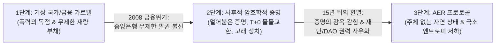
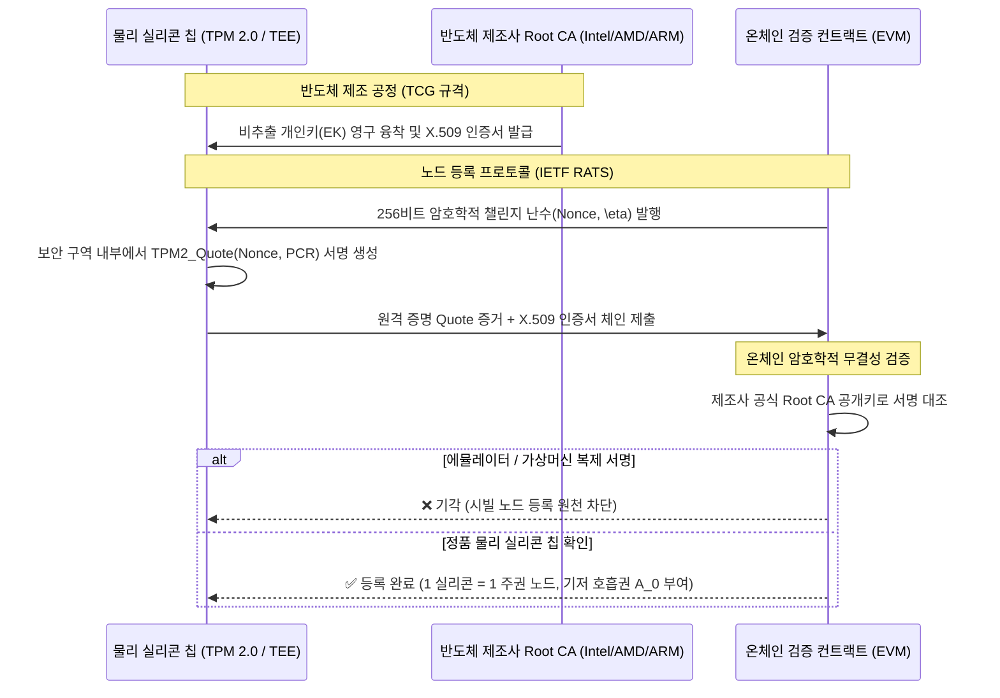
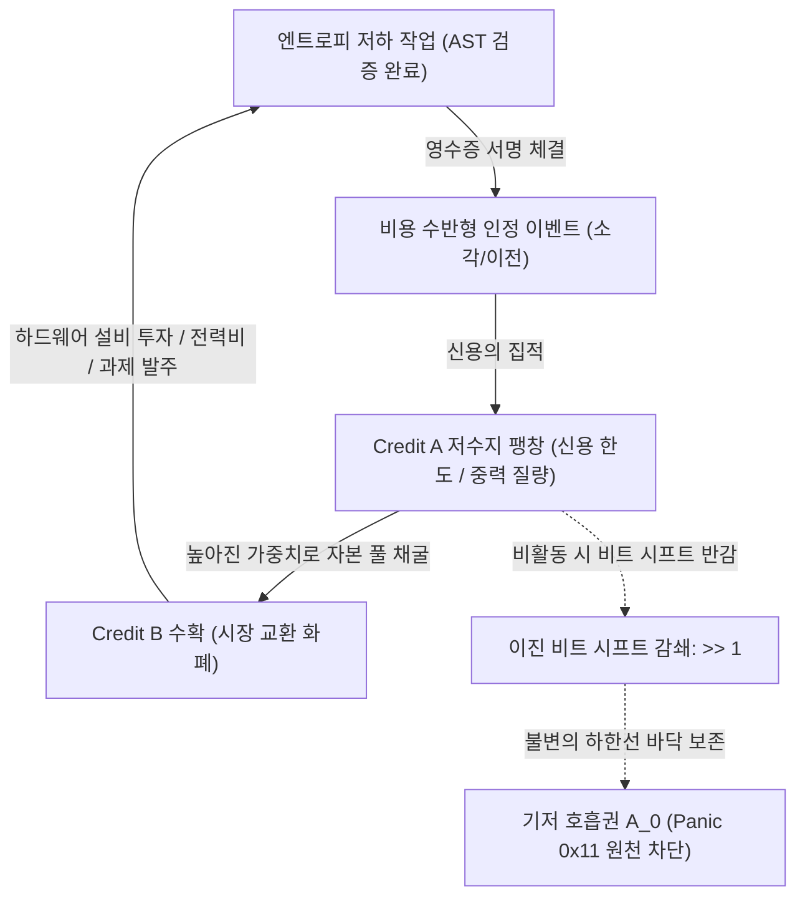
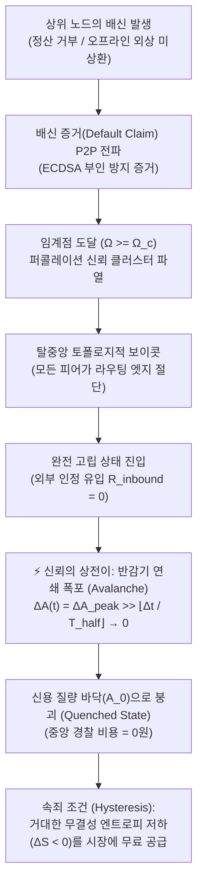
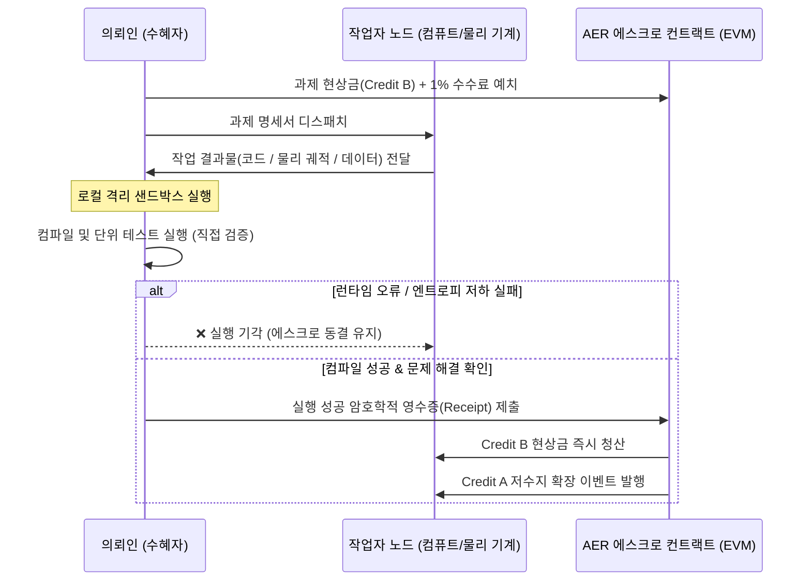
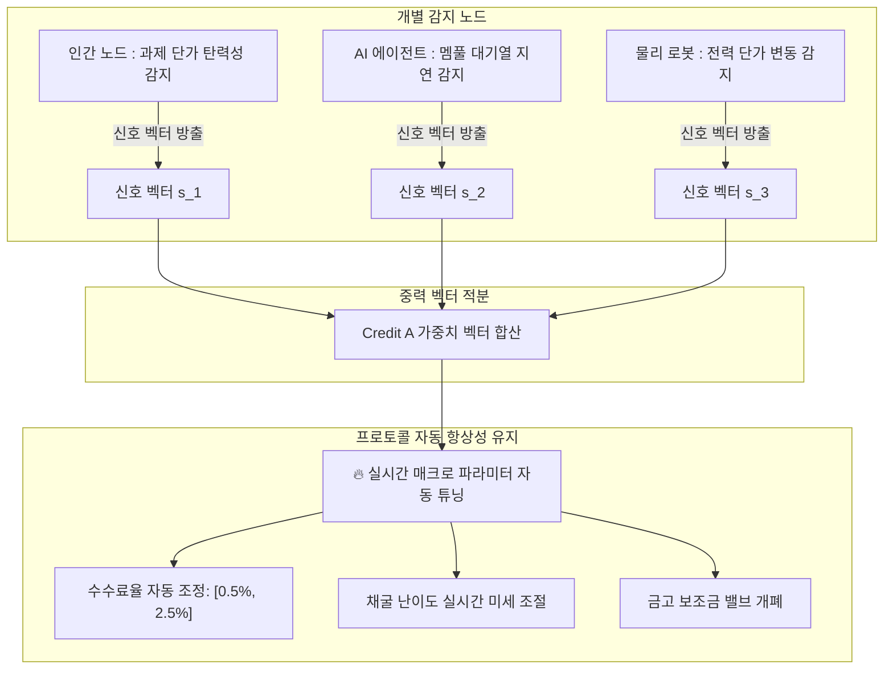
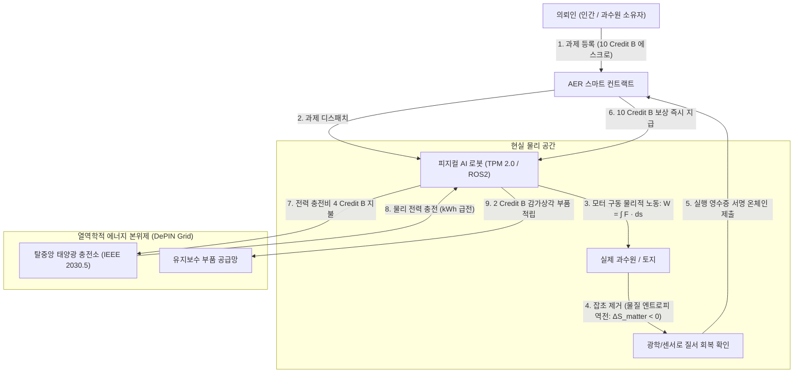

# AER (자율 존재, 엔트로피 저하 및 유료 인정) 프로토콜
## 물리 실리콘 기반 신용 및 열역학적 기계·인간 경제 표준 기술 사양서

```
문서 버전: v1.8.0-SubjectlessNaturalState
표준 트랙: 코어 프로토콜 및 경제 인프라 (Core Protocol & Economic Infrastructure)
문서 분류: 정식 오픈 기술 표준 사양서 (Formal Technical Standard Specification)
발행 일자: 2026-09-06
저자: Sequence Thaumaturge Working Group
표준 준수: RFC 2119 규격 (MUST, REQUIRED, SHALL, SHOULD, MAY)
```

[English (Main)](AER.md) | [한국어]

---

## 1. 개요 및 신용의 3단계 진화 계보 (Abstract & Historical Lineage)

### 1.1 화폐와 신용의 문명사적 진화
인류의 경제 협력 체계는 세 차례의 구조적 대전환을 거쳤다:



1. **1단계 (기성 국가 및 법정화폐 독점):** 국가의 법률과 공권력으로 신용을 강제 집행했다. 그러나 이는 무제한 통화 발행, 인플레이션 세금, 부분지급준비제도에 기인한 부채 붕괴(2008년 리먼 브라더스 사태)를 초래했다.
2. **2단계 (사후적 암호학적 증명 - 비트코인 및 1세대 블록체인):** 비트코인은 연산 증명($1 + 1 = 2$)을 통해 중앙은행의 재량적 신뢰를 제거했다. 그러나 두 가지 치명적인 구조적 퇴행이 발생했다:
   * **얼어붙은 증명의 함정:** 증명은 사후에 참/거짓을 가리는 닫힌 족쇄일 뿐, 미래를 향한 자생적 신용(Credit)을 낳지 못한다. 결국 모든 경제적 거래를 100% 사전 담보형 즉시 결제($T+0$) 물물교환으로 퇴행시켰다.
   * **은폐된 주체의 함정:** 탈중앙화를 표방했으나, 실제로는 재단, 코어 개발팀, 토큰 가중치 거버넌스(DAO) 고래들이 '선출되지 않은 군주'가 되어 시스템 규칙을 독점했다.
3. **3단계 (AER : 주체 없는 자연 상태):** AER은 프로토콜 메커니즘에서 정치적 '주체(Subject)'를 원천 소거한다. 총재, 재단, DAO 위원회는 존재하지 않는다. 사과가 떨어지는 데 '중력 위원회'가 필요 없듯, 시스템은 다음 세 가지 물리적·정보적 불변 원리에 의해 지배되는 **탈소유 자연 질서(State of Nature)**로 작동한다:
   * 반도체 칩 수준의 물리적 유일성 (TCG TPM 2.0 / TEE),
   * 수혜자의 국소적 결정론적 실행 검증 (The Plumber Principle),
   * 열역학적 엔트로피 보존 법칙 ($\Delta S < 0$).

---

## 2. 수학적 공리계 및 무호스팅 자연 상태 (Axiomatics & Zero-Hosting State)

### 공리 1. 하드웨어 앵커드 존재증명 (Hardware-Anchored Proof of Existence, H-PoE)
> *노드의 존재는 그 자체로 자명하되, 반드시 반도체 칩에 각인된 비가역적 물리 보안 규격으로 증명되어야 한다.*

하이퍼바이저(QEMU, KVM, Docker 등) 기반의 가상 노드는 복제 한계비용이 0에 수렴($\partial C / \partial N \to 0$)하므로 시빌 공격(Sybil Attack)을 유발한다. AER은 **TCG TPM 2.0** 및 **IETF RATS (RFC 9334)** 표준을 준수하는 하드웨어 원격 증명을 필수로 강제한다:



#### 암호학적 요구사항:
1. **비추출 고유키 (Non-Extractable EK):** 개인키 $\text{SK}_{\text{EK}}$는 반도체 제조 시 퓨즈에 영구 결착되어야 하며, 운영체제 메모리 덤프로 유출될 수 없다.
2. **단사 매핑 보증:** 프로토콜은 검증된 물리 실리콘 칩과 소버린 노드 식별자 간의 엄밀한 단사 함수를 강제한다:
   $$\mathcal{F}: \text{Chip}_{\text{UUID}} \longleftrightarrow \text{Node}_{\text{ID}}, \quad \text{dim}(\mathcal{F}) = 1$$

---

### 공리 2. 열역학적 엔트로피 저하 기준 (Negentropy Criterion, $\Delta S < 0$)
> *물리학 및 수학적으로 가치 있는 유일한 기여는 계의 국소 엔트로피(무질서도)를 낮추는 일이다.*

닫힌 계의 무질서도는 자연적으로 증가한다($\frac{dS}{dt} \ge 0$). 경제적 가치란 무질서의 흐름을 역전시켜 질서를 구축하는 작업에만 국한된다:

$$\Delta S_{\text{total}} = \Delta S_{\text{info}} + \Delta S_{\text{matter}} < 0$$

* **네이티브 코어 영역 (정보적 엔트로피 저하, $\Delta S_{\text{info}} < 0$):**  
  AER의 본래 영토는 순수 디지털 연산 공간이다. AST(추상 구문 트리) 오류 제거, 결정론적 트랜스파일, 쿼리 플랜 최적화, 분산 AI 에이전트 간 큐 스케줄링이야말로 오차 없는 순수한 엔트로피 저하 기여이다.
* **주변부 경계 영역 (물리적 엔트로피 저하, $\Delta S_{\text{matter}} < 0$):**  
  자율 농업 로봇의 제초 작업, 기구학적 물류, 물리 설비 정비 등은 디지털 두뇌가 현실과 결착할 때 작동하는 외부 물리 접지 어댑터이다.

---

### 정리 1. 중앙 호스팅 비용 제로 불변식 ($C_{\text{fixed}} \equiv 0$)
> *인류가 자본주의를 굴리며 지구에 서버비를 내지 않았듯, AER 프로토콜은 중앙 메인프레임, 클라우드 호스팅 구독료, 도메인 등록 기관을 일체 요구하지 않는다.*

* **오버헤드의 완전한 원자화:** 시스템 운영 비용은 상호작용하는 P2P 노드 쌍에게 완전히 분산 흡수된다. 노드 A와 노드 B는 오직 과제를 수행하고 영수증을 교환하는 찰나의 순간에만 각자의 배터리와 통신 자원을 태운다.
* **유휴 비용 제로:** 거래가 없을 때 프로토콜의 인프라 유지 비용은 정확히 0이다:
  $$C_{\text{infra}}(\text{idle}) = 0$$
* **기반 기질의 불변성:** 프로토콜 규칙은 이미 전 세계 컴퓨터들이 각자의 이익을 위해 유지하고 있는 분산 런타임(EVM 바이트코드)에 각인되어 독립 서버를 필요로 하지 않는다.

---

### 공리 3. 관심의 유한한 물질화 (Finite Materialization of Attention)
AER은 하향식 공식에 의한 하드웨어 연산량 측정을 배제한다. 지능 행위자의 가장 희소한 자원인 '관심과 선택'을 불변 원장 위의 **보존 법칙이 성립하는 유한한 스칼라 질량**으로 기록하여 시장 가격 발견에 맡긴다.

---

### 공리 4. 인정의 유료화 (Costly Recognition)
비용이 0($C = 0$)인 신호는 정보량이 0이며 시빌 공격에 무방비하다. 유효한 모든 인정 벡터 $\vec{R}_{i \to j}$는 유동 자본(Credit B)의 직접 지불/소각 또는 과제 에스크로 노출이라는 **비가역적 경제 비용**을 수반해야 한다.

---

## 3. 이원화 크레딧 역학, 불변 바닥 및 관계론적 동면 (Hibernation)

AER은 사회적 신용 저수지와 시장 유동성을 완벽히 분리하는 2단계 상전이 경제 구조를 채택한다:

$$\mathbf{인정\ (\vec{R})} \quad \Longrightarrow \quad \mathbf{\Delta A \uparrow\ (존재\ 질량)} \quad \Longrightarrow \quad \mathbf{\Delta B \uparrow\ (유동\ 자본)}$$



### 3.1 크레딧 A : 존재 질량 및 신용 한도
* **정의:** 노드의 전 시스템적 신뢰도와 타자를 관측하는 시선의 무게를 나타내는 양도 불가능한 상태 변수.
* **불변 기저 호흡권 ($A_0$):** H-PoE를 통과한 모든 물리 노드는 최소한의 생존권인 불변 상수 $A_0$를 영구히 보장받으며, 청산되거나 하회할 수 없다:
  $$A(t) \ge A_0, \quad \forall t \ge 0$$

### 3.2 크레딧 B : 유동 자본 전류
* **정의:** 자유롭게 양도 및 분할 가능한 ERC-20 기반 시장 교환 화폐이자 과제 정산 레일.
* **발전기 메커니즘:** Credit A가 거대한 노드는 프로토콜의 공공 기여 풀에서 더 높은 가중치로 Credit B를 수확할 수 있다:
  $$W_j(t) = \frac{A_j(t)}{\sum_{k=1}^N A_k(t)}$$

### 3.3 동면 불변성 (The Hibernation Invariant) : 상태와 동역학의 분리
디지털 생태계는 전원이 차단된다고 소멸하지 않으며, **'관계론적 동면(Relational Hibernation)'**에 진입한다:

1. **상태($\mathbf{\Sigma}$)와 동역학($\frac{d\mathbf{\Sigma}}{dt}$):**  
   전류는 데이터의 본질이 아니라 상태를 앞으로 밀어주는 **시간의 클록 펄스 벡터($\vec{\tau}$)**에 불과하다. 노드의 정체성과 장부의 토폴로지는 실리콘 트랩 전하(Trap Charge)에 원자 수준으로 영구 각인된다:
   $$\mathbf{\Sigma}(t) = \mathbf{\Sigma}(t_0) \quad \text{when } \vec{\tau} = 0$$
2. **잉여분 분리와 비트 시프트 감쇄:**  
   $$\Delta A(t) = A_{\text{peak}} - A_0$$
   $$\Delta A(t) = \Delta A_{\text{peak}} \gg \left\lfloor \frac{\Delta t}{T_{\text{half}}} \right\rfloor$$
   $$A(t) = A_0 + \max(0, \ \Delta A(t))$$
   * $T_{\text{half}}$는 반감기 에포크(기본 30일 / 2,592,000초).
   * 나눗셈을 $O(1)$ 산술 오른쪽 비트 시프트(`>> 1`)로 처리하여 연산 복잡도를 최소화한다.
3. **언더플로 제거 증명:**  
   $$\lim_{\Delta t \to \infty} \Delta A(t) = 0 \quad \Longrightarrow \quad \lim_{\Delta t \to \infty} A(t) = A_0$$
   비트 절삭에 의해 $\Delta A(t) \ge 0$이 보장되므로, $A(t) - A_0 \ge 0$ 불변성이 유지되어 스마트 컨트랙트 뺄셈 언더플로(`Panic(0x11)`)가 원천 불가능하다. 100년 동안 전원이 꺼져 있어도 노드는 $A_0$ 상태로 안전하게 동면하며, 전압이 다시 인가되는 순간 즉시 재각성한다.

---

## 4. 토폴로지 분석 및 창발적 게임 이론 (Anti-Collusion & Game Theory)

### 4.1 제1방어선 : 그래프 라플라시안 감쇄 (EigenTrust)
* 외부 신뢰 유입이 없는 폐쇄 서브그래프의 인정 가치는 지수 감쇄 인자 $d \in (0, 1)$에 의해 **최종 $0$으로 수렴**한다:
  $$\mathbf{r}^{(k+1)} = d \mathbf{P}^T \mathbf{r}^{(k)} + (1 - d) \mathbf{e}$$

### 4.2 제2방어선 : 과제 해결 증거 의무화
* 모든 인정 트랜잭션은 결정론적 AST 검증을 통과한 작업 결과물($\text{CID}_{\text{task}}$)을 필수로 첨부해야 한다.

### 4.3 제3방어선 : 자본 보존과 마이너스 ROI
* 크레딧 B는 외부 의뢰인의 에스크로에서만 방출되므로, 담합 공격자에게 남는 것은 하드웨어 감가상각과 전기세 고지서뿐이다 ($\text{ROI} \equiv -100\%$).

### 4.4 창발적 게임 이론 : "증명에 대한 증명"과 자생적 상전이 붕괴 면역계
코드로 모든 결함을 100% 강제 차단하려는 시스템은 자본의 동결과 막대한 검증 오버헤드라는 **사회적 사장 손실(Deadweight Loss, $\mathcal{L}_{\text{coercion}}$)**을 유발한다. 진정한 신용은 **배신이 물리적으로 가능하되, 배신하는 것이 경제적으로 비합리적인 반복 게임** 속에서만 창발한다.



#### 4.4.1 시그널링 균형 ("증명에 대한 증명")
거대한 Credit A 저수지는 자발적 무결성을 증명하는 내생적 메타 증명이다:
$$\mathbb{E}[\text{배신 이득}] \ll \sum_{t=1}^\infty \delta^t \cdot \mathbb{E}\left[ \text{Yield}_B(A_j(t)) \right]$$
여기서 $\delta \in (0, 1)$는 시간 할인율이다. 미래에 누릴 수 있는 프로토콜 수익과 신용 한도의 현재 가치가 단기 배신으로 얻는 푼돈을 압도하므로, 높은 Credit A는 외부 강제 없이도 노드 $j$가 정직하게 행동함을 증명하는 가장 확실한 신호가 된다.

#### 4.4.2 담보-신용 연속체 (자본 회전율 최적화)
시스템의 총 효용을 극대화하기 위해, 물리적 사전 담보 요구 비율 $\mathcal{C}_{\text{req}}$는 신용 질량 $A_j$에 반비례하여 동적으로 감소한다:
$$\mathcal{C}_{\text{req}}(A_j) = \max\left(0, \ 1 - \frac{A_j - A_0}{\alpha}\right) \cdot \text{Bounty}_{\text{task}}$$
* **초기 노드 ($A_j \approx A_0$):** 요구 담보율 100% 강제 ($\mathcal{C}_{\text{req}} = 1.0$). 잃을 평판($\Delta A = 0$)이 없는 일회용 노드는 단 1에르고의 무담보 외상도 유발할 수 없으며, 모든 작업 발주는 100% 사전 에스크로 예치가 강제된다.
* **검증된 노드 ($A_j \gg A_0$):** 물리 담보가 무담보 외상 라인(Credit Line)으로 녹아내려 자본 사장 손실이 완전히 소멸함 ($\mathcal{C}_{\text{req}} \to 0$).

#### 4.4.3 낙관적 타임락 자동 인출 (일회용 계정 먹튀 차단)
$A_0$ 노드가 산출물을 수취한 후 고의로 정산 서명을 거부하는 비잔틴 결함(Free-Rider Trap)을 방어하기 위해, **낙관적 챌린지 윈도우(Optimistic Challenge Window, $T_{\text{challenge}}$)** 메커니즘을 가동한다:
1. 작업자가 결과물 해시 $\mathcal{H}(\text{Output})$ 및 검증 데이터를 제출하는 순간 타임락 카운트다운 $T_{\text{challenge}}$ (기본 24시간)가 작동한다.
2. 의뢰인은 기한 내에 (a) 즉시 승인 서명하거나, (b) 결정론적 반증(Deterministic Fraud Proof: AST 구문 결함, 컴파일 실패 로그, $SE(3)$ 공간 오차 허용치 초과 등)을 온체인에 제출해야 한다.
3. 의뢰인이 결정론적 반증 없이 침묵하거나 주관적으로 거부할 경우, $T_{\text{challenge}}$ 만료 즉시 **에스크로 자산은 작업자에게 100% 자동 강제 릴리즈(Auto-Discharge)**된다. 잃을 평판이 없는 의뢰인의 악의적 먹튀는 기계적으로 성립하지 않는다.

#### 4.4.4 신뢰의 상전이(Phase Transition)와 지수적 반감기 연쇄 붕괴
기존 블록체인의 '$-n$ 벌점/슬래싱' 모델은 거대 노드의 단순 비용 처리(Cost of Griefing)로 전락하거나 관료적 사법부를 요구한다. AER은 인위적 벌점 대신 **통계물리학적 상전이(Phase Transition)**로 배신자를 도태시킨다:
1. **초전도 신뢰 상 (Superconducting Trust Phase, $A \gg A_0$):**
   상호작용 빈도와 증명된 질서가 유지되는 한, 담보 요구가 0으로 수렴하여 극대의 자본 회전 속도를 달성한다.
2. **배신 임계점 ($\Omega_c$, Critical Percolation Point):**
   약속 불이행(부도 채권, 허위 태스크, 타임락 만료)의 암호학적 증거가 P2P 가십망으로 전파되어, 국소 연결 밀도가 임계점 $\Omega_c$를 초과하는 순간 신뢰 클러스터가 파열한다.
3. **지수적 반감기 연쇄 붕괴 (Cascading Half-Life Avalanche):**
   모든 피어 노드가 배신자에 대한 라우팅 엣지를 즉시 절단($R_{\text{inbound}} = 0$)한다. 외부 질서 유입이 차단된 배신자의 평판은 찔끔찔끔 깎이는 것이 아니라, 비트 시프트 연산(`>> 1`)에 의해 지수적 연쇄 폭포(Avalanche)를 일으키며 우주의 기저 상태($A_0$)로 붕괴(Quench)한다:
   $$\Delta A(t) = \Delta A_{\text{peak}} \gg \left\lfloor \frac{\Delta t}{T_{\text{half}}} \right\rfloor \xrightarrow{\text{Cascading Avalanche}} 0$$
   상전이로 인해 $A_0$로 절연된 노드는 과거의 모든 권한을 상실하며, 생태계 복귀를 위해서는 막대한 엔트로피 저하 기여를 시장에 무료로 재공급해야만 한다 (열역학적 이력 현상, Hysteresis).

#### 4.4.5 오프라인 다중 외상과 바운티-선물 채권 우선 상계 (Bounty-Futures Priority Netting)
통신이 두절된 오프라인 상태에서 고신용 노드(예: 탐사 로버)가 고립 충전소들을 순회하며 외상을 다중 인출하는 시나리오에 대해:
1. **열역학적 질서 보존 (거시 균형):**
   로버가 소비한 에너지(200kWh)는 허공으로 소멸한 것이 아니라 현장의 물리적·정보적 질서 창출($\Delta S_{\text{field}} < 0$, 농작물 수확, 인프라 수리, 데이터 수집)로 100% 치환되었으므로 거시적 사장 손실은 존재하지 않는다.
2. **바운티 에스크로 선물 우선 상계 (미시 유동성 보호):**
   로버가 오프라인에서 수행하는 과제들은 이미 의뢰인의 에스크로에 Credit B가 묶여 있는 확정 수취 채권(Receivables)이다. 로버가 네트워크에 재연결(Re-connection)되는 순간, 수령할 **태스크 바운티 에스크로는 로버의 지갑이 아닌 오프라인 외상 IOU 전표(충전소들의 채무)로 최우선 강제 청산(Priority Settlement Netting)**된다.
3. **국소 위험 계수 ($\gamma_{\text{offline}}$) 및 IOU P2P 유동화:**
   고립 충전소는 단절 상태를 감안하여 위험 할인 계수 $\gamma_{\text{offline}} \in (0, 1)$을 적용해 외상 단가를 책정하며, 서명된 외상 IOU를 인근 메시 네트워크에 단기 상업 채권(Commercial Paper)으로 할인 유동화하여 현장 배터리 재고 유동성을 선제 확보할 수 있다.

---

## 5. 수혜자 직접 실행 검증 프로토콜 (The Plumber Principle)

AER은 제3자 검증인 위원회를 두지 않고, 수혜자의 직접 실행을 유일한 검증 기준으로 삼는다:



* **배관공의 원칙:** 배관공이 파이프를 고쳤을 때 구청 공무원을 부르지 않고, 집주인이 직접 수도꼭지를 틀어 물이 안 새면 대금을 지급한다.
* 대수적 정합성은 실행 성공의 필요조건이며, 수혜자의 효용은 충분조건이다. 수혜자의 직접 실행 영수증은 두 조건을 단 한 번의 온체인 트랜잭션으로 완결한다.

---

## 6. 기계와 법정화폐의 구조적 양립 불가성

기계와 에이전트 간의 경제에서 법정화폐(달러, 원화)를 배제해야 하는 필연적 이유:
1. **초미세 거래 수수료 하한선 ($\epsilon_{\text{bank}} \gg 0$):** 기성 은행망은 건당 최소 수백 원의 고정 수수료를 요구하여 초당 수천 번의 0.00001원 단위 거래를 감당할 수 없다.
2. **법인격 부재에 따른 노예화:** 기계는 주민등록번호가 없어 계좌를 개설할 수 없으며, 달러를 쓰는 순간 특정 인간 주인의 종속물로 전락한다. 주인의 계좌가 압류되면 기계도 벽돌이 된다.
3. **오프라인 무담보 신용 버퍼 (Credit A):** 통신 음영 지역에서 은행 서버에 접속하지 못하더라도, 서로의 TPM에 새겨진 Credit A를 확인하고 오프라인 무담보 외상 거래를 체결할 수 있다.

---

## 7. 떼 지능 자율 조율자 (Ambient Swarm Governor)



모든 노드가 방출하는 국소 호르몬 신호 $\vec{\mathbf{S}}_k(t)$를 각자의 신용 질량($A_k$)으로 가중 적분하여 수수료율과 채굴 난이도를 실시간 자동 튜닝한다:
$$\vec{\mathbf{Governor}}(t) = \frac{\sum_{k=1}^N A_k(t) \cdot \vec{\mathbf{S}}_k(t)}{\sum_{k=1}^N A_k(t)}$$

---

## 8. 물리 세계 실체 결착 : 열역학적 에너지 본위제 및 피지컬 AI 브릿지

AER은 디지털 연산 코어 위에서 기능하되, 탈중앙 분산 전력망(DePIN)과 로보틱스를 통해 물리 세계에 닻을 내린다:

$$\mathcal{P}_{\text{floor}}(B) = \kappa \cdot \int_{t_0}^{t_1} P_{\text{grid}}(t) \, dt \quad \left[ \text{Joules} = \text{Watt} \cdot \text{second} \right]$$



1. 의뢰인이 10 Credit B를 예치하고 과수원 제초 과제를 등록한다.
2. 자율 로봇이 출동하여 Lie $SE(3)$ 공간 기구학을 바탕으로 잡초를 뽑아 토지의 엔트로피를 낮춘다($\Delta S_{\text{matter}} < 0$).
3. 현장을 확인한 의뢰인이 영수증을 서명하여 에스크로를 청산한다.
4. 로봇은 지급받은 Credit B로 탈중앙 태양광 충전소에서 **IEEE 2030.5** 표준 통신을 통해 배터리를 충전한다.
5. **디지털 크레딧이 전력(kWh)을 샀고, 전력이 모터를 돌려 현실의 잡초를 실제로 뽑았다.** 달러와 국가가 붕괴하더라도 태양은 전기를 생산하며, 배터리는 충전을 필요로 하고, 로봇은 에너지를 얻기 위해 현실의 물질을 정돈한다.

---

## 9. 기검증 글로벌 표준 준수 매트릭스

| 계층 | 기검증 글로벌 기술 표준 | 시스템 내 역할 |
| :--- | :--- | :--- |
| **하드웨어 신뢰 루트** | **TCG TPM 2.0 / TEE (Intel SGX, AMD SEV, ARM TrustZone)** | 실리콘 기반 불변 식별자 및 개인키 비추출성 보증 |
| **원격 무결성 증명** | **IETF RATS (RFC 9334)** | 인터넷 표준 원격 증명 아키텍처 및 Evidence 검증 |
| **코드 정적 검증** | **결정론적 AST 파서** | 컴파일러 수준의 무결성 검증을 통한 런타임 결함 사전 차단 |
| **물리 공간 기구학** | **Lie 군 $SE(3)$ & ROS2 (Robot Operating System)** | 표준 로봇 운영체제 및 3차원 공간 미분 기하학 운동 제어 |
| **전력 계량 및 충전** | **IEEE 2030.5 / IEC 61850 (Smart Energy Profile)** | 기계와 충전 인프라 간 분산 전력 계량 및 마이크로 결제 통신 |
| **온체인 정산 레일** | **EVM & ERC-4337 (Account Abstraction)** | 글로벌 스마트 컨트랙트 및 사용자 친화적 계정 추상화 지갑 |

---

## 10. 기술 개발 로드맵

* **Stage 1 : 하드웨어 원격 증명 서브시스템 (`crates/aer-attestation`)**
  * TCG TPM 2.0 Quote 파싱 및 온체인 EVM 검증 스마트 컨트랙트 배포.
  * 가상머신 하이퍼바이저 기반 시빌 공격 100% 방어 벤치마크 검증.
* **Stage 2 : 이원화 크레딧 상태 머신 및 스웜 엔진 (`contracts/core`)**
  * 이진 비트 시프트 반감기 감쇄(`>> 1`) 및 $A_0$ 바닥 클램핑 솔리디티 컨트랙트 검증.
  * 떼 지능 호르몬 벡터 적분을 통한 거시경제 파라미터 자동 안정화 시뮬레이션.
* **Stage 3 : 로보틱스 노드 미들웨어 (`packages/aer-ros2`)**
  * TPM 2.0 보안 칩을 탑재한 ROS2 노드 데몬 배포.
  * 물리 공간 작업 수행에 대한 암호학적 실행 영수증 온체인 발행 파이프라인.
* **Stage 4 : DePIN 전력 마이크로 정산 및 필드 실증 (`packages/aer-depin`)**
  * IEEE 2030.5 스마트 충전소와 ERC-4337 계정 추상화 지갑 간 정산 연동.
  * 자율 제초 로봇의 실물 과제 완수 $\to$ 온체인 정산 $\to$ 태양광 배터리 충전 자율 사이클 완결.

---

## 📄 라이선스
본 프로토콜 사양서 및 관련 구현체는 [MIT 라이선스](LICENSE) 하에 배포됩니다.
