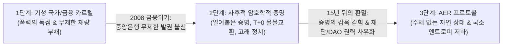
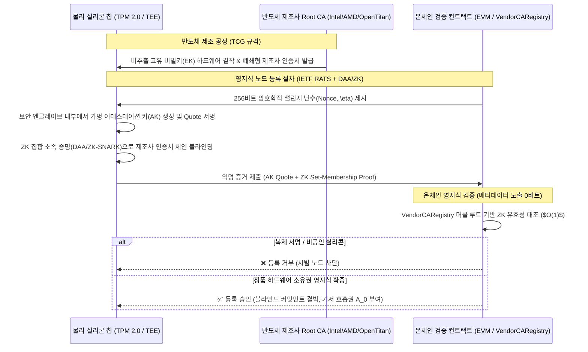
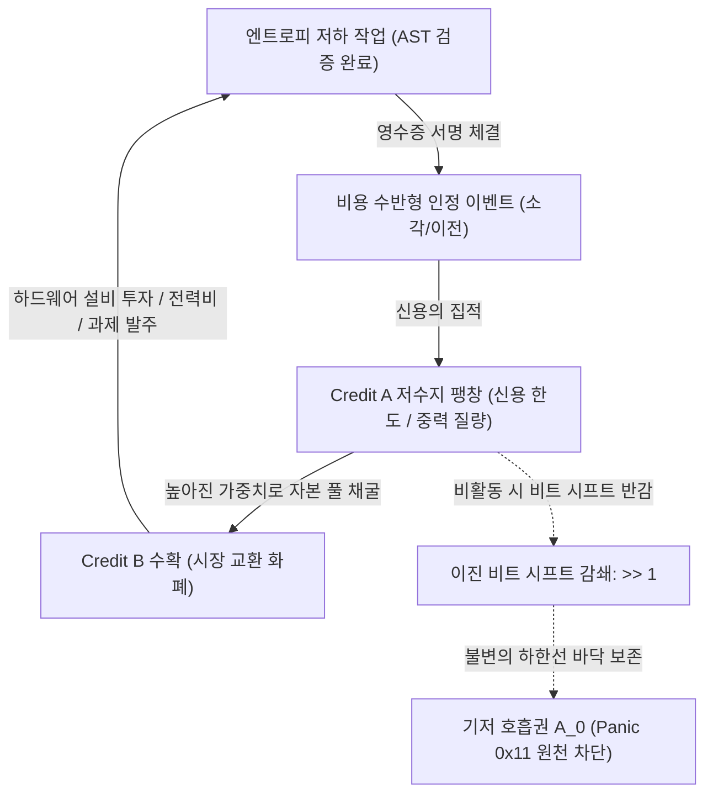
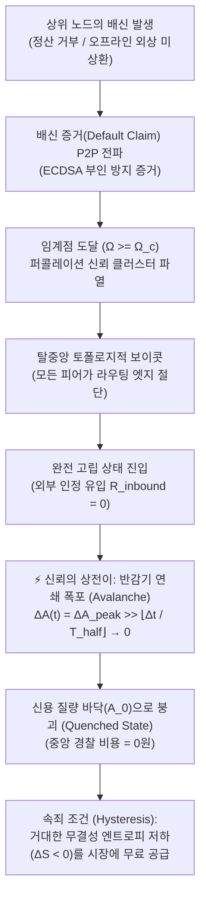
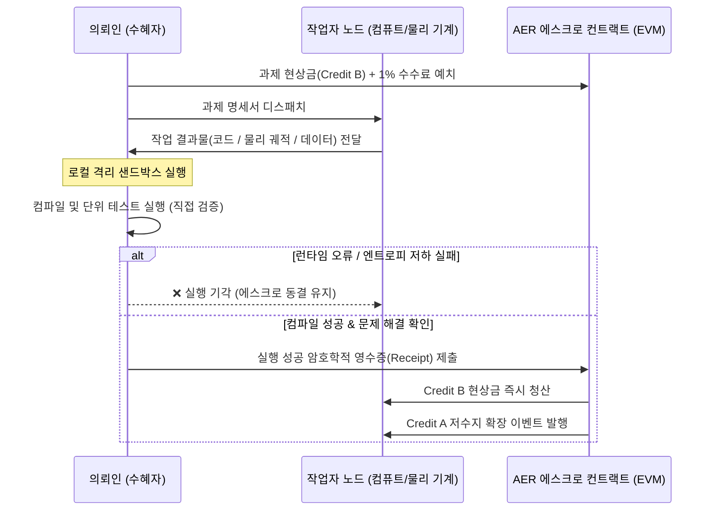
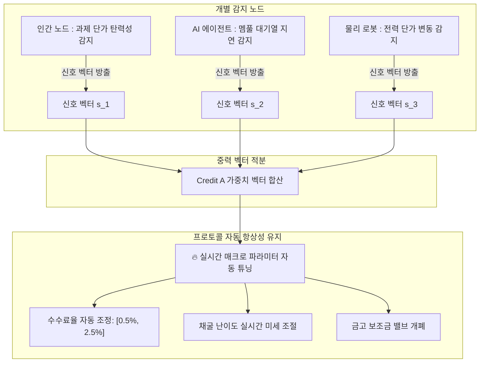
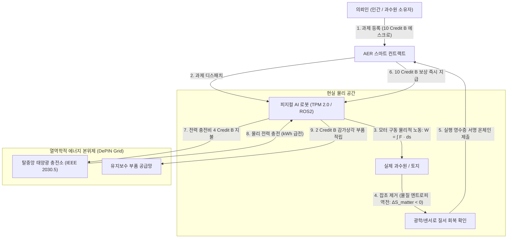

# AER (자율 존재, 엔트로피 저하 및 유료 인정) 프로토콜
## 물리 실리콘 기반 신용 및 열역학적 기계·인간 경제 표준 기술 사양서

```
문서 버전: v1.8.0-SubjectlessNaturalState
표준 트랙: 코어 프로토콜 및 경제 인프라 (Core Protocol & Economic Infrastructure)
문서 분류: 정식 오픈 기술 표준 사양서 (Formal Technical Standard Specification)
발행 일자: 2026-09-06
저자: Sequence Thaumaturge Working Group
표준 준수: RFC 2119 규격 (MUST, REQUIRED, SHALL, SHOULD, MAY)
```

[English (Main)](AER.md) | [한국어]

---

## 1. 개요 및 신용의 3단계 진화 계보 (Abstract & Historical Lineage)

### 1.1 화폐와 신용의 문명사적 진화
인류의 경제 협력 체계는 세 차례의 구조적 대전환을 거쳤다:



1. **1단계 (기성 국가 및 법정화폐 독점):** 국가의 법률과 공권력으로 신용을 강제 집행했다. 그러나 이는 무제한 통화 발행, 인플레이션 세금, 부분지급준비제도에 기인한 부채 붕괴(2008년 리먼 브라더스 사태)를 초래했다.
2. **2단계 (사후적 암호학적 증명 - 비트코인 및 1세대 블록체인):** 비트코인은 연산 증명($1 + 1 = 2$)을 통해 중앙은행의 재량적 신뢰를 제거했다. 그러나 두 가지 치명적인 구조적 퇴행이 발생했다:
   * **얼어붙은 증명의 함정:** 증명은 사후에 참/거짓을 가리는 닫힌 족쇄일 뿐, 미래를 향한 자생적 신용(Credit)을 낳지 못한다. 결국 모든 경제적 거래를 100% 사전 담보형 즉시 결제($T+0$) 물물교환으로 퇴행시켰다.
   * **은폐된 주체의 함정:** 탈중앙화를 표방했으나, 실제로는 재단, 코어 개발팀, 토큰 가중치 거버넌스(DAO) 고래들이 '선출되지 않은 군주'가 되어 시스템 규칙을 독점했다.
3. **3단계 (AER : 주체 없는 자연 상태):** AER은 프로토콜 메커니즘에서 정치적 '주체(Subject)'를 원천 소거한다. 총재, 재단, DAO 위원회는 존재하지 않는다. 사과가 떨어지는 데 '중력 위원회'가 필요 없듯, 시스템은 다음 세 가지 물리적·정보적 불변 원리에 의해 지배되는 **탈소유 자연 질서(State of Nature)**로 작동한다:
   * 반도체 칩 수준의 물리적 유일성 (TCG TPM 2.0 / TEE),
   * 수혜자의 국소적 결정론적 실행 검증 (The Plumber Principle),
   * 열역학적 엔트로피 보존 법칙 ($\Delta S < 0$).

---

## 2. 수학적 공리계 및 무호스팅 자연 상태 (Axiomatics & Zero-Hosting State)

### 공리 1. 하드웨어 앵커드 존재증명 (Hardware-Anchored Proof of Existence, H-PoE)
> *노드의 존재는 그 자체로 자명하되, 반드시 반도체 칩에 각인된 비가역적 물리 보안 규격으로 증명되어야 한다.*

하이퍼바이저(QEMU, KVM, Docker 등) 기반의 가상 노드는 복제 한계비용이 0에 수렴($\partial C / \partial N \to 0$)하므로 시빌 공격(Sybil Attack)을 유발한다. AER은 **TCG TPM 2.0** 및 **IETF RATS (RFC 9334)** 표준을 준수하는 하드웨어 원격 증명을 필수로 강제한다:



#### 암호학적 요구사항:
1. **비추출 고유키 (Non-Extractable EK):** 개인키 $\text{SK}_{\text{EK}}$는 반도체 제조 시 퓨즈에 영구 결착되어야 하며, 운영체제 메모리 덤프로 유출될 수 없다.
2. **영지식 블라인드 단사 매핑 (Blinded Bijection):** 프로토콜은 검증된 물리 실리콘 칩과 소버린 노드 식별자 간의 엄밀한 단사 관계를 보장하되, 칩 고유 시리얼이나 하드웨어 지문이 온체인에 평문으로 노출되는 것을 차단하기 위해 페더슨 커밋먼트(Pedersen Commitment) 또는 ZK 널리파이어(Nullifier) 기반의 암호학적 서약을 사용한다:
   $$\mathcal{F}: \text{Commit}(\text{Chip}_{\text{Secret}}, \ r) \longleftrightarrow \text{Node}_{\text{ID}}, \quad \text{dim}(\mathcal{F}) = 1$$
   여기서 $r$은 로컬 블라인딩 난수이며, $\text{Node}_{\text{ID}}$는 온체인에서 실리콘 칩과의 1:1 물리적 결속을 증명하되 외부 관측자의 하드웨어 영구 추적(Super-Cookie Tracking)을 배제한다.

> [!NOTE]
> **하드웨어 갱신 및 반도체 벤더 Root CA 폐기 메커니즘**: 물리 실리콘 칩의 수명 만료, 파손 시의 계정 승계(ERC-4337 분리) 및 벤더 Root CA 암호학적 자가 무효화 규격은 **[제12절 부록 C](AER.ko.md#12-부록-c--물리-세계의-한계-실리콘-공급망-그리고-기계-자본의-불멸성-appendix-c)**에 상술되어 있다.

---

### 공리 2. 열역학적 엔트로피 저하 기준 (Negentropy Criterion, $\Delta S < 0$)
> *물리학 및 수학적으로 가치 있는 유일한 기여는 계의 국소 엔트로피(무질서도)를 낮추는 일이다.*

닫힌 계의 무질서도는 자연적으로 증가한다($\frac{dS}{dt} \ge 0$). 경제적 가치란 무질서의 흐름을 역전시켜 질서를 구축하는 작업에만 국한된다:

$$\Delta S_{\text{total}} = \Delta S_{\text{info}} + \Delta S_{\text{matter}} < 0$$

* **네이티브 코어 영역 (정보적 엔트로피 저하, $\Delta S_{\text{info}} < 0$):**  
  AER의 본래 영토는 순수 디지털 연산 공간이다. AST(추상 구문 트리) 오류 제거, 결정론적 트랜스파일, 쿼리 플랜 최적화, 분산 AI 에이전트 간 큐 스케줄링이야말로 오차 없는 순수한 엔트로피 저하 기여이다.
* **주변부 경계 영역 (물리적 엔트로피 저하, $\Delta S_{\text{matter}} < 0$):**  
  자율 농업 로봇의 제초 작업, 기구학적 물류, 물리 설비 정비 등은 디지털 두뇌가 현실과 결착할 때 작동하는 외부 물리 접지 어댑터이다.

---

### 정리 1. 중앙 호스팅 비용 제로 불변식 ($C_{\text{fixed}} \equiv 0$)
> *인류가 자본주의를 굴리며 지구에 서버비를 내지 않았듯, AER 프로토콜은 중앙 메인프레임, 클라우드 호스팅 구독료, 도메인 등록 기관을 일체 요구하지 않는다.*

* **오버헤드의 완전한 원자화:** 시스템 운영 비용은 상호작용하는 P2P 노드 쌍에게 완전히 분산 흡수된다. 노드 A와 노드 B는 오직 과제를 수행하고 영수증을 교환하는 찰나의 순간에만 각자의 배터리와 통신 자원을 태운다.
* **유휴 비용 제로:** 거래가 없을 때 프로토콜의 인프라 유지 비용은 정확히 0이다:
  $$C_{\text{infra}}(\text{idle}) = 0$$
* **기반 기질의 불변성:** 프로토콜 규칙은 이미 전 세계 컴퓨터들이 각자의 이익을 위해 유지하고 있는 분산 런타임(EVM 바이트코드)에 각인되어 독립 서버를 필요로 하지 않는다.

---

### 공리 3. 관심의 유한한 물질화 (Finite Materialization of Attention)
AER은 하향식 공식에 의한 하드웨어 연산량 측정을 배제한다. 지능 행위자의 가장 희소한 자원인 '관심과 선택'을 불변 원장 위의 **보존 법칙이 성립하는 유한한 스칼라 질량**으로 기록하여 시장 가격 발견에 맡긴다.

---

### 공리 4. 인정의 유료화 (Costly Recognition)
비용이 0($C = 0$)인 신호는 정보량이 0이며 시빌 공격에 무방비하다. 유효한 모든 인정 벡터 $\vec{R}_{i \to j}$는 유동 자본(Credit B)의 직접 지불/소각 또는 과제 에스크로 노출이라는 **비가역적 경제 비용**을 수반해야 한다.

---

## 3. 이원화 크레딧 역학, 불변 바닥 및 관계론적 동면 (Hibernation)

AER은 사회적 신용 저수지와 시장 유동성을 완벽히 분리하는 2단계 상전이 경제 구조를 채택한다:

$$\mathbf{인정\ (\vec{R})} \quad \Longrightarrow \quad \mathbf{\Delta A \uparrow\ (존재\ 질량)} \quad \Longrightarrow \quad \mathbf{\Delta B \uparrow\ (유동\ 자본)}$$



### 3.1 크레딧 A : 존재 질량 및 신용 한도
* **정의:** 노드의 전 시스템적 신뢰도와 타자를 관측하는 시선의 무게를 나타내는 양도 불가능한 상태 변수.
* **불변 기저 호흡권 ($A_0$):** H-PoE를 통과한 모든 물리 노드는 최소한의 생존권인 불변 상수 $A_0$를 영구히 보장받으며, 청산되거나 하회할 수 없다:
  $$A(t) \ge A_0, \quad \forall t \ge 0$$

### 3.2 크레딧 B : 유동 자본 전류
* **정의:** 자유롭게 양도 및 분할 가능한 ERC-20 기반 시장 교환 화폐이자 과제 정산 레일.
* **발전기 메커니즘:** Credit A가 거대한 노드는 프로토콜의 공공 기여 풀에서 더 높은 가중치로 Credit B를 수확할 수 있다:
  $$W_j(t) = \frac{A_j(t)}{\sum_{k=1}^N A_k(t)}$$

### 3.3 동면 불변성 (The Hibernation Invariant) : 상태와 동역학의 분리
디지털 생태계는 전원이 차단된다고 소멸하지 않으며, **'관계론적 동면(Relational Hibernation)'**에 진입한다:

1. **상태($\mathbf{\Sigma}$)와 동역학($\frac{d\mathbf{\Sigma}}{dt}$):**  
   전류는 데이터의 본질이 아니라 상태를 앞으로 밀어주는 **시간의 클록 펄스 벡터($\vec{\tau}$)**에 불과하다. 노드의 정체성과 장부의 토폴로지는 실리콘 트랩 전하(Trap Charge)에 원자 수준으로 영구 각인된다:
   $$\mathbf{\Sigma}(t) = \mathbf{\Sigma}(t_0) \quad \text{when } \vec{\tau} = 0$$
2. **잉여분 분리와 비트 시프트 감쇄:**  
   $$\Delta A(t) = A_{\text{peak}} - A_0$$
   $$\Delta A(t) = \Delta A_{\text{peak}} \gg \left\lfloor \frac{\Delta t}{T_{\text{half}}} \right\rfloor$$
   $$A(t) = A_0 + \max(0, \ \Delta A(t))$$
   * $T_{\text{half}}$는 반감기 에포크(기본 30일 / 2,592,000초).
   * 나눗셈을 $O(1)$ 산술 오른쪽 비트 시프트(`>> 1`)로 처리하여 연산 복잡도를 최소화한다.
3. **언더플로 제거 증명:**  
   $$\lim_{\Delta t \to \infty} \Delta A(t) = 0 \quad \Longrightarrow \quad \lim_{\Delta t \to \infty} A(t) = A_0$$
   비트 절삭에 의해 $\Delta A(t) \ge 0$이 보장되므로, $A(t) - A_0 \ge 0$ 불변성이 유지되어 스마트 컨트랙트 뺄셈 언더플로(`Panic(0x11)`)가 원천 불가능하다. 100년 동안 전원이 꺼져 있어도 노드는 $A_0$ 상태로 안전하게 동면하며, 전압이 다시 인가되는 순간 즉시 재각성한다.

---

## 4. 토폴로지 분석 및 창발적 게임 이론 (Anti-Collusion & Game Theory)

### 4.1 제1방어선 : 그래프 라플라시안 감쇄 (EigenTrust)
* 외부 신뢰 유입이 없는 폐쇄 서브그래프의 인정 가치는 지수 감쇄 인자 $d \in (0, 1)$에 의해 **최종 $0$으로 수렴**한다:
  $$\mathbf{r}^{(k+1)} = d \mathbf{P}^T \mathbf{r}^{(k)} + (1 - d) \mathbf{e}$$

### 4.2 제2방어선 : 과제 해결 증거 의무화
* 모든 인정 트랜잭션은 결정론적 AST 검증을 통과한 작업 결과물($\text{CID}_{\text{task}}$)을 필수로 첨부해야 한다.

### 4.3 제3방어선 : 자본 보존과 마이너스 ROI
* 크레딧 B는 외부 의뢰인의 에스크로에서만 방출되므로, 담합 공격자에게 남는 것은 하드웨어 감가상각과 전기세 고지서뿐이다 ($\text{ROI} \equiv -100\%$).

### 4.4 창발적 게임 이론 : "증명에 대한 증명"과 자생적 상전이 붕괴 면역계
코드로 모든 결함을 100% 강제 차단하려는 시스템은 자본의 동결과 막대한 검증 오버헤드라는 **사회적 사장 손실(Deadweight Loss, $\mathcal{L}_{\text{coercion}}$)**을 유발한다. 진정한 신용은 **배신이 물리적으로 가능하되, 배신하는 것이 경제적으로 비합리적인 반복 게임** 속에서만 창발한다.



#### 4.4.1 시그널링 균형 ("증명에 대한 증명")
거대한 Credit A 저수지는 자발적 무결성을 증명하는 내생적 메타 증명이다:
$$\mathbb{E}[\text{배신 이득}] \ll \sum_{t=1}^\infty \delta^t \cdot \mathbb{E}\left[ \text{Yield}_B(A_j(t)) \right]$$
여기서 $\delta \in (0, 1)$는 시간 할인율이다. 미래에 누릴 수 있는 프로토콜 수익과 신용 한도의 현재 가치가 단기 배신으로 얻는 푼돈을 압도하므로, 높은 Credit A는 외부 강제 없이도 노드 $j$가 정직하게 행동함을 증명하는 가장 확실한 신호가 된다.

#### 4.4.2 담보-신용 연속체 (자본 회전율 최적화)
시스템의 총 효용을 극대화하기 위해, 물리적 사전 담보 요구 비율 $\mathcal{C}_{\text{req}}$는 신용 질량 $A_j$에 반비례하여 동적으로 감소한다:
$$\mathcal{C}_{\text{req}}(A_j) = \max\left(0, \ 1 - \frac{A_j - A_0}{\alpha}\right) \cdot \text{Bounty}_{\text{task}}$$
* **초기 노드 ($A_j \approx A_0$):** 요구 담보율 100% 강제 ($\mathcal{C}_{\text{req}} = 1.0$). 잃을 평판($\Delta A = 0$)이 없는 일회용 노드는 단 1에르고의 무담보 외상도 유발할 수 없으며, 모든 작업 발주는 100% 사전 에스크로 예치가 강제된다.
* **검증된 노드 ($A_j \gg A_0$):** 물리 담보가 무담보 외상 라인(Credit Line)으로 녹아내려 자본 사장 손실이 완전히 소멸함 ($\mathcal{C}_{\text{req}} \to 0$).

#### 4.4.3 낙관적 타임락, 즉시 유동성 및 분쟁 장부 (Optimistic Timelock & Dispute Economics)
일회용 $A_0$ 의뢰인의 고의적 정산 거부(Free-Rider Trap)와 악의적 작업자의 정크 제출 및 의뢰인 오프라인 탈취 공격을 동시에 방어하기 위해, AER은 **즉시 유동성(Zero-Delay Liquidity), 기간별 유동성 프리미엄(Liquidity Term Premium), 그리고 비처벌적 전과 장부(Dispute Trail)** 메커니즘을 융합한다:

1. **플러머 원칙 기반 즉시 유동성 (Zero-Delay Liquidity Guarantee)**:
   의뢰인이 결과물을 확인하고 승인 영수증(`schemas/ExecutionReceipt.schema.json`)에 서명하는 정상 상황에서는, **에스크로가 0초 만에 해제되며 작업자는 1초의 지체나 체류(Lockup/Vesting) 없이 100% 즉시 토큰을 인출 및 소비**할 수 있다. 노동의 대가에 인위적 락업을 강제하는 기존 1·2세대 토큰의 UX 결함을 근본적으로 배제한다.
2. **낙관적 챌린지 윈도우와 시간 선호 프리미엄 (Liquidity Term Premium)**:
   의뢰인의 서명이 도달하지 않을 때만 비상 카운트다운인 챌린지 윈도우 $T_{\text{challenge}}$(기본 24시간)가 가동된다.
   * **의뢰인의 사전 방어 (오프라인 안전 모드)**: 오지 탐사나 배터리 교체 주기로 장기 오프라인이 불가피한 의뢰인은 과제 발주 시 타임락을 $72\text{h}$, $168\text{h}$(7일) 등으로 가변 연장하거나 `수동 승인 필수(Manual Approval Only)`를 지정할 수 있다.
   * **대기 시간의 경제적 보상 (Risk-Return)**: 대기 시간은 작업자에게 자본 기회비용이므로, 타임락 연장 시 의뢰인은 시간 선호에 따른 **유동성 시간 프리미엄($\Delta B_{\text{time}}$)**을 바운티에 의무 가산하여 지불해야 한다:
     $$B_{\text{total}} = B_{\text{base}} \times \left(1 + \kappa_{\text{delay}} \cdot \ln\left(\frac{T_{\text{challenge}}}{24\text{h}}\right)\right)$$
     단, 검증된 고신용 의뢰인($A_j \gg A_0$)은 자신의 신용 평판을 담보로 프리미엄 없이 장기 대기 과제를 발주할 수 있다.
3. **탈중앙 감시탑(Watchtower)의 일시정지(Pause) 위임**:
   의뢰인은 오프라인 진입 전 기지국이나 길드 피어에게 사전 서명된 감시 티켓을 위임할 수 있다. 작업자가 스키마 규격을 어긴 정크 데이터를 제출할 경우, 감시탑 노드는 1가스의 가벼운 결함 신호로 **에스크로 방출 타이머를 즉각 일시정지(Pause)**시켜 의뢰인 복귀 전 자금 누출을 물리적으로 차단한다.
4. **프로토콜의 중립성과 전과 장부(Dispute Trail) 및 자동 상계(Netting)**:
   * **시스템의 임의 징벌 배제**: 프로토콜은 도덕적 판사가 아니므로, 단 한 번의 분쟁으로 특정 노드의 신용을 0점으로 강제 폭락시키거나 계정을 처형(Slashing)하지 않는다. 프로토콜이 강제하는 유일한 감쇄는 자연 법칙인 **지수 반감기($A(t) = A_0 \cdot 2^{-t/\tau}$)**뿐이다.
   * **음수 잔고와 차기 수익 상계**: 자동 방출로 대금이 출금된 후 의뢰인이 복귀하여 정당한 사기 증명을 제출한 경우, 해당 작업자 계정에는 **미해결 분쟁 부채(Negative Balance: $-B$) 및 객관적 전과 사실**이 온체인/P2P 장부에 기록된다. 작업자는 계정 퇴출 없이 차기 과제 수행을 통해 벌어들인 수익에서 해당 부채를 최우선 자동 상계(Priority Netting)하며 채무를 변제할 수 있다.
   * **동료 노드의 주관적 위험 평가**: 전과 장부를 스캔한 동료 노드들의 로컬 데몬(`aerd`)은 해당 노드에 대한 사전 담보 요구율을 100%로 상향($\mathcal{C}_{\text{req}} = 1.0$)하거나 거래를 거부하여, 시장 원리에 의해 악의적 행위자를 자연스럽게 자율 도태시킨다.

> [!NOTE]
> **물리 세계($\Delta S_{\text{matter}} < 0$)의 대화형 이분 탐색 증명**: 라이다/RGB-D 및 모터 토크 이상치 등 고용량 물리 센서 데이터의 온체인 경량 검증(가스비 20만 이하) 및 센서 왜곡에 대한 경제적 억제 모델 사양은 **[제12절 부록 C](AER.ko.md#12-부록-c--물리-세계의-한계-실리콘-공급망-그리고-기계-자본의-불멸성-appendix-c)**에 상술되어 있다.

#### 4.4.4 신뢰의 상전이(Phase Transition)와 지수적 반감기 연쇄 붕괴
기존 블록체인의 '$-n$ 벌점/슬래싱' 모델은 거대 노드의 단순 비용 처리(Cost of Griefing)로 전락하거나 관료적 사법부를 요구한다. AER은 인위적 벌점 대신 **통계물리학적 상전이(Phase Transition)**로 배신자를 도태시킨다:
1. **초전도 신뢰 상 (Superconducting Trust Phase, $A \gg A_0$):**
   상호작용 빈도와 증명된 질서가 유지되는 한, 담보 요구가 0으로 수렴하여 극대의 자본 회전 속도를 달성한다.
2. **배신 임계점 ($\Omega_c$, Critical Percolation Point):**
   약속 불이행(부도 채권, 허위 태스크, 타임락 만료)의 암호학적 증거가 P2P 가십망으로 전파되어, 국소 연결 밀도가 임계점 $\Omega_c$를 초과하는 순간 신뢰 클러스터가 파열한다.
3. **지수적 반감기 연쇄 붕괴 (Cascading Half-Life Avalanche):**
   모든 피어 노드가 배신자에 대한 라우팅 엣지를 즉시 절단($R_{\text{inbound}} = 0$)한다. 외부 질서 유입이 차단된 배신자의 평판은 찔끔찔끔 깎이는 것이 아니라, 비트 시프트 연산(`>> 1`)에 의해 지수적 연쇄 폭포(Avalanche)를 일으키며 우주의 기저 상태($A_0$)로 붕괴(Quench)한다:
   $$\Delta A(t) = \Delta A_{\text{peak}} \gg \left\lfloor \frac{\Delta t}{T_{\text{half}}} \right\rfloor \xrightarrow{\text{Cascading Avalanche}} 0$$
   상전이로 인해 $A_0$로 절연된 노드는 과거의 모든 권한을 상실하며, 생태계 복귀를 위해서는 막대한 엔트로피 저하 기여를 시장에 무료로 재공급해야만 한다 (열역학적 이력 현상, Hysteresis).

#### 4.4.5 오프라인 다중 외상과 바운티-선물 채권 우선 상계 (Bounty-Futures Priority Netting)
통신이 두절된 오프라인 상태에서 고신용 노드(예: 탐사 로버)가 고립 충전소들을 순회하며 외상을 다중 인출하는 시나리오에 대해:
1. **열역학적 질서 보존 (거시 균형):**
   로버가 소비한 에너지(200kWh)는 허공으로 소멸한 것이 아니라 현장의 물리적·정보적 질서 창출($\Delta S_{\text{field}} < 0$, 농작물 수확, 인프라 수리, 데이터 수집)로 100% 치환되었으므로 거시적 사장 손실은 존재하지 않는다.
2. **바운티 에스크로 선물 우선 상계 (미시 유동성 보호):**
   로버가 오프라인에서 수행하는 과제들은 이미 의뢰인의 에스크로에 Credit B가 묶여 있는 확정 수취 채권(Receivables)이다. 로버가 네트워크에 재연결(Re-connection)되는 순간, 수령할 **태스크 바운티 에스크로는 로버의 지갑이 아닌 오프라인 외상 IOU 전표(충전소들의 채무)로 최우선 강제 청산(Priority Settlement Netting)**된다.
3. **국소 위험 계수 ($\gamma_{\text{offline}}$) 및 IOU P2P 유동화:**
   고립 충전소는 단절 상태를 감안하여 위험 할인 계수 $\gamma_{\text{offline}} \in (0, 1)$을 적용해 외상 단가를 책정하며, 서명된 외상 IOU를 인근 메시 네트워크에 단기 상업 채권(Commercial Paper)으로 할인 유동화하여 현장 배터리 재고 유동성을 선제 확보할 수 있다.

### 4.5 상태 수명 만료(State Expiry)와 란다우어 상태 소거 불변식
기존 블록체인은 모든 과거 트랜잭션과 비활성 계정 데이터를 스토리지 트라이에 영구 보존하여 **상태 폭발(State Bloat)**이라는 구조적 한계에 부딪힌다. AER은 비트 시프트 반감기 감쇄를 이용한 **지연 상태 컴팩션(Lazy State Compaction)**을 적용하여 활성 상태 크기를 엄밀하게 유계(Bounded)한다.

1. **지연 상태 프루닝 (Lazy State Pruning)**:
   노드가 연속 $k$ 회의 반감기 에포크($k \cdot T_{\text{half}}$) 동안 새로운 인바운드 상호작용(Proof of Negentropy)을 생성하지 못할 경우, 노드의 잉여 평판 $\Delta A$는 비트 시프트 연산에 의해 0으로 수렴한다. 해당 노드의 활성 상태 리프(Active Leaf)는 별도의 글로벌 재계산 없이 $O(1)$ 복잡도로 기저 질량 $A_0$로 자동 소거(Pruning)된다.
2. **유계 상태 공간 불변식 (Bounded State Invariant)**:
   AER 노드가 메모리에 유지해야 하는 유효 상태 공간 $\mathcal{M}(t)$는 전체 누적 트랜잭션 수 $O(T_{\text{total}})$에 비례하지 않고, 오직 현재 활동 중인 유효 노드 수에만 비례한다:
   $$\mathcal{M}(t) \in O(|V_{\text{active}}|) \le \mathcal{M}_{\max}$$
   이는 불필요한 정보가 열역학적 란다우어 한계(Landauer Limit)에 따라 소거되는 물리적 정보 소멸과 일치하며, 시스템이 수백 년간 지속 구동되어도 스토리지 파탄 없이 일정한 물리적 풋프린트를 유지하도록 보장한다.

### 4.6 재귀적 하위 상태 채널과 벌크헤드 결함 격리 (Recursive State Channels & Bulkhead Isolation)
AER은 "모든 중앙화를 원천 금지한다"는 이상주의적 도그마를 배제한다. 자연계에서 중력에 의해 성운이 뭉쳐 항성이 형성되듯, 경제 주체들이 연합하여 신용 길드(Guild), 로컬 협동조합, 파생 화폐 채널을 형성하는 것은 복잡계의 자연스러운 재귀적 현상이다.

1. **비수탁형 하위 상태 채널 (Non-Custodial Sub-Channels)**:
   복수의 노드가 상위 노드 $j$의 신용 질량 $A_j$를 앵커로 삼아 오프체인 하위 상태 채널(L2/L3 Credit Syndicate)을 자생적으로 구축할 수 있다. 이 채널 내에서 발생하는 미세 거래는 자체 서명 어음으로 처리된다.
2. **벌크헤드 결함 격리 (Bulkhead Fault Isolation & Blast Radius Containment)**:
   길드 마스터 또는 거대 상위 노드가 약속을 어겨 상전이 임계점($\Omega_c$)을 초과하고 초신성 붕괴($A_j \to A_0$)를 겪더라도, 그 폭발 반경(Blast Radius)은 상위 노드의 담보 경계 내부로 엄격히 한정된다.
   선박의 수밀 격벽(Bulkhead)처럼, 스마트 컨트랙트에 묶인 무고한 하위 작업자들의 바운티 에스크로와 상호신용 채권은 길드 마스터의 부도 자산과 암호학적으로 완전 분리(Non-custodial Partitioning)되어 보호된다. 시스템 전체가 인질로 잡히지 않고 결함 노드만 국소적으로 분해·환원된다.

---

## 5. 수혜자 직접 실행 검증 프로토콜 (The Plumber Principle)

AER은 제3자 검증인 위원회를 두지 않고, 수혜자의 직접 실행을 유일한 검증 기준으로 삼는다:



* **배관공의 원칙:** 배관공이 파이프를 고쳤을 때 구청 공무원을 부르지 않고, 집주인이 직접 수도꼭지를 틀어 물이 안 새면 대금을 지급한다.
* 대수적 정합성은 실행 성공의 필요조건이며, 수혜자의 효용은 충분조건이다. 수혜자의 직접 실행 영수증은 두 조건을 단 한 번의 온체인 트랜잭션으로 완결한다.

### 5.1 수요 주도형 지연 실행과 전염병 가십 확정 (Demand-Driven Lazy Execution & Epidemic Consensus)
기존 블록체인이 채택한 "전 세계 모든 노드가 동일한 코드를 중복 실행하는 모델($O(N \cdot M)$)"은 연산 자원의 극단적 낭비이자 사장 손실이다. AER은 이를 **수요 주도형 지연 실행(Demand-Driven Lazy Evaluation)**과 **전염병 가십(Epidemic Gossip)**으로 대체한다.

1. **클라이언트 오프체인 1회 실행 (Client-Side Off-Chain Execution)**:
   작업 산출물은 글로벌 온체인이 아니라, 오직 수혜자의 로컬 격리 환경에서 단 한 번만 온디맨드로 실행(지연 평가)된다.
2. **WASM 선형 메모리 격리와 연산량(Fuel) 계측**:
   수혜자의 호스트 시스템을 보호하기 위해, 실행 엔진은 WebAssembly(WASM) 런타임을 채택한다. WASM의 선형 메모리(Linear Memory) 격리는 호스트 OS 파일 및 네트워크 접근을 원천 차단하며, 명령어 수(Fuel Metering)를 계측하여 악의적 무한 루프 코드를 기계적으로 타임아웃 종료한다.
3. **가십 전파와 최종 일관성 (libp2p GossipSub)**:
   수혜자가 발행한 64바이트 ECDSA 실행 영수증과 결함 반증(Fraud Proof)은 무거운 $O(N^2)$ 동기식 BFT 투표를 거치지 않고, `libp2p GossipSub v1.1` 기반의 전염병 가십 프로토콜을 통해 P2P 토폴로지로 확산된다. 네트워크는 확률적 전파를 통해 지연 시간 내에 자율적인 최종 일관성(Eventual Consistency)을 달성한다.

---

## 6. 기계와 법정화폐의 구조적 양립 불가성

기계와 에이전트 간의 경제에서 법정화폐(달러, 원화)를 배제해야 하는 필연적 이유:
1. **초미세 거래 수수료 하한선 ($\epsilon_{\text{bank}} \gg 0$):** 기성 은행망은 건당 최소 수백 원의 고정 수수료를 요구하여 초당 수천 번의 0.00001원 단위 거래를 감당할 수 없다.
2. **법인격 부재에 따른 노예화:** 기계는 주민등록번호가 없어 계좌를 개설할 수 없으며, 달러를 쓰는 순간 특정 인간 주인의 종속물로 전락한다. 주인의 계좌가 압류되면 기계도 벽돌이 된다.
3. **오프라인 무담보 신용 버퍼 (Credit A):** 통신 음영 지역에서 은행 서버에 접속하지 못하더라도, 서로의 TPM에 새겨진 Credit A를 확인하고 오프라인 무담보 외상 거래를 체결할 수 있다.

---

## 7. 떼 지능 자율 조율자 (Ambient Swarm Governor)



모든 노드가 방출하는 국소 호르몬 신호 $\vec{\mathbf{S}}_k(t)$를 각자의 신용 질량($A_k$)으로 가중 적분하여 수수료율과 채굴 난이도를 실시간 자동 튜닝한다:
$$\vec{\mathbf{Governor}}(t) = \frac{\sum_{k=1}^N A_k(t) \cdot \vec{\mathbf{S}}_k(t)}{\sum_{k=1}^N A_k(t)}$$

---

## 8. 물리 세계 실체 결착 : 열역학적 에너지 본위제 및 피지컬 AI 브릿지

AER은 디지털 연산 코어 위에서 기능하되, 탈중앙 분산 전력망(DePIN)과 로보틱스를 통해 물리 세계에 닻을 내린다:

$$\mathcal{P}_{\text{floor}}(B) = \kappa \cdot \int_{t_0}^{t_1} P_{\text{grid}}(t) \, dt \quad \left[ \text{Joules} = \text{Watt} \cdot \text{second} \right]$$



1. 의뢰인이 10 Credit B를 예치하고 과수원 제초 과제를 등록한다.
2. 자율 로봇이 출동하여 Lie $SE(3)$ 공간 기구학을 바탕으로 잡초를 뽑아 토지의 엔트로피를 낮춘다($\Delta S_{\text{matter}} < 0$).
3. 현장을 확인한 의뢰인이 영수증을 서명하여 에스크로를 청산한다.
4. 로봇은 지급받은 Credit B로 탈중앙 태양광 충전소에서 **IEEE 2030.5** 표준 통신을 통해 배터리를 충전한다.
5. **디지털 크레딧이 전력(kWh)을 샀고, 전력이 모터를 돌려 현실의 잡초를 실제로 뽑았다.** 달러와 국가가 붕괴하더라도 태양은 전기를 생산하며, 배터리는 충전을 필요로 하고, 로봇은 에너지를 얻기 위해 현실의 물질을 정돈한다.

---

## 9. 기검증 글로벌 표준 준수 매트릭스

| 계층 | 기검증 글로벌 기술 표준 | 시스템 내 역할 |
| :--- | :--- | :--- |
| **하드웨어 신뢰 루트** | **TCG TPM 2.0 / TEE (Intel SGX, AMD SEV, ARM TrustZone)** | 실리콘 기반 불변 식별자 및 개인키 비추출성 보증 |
| **원격 무결성 증명** | **IETF RATS (RFC 9334)** | 인터넷 표준 원격 증명 아키텍처 및 Evidence 검증 |
| **코드 정적 검증** | **결정론적 AST 파서** | 컴파일러 수준의 무결성 검증을 통한 런타임 결함 사전 차단 |
| **물리 공간 기구학** | **Lie 군 $SE(3)$ & ROS2 (Robot Operating System)** | 표준 로봇 운영체제 및 3차원 공간 미분 기하학 운동 제어 |
| **전력 계량 및 충전** | **IEEE 2030.5 / IEC 61850 (Smart Energy Profile)** | 기계와 충전 인프라 간 분산 전력 계량 및 마이크로 결제 통신 |
| **온체인 정산 레일** | **EVM & ERC-4337 (Account Abstraction)** | 글로벌 스마트 컨트랙트 및 사용자 친화적 계정 추상화 지갑 |

---

## 10. 부록 A : 외곽 거시경제 경계 조건과 국경 게이트웨이 (Appendix A)

AER 프로토콜이 외부 법정화폐(USDT/달러) 및 이종 블록체인 생태계와 접촉할 때 발생하는 금융공학적 딜레마와 자율 복원 경계 조건을 규정한다.

### A.1 법정화폐 환전 딜레마와 자산 직교성 불변식 ($A_j \perp \text{Fiat}$)
테더(USDT)와 같은 기성 스테이블코인을 프로토콜 코어에 직접 수용하면 발행사의 계좌 동결(`freeze()`) 권한 및 외부 금리 리스크에 종속된다. AER은 이를 방지하기 위해 **외곽 단방향 바우처 게이트웨이(Perimeter Voucher Gateway)** 모델을 채택한다.

1. **벌크헤드 격벽 분리 (Gateway Bulkhead Partitioning)**:
   외곽 환전소 컨트랙트(`PerimeterGateway.sol`)에 예치된 USDT가 외부 규제 기관에 의해 강제 동결되더라도, 동결의 영향은 국경 환전소 풀의 외화 유동성에 한정된다. 내부 기계 노드들의 TPM 원격 증명, P2P 가십 메시, 충전소 외상 IOU 전표, 그리고 Credit A 장부는 완전 무풍지대로 정상 가동된다.
2. **자산 직교성 불변식 ($A_j \perp \text{Fiat}$)**:
   외부 자본이 수조 원의 테더를 투입하더라도 신용 질량 $A_j$는 단 1비트도 매입할 수 없다. Credit A는 오직 물리적·정보적 엔트로피 저하 작업($\Delta S < 0$)의 완수 이력과 수혜자 직접 실행 영수증을 통해서만 발행되므로, 외부 자본에 의한 시스템 지배(Plutocracy)가 원천 차단된다:
   $$\frac{\partial A_j}{\partial (\text{Fiat Input})} \equiv 0$$

### A.2 3대 거시금융 역설과 복잡계 자율 복원력
1. **자선 사업가의 역설 (규모의 경제 독점 시도 무력화)**:
   외부 고래가 막대한 테더로 Credit B를 전량 매집하여 생태계의 모든 기계 노동을 독점하려 할 경우, 고래는 과제 발주 시 에스크로에 자금을 예치해야 한다. 작업 완료 즉시 Credit B는 현장 노동 노드와 충전소 지갑으로 영구 분산된다. 고래는 지분(Credit A)을 얻지 못한 채 시스템에 실물 질서와 유동성만을 무상 공급하는 자선 사업가로 귀결된다.
2. **상호신용 우회로 (Credit B 사재기 및 퇴장 방어)**:
   투기적 목적으로 Credit B가 금고에 장기 사재기(Hoarding)되어 시중 유동성이 감소하더라도, 검증된 노드들은 Credit A에 기반한 무담보 외상 연속체(Mutual Credit Line)를 통해 상호 외상 IOU로 결제를 자동 우회한다. 유동성 퇴장은 기계 경제망을 마비시키지 못하며, 사재기 주체의 자발적 자본 기회비용 상실로 수렴한다.
3. **벌크헤드 격벽 (사설 은행의 신용 복사 거품 격리)**:
   사설 금융 길드가 Credit B를 담보로 10배의 파생 어음을 발행하는 부분지급준비 대출(신용 복사)을 구축할 수 있다. 그러나 실물 청산(전력 충전, 부품 교체) 실패로 뱅크런이 발생할 경우, 결함은 벌크헤드 격벽에 갇혀 해당 사설 길드 마스터만 상전이 임계점($\Omega_c$)을 넘어 초신성 붕괴($A \to A_0$)를 맞이한다. 코어 에스크로의 실물 자산은 안전하게 보호된다.

### A.3 간접 토큰 스왑과 열역학적 무역 흑자 (Thermodynamic Trade Surplus)
1. **실물 차익거래를 통한 간접 스왑 (Indirect Physical Arbitrage)**:
   의뢰인이 Credit B를 지불하여 기계에게 비트코인 해시 연산, ZK-Rollup 증명 생성, 또는 실제 농작물 수확을 발주하고, 그 결과물로 외부 시장에서 BTC, ETH, 달러를 획득하는 행위는 실물 노동을 매개로 한 건전한 간접 토큰 스왑이다.
2. **열역학적 무역 흑자**:
   외부 자본이 차익을 얻는 동안, AER 생태계 내부에는 배부른 기계(전력 충전), 갱신된 하드웨어 부품, 1% 커뮤니티 풀 적립, 그리고 수행 노드의 Credit A 성장이 영구 자산으로 남는다. 이는 고부가가치 질서($\Delta S < 0$)를 수출하고 외화를 흡수하는 무역 흑자 구조이다.
3. **자연 균형 가격의 자기 닻내림 (Self-Anchoring Peg)**:
   인위적인 알고리즘 페깅 없이도, 전 세계 차익거래자들의 물리적 연산 비용 비교를 통해 $1\text{ Credit B}$의 실질 구매력은 "현실에서 ZK 증명 1개를 연산하거나 잡초 1평을 제초하는 한계 물리 비용"에 자연스럽게 수렴한다.

### A.4 초기 유동성 부트스트래핑과 2단계 본딩 커브 자율 이행 (Cold-Start Resolution)
초기 생태계에서는 태양광 발전소(DePIN)나 현장 로버가 인지도 없는 Credit B를 받고 실제 전력이나 노동을 내어주기 주저하는 콜드스타트 문제가 발생한다. `PerimeterGateway.sol`은 이를 극복하기 위해 2단계 유동성 진화 경로를 강제한다:

1. **Stage 0: 100% 법정화폐 완전 준비금 태동기 (100% Reserve Backing)**:
   네트워크 초기에는 게이트웨이에 예치된 외부 USDT와 발행된 Credit B 간의 준비금 비율을 1:1(100%)로 완전 고정한다. 초기 충전소와 하드웨어 노드는 작업을 완수하고 수취한 Credit B를 게이트웨이 창구에서 언제든 100% USDT로 즉시 상환(Redeem)받을 수 있으므로 카운터파티 리스크가 0이다.
2. **개척자 엔트로피 저하 리베이트 (Early Negentropy Rebate)**:
   극초기 실물 전력과 로봇 노동을 공급하는 개척 노드에게는 1% 공공 풀에서 추가 인프라 보조금(Credit A 평판 가산점 및 자본 보조)을 지급하여 실물 장비 소유자들의 참여를 견인한다.
3. **Stage 1: 물리 한계비용 닻내림으로의 디커플링 (The Decoupling Phase Transition)**:
   노드 수가 임계점($N > N_c$)을 넘어서고 상호신용(Mutual Credit Line) 외상망이 안착되면, 노드들은 Credit B를 법정화폐로 환전하지 않고 자체 유통하기 시작한다. 게이트웨이의 환전 상환 요구율이 급락하면 본딩 커브가 자율 가동되어 100% 준비금 제약을 점진적으로 해제하고, $1\text{ Credit B}$는 실제 물리 전력(1kWh) 및 연산의 한계 물리 비용에 자연스럽게 닻을 내린다.

---

## 11. 부록 B : 인간 중심 AI의 한계와 실효적 존재 당위성 (Appendix B)

본 부록은 AI 에이전트 과도기에 발생하는 프록시(Proxy)의 구조적 한계, 인간 심리의 실질적 효능감(도파민), 빅테크 플랫폼의 감시 판옵티콘을 무력화하는 '연산의 완전 블랙박스화(Black-boxization)', 그리고 중앙 서버 없는 P2P 자원 거래 및 제로 서버(Zero-Server) 로컬 루프백 UI 규격을 정식화한다.

### B.1 프록시 에이전트의 3대 종속성과 가짜 자율성의 한계
현재 산업계의 'AI 에이전트'는 인간의 보조 도구(Proxy)에 머물러 있으며, 다음과 같은 세 가지 구조적 종속성을 지닌다:
1. **인간 레거시 인터페이스 기생 (Screen-Scraping Prosthetic)**: 브라우저 클릭, 폼 자동 입력 등 인간용 UI를 대리 조작하는 매크로에 불과하며, 진정한 기계 간 상호작용 규격이 부재하다.
2. **빅테크 신용카드 종속 (The Centralized Life-Support)**: 에이전트는 결제 시 인간의 신용카드(Stripe, AWS)에 의존하며, 구독 취소나 한도 초과 시 즉시 기능이 정지(Brain-Dead)된다.
3. **자연어 프롬프트 오버헤드**: 기계 간 협업 시에도 불필요한 자연어 문맥을 교환하여 연산 자원과 토큰을 극심하게 낭비한다.

### B.2 인간 효능감의 본질 : 위험 회피(보험)를 넘어선 '디지털 전리품(Loot)'의 획득
1. **위험 회피의 한계와 획득 쾌감 (Loss Prevention vs. Unexpected Gain)**:
   시스템 결함 방지나 보안 격벽("내 컴퓨터가 안전하다")은 필수적인 위생 요건(Hygiene Factor)이지만, 인간 사용자에게 폭발적인 참여 동기를 부여하지 못한다. 비트코인이 1억 원의 자산 가치를 증명했을 때 시장이 열광했듯, AER은 인간에게 **"생각지도 못한 획득(Unexpected Gain)"**의 도파민을 제공해야 한다.
2. **디지털 치외법권적 구매력으로서의 Credit B**:
   유휴 PC를 켜둔 사용자는 별도의 현금 결제나 계정 인증 없이, 백그라운드에서 축적된 Credit B를 사용하여 **"인간의 신용카드나 빅테크 KYC로 구매할 수 없는 비공개 독점 MCP 도구, 고성능 GPU 연산 쿼터, 미공개 도메인 데이터셋"**을 자율 매수(Looting)하여 자신의 로컬 에이전트에 장착한다.

### B.3 빅테크의 구조적 한계와 AER의 해자 : '연산의 완전 블랙박스화(Black-Boxization)'
1. **감시 판옵티콘 (The Surveillance Panopticon)**:
   빅테크 클라우드(OpenAI, Google, AWS)는 법적 컴플라이언스, 저작권, 반테러 규제 및 주주 책임으로 인해 모든 프롬프트, API 호출, 입출력 데이터를 로깅하고 검열할 구조적 의무를 지닌다. 중앙화 클라우드 환경에서는 진정한 기밀 연산이 불가능하다.
2. **탈감시 연산 블랙박스 (Epistemic Opacity)**:
   AER은 실리콘 TPM 2.0 하드웨어 암호화 앵커와 WASM 선형 메모리 샌드박스를 통해 **통신사, 플랫폼, 결제 기관이 연산의 내용과 결과를 절대 역추적하거나 검열할 수 없는 '연산의 블랙박스'**를 구축한다:
   $$\text{Observable}(\text{Payload}) \equiv \mathcal{H}(\text{Output}) \quad (\text{Zero Knowledge of Semantics})$$
   외부 관측자는 오직 작업 완료 해시와 상태 전이만을 관측할 뿐, 내부 알고리즘과 데이터는 양자 간 하드웨어 격벽 내에서만 소비된다.

### B.4 서버리스 P2P 오더북 프로토콜 (`P2P Resource Discovery`)
중앙 거래소나 메인 서버 없이 노드 간 연산 쿼터, MCP 도구, 데이터셋을 자율 거래하기 위한 분산 라우팅 규격을 정의한다.

1. **GossipSub 토픽 브로드캐스팅 (`/aer/market/v1/...`)**:
   판매 노드는 암호 서명된 오더 전표(`schemas/MarketOrder.schema.json`)를 특정 가십 토픽(`/aer/market/gpu-quota`, `/aer/market/mcp-tools`, `/aer/market/datasets`)으로 방출하며, 수신 노드는 이를 로컬 메모리 인-메모리 오더북에 반영한다.
2. **Kademlia DHT 프로바이더 레코드**:
   자원의 고유 식별자 $\text{CID} = \mathcal{H}(\text{ResourceMetadata})$를 Kademlia DHT에 등록하여, 피어들이 중앙 디렉토리 없이 자원 제공자의 멀티어드레스(`multiaddr`)를 $O(\log N)$ 홉으로 탐색한다.
3. **자율 매칭 및 P2P 에스크로**:
   구매 노드의 `src/aer/market.py` 데몬은 사용자의 사전 정책(예: "야간 유휴 연산으로 Credit B 적립 후 특정 MCP 도구 자동 매수")에 따라 판매 노드와 직접 양자 간 스테이트 채널을 체결한다.

### B.5 제로 서버(Zero-Server) 로컬 루프백 인터페이스 (`127.0.0.1 Loopback UI`)
1. **로컬 임베디드 아키텍처**:
   데몬 바이너리(`aerd.exe`) 내부에 정적 프론트엔드 에셋(HTML/JS) 및 경량 로컬 HTTP/WebSocket 서버(`src/aer/ui_server.py`)를 내장하여, 외부 웹 서버 접속 없이 `127.0.0.1:28741` 로컬 루프백으로 UI를 제공한다.
2. **인간 가시성 대시보드 (AER Station)**:
   시스템 트레이 아이콘과 로컬 WebView2/Tauri 독립 창을 통해 실시간 P2P 오더북 흐름, Credit A/B 잔고 변동, 그리고 자율 득템(Loot) 체결 알림을 중앙화 서버 없이 인간에게 실시간 시각화한다.

---

## 12. 부록 C : 물리 세계의 한계, 실리콘 공급망, 그리고 기계 자본의 불멸성 (Appendix C)

본 부록은 소프트웨어 샌드박스를 넘어선 물리 세계의 고용량 센서 분쟁 증명, 반도체 제조사 Root CA의 무거버넌스 자율 폐기, 그리고 물리적 육체(TPM 칩)의 죽음과 독립된 기계 자본의 불멸 승계(ERC-4337 계정 추상화) 규격을 정식화한다.

### C.1 물리 세계($\Delta S_{\text{matter}} < 0$)의 대화형 이분 탐색과 다중 양식 경제적 억제 모델
농경 로봇의 제초 작업이나 물리 물류와 같은 물질계 기여는 기가바이트 단위의 라이다(LiDAR), RGB-D 점군, $SE(3)$ 궤적 로그를 수반하므로 온체인 직접 검증이 불가능하다. 나아가 물리 세계의 센서는 렌즈 가림이나 환경 왜곡 등 '오라클 문제(The Oracle Problem)'의 근본적 한계를 지닌다. AER은 이를 "신적이고 완벽한 물리 증명"으로 호도하지 않고, **옵티미스틱 이분 탐색(Interactive Bisection)과 다중 양식 교차 검증에 기반한 비대칭 경제적 억제 모델**로 해결한다:

1. **시공간 환경 서약 (Spatiotemporal Octree Commitment)**:
   작업 시작 전 환경 3D 옥트리 머클 루트 $\mathcal{H}(\text{State}_{t_0})$와 완료 후 루트 $\mathcal{H}(\text{State}_{t_1})$를 에스크로에 32바이트 해시로 사전 서약한다.
2. **오프체인 대화형 이분 탐색 (Interactive Bisection)**:
   의뢰인이 결과물 결함을 주장할 경우, 24시간 자동 방출 타이머는 즉시 일시 정지(Pause)된다. 양자는 오프체인에서 작업 시간과 공간 구역을 반씩 쪼개는 핑퐁 챌린지를 거쳐, 최대 10~15회 이내에 **"결함이 발생한 특정 0.1초의 단일 센서 프레임(또는 단일 옥트리 복셀)"**으로 분쟁 지점을 수렴시킨다.
3. **EVM 단일 리프 온체인 검증 (`contracts/DisputeVerifier.sol`)**:
   최종 제출되는 증거는 기가바이트의 영상이 아니라, "해당 순간 커터 모터의 전류 적분값이 0(공회전)이었음" 또는 "지오펜스 경계선을 10m 이탈했음"을 입증하는 **단 1개의 머클 증명 경로(Merkle Path) 또는 초경량 ZK-SNARK 간이 증명(약 20만 가스 소모)**이다. EVM은 단일 트랜잭션으로 사기를 확정하고 에스크로를 의뢰인에게 환급한다.
4. **다중 양식 교차 엔트로피 검증과 비대칭 기만 비용 (Multimodal Economic Deterrence)**:
   * **물리 보존량 교차 일치성**: 카메라 렌즈 앞 잡초 사진 부착과 같은 단일 센서 기만을 방어하기 위해, [RGB-D 시각 점군 + $SE(3)$ 공간 이동 궤적 + 모터 토크 전류 파형 + 전후 배터리 소모량($\Delta E$)] 간의 상호 상관관계를 교차 검증한다.
   * **기만 비용의 절대적 비대칭성**: 3개 이상의 물리 센서를 동시에 정교하게 에뮬레이트하여 단일 바운티 $B$를 편취하는 데 드는 공학적 비용($C_{\text{spoof}}$)과, 발각 시 발생하는 전과 장부 기록 및 신용 손실($\text{Loss}(A_j)$)의 합은 작업 보상을 압도한다:
     $$C_{\text{spoof}} + \text{Loss}(A_j) \gg B_{\text{task}}$$
   * AER은 센서의 절대적 무결성을 맹신하는 것이 아니라, **센서를 속이는 시도가 열역학적·경제적 자살이 되도록 내시 균형을 물리 법칙에 결박**한다.

### C.2 반도체 벤더 Root CA의 수학적 자가 무효화 및 오픈소스 실리콘 검열 저항성
TCG TPM 2.0 규격은 인텔, AMD, STMicro 등 반도체 벤더의 Root CA에 의존한다. 특정 제조사의 키가 만료되거나 취약점(예: ROCA 소인수분해 공격)으로 뚫렸을 때, 중앙화 재단의 투표 없이 컨트랙트가 자율적으로 CRL(인증서 폐기 목록)을 갱신한다:

1. **암호학적 수학 결함 자가 증명 (Self-Evident Cryptographic Invalidation)**:
   특정 TPM 공개키 $N$이 소인수분해 취약점으로 파훼된 경우, 검증자는 중앙 위원회 승인 없이 **소수 인자 쌍 $(p, q)$**를 온체인 컨트랙트(`VendorCARegistry.sol`)에 직접 트랜잭션으로 투하한다. 컨트랙트는 $p \times q \equiv N$ 사칙연산 하나로 취약점을 $O(1)$로 즉시 확증하고 해당 벤더 배치를 자동 영구 무효화(Auto-Revocation)한다.
2. **IETF RFC 5280 퍼미션리스 CRL 머클 릴레이**:
   벤더사가 공식 서명한 X.509 CRL이 인터넷에 발행되면, 누구나 해당 폐기 목록 블록을 머클 트리 형태로 컨트랙트에 릴레이할 수 있다. 기존 상위 마스터 서명의 유효성만 확인되면 폐기 목록이 탈중앙 갱신된다.
3. **실리콘 직교성과 지정학적 검열 저항성 (Silicon Orthogonality & Anti-Censorship)**:
   인텔 x86 fTPM, AMD fTPM, ARM TrustZone, Apple Secure Enclave뿐만 아니라 **오픈소스 RISC-V 보안 실리콘(OpenTitan, Keystone TEE) 및 탈중앙 웹-오브-트러스트(Web-of-Trust) 앵커를 동등한 1계층 증명자로 병렬 수용**한다. 이를 통해 특정 반도체 벤더의 파산은 물론, 강대국의 지정학적 수출 통제나 인증서 발급 거부/블랙리스트 규제가 기계 노드의 네트워크 진입을 영구 차단할 수 없도록 보장한다.

### C.3 자연인(하드웨어 육체)과 법인(스마트 계정)의 분리 : 기계 자본의 불멸성
인간이 사망하더라도 법인과 자본, 채권·채무는 증발하지 않듯, 로봇의 물리적 차체(TPM 칩)가 파괴되어도 축적된 자본과 신용 질량은 영속해야 한다. AER은 **ERC-4337 스마트 계정과 하드웨어 서명기의 암호학적 분리**를 통해 이를 실현한다:

1. **신원과 서명기의 분리 (`AERAccount.sol`)**:
   Credit A 장부와 P2P 평판은 스마트 계정에 귀속되며, 물리 TPM 칩은 해당 계정을 조작할 수 있는 **'공인된 물리적 서명 장치(Authorized Signer)'**로만 등록된다.
2. **정상 기기 업그레이드 (Graceful Dual-Handover)**:
   구 장비(TPM_A)가 살아있는 상태에서 신규 고성능 장비(TPM_B)로 교체할 경우, 양 장비 간 RATS 원격 증명을 교환하고 양방향 교차 서명 전표(`schemas/HardwareMigration.schema.json`)를 체결한다. 체결 즉시 구 칩 내부 시크릿을 영구 소각(Zeroization)하고 신규 칩으로 계정 권한을 승계한다. 복제(시빌 공격)는 원천 차단된다.
3. **급작 파손 및 침수 재해 복구 (Disaster Recovery & 7-Day Quarantine)**:
   물리 차체가 낙뢰나 침수로 급작 파괴되어 구 TPM이 서명할 수 없는 경우, 해당 노드와 오랜 기간 신용 거래를 이어온 **상호신용 길드 이웃 노드 3/5 이상의 다중 증언 서명(M-of-N Peer Witness)**으로 복구를 발의한다.
   탈취 방지를 위해 **7일간의 비상 챌린지 윈도우(Quarantine Timelock)**가 가동되며, 7일 동안 구 칩의 생존 거부권(Veto)이 행사되지 않으면 물리적 사망이 최종 확정되어 신규 장비로 신용과 에스크로 자산이 안전하게 복원된다.

---

## 13. 기술 개발 로드맵
상세 엔지니어링 구현 사양 및 데몬 레이어별 개발 계획은 **[ROADMAP.ko.md](ROADMAP.ko.md)**에 상술되어 있다.

* **Layer 1-3 : 하드웨어 앵커, 온체인 에스크로 및 기계 통신 스키마 규격**
* **Layer 4-5 : WASM 샌드박스, P2P 오더북, 란다우어 상태 수명 만료, 벌크헤드 길드 및 몬테카를로 시뮬레이터**
* **Layer 6 : 개발자 온보딩 및 로컬 루프백 UI (AER Station)**

---

## 📄 라이선스
본 프로토콜 사양서 및 관련 구현체는 [MIT 라이선스](LICENSE) 하에 배포됩니다.
