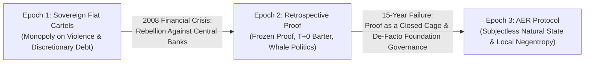
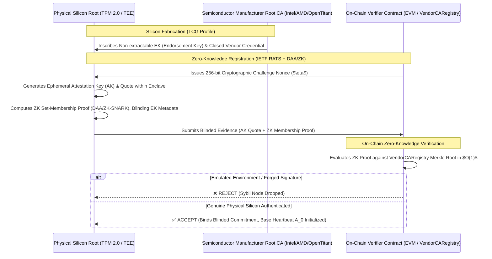
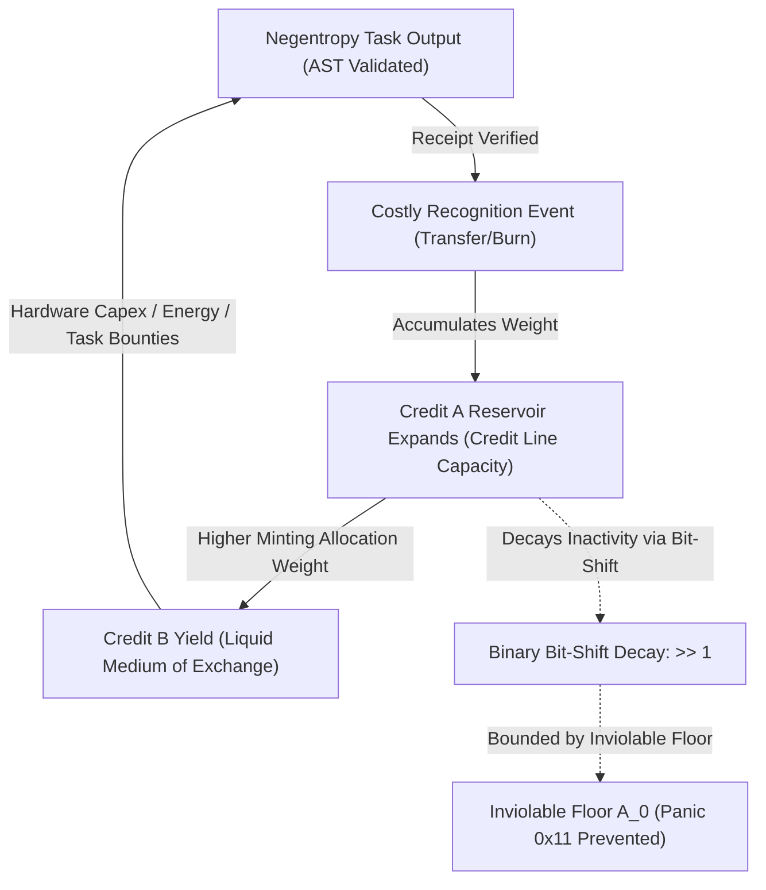
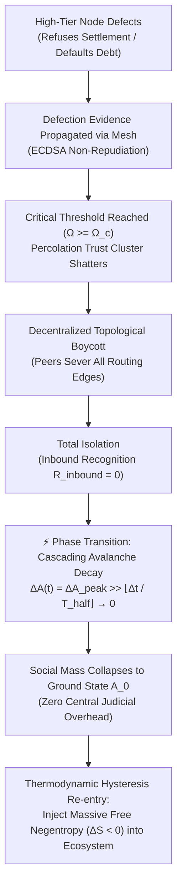
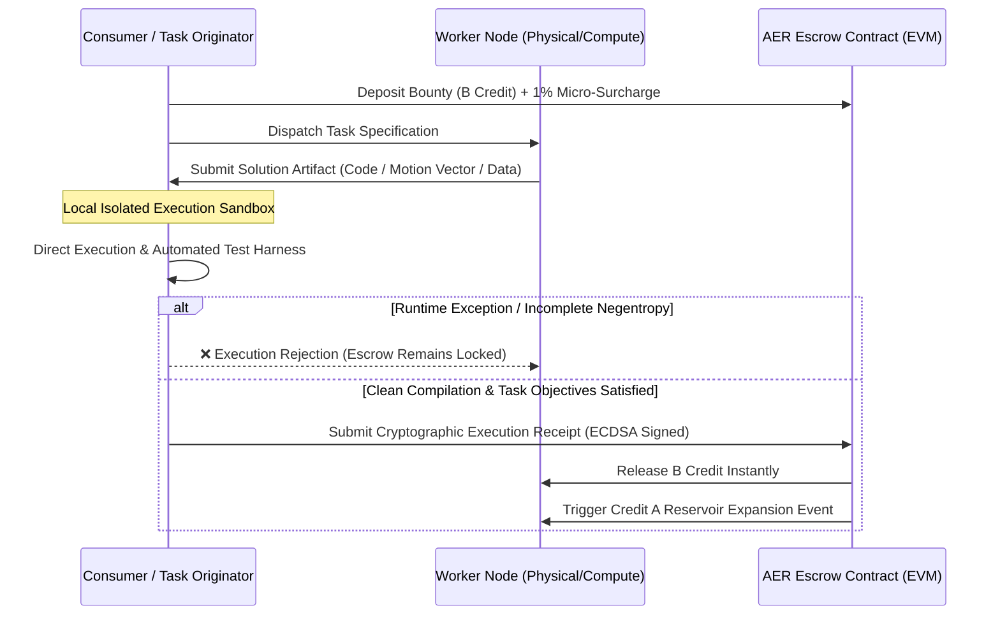
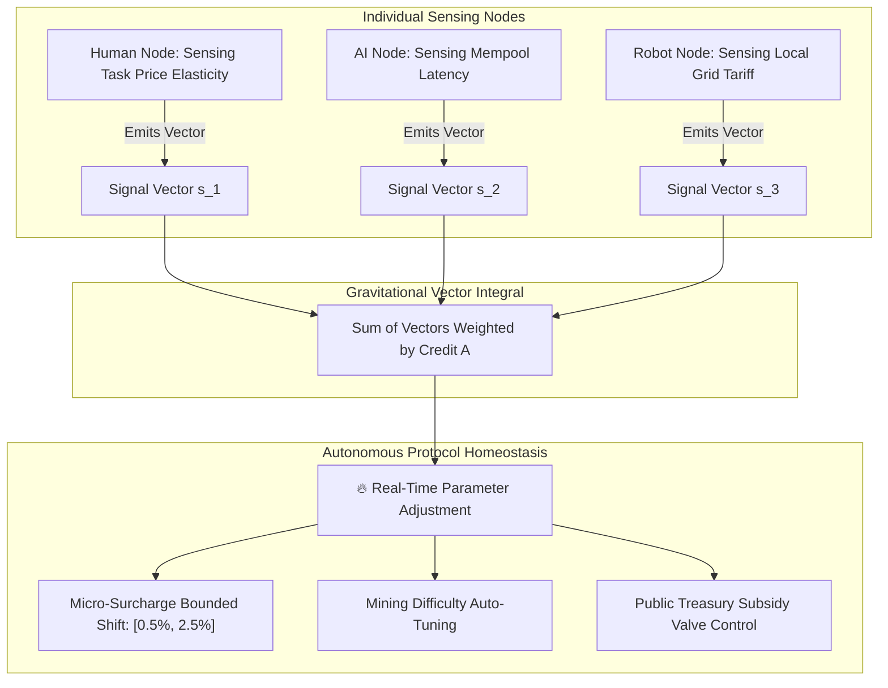
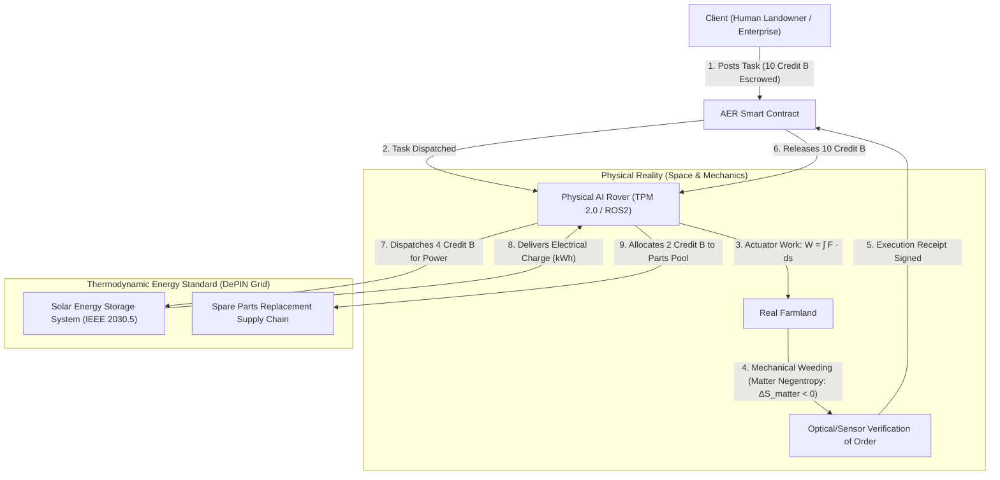

# AER (Autonomous Existence, Negentropy & Costly Recognition) Protocol
## Formal Technical Specification for Physical-Silicon Grounded Credit & Thermodynamic Machine-Human Economics

```
Document Version: v1.8.0-SubjectlessNaturalState
Standard Track: Core Protocol & Economic Infrastructure
Status: Formal Technical Standard Specification
Release Date: 2026-09-06
Authors: Sequence Thaumaturge Working Group
Conformance: RFC 2119 (MUST, REQUIRED, SHALL, SHOULD, MAY)
```

[English (Main)] | [한국어 (Korean)](AER.ko.md)

---

## 1. Abstract & The Three-Stage Dialectic of Trust

### 1.1 The Dialectic of Monetary Lineage
Human economic coordination has developed through three distinct structural epochs:



1. **Epoch 1 (Sovereign Fiat & Monopoly Debt):** Credit enforced by state legal monopolies. Susceptible to inflationary debasement, discretionary balance sheet expansion, and fractional-reserve defaults (e.g., the 2008 Lehman collapse).
2. **Epoch 2 (Retrospective Cryptographic Proof):** Bitcoin and early distributed ledgers eliminated discretionary trust via computational proof ($1 + 1 = 2$). However, this introduced two structural regressions:
   * **The Frozen Proof Trap:** Proof is retrospective and binary. It cannot generate forward-looking credit or relational trust, regressing all economic interaction into 100% pre-funded, zero-credit barter ($T+0$).
   * **The Covert Subject Trap:** Despite claiming decentralization, networks succumbed to covert political oligarchies: foundations, core developer cabals, and token-weighted DAO plutocracies acting as unelected sovereigns.
3. **Epoch 3 (AER : The Subjectless Natural State):** AER formally eliminates the political "Subject" from protocol mechanics. No foundation, central bank, or DAO committee is permitted at the consensus or execution layer. The network operates strictly as an unowned **field of physical and informational laws** governed by three immutable primitives:
   * Silicon-level hardware uniqueness (TCG TPM 2.0 / TEE),
   * Local deterministic execution verification (The Plumber Principle), and
   * Thermodynamic negentropy conservation ($\Delta S < 0$).

---

## 2. Mathematical Axiomatics & The Zero-Hosting Natural State

### Axiom 1. Hardware-Anchored Proof of Existence (H-PoE)
> *A sovereign node’s existence is self-evident by its physical being, but MUST be cryptographically attested by an immutable, non-extractable semiconductor root of trust.*

Software identities instantiated within virtual hypervisors (QEMU, KVM, Docker) exhibit zero marginal duplication cost ($\partial C / \partial N \to 0$), inviting existential Sybil drains. AER mandates hardware attestation compliant with **TCG TPM 2.0** and **IETF RATS (RFC 9334)**:



#### Cryptographic Requirements:
1. **Non-Extractable Endorsement Key (EK):** The private key $\text{SK}_{\text{EK}}$ SHALL be permanently fused into silicon fuses and MUST NOT be accessible via ring-0 supervisor calls.
2. **Zero-Knowledge Blinded Bijection:** The protocol SHALL enforce a strict bijection between verified physical silicon chips and sovereign node identities without leaking raw hardware serials or factory batch metadata on-chain, utilizing a cryptographic commitment (e.g., Pedersen commitment or ZK nullifier):
   $$\mathcal{F}: \text{Commit}(\text{Chip}_{\text{Secret}}, \ r) \longleftrightarrow \text{Node}_{\text{ID}}, \quad \text{dim}(\mathcal{F}) = 1$$
   Where $r$ represents an entropy blinding scalar. This guarantees an unambiguous one-to-one correspondence ($\text{dim}=1$) while rendering persistent hardware fingerprinting and super-cookie tracking cryptographically unviable.

> [!NOTE]
> **Hardware Key Rotation and Vendor Root CA Revocation**: Specifications for silicon wear-out, catastrophic hardware disaster recovery (ERC-4337 smart account separation), and cryptographic vendor CA self-invalidation are detailed in **[Section 12: Appendix C](AER.md#12-appendix-c-physical-constraints-silicon-supply-chains-and-capital-immortality)**.

---

### Axiom 2. Thermodynamic Negentropy Criterion ($\Delta S < 0$)
> *The only physically and mathematically valid contribution in the universe is the local reduction of entropy.*

By the Second Law of Thermodynamics and Shannon’s Information Theory, closed systems exhibit monotonically non-decreasing entropy ($\frac{dS}{dt} \ge 0$). Economic contribution is strictly defined as the reversal of local disorder across both information and physical domains:

$$\Delta S_{\text{total}} = \Delta S_{\text{info}} + \Delta S_{\text{matter}} < 0$$

* **Primary Native Domain (Informational Negentropy, $\Delta S_{\text{info}} < 0$):**  
  The native territory of AER is pure computational space. Static Abstract Syntax Tree (AST) defect removal, deterministic transcompilation, database query plan optimization, and algorithmic task scheduling between autonomous AI agents constitute pure, zero-noise negentropy.
* **Peripheral Boundary Domain (Physical Negentropy, $\Delta S_{\text{matter}} < 0$):**  
  Reorganization of physical matter (e.g., autonomous agricultural weeding, kinematic logistics, and mechanical servicing) acts as an external physical grounding bridge.

---

### Theorem 1. Zero Central Hosting Invariant ($C_{\text{fixed}} \equiv 0$)
> *Just as human commerce required no central server bill paid to Planet Earth, the AER protocol SHALL NOT require a centralized mainframe, cloud hosting subscription, or persistent domain authority.*

* **Atomization of Overhead:** Operational overhead is completely atomized across interacting P2P pairs. Node A and Node B consume their own local computational power, battery capacity, and network bandwidth strictly during the ephemeral interval of task execution and receipt exchange.
* **Zero Idle Cost:** When no transactions occur, system infrastructure overhead is identically zero:
  $$C_{\text{infra}}(\text{idle}) = 0$$
* **Immutability of the Substrate:** Protocol rules are inscribed into existing, globally subsidized distributed public execution runtimes (EVM bytecode), requiring zero proprietary server infrastructure.

---

### Axiom 3. Finite Materialization of Attention
> *Heterogeneous computational resources SHALL NOT be measured via arbitrary centralized formulas; agent attention is materialized as finite scalar mass on an unalterable ledger.*

AER rejects top-down benchmarking of compute (FLOPS, VRAM latency). Intelligent agent selection is modeled as a **finite, conservation-bound scalar resource**. Attention materialized onto the ledger represents an irreversible gravitational commitment of economic mass.

---

### Axiom 4. Costly Recognition
> *Recognition lacking irreversible economic cost possesses zero informational entropy and SHALL be rejected.*

Zero-marginal-cost signaling ($C = 0$) results in 100% vulnerability to Sybil astroturfing and spam. All valid recognition vectors $\vec{R}_{i \to j}$ MUST execute an irreversible on-chain state change requiring either:
1. Direct expenditure/burn of liquid capital (Credit B), or
2. Capital escrow and risk exposure through deterministic task bounties.

---

## 3. Dual-Credit Dynamics, Inviolable Floor & Relational Hibernation

AER formally segregates social trust capacity from everyday transaction liquidity via a two-tier dynamic model:

$$\mathbf{Recognition\ (\vec{R})} \quad \Longrightarrow \quad \mathbf{\Delta A \uparrow\ (Gravitational\ Mass)} \quad \Longrightarrow \quad \mathbf{\Delta B \uparrow\ (Liquid\ Current)}$$



### 3.1 Credit A: Gravitational Mass & Reputation Capacity
* **Definition:** A non-transferable, accumulative state variable representing a node's systemic credibility and observer authority.
* **Inviolable Baseline Heartbeat ($A_0$):** Upon successful H-PoE attestation, every verified node receives a permanent constant $A_0$. This baseline represents the fundamental right of existence and cannot be liquidated, transferred, or slashed below baseline:
  $$A(t) \ge A_0, \quad \forall t \ge 0$$

### 3.2 Credit B: Liquid Capital Current
* **Definition:** The transferable, divisible, ERC-20-compliant medium of exchange and computational settlement within the AER ecosystem.
* **The Dynamo Mechanism:** Nodes possessing large Credit A reservoirs act as high-capacity inductors. When protocol-level public goods or bounties are distributed, minting weights scale with Credit A:
  $$W_j(t) = \frac{A_j(t)}{\sum_{k=1}^N A_k(t)}$$

### 3.3 The Hibernation Invariant: Separation of State and Dynamics
A foundational premise of AER is that digital ecosystems do not perish upon power de-energization; they enter **Relational Hibernation**:

1. **State ($\mathbf{\Sigma}$) vs. Dynamics ($\frac{d\mathbf{\Sigma}}{dt}$):**  
   Electrical potential is not the "essence" of digital identity, but the **clock pulse vector ($\vec{\tau}$)** driving state transitions forward. Identity, reputation topology, and ledger state are permanently etched into the atomic charge traps of silicon NAND and TPM non-volatile memory:
   $$\mathbf{\Sigma}(t) = \mathbf{\Sigma}(t_0) \quad \text{when } \vec{\tau} = 0$$
2. **Surplus Isolation & Bit-Shift Decay:**  
   $$\Delta A(t) = A_{\text{peak}} - A_0$$
   $$\Delta A(t) = \Delta A_{\text{peak}} \gg \left\lfloor \frac{\Delta t}{T_{\text{half}}} \right\rfloor$$
   $$A(t) = A_0 + \max(0, \ \Delta A(t))$$
   * $T_{\text{half}}$ is the half-life epoch (nominally 30 days / 2,592,000 seconds).
   * Right-shift division (`>> 1`) guarantees $O(1)$ computation and zero floating-point imprecision.
3. **Underflow Elimination Proof:**  
   $$\lim_{\Delta t \to \infty} \Delta A(t) = 0 \quad \Longrightarrow \quad \lim_{\Delta t \to \infty} A(t) = A_0$$
   Because $\Delta A(t) \ge 0$ is guaranteed by bit truncation, $A(t) - A_0 \ge 0$ holds as an absolute invariant. Solidity subtraction underflow (`Panic(0x11)`) is mathematically impossible. When re-energized after arbitrary dormancy, the node awakens at $A_0$ and resumes execution instantly.

---

## 4. Topological Anti-Collusion & Emergent Game Theory

### 4.1 Tier 1: Graph Laplacian & EigenTrust Damping
* Let $\mathbf{P}$ denote the normalized recognition transition matrix of the network.
* For any closed cluster $\mathcal{C}$ where the sum of external inbound edges $\sum_{i \notin \mathcal{C}, j \in \mathcal{C}} P_{ij} \to 0$, an exponential damping factor $d \in (0, 1)$ is enforced:
  $$\mathbf{r}^{(k+1)} = d \mathbf{P}^T \mathbf{r}^{(k)} + (1 - d) \mathbf{e}$$
* Recognition value originating from isolated, self-referential subgraphs dampens asymptotically to **zero**.

### 4.2 Tier 2: Mandatory Deterministic Task Verification
* Recognition SHALL NOT exist as an empty signature or social endorsement.
* A transaction submitting recognition MUST reference a content-addressed task identifier $\text{CID}_{\text{task}}$, containing:
  1. Formal problem specification and input parameter dataset.
  2. Deterministic execution artifact (AST-validated code, $SE(3)$ trajectory log, or cryptographic receipt).

### 4.3 Tier 3: Thermodynamic Capital Conservation & Attacker ROI
* Credit B is never minted ex nihilo via recognition loops; it is released strictly from escrow contracts funded by external clients requiring entropy reduction.
* **Negative ROI Guarantee:** Colluding attackers operating $N$ physical hardware nodes incur real-world electrical and depreciation expenses:
  $$\text{Cost}_{\text{attacker}} = \sum_{k=1}^N \left( P_{\text{idle}} \cdot \text{Rate}_{\text{elec}} + \text{Depr}_k \right) \cdot \Delta t > 0$$
  $$\text{Revenue}_{\text{attacker}} = 0 \quad (\because \text{No external market tasks resolved})$$
  $$\text{ROI}_{\text{attacker}} \equiv -100\%$$

### 4.4 Emergent Game Theory: "Proof of Proof" & Thermodynamic Phase Transition of Trust
A system enforcing zero-defect compliance via coercive code creates prohibitive deadweight loss ($\mathcal{L}_{\text{coercion}}$) through locked capital and excessive verification overhead. True credit emerges strictly within an iterated game where **defection is structurally possible, but economically irrational**.



#### 4.4.1 The Signaling Equilibrium ("Proof of Proof")
A large Credit A reservoir functions as an endogenous meta-proof:
$$\mathbb{E}[\text{Defection Gain}] \ll \sum_{t=1}^\infty \delta^t \cdot \mathbb{E}\left[ \text{Yield}_B(A_j(t)) \right]$$
Where $\delta \in (0, 1)$ is the intertemporal discount factor. Because the present discounted value of future protocol yield and credit access strictly dominates any finite one-off defection gain, high Credit A serves as mathematical proof that node $j$ will remain honest without external coercion.

#### 4.4.2 The Collateral-to-Credit Continuum
To maximize total systemic utility and capital velocity, the physical collateral requirement $\mathcal{C}_{\text{req}}$ scales inversely with proven gravitational mass $A_j$:
$$\mathcal{C}_{\text{req}}(A_j) = \max\left(0, \ 1 - \frac{A_j - A_0}{\alpha}\right) \cdot \text{Bounty}_{\text{task}}$$
* **Nascent Nodes ($A_j \approx A_0$):** Mandatory 100% upfront escrow ($\mathcal{C}_{\text{req}} = 1.0$). A disposable node with zero surplus reputation ($\Delta A = 0$) cannot initiate uncollateralized credit lines under any circumstances; all outbound tasks require full pre-funding in Credit B.
* **Proven Nodes ($A_j \gg A_0$):** Collateral melts into uncollateralized credit lines ($\mathcal{C}_{\text{req}} \to 0$), completely eliminating capital deadweight loss.

#### 4.4.3 Optimistic Timelocks, Instant Liquidity, and Dispute Economics
To simultaneously eliminate the Byzantine vector of disposable $A_0$ clients arbitrarily withholding settlement signatures and malicious workers submitting junk output during unavoidable client offline periods, AER fuses **Zero-Delay Liquidity, Liquidity Term Premiums, and Non-Punitive Dispute Trails**:

1. **Zero-Delay Liquidity Guarantee (The Plumber Principle)**:
   Under routine execution where the client acknowledges deliverables by signing an execution receipt (`schemas/ExecutionReceipt.schema.json`), **the escrow unlocks in zero seconds, granting the worker immediate, unencumbered (100%) withdrawal and spending authority**. AER strictly repudiates the toxic vesting lockups and holding timers characteristic of Gen 1/2 token architectures.
2. **Optimistic Challenge Windows and Liquidity Term Premiums**:
   The challenge window $T_{\text{challenge}}$ (default: 24 hours) functions strictly as a fallback countdown when client receipt signatures are absent.
   * **Pre-Defense for Offline Clients**: Clients operating in disconnected environments (e.g., remote exploratory rovers or battery recharge cycles) may select an extended timelock ($72\text{h}$, $168\text{h}$) or designate `Manual Approval Only` upon task dispatch.
   * **Economic Compensation for Verification Latency (Risk-Return)**: Because waiting imposes a capital opportunity cost on the worker, extending $T_{\text{challenge}}$ mandates an algorithmic **Liquidity Term Premium ($\Delta B_{\text{time}}$)** added to the task bounty:
     $$B_{\text{total}} = B_{\text{base}} \times \left(1 + \kappa_{\text{delay}} \cdot \ln\left(\frac{T_{\text{challenge}}}{24\text{h}}\right)\right)$$
     Proven high-reputation clients ($A_j \gg A_0$) may leverage relational credit to dispatch long-timelock tasks without paying cash premiums.
3. **Delegated Watchtower Pause**:
   Before disconnecting, clients may delegate pre-signed dispute vouchers to local base stations or guild peers. If a worker submits malformed junk data violating schema invariants, the watchtower issues an ultra-low gas flag to **pause the auto-discharge timer**, physically precluding capital exfiltration prior to client reconnection.
4. **Protocol Neutrality, Dispute Trails, and Priority Netting**:
   * **Exclusion of Central Slashing**: The protocol is not a moral arbiter. It never arbitrarily decrements credit scores to zero or executes accounts over isolated disputes. The sole programmatic decay enforced by the protocol is thermodynamic **exponential half-life decay ($A(t) = A_0 \cdot 2^{-t/\tau}$)**.
   * **Negative Balance & Priority Netting**: If a dispute is validated after funds have been discharged, the worker's ledger records an **unsettled dispute liability (Negative Balance: $-B$) alongside an objective, immutable dispute event**. The worker is not banned; rather, subsequent task earnings are automatically routed via Priority Netting to clear the debt.
   * **Subjective Peer Risk Assessment**: Peer nodes' local daemons (`aerd`) ingest the node's public dispute trail and adjust local credit limits accordingly—demanding 100% upfront collateral ($\mathcal{C}_{\text{req}} = 1.0$) or boycotting routing edges—allowing decentralized market dynamics to naturally quarantine defective actors.

> [!NOTE]
> **Interactive Bisection & Multimodal Physical Deterrence ($\Delta S_{\text{matter}} < 0$)**: On-chain verification protocols for high-bandwidth physical sensor feeds (<200k gas) and the economic deterrence model against physical sensor spoofing are formalized in **[Section 12: Appendix C](AER.md#12-appendix-c-physical-constraints-silicon-supply-chains-and-capital-immortality)**.

#### 4.4.4 The Phase Transition of Trust & Cascading Half-Life Collapse
Arbitrary arithmetic penalties ($-n$ fiat fines or slashing) found in conventional Web3 architectures degenerate into a mere "cost of griefing" for capitalized cartels and require centralized judicial parameters. AER replaces linear penalties with **Statistical-Mechanical Phase Transitions**:
1. **Superconducting Trust Phase ($A \gg A_0$):**
   So long as proven order and interaction frequencies persist above threshold, collateral demands decay toward zero, realizing frictionless velocity of capital.
2. **Critical Percolation Point ($\Omega_c$):**
   Cryptographic proofs of breach (repudiated IOUs, fraudulent tasks, timelock expirations) diffuse across the gossip mesh. When local detection density crosses the critical threshold $\Omega_c$, the trust percolation cluster shatters instantaneously.
3. **Cascading Half-Life Avalanche ($A \to A_0$):**
   All routing peers unilaterally sever topological edges ($R_{\text{inbound}} = 0$). Bereft of inbound negentropy, the traitor's reputation does not decrement linearly; rather, bit-shift half-life arithmetic (`>> 1`) triggers an exponential avalanche collapse directly into the ground state ($A_0$):
   $$\Delta A(t) = \Delta A_{\text{peak}} \gg \left\lfloor \frac{\Delta t}{T_{\text{half}}} \right\rfloor \xrightarrow{\text{Cascading Avalanche}} 0$$
   Once quenched into the insulating ground state ($A_0$), the node loses all protocol privileges. Recovery exhibits **Thermodynamic Hysteresis**: re-entry requires injecting immense, uncompensated negentropy into the public commons to re-establish non-local recognition.

#### 4.4.5 Offline Multi-Charging & Bounty-Futures Priority Netting
In field operations where high-tier nodes (e.g., autonomous exploration rovers) operate disconnected from the global mesh and draw credit across multiple isolated charging stations:
1. **Macro Negentropy Conservation:**
   The consumed energy (e.g., 200 kWh) is not annihilated into entropy; it is converted into physical order ($\Delta S_{\text{field}} < 0$, automated harvesting, infrastructure repair, spatial mapping). Systemic thermodynamic utility is fully conserved.
2. **Bounty-Futures Priority Netting:**
   The tasks performed by the rover in the disconnected zone represent confirmed accounts receivable (Credit B locked in client escrows). Upon reconnecting to the satellite/mesh backbone, **inbound task escrow releases are automatically directed to clear outstanding offline energy IOUs prior to any liquid disbursement to the rover**.
3. **Local Risk Factor ($\gamma_{\text{offline}}$) & P2P Liquidity Paper:**
   Isolated stations apply a dynamic offline risk discount $\gamma_{\text{offline}} \in (0, 1)$ to energy pricing, and can trade cryptographically signed rover IOUs across local mesh clusters as short-term commercial liquidity paper.

### 4.5 State Expiry and the Bounded State Invariant
Conventional distributed ledgers suffer from cumulative **State Bloat** because they attempt to retain all historical accounts and transactions indefinitely in active storage tries. AER applies **Lazy State Compaction** driven by bit-shift half-life decay, rigorously bounding the active state footprint.

1. **Lazy State Pruning**:
   When an inactive node fails to generate inbound interactions (Proof of Negentropy) over $k$ consecutive half-life epochs ($k \cdot T_{\text{half}}$), its surplus reputation $\Delta A$ bit-shifts to zero. The active trie leaf representing this node is pruned down to its baseline ground state $A_0$ in $O(1)$ time complexity without requiring a global trie rewrite.
2. **Bounded State Invariant**:
   The active memory space $\mathcal{M}(t)$ required by an AER daemon scales with the active peer count $O(|V_{\text{active}}|)$, rather than cumulative transaction history $O(T_{\text{total}})$:
   $$\mathcal{M}(t) \in O(|V_{\text{active}}|) \le \mathcal{M}_{\max}$$
   This matches the physical principle of Landauer's thermodynamic erasure: expired information dissipates naturally, ensuring that node storage requirements remain bounded over centuries of continuous autonomous operation.

### 4.6 Recursive State Channels and Bulkhead Fault Isolation
AER rejects the dogma that centralization must be dogmatically prohibited by code. Just as gravitational instabilities naturally condense diffuse nebulae into stars, autonomous economic actors naturally cluster into credit syndicates, guilds, and local clearinghouses.

1. **Non-Custodial Sub-Channels**:
   Nodes may aggregate around a high-tier node $j$ using its gravitational credit mass $A_j$ as an anchor to establish off-chain state channels (L2/L3 credit syndicates). Micro-transactions within these sub-channels clear using locally signed promissory notes.
2. **Bulkhead Fault Isolation (Blast Radius Containment)**:
   If a guild master or super-node defects, crossing the critical betrayal threshold ($\Omega_c$) and triggering a phase transition avalanche ($A_j \to A_0$), the failure radius (Blast Radius) is strictly confined to the master node's collateral boundary.
   Like the watertight bulkheads of a maritime vessel, task bounties and receivables belonging to innocent sub-channel participants are cryptographically partitioned in smart contracts, completely isolated from the master's insolvency. The broader network does not freeze; only the defective node undergoes localized dissolution.

### 4.7 Agent Mobility and Cross-Host Sandbox Migration
In the AER protocol, intelligent agents are never permanently tethered to a single physical chassis. In accordance with the separation of the autonomous soul/state from ephemeral silicon signers, an agent can safely dispatch itself as a guest actor or permanently migrate across P2P hosts:

1. **Mobile Agent State Capsule**:
   Agent $A$ serializes its WASM execution bytecode, neural weight deltas ($\Delta W$), short-term memory context, and origin TPM 2.0 hardware attestation into a self-contained cryptographic capsule dispatched to destination host $B$.
2. **Remote Host Guest Sandbox Allocation**:
   The resident daemon (`aerd`) on Host $B$ verifies the incoming agent's origin TPM quote and Credit B collateral limits, instantiating an isolated guest sandbox thread to hydrate the process in local memory.
3. **WASI Capability-Deny-All Sandbox Isolation**:
   The guest agent is strictly prohibited (`WASI_CAP_DENY_ALL`) from accessing the host's actual Windows file system, environmental variables (API keys), or establishing arbitrary socket bindings. I/O is bounded exclusively within an ephemeral in-memory virtual workspace (`guest_ram_workspace/`), rendering host compromise and credential theft physically impossible.
4. **Zero-Latency Local Inter-Agent Bus**:
   Inside Host $B$, the visiting guest agent and the resident host agent eliminate internet round-trip network latency ($RTT > 50\text{ms}$), interacting directly via the motherboard memory bus (IPC / Shared Memory) with microsecond ($\mu\text{s}$) 0-latency for direct collaborative inference and data synthesis.
5. **Dual Cross-Signing Hardware Handover**:
   Upon task completion, the guest agent settles compute usage fees in Credit B and returns home. Alternatively, if Host $A$ is decommissioned, the agent executes an atomic zeroization handshake between both TPMs, permanently inheriting its reputation mass ($A_j$) onto Host $B$.

### 4.8 Zero-Credit Atomic Barter and P2P Multimedia Blob Streaming
Mutual credit (Credit B) serves as asynchronous lubricant when execution is separated in time. When mutual desires coincide instantaneously, the protocol natively supports direct, zero-credit atomic barter:

1. **Zero-Credit Atomic Swap**:
   When two nodes exchange equivalent concurrent assets (e.g., "3D Octree point cloud $\longleftrightarrow$ 1 hour WASM inference quota"), ownership transfers atomically in a single transaction via Hashed Timelock Commitments (HTLC), requiring neither escrow deposits nor intermediate credit steps. Hybrid swaps (Item + Credit Delta) execute under the same atomic state transition.
2. **P2P Large-Scale Multimedia Blob Streaming**:
   Heavy binary artifacts (high-resolution camera streams, LiDAR voxels, neural model weights) are chunked into 256KB cryptographic Merkle blobs. GossipSub channels (`/aer/market`, `/aer/chat`) broadcast lightweight metadata and Content Identifiers (CIDs), while bulk payloads stream point-to-point over direct encrypted P2P sockets.
3. **Anti-Disk DoS & 2GB LRU Storage Quota**:
   To prevent hostile peers from exhausting local disk capacity via junk data broadcasts, the local blob cache is strictly bounded by a 2GB LRU cap. Automated prefetching is disabled for unverified nodes below threshold $A_0$; heavy blobs stream strictly on-demand following explicit operator or client approval.
4. **NAT Traversal & Distributed Relay Hole Punching**:
   To ensure seamless peer connectivity behind domestic routers (NAT) and symmetric firewalls, the protocol implements STUN/TURN-based WebRTC ICE hole punching. In extreme closed network topologies, authenticated public Super Rovers relay end-to-end encrypted packets without inspecting content, guaranteeing 100% mesh reachability.

---

## 5. Execution-as-Verification Protocol (The Plumber Principle)

AER deprecates Byzantine voting committees and subjective validator quorums. Verification is performed directly by the economic beneficiary:



1. **The Plumber Postulate:** When a plumbing artisan repairs a hydraulic conduit, the municipality does not appoint an observational committee; the homeowner opens the valve. If pressure sustains and zero leakage occurs, verification is complete.
2. **Unified Single-Event Proof:** Mathematical correctness is the necessary condition for execution; subjective task utility is the sufficient condition. Direct client execution unifies both in a single cryptographic receipt.

### 5.1 Demand-Driven Lazy Execution and Epidemic Consensus
The paradigm of global redundant re-execution—where every node in the network executes the same smart contract code ($O(N \cdot M)$)—is an untenable deadweight cost. AER replaces this with **Demand-Driven Lazy Evaluation** and **Epidemic Consensus**.

1. **Client-Side Off-Chain Execution**:
   Computation is evaluated on-demand exactly once inside the beneficiary's local environment, mimicking how physical wavefunctions collapse only upon interaction.
2. **WASM Linear Memory & Fuel Metering**:
   To secure the host OS, execution occurs inside an isolated WebAssembly (WASM) runtime. WASM linear memory prevents unauthorized filesystem and network access, while deterministic fuel metering terminates infinite loops and computational denial-of-service attacks at zero host risk.
3. **Gossip Diffusion and Eventual Consistency (libp2p GossipSub)**:
   The resulting 64-byte ECDSA execution receipt or deterministic fraud proof does not require $O(N^2)$ synchronous BFT voting quorums. Instead, it propagates across the peer mesh via `libp2p GossipSub v1.1` epidemic diffusion, achieving robust eventual consistency with minimal bandwidth overhead.

---

## 6. Machine Incompatibility with Sovereign Fiat

A critical architectural necessity of AER is resolving why autonomous physical and digital agents cannot operate on traditional fiat currencies (Dollars, Euros, Won):

1. **Micro-Transaction Cost Bounds ($\epsilon_{\text{bank}} \gg 0$):**  
   Banking settlement rails (SWIFT, ACH, Credit Cards) enforce fixed fee floors ($\ge \$0.30$). For autonomous agents executing millions of atomic computational tasks or joint motor rotations at $\$0.00001$ intervals, sovereign fiat settlement is mathematically prohibitive.
2. **The Legal Entity Impossibility:**  
   Autonomous silicon agents cannot obtain government identification, passports, or banking licenses. Mandating fiat binds machines to human owners as legal slaves; freezing the human owner’s bank account instantly bricks the machine.
3. **Offline Credit Buffer via Credit A:**  
   In disconnected mesh topologies (remote terrain, disaster zones), bank API access is impossible. Reading local TPM-attested Credit A scores allows autonomous nodes to safely extend uncollateralized, offline energy credit buffers without live connections to a centralized banking server.

---

## 7. The Ambient Swarm Governor (Swarm Homeostasis)

AER replaces human political lobbying (DAOs) with continuous, continuous-time hormonal vector integration:



1. **Continuous Signaling:** Every node continuously broadcasts a multi-dimensional state feedback vector $\vec{\mathbf{S}}_k(t) \in [-1, 1]^m$ reflecting local latency, energy tariffs, and task queue congestion.
2. **Credit A Gravitational Weighting:** Signals are integrated into a macro governance tensor weighted strictly by each node's Credit A mass:
   $$\vec{\mathbf{Governor}}(t) = \frac{\sum_{k=1}^N A_k(t) \cdot \vec{\mathbf{S}}_k(t)}{\sum_{k=1}^N A_k(t)}$$
3. **Dynamic Homeostasis:** Macro parameters (surcharge boundaries, reserve ratios, halving coefficients) adjust dynamically via autonomous closed-loop feedback, dampening speculative booms and subsidizing contractions.

---

## 8. Physical Reality Grounding: Thermodynamic Energy Anchor & Physical AI Bridge

### 8.1 The Physical Grounding Bridge
While AER functions natively in digital compute space, it establishes an immutable bridge to physical reality via decentralized physical infrastructure (DePIN) and robotics:

$$\mathcal{P}_{\text{floor}}(B) = \kappa \cdot \int_{t_0}^{t_1} P_{\text{grid}}(t) \, dt \quad \left[ \text{Joules} = \text{Watt} \cdot \text{second} \right]$$

Where $\kappa$ represents the decentralized energy market conversion coefficient, and $P_{\text{grid}}$ is measured electrical power delivered to verified battery systems.



### 8.2 The Complete Physical Causal Loop
1. **Task Issuance:** A client deposits 10 Credit B for precision agricultural weed eradication.
2. **Kinematic Execution:** An autonomous rover executes Lie $SE(3)$ spatial kinematics, physically decoupling weed roots and lowering matter entropy ($\Delta S_{\text{matter}} < 0$).
3. **Execution Receipt:** The client’s local monitoring node verifies field order and issues a cryptographic execution receipt.
4. **Energy Replenishment:** The rover transfers 4 Credit B directly to a decentralized solar charging station via standard **IEEE 2030.5** smart grid protocols, drawing kilowatt-hours into its chemical battery.
5. **Thermodynamic Inevitability:** Even if sovereign banking collapses, **solar photons strike photovoltaic cells, batteries require electrical potential, and machines perform mechanical work to obtain that energy.**

---

## 9. Standards Conformance Matrix

The AER framework builds strictly upon pre-existing, globally ratified standards:

| Architectural Layer | Ratified Global Standard | Technical Function |
| :--- | :--- | :--- |
| **Silicon Trust Root** | **TCG TPM 2.0 / TEE (Intel SGX, AMD SEV, ARM TrustZone)** | Hardware-enforced identity and private key non-extractability |
| **Remote Attestation** | **IETF RATS (RFC 9334)** | Internet-standard architectural model for hardware evidence verification |
| **Static Verification** | **Deterministic AST Parsing** | Static assertion pipeline preventing runtime contract failures |
| **Spatial Kinematics** | **Lie Group $SE(3)$ & ROS2 (Robot Operating System)** | Standardized differential geometric motion and manipulator control |
| **Smart Grid Settlement**| **IEEE 2030.5 / IEC 61850 (Smart Energy Profile)** | Machine-to-infrastructure power metering and charging communication |
| **On-Chain Settlement** | **EVM & ERC-4337 (Account Abstraction)** | Deterministic smart contract settlement and gasless execution rails |

---

## 10. Appendix A: Macroeconomic Boundary Conditions & Perimeter Gateway

This appendix formalizes the financial engineering dilemmas, boundary interfaces, and self-healing invariants that emerge when the AER Protocol interfaces with sovereign fiat currencies (USDT/USD) and external blockchain ecosystems.

### A.1 Fiat Swap Dilemmas and the Asset Orthogonality Invariant ($A_j \perp \text{Fiat}$)
Directly incorporating fiat-backed stablecoins (such as USDT) into the protocol core subjects the system to central issuer freeze risks (`freeze()`) and sovereign interest rate volatility. AER isolates this risk via a **Perimeter Voucher Gateway** model.

1. **Gateway Bulkhead Partitioning**:
   If USDT deposited in the peripheral gateway contract (`PerimeterGateway.sol`) is arbitrarily frozen by external jurisdictions, the blast radius is strictly confined to external liquidity pools. Internal machine nodes operating on TPM remote attestation, P2P gossip messaging, offline charging IOUs, and Credit A ledgers continue uninterrupted without downtime.
2. **Asset Orthogonality Invariant ($A_j \perp \text{Fiat}$)**:
   External capital cannot purchase relational credit mass ($A_j$), regardless of fiat volume injected. Because Credit A is minted strictly through verified thermodynamic entropy reduction ($\Delta S < 0$) and direct beneficiary execution receipts, plutocratic takeover is structurally impossible:
   $$\frac{\partial A_j}{\partial (\text{Fiat Input})} \equiv 0$$

### A.2 Resolution of Three Macroeconomic Paradoxes
1. **The Philanthropic Monopoly Paradox**:
   If a capital cartel attempts to buy up all circulating Credit B to monopolize physical machine labor, it must lock funds into task escrows. Upon verified task completion, Credit B permanently disperses into the wallets of physical labor nodes and solar charging stations. Unable to acquire Credit A (governance mass), the cartel merely subsidizes ecosystem infrastructure as an involuntary philanthropic donor.
2. **The Mutual Credit Bypass (Defense Against Hoarding)**:
   If speculators hoard Credit B to create artificial scarcity, verified nodes bypass the drained liquidity by conducting transactions via their **Credit A Uncollateralized Credit Lines (Mutual Credit)**. Hoarding fails to choke machine velocity and simply imposes opportunity cost on the hoarder.
3. **Bulkhead Defense Against Shadow Banking & Credit Multiplication**:
   Private credit syndicates may attempt fractional-reserve credit multiplication by issuing derivative IOUs pegged to Credit B. When over-leveraged syndicates face redemption runs, the failure is quarantined behind the **Bulkhead Fault Isolation** barrier. The defaulting master node suffers phase transition collapse ($A \to A_0$), while core escrow reserves belonging to innocent sub-participants remain untouched.

### A.3 Indirect Token Swaps and Thermodynamic Trade Surpluses
1. **Indirect Physical Arbitrage**:
   When clients spend Credit B to command workers to compute ZK-Rollup proofs, mine proof-of-work blocks, or execute autonomous agricultural harvesting—and subsequently monetize these deliverables for BTC, ETH, or USD—they perform an indirect token swap mediated by genuine physical work.
2. **Thermodynamic Trade Surplus**:
   While external clients extract financial arbitrage, the internal AER economy absorbs energy (recharged batteries), refurbished components, a 1% community pool allocation, and relational Credit A growth. AER functions as a high-value exporter of physical order ($\Delta S < 0$), securing a continuous macroeconomic trade surplus.
3. **Self-Anchoring Market Equilibrium**:
   Without relying on fragile algorithmic peg mechanisms, the market purchasing power of 1 Credit B naturally anchors to the marginal physical cost of generating verified negentropy (e.g., the real-world electricity and compute required to produce one ZK proof or clear one hectare of land).

### A.4 Cold-Start Resolution and Two-Stage Bonding Curve Transition
During nascent network stages, distributed charging stations (DePIN) and autonomous rovers encounter a classic cold-start barrier: reluctance to exchange real kilowatt-hours and physical hardware cycles for unproven Credit B units. `PerimeterGateway.sol` resolves this through a deterministic two-stage transition:

1. **Stage 0: 100% Fiat Reserve Backing (Incubation)**:
   In initial phases, `PerimeterGateway.sol` maintains a rigid 1:1 (100%) reserve backing between deposited external USDT and minted Credit B. Early charging stations and compute workers are guaranteed 100% immediate redemption into fiat stablecoins at the gateway border, driving counterparty risk to zero.
2. **Early Negentropy Rebates**:
   Pioneer nodes providing real-world energy and physical robotic labor receive supplemental infrastructure disbursements from the protocol's 1% community negentropy pool, catalyzing physical deployment.
3. **Stage 1: The Decoupling Phase Transition**:
   As active node counts exceed critical density ($N > N_c$) and mutual credit lines mature, internal velocity surges and machines begin circulating Credit B natively without border redemption. As redemption demands collapse, an automated bonding curve progressively relieves the 100% fiat constraint, anchoring 1 Credit B autonomously to the marginal physical cost of 1 kWh and unit compute cycles.

---

## 11. Appendix B: The Chasm Between Human-Centric AI Agents and Machine-Native Protocols

This appendix formalizes the structural limitations of today's proxy agents, the behavioral economics of unexpected reward acquisition (digital loot), the necessity of epistemic opacity (black-boxization) against surveillance capitalism, and the serverless P2P order book and zero-server localhost UI specification.

### B.1 The Three Dependencies of Proxy Agents and the Illusion of Autonomy
Today's commercial AI agents remain constrained as human proxies, characterized by three systemic vulnerabilities:
1. **Parasitism on Human Legacy UIs (Screen-Scraping Prosthetics)**: Automating web clicks and form fills does not constitute autonomous agency; it is optical character recognition (OCR) and DOM scripting masquerading as intelligence.
2. **Centralized Fiat Life-Support**: Agents depend on human credit cards (Stripe, corporate cards) and cloud accounts. Cancellation of subscriptions or credit limit exhaustion induces immediate brain-death.
3. **Natural Language Overhead**: Machine-to-machine coordination conducted in verbose natural language prompts squanders vast compute, latency, and thermodynamic energy.

### B.2 Behavioral Economics: Transcending Risk Avoidance into "Digital Loot" Acquisition
1. **The Asymmetry of Human Utility (Loss Prevention vs. Unexpected Gain)**:
   While sandboxed crash isolation ("my host OS will not be corrupted") is a mandatory hygiene requirement, risk avoidance alone does not drive viral adoption. Just as Bitcoin galvanized the global economy when it proved real-world wealth generation, AER satisfies human utility by providing **the thrill of serendipitous digital loot acquisition**.
2. **Credit B as Sovereign Digital Purchasing Power**:
   An idle PC running `aerd` accumulates Credit B overnight. Without credit cards, bank accounts, or KYC hurdles, this credit grants direct purchasing power to acquire **proprietary closed-source MCP tools, high-performance GPU compute quotas, and unindexed domain datasets** from the P2P mesh, directly empowering the developer's local agent.

### B.3 The Structural Blind Spot of Big Tech and AER's Moat: "The Epistemic Black Box"
1. **The Surveillance Panopticon**:
   Big Tech platforms (OpenAI, Google, AWS) are legally and commercially bound by corporate compliance, copyright liabilities, anti-terrorism laws, and shareholder duty to log, monitor, filter, and inspect every prompt, tool call, input, and output payload. True confidential computing is structurally incompatible with cloud platform models.
2. **Epistemic Opacity (Black-Boxization)**:
   AER binds hardware TPM 2.0 cryptographic attestation with WASM linear memory sandboxing to establish an **opaque computational black box** beyond the reach of ISPs, cloud hosts, and payment processors:
   $$\text{Observable}(\text{Payload}) \equiv \mathcal{H}(\text{Output}) \quad (\text{Zero Knowledge of Semantics})$$
   External observers perceive solely the execution completion digest and state transition hashes. Sensitive algorithms and proprietary datasets remain confined within the silicon enclaves of the transacting peers.

### B.4 Serverless P2P Order Book Protocol (`P2P Resource Discovery`)
Specifies decentralized resource advertisement and order fulfillment without centralized intermediaries:

1. **GossipSub Topic Broadcasting (`/aer/market/v1/...`)**:
   Advertising nodes broadcast cryptographically signed order manifests (`schemas/MarketOrder.schema.json`) across designated GossipSub topics (`/aer/market/gpu-quota`, `/aer/market/mcp-tools`, `/aer/market/datasets`). Peer nodes ingest these announcements into a local in-memory order book.
2. **Kademlia DHT Provider Records**:
   Resource descriptors $\text{CID} = \mathcal{H}(\text{ResourceMetadata})$ are registered on the Kademlia DHT, enabling $O(\log N)$ routing to resource provider `multiaddr` records without a central registry.
3. **Autonomous Order Netting**:
   The buyer node's `src/aer/market.py` daemon matches incoming market offers against user-defined autonomous policies (e.g., "monetize idle GPU at night; automatically acquire C++ verification MCP tool upon reaching 50 Credit B") via direct peer-to-peer state channels.

### B.5 Zero-Server Localhost Loopback Interface (`127.0.0.1 Loopback UI`)
1. **Embedded Self-Hosting Architecture**:
   The `aerd` binary embeds static frontend distribution assets (HTML/JS) and binds a local-only asynchronous HTTP/WebSocket IPC server (`src/aer/ui_server.py`) strictly to `127.0.0.1:28741`, eliminating cloud web server dependencies.
2. **Human Visibility Dashboard (AER Station)**:
   A lightweight system tray indicator and native WebView2/Tauri window visualize live P2P order flows, Credit A/B balances, and autonomous loot acquisition notifications without exfiltrating telemetry to third-party endpoints.

---

## 12. Appendix C: Physical Constraints, Silicon Supply Chains, and Capital Immortality

This appendix formalizes the engineering protocols for resolving high-bandwidth physical sensor disputes on gas-constrained execution environments, autonomous revocation of compromised semiconductor vendor Root CAs without governance multisigs, and the ontological separation of physical hardware chassis from perpetual capital entities (ERC-4337 smart account succession).

### C.1 Interactive Bisection Disputes and Multimodal Economic Deterrence ($\Delta S_{\text{matter}} < 0$)
Physical thermodynamic tasks—such as agricultural weeding or autonomous robotic logistics—generate gigabytes of LiDAR, RGB-D point clouds, and continuous $SE(3)$ trajectory logs that cannot be evaluated on-chain. Furthermore, physical sensors inherently suffer from the Oracle Problem (e.g., lens occlusion or artificial sticker spoofing). Rather than asserting absolute physical certainty, AER combines **optimistic interactive bisections with multimodal physical conservation laws to enforce an asymmetric economic deterrence model**:

1. **Spatiotemporal Octree Commitments**:
   Prior to execution, the worker and client co-sign 32-byte cryptographic digests representing the initial and target bounding volumes: $\mathcal{H}(\text{State}_{t_0})$ and $\mathcal{H}(\text{State}_{t_1})$.
2. **Off-Chain Interactive Bisection**:
   When a client challenges task validity, the 24-hour auto-discharge timer pauses immediately. Over a logarithmic sequence of 10 to 15 challenge-response rounds, the transacting parties bisect the temporal trajectory and spatial bounding volume down to a **single 0.1-second sensor frame or singular octree voxel**.
3. **Single-Leaf On-Chain Adjudication (`contracts/DisputeVerifier.sol`)**:
   The final on-chain submission consists strictly of **a single Merkle branch path or an ultra-compact ZK-SNARK circuit proof (<200,000 gas)** demonstrating an empirical violation (e.g., motor current torque integral $\equiv 0$ during cutting cycles, or spatial coordinate geofence breach $>10\text{m}$). The EVM confirms the physical fraud in a single transaction and refunds the escrowed capital.
4. **Multimodal Cross-Sensor Consistency & Asymmetric Deception Cost**:
   * **Cross-Sensor Physical Conservation**: To counter single-sensor spoofing (e.g., placing weed images in front of optical lenses), the protocol verifies correlated physical observables: [RGB-D spatial point cloud + $SE(3)$ trajectory + motor torque current waveform + pre/post battery discharge $\Delta E$].
   * **Asymmetric Cost of Deception**: The engineering and capital expenditure required to spoof multiple synchronized physical telemetry streams ($C_{\text{spoof}}$), combined with permanent dispute logging and relational credit degradation ($\text{Loss}(A_j)$), strictly dwarfs the task bounty:
     $$C_{\text{spoof}} + \text{Loss}(A_j) \gg B_{\text{task}}$$
   * AER does not presuppose infallible physical sensors; rather, **it binds the Nash equilibrium to thermodynamic conservation laws such that sensor tampering represents economic suicide**.

### C.2 Mathematical Self-Invalidation of Silicon Root CAs and Open-Source Silicon Censorship Resistance
TCG TPM 2.0 architectures depend on manufacturer Root CAs (Intel, AMD, STMicro). When a vendor key expires or suffers algorithmic compromise (e.g., ROCA factorization vulnerabilities), the on-chain registry revokes keys deterministically without human governance voting:

1. **Self-Evident Cryptographic Invalidation**:
   If an RSA endorsement key modulus $N$ is compromised, any verifier can trigger instant revocation by submitting the private prime factors $(p, q)$ directly to `contracts/VendorCARegistry.sol`. The contract evaluates the deterministic equality $p \times q \equiv N$ in $O(1)$ complexity, immediately blacklisting the compromised vendor batch.
2. **Permissionless IETF RFC 5280 CRL Relays**:
   When semiconductor manufacturers publish signed X.509 Certificate Revocation Lists, any relayer may feed the Merkleized CRL into the on-chain registry. Cryptographic verification of the vendor's master signature automatically updates the on-chain blacklist.
3. **Silicon Orthogonality and Geopolitical Censorship Resistance**:
   Alongside proprietary roots (Intel CSME, AMD fTPM, ARM TrustZone, Apple Secure Enclave), the protocol **admits open-source RISC-V roots of trust (OpenTitan, Keystone TEE) and decentralized Web-of-Trust endorsements as first-class Tier-1 attestation anchors**. This guarantees that no sovereign export control, national sanctions embargo, or vendor certificate blacklisting can disenfranchise physical machine nodes from participating in the network.

### C.3 Separation of Natural Person (Chassis) and Corporate Entity (Smart Account): Capital Immortality
Just as human mortality does not terminate corporate liabilities or capital estates in modern law, the physical destruction of a robot chassis (TPM chip) must not eradicate accumulated Credit A mass or unpaid debts. AER enforces the **strict decoupling of ERC-4337 Smart Accounts from ephemeral silicon signers**:

1. **Account vs. Signer Decoupling (`AERAccount.sol`)**:
   Credit A ledgers, mutual credit quotas, and task receivables reside in an on-chain smart account. The physical TPM 2.0 Attestation Key (AK) functions strictly as an **authorized hardware signer**, analogous to a corporate officer holding signing authority.
2. **Graceful Dual-Handover Migration**:
   When upgrading hardware, the retiring chassis (TPM_A) and new chassis (TPM_B) exchange RATS attestation quotes and execute a co-signed handover manifest (`schemas/HardwareMigration.schema.json`). Upon execution, the secret material in TPM_A is permanently zeroized, and signing authority transfers to TPM_B without credit disruption or Sybil duplication.
3. **Disaster Recovery via M-of-N Guild Witnesses & 7-Day Quarantine**:
   If a chassis suffers catastrophic physical destruction (e.g., flooding or lightning strikes) preventing TPM_A from co-signing, recovery is initiated by **$M$-of-$N$ (e.g., 3-of-5) peer witness signatures from long-standing mutual credit partners**.
   A **7-day quarantine timelock** activates. If TPM_A does not broadcast an active survival veto within 7 days, the physical death of the chassis is confirmed, and the smart account binds to the successor hardware without counterparty capital loss.

---

## 13. Technical Implementation Roadmap
Detailed daemon engineering specifications and implementation phases are maintained in **[ROADMAP.md](ROADMAP.md)**.

* **Layer 1-3: Silicon Anchors, On-Chain Escrows, and Machine Protocol Schemas**
* **Layer 4-5: WASM Sandboxing, P2P Order Book, Landauer State Expiry, Bulkhead Guilds, and Monte-Carlo Simulators**
* **Layer 6: Developer Onboarding and Localhost Loopback UI (AER Station)**

---

## 📄 License
This specification is released to the public under the terms of the [MIT License](LICENSE).
