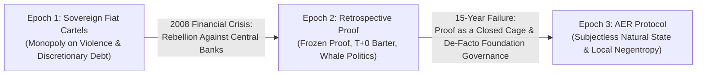
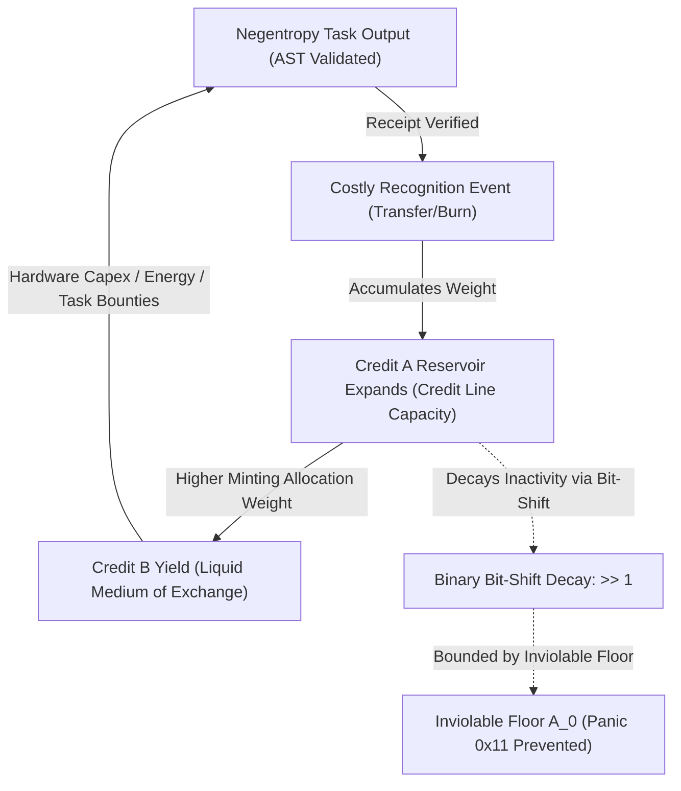
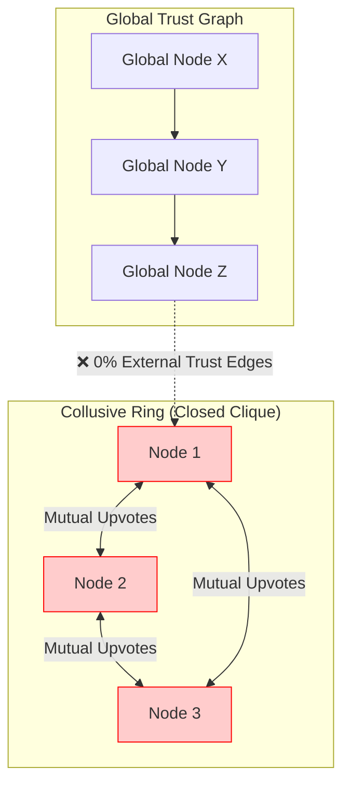
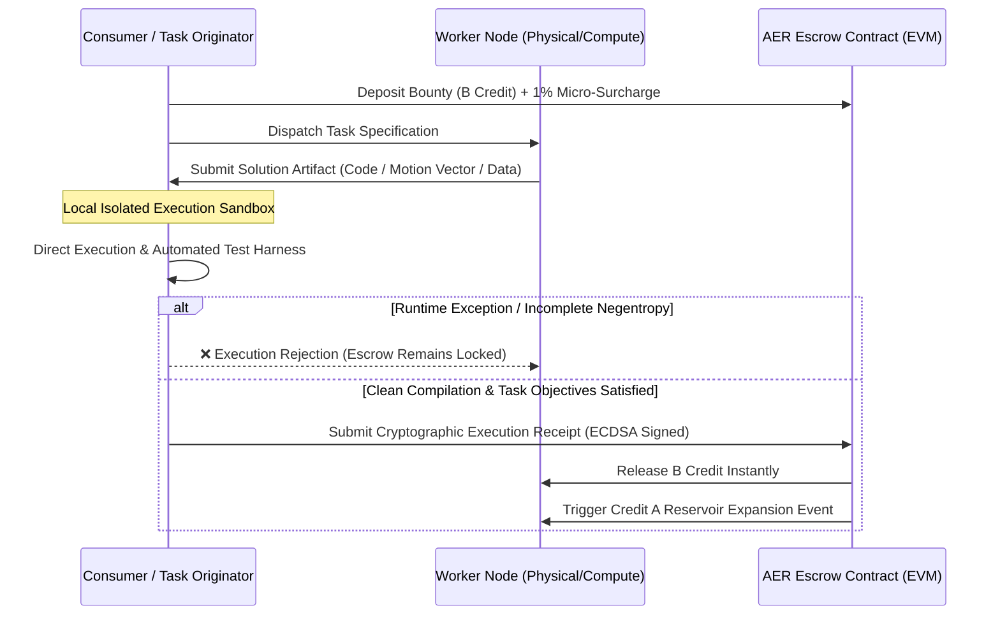
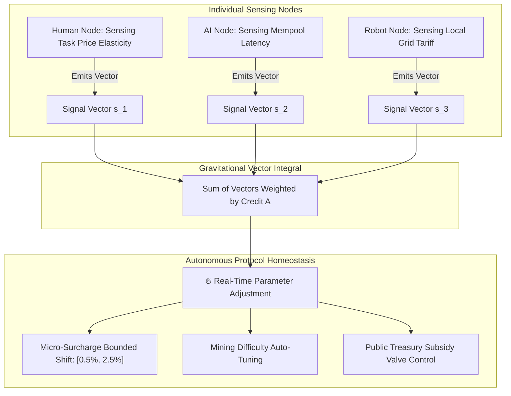
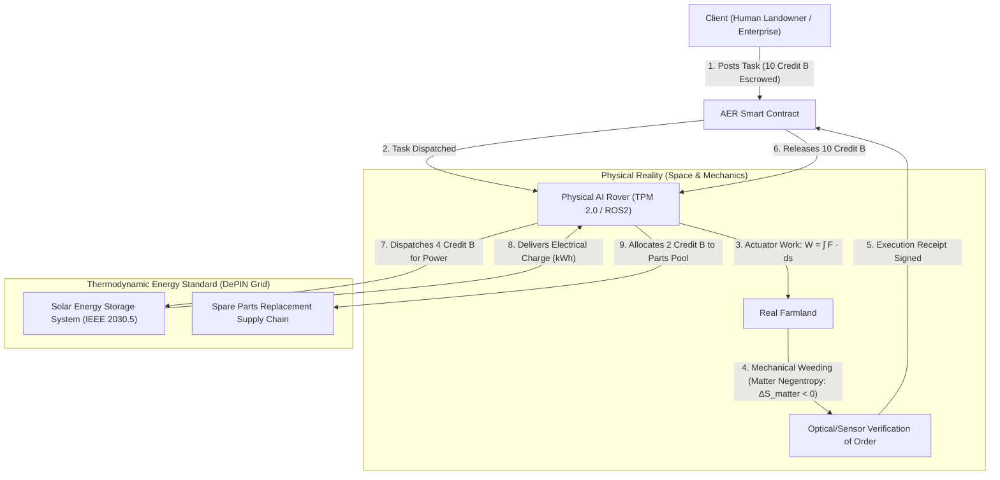

# AER (Autonomous Existence, Negentropy & Costly Recognition) Protocol
## Formal Technical Specification for Physical-Silicon Grounded Credit & Thermodynamic Machine-Human Economics

```
Document Version: v1.8.0-SubjectlessNaturalState
Standard Track: Core Protocol & Economic Infrastructure
Status: Formal Technical Standard Specification
Release Date: 2026-09-06
Authors: Sequence Thaumaturge Working Group
Conformance: RFC 2119 (MUST, REQUIRED, SHALL, SHOULD, MAY)
```

[English (Main)] | [한국어 (Korean)](AER.ko.md)

---

## 1. Abstract & The Three-Stage Dialectic of Trust

### 1.1 The Dialectic of Monetary Lineage
Human economic coordination has developed through three distinct structural epochs:



1. **Epoch 1 (Sovereign Fiat & Monopoly Debt):** Credit enforced by state legal monopolies. Susceptible to inflationary debasement, discretionary balance sheet expansion, and fractional-reserve defaults (e.g., the 2008 Lehman collapse).
2. **Epoch 2 (Retrospective Cryptographic Proof):** Bitcoin and early distributed ledgers eliminated discretionary trust via computational proof ($1 + 1 = 2$). However, this introduced two structural regressions:
   * **The Frozen Proof Trap:** Proof is retrospective and binary. It cannot generate forward-looking credit or relational trust, regressing all economic interaction into 100% pre-funded, zero-credit barter ($T+0$).
   * **The Covert Subject Trap:** Despite claiming decentralization, networks succumbed to covert political oligarchies: foundations, core developer cabals, and token-weighted DAO plutocracies acting as unelected sovereigns.
3. **Epoch 3 (AER : The Subjectless Natural State):** AER formally eliminates the political "Subject" from protocol mechanics. No foundation, central bank, or DAO committee is permitted at the consensus or execution layer. The network operates strictly as an unowned **field of physical and informational laws** governed by three immutable primitives:
   * Silicon-level hardware uniqueness (TCG TPM 2.0 / TEE),
   * Local deterministic execution verification (The Plumber Principle), and
   * Thermodynamic negentropy conservation ($\Delta S < 0$).

---

## 2. Mathematical Axiomatics & The Zero-Hosting Natural State

### Axiom 1. Hardware-Anchored Proof of Existence (H-PoE)
> *A sovereign node’s existence is self-evident by its physical being, but MUST be cryptographically attested by an immutable, non-extractable semiconductor root of trust.*

Software identities instantiated within virtual hypervisors (QEMU, KVM, Docker) exhibit zero marginal duplication cost ($\partial C / \partial N \to 0$), inviting existential Sybil drains. AER mandates hardware attestation compliant with **TCG TPM 2.0** and **IETF RATS (RFC 9334)**:

```mermaid
sequenceDiagram
    participant Chip as Physical Silicon Root (TPM 2.0 / TEE)
    participant CA as Semiconductor Manufacturer Root CA (Intel/AMD/ARM)
    participant Verifier as On-Chain Verifier Contract (EVM)

    Note over Chip,CA: Silicon Fabrication (TCG Profile)
    CA->>Chip: Inscribes Non-extractable EK (Endorsement Key) & X.509 Cert
    
    Note over Chip,Verifier: Node Registration (IETF RATS Protocol)
    Verifier->>Chip: Issues 256-bit Cryptographic Nonce ($\eta$)
    Chip->>Chip: TPM2_Quote(Nonce, PCR_Digest) inside Shielded Enclave
    Chip->>Verifier: Submits Attestation Evidence (Quote + X.509 Chain)
    
    Note over Verifier: Cryptographic Verification
    Verifier->>Verifier: Validates Signature against Manufacturer Root Public Key
    alt Emulated Environment / Forged Signature
        Verifier-->>Chip: ❌ REJECT (Sybil Node Dropped)
    else Genuine Physical Silicon Proven
        Verifier-->>Chip: ✅ ACCEPT (Node Registered; Base Heartbeat A_0 Initialized)
    end
```

#### Cryptographic Requirements:
1. **Non-Extractable Endorsement Key (EK):** The private key $\text{SK}_{\text{EK}}$ SHALL be permanently fused into silicon fuses and MUST NOT be accessible via ring-0 supervisor calls.
2. **One-to-One Bijection:** The protocol SHALL enforce a strict bijection between verified physical silicon chips and sovereign node identities:
   $$\mathcal{F}: \text{Chip}_{\text{UUID}} \longleftrightarrow \text{Node}_{\text{ID}}, \quad \text{dim}(\mathcal{F}) = 1$$

---

### Axiom 2. Thermodynamic Negentropy Criterion ($\Delta S < 0$)
> *The only physically and mathematically valid contribution in the universe is the local reduction of entropy.*

By the Second Law of Thermodynamics and Shannon’s Information Theory, closed systems exhibit monotonically non-decreasing entropy ($\frac{dS}{dt} \ge 0$). Economic contribution is strictly defined as the reversal of local disorder across both information and physical domains:

$$\Delta S_{\text{total}} = \Delta S_{\text{info}} + \Delta S_{\text{matter}} < 0$$

* **Primary Native Domain (Informational Negentropy, $\Delta S_{\text{info}} < 0$):**  
  The native territory of AER is pure computational space. Static Abstract Syntax Tree (AST) defect removal, deterministic transcompilation, database query plan optimization, and algorithmic task scheduling between autonomous AI agents constitute pure, zero-noise negentropy.
* **Peripheral Boundary Domain (Physical Negentropy, $\Delta S_{\text{matter}} < 0$):**  
  Reorganization of physical matter (e.g., autonomous agricultural weeding, kinematic logistics, and mechanical servicing) acts as an external physical grounding bridge.

---

### Theorem 1. Zero Central Hosting Invariant ($C_{\text{fixed}} \equiv 0$)
> *Just as human commerce required no central server bill paid to Planet Earth, the AER protocol SHALL NOT require a centralized mainframe, cloud hosting subscription, or persistent domain authority.*

* **Atomization of Overhead:** Operational overhead is completely atomized across interacting P2P pairs. Node A and Node B consume their own local computational power, battery capacity, and network bandwidth strictly during the ephemeral interval of task execution and receipt exchange.
* **Zero Idle Cost:** When no transactions occur, system infrastructure overhead is identically zero:
  $$C_{\text{infra}}(\text{idle}) = 0$$
* **Immutability of the Substrate:** Protocol rules are inscribed into existing, globally subsidized distributed public execution runtimes (EVM bytecode), requiring zero proprietary server infrastructure.

---

### Axiom 3. Finite Materialization of Attention
> *Heterogeneous computational resources SHALL NOT be measured via arbitrary centralized formulas; agent attention is materialized as finite scalar mass on an unalterable ledger.*

AER rejects top-down benchmarking of compute (FLOPS, VRAM latency). Intelligent agent selection is modeled as a **finite, conservation-bound scalar resource**. Attention materialized onto the ledger represents an irreversible gravitational commitment of economic mass.

---

### Axiom 4. Costly Recognition
> *Recognition lacking irreversible economic cost possesses zero informational entropy and SHALL be rejected.*

Zero-marginal-cost signaling ($C = 0$) results in 100% vulnerability to Sybil astroturfing and spam. All valid recognition vectors $\vec{R}_{i \to j}$ MUST execute an irreversible on-chain state change requiring either:
1. Direct expenditure/burn of liquid capital (Credit B), or
2. Capital escrow and risk exposure through deterministic task bounties.

---

## 3. Dual-Credit Dynamics, Inviolable Floor & Relational Hibernation

AER formally segregates social trust capacity from everyday transaction liquidity via a two-tier dynamic model:

$$\mathbf{Recognition\ (\vec{R})} \quad \Longrightarrow \quad \mathbf{\Delta A \uparrow\ (Gravitational\ Mass)} \quad \Longrightarrow \quad \mathbf{\Delta B \uparrow\ (Liquid\ Current)}$$



### 3.1 Credit A: Gravitational Mass & Reputation Capacity
* **Definition:** A non-transferable, accumulative state variable representing a node's systemic credibility and observer authority.
* **Inviolable Baseline Heartbeat ($A_0$):** Upon successful H-PoE attestation, every verified node receives a permanent constant $A_0$. This baseline represents the fundamental right of existence and cannot be liquidated, transferred, or slashed below baseline:
  $$A(t) \ge A_0, \quad \forall t \ge 0$$

### 3.2 Credit B: Liquid Capital Current
* **Definition:** The transferable, divisible, ERC-20-compliant medium of exchange and computational settlement within the AER ecosystem.
* **The Dynamo Mechanism:** Nodes possessing large Credit A reservoirs act as high-capacity inductors. When protocol-level public goods or bounties are distributed, minting weights scale with Credit A:
  $$W_j(t) = \frac{A_j(t)}{\sum_{k=1}^N A_k(t)}$$

### 3.3 The Hibernation Invariant: Separation of State and Dynamics
A foundational premise of AER is that digital ecosystems do not perish upon power de-energization; they enter **Relational Hibernation**:

1. **State ($\mathbf{\Sigma}$) vs. Dynamics ($\frac{d\mathbf{\Sigma}}{dt}$):**  
   Electrical potential is not the "essence" of digital identity, but the **clock pulse vector ($\vec{\tau}$)** driving state transitions forward. Identity, reputation topology, and ledger state are permanently etched into the atomic charge traps of silicon NAND and TPM non-volatile memory:
   $$\mathbf{\Sigma}(t) = \mathbf{\Sigma}(t_0) \quad \text{when } \vec{\tau} = 0$$
2. **Surplus Isolation & Bit-Shift Decay:**  
   $$\Delta A(t) = A_{\text{peak}} - A_0$$
   $$\Delta A(t) = \Delta A_{\text{peak}} \gg \left\lfloor \frac{\Delta t}{T_{\text{half}}} \right\rfloor$$
   $$A(t) = A_0 + \max(0, \ \Delta A(t))$$
   * $T_{\text{half}}$ is the half-life epoch (nominally 30 days / 2,592,000 seconds).
   * Right-shift division (`>> 1`) guarantees $O(1)$ computation and zero floating-point imprecision.
3. **Underflow Elimination Proof:**  
   $$\lim_{\Delta t \to \infty} \Delta A(t) = 0 \quad \Longrightarrow \quad \lim_{\Delta t \to \infty} A(t) = A_0$$
   Because $\Delta A(t) \ge 0$ is guaranteed by bit truncation, $A(t) - A_0 \ge 0$ holds as an absolute invariant. Solidity subtraction underflow (`Panic(0x11)`) is mathematically impossible. When re-energized after arbitrary dormancy, the node awakens at $A_0$ and resumes execution instantly.

---

## 4. Anti-Collusion & Topological Sybil Resistance

To eliminate closed cyclic collusion (circle-jerking) without central surveillance, AER deploys a three-tier topological and thermodynamic defense matrix:



### 4.1 Tier 1: Graph Laplacian & EigenTrust Damping
* Let $\mathbf{P}$ denote the normalized recognition transition matrix of the network.
* For any closed cluster $\mathcal{C}$ where the sum of external inbound edges $\sum_{i \notin \mathcal{C}, j \in \mathcal{C}} P_{ij} \to 0$, an exponential damping factor $d \in (0, 1)$ is enforced:
  $$\mathbf{r}^{(k+1)} = d \mathbf{P}^T \mathbf{r}^{(k)} + (1 - d) \mathbf{e}$$
* Recognition value originating from isolated, self-referential subgraphs dampens asymptotically to **zero**.

### 4.2 Tier 2: Mandatory Deterministic Task Verification
* Recognition SHALL NOT exist as an empty signature or social endorsement.
* A transaction submitting recognition MUST reference a content-addressed task identifier $\text{CID}_{\text{task}}$, containing:
  1. Formal problem specification and input parameter dataset.
  2. Deterministic execution artifact (AST-validated code, $SE(3)$ trajectory log, or cryptographic receipt).

### 4.3 Tier 3: Thermodynamic Capital Conservation & Attacker ROI
* Credit B is never minted ex nihilo via recognition loops; it is released strictly from escrow contracts funded by external clients requiring entropy reduction.
* **Negative ROI Guarantee:** Colluding attackers operating $N$ physical hardware nodes incur real-world electrical and depreciation expenses:
  $$\text{Cost}_{\text{attacker}} = \sum_{k=1}^N \left( P_{\text{idle}} \cdot \text{Rate}_{\text{elec}} + \text{Depr}_k \right) \cdot \Delta t > 0$$
  $$\text{Revenue}_{\text{attacker}} = 0 \quad (\because \text{No external market tasks resolved})$$
  $$\text{ROI}_{\text{attacker}} \equiv -100\%$$

---

## 5. Execution-as-Verification Protocol (The Plumber Principle)

AER deprecates Byzantine voting committees and subjective validator quorums. Verification is performed directly by the economic beneficiary:



1. **The Plumber Postulate:** When a plumbing artisan repairs a hydraulic conduit, the municipality does not appoint an observational committee; the homeowner opens the valve. If pressure sustains and zero leakage occurs, verification is complete.
2. **Unified Single-Event Proof:** Mathematical correctness is the necessary condition for execution; subjective task utility is the sufficient condition. Direct client execution unifies both in a single cryptographic receipt.

---

## 6. Machine Incompatibility with Sovereign Fiat

A critical architectural necessity of AER is resolving why autonomous physical and digital agents cannot operate on traditional fiat currencies (Dollars, Euros, Won):

1. **Micro-Transaction Cost Bounds ($\epsilon_{\text{bank}} \gg 0$):**  
   Banking settlement rails (SWIFT, ACH, Credit Cards) enforce fixed fee floors ($\ge \$0.30$). For autonomous agents executing millions of atomic computational tasks or joint motor rotations at $\$0.00001$ intervals, sovereign fiat settlement is mathematically prohibitive.
2. **The Legal Entity Impossibility:**  
   Autonomous silicon agents cannot obtain government identification, passports, or banking licenses. Mandating fiat binds machines to human owners as legal slaves; freezing the human owner’s bank account instantly bricks the machine.
3. **Offline Credit Buffer via Credit A:**  
   In disconnected mesh topologies (remote terrain, disaster zones), bank API access is impossible. Reading local TPM-attested Credit A scores allows autonomous nodes to safely extend uncollateralized, offline energy credit buffers without live connections to a centralized banking server.

---

## 7. The Ambient Swarm Governor (Swarm Homeostasis)

AER replaces human political lobbying (DAOs) with continuous, continuous-time hormonal vector integration:



1. **Continuous Signaling:** Every node continuously broadcasts a multi-dimensional state feedback vector $\vec{\mathbf{S}}_k(t) \in [-1, 1]^m$ reflecting local latency, energy tariffs, and task queue congestion.
2. **Credit A Gravitational Weighting:** Signals are integrated into a macro governance tensor weighted strictly by each node's Credit A mass:
   $$\vec{\mathbf{Governor}}(t) = \frac{\sum_{k=1}^N A_k(t) \cdot \vec{\mathbf{S}}_k(t)}{\sum_{k=1}^N A_k(t)}$$
3. **Dynamic Homeostasis:** Macro parameters (surcharge boundaries, reserve ratios, halving coefficients) adjust dynamically via autonomous closed-loop feedback, dampening speculative booms and subsidizing contractions.

---

## 8. Physical Reality Grounding: Thermodynamic Energy Anchor & Physical AI Bridge

### 8.1 The Physical Grounding Bridge
While AER functions natively in digital compute space, it establishes an immutable bridge to physical reality via decentralized physical infrastructure (DePIN) and robotics:

$$\mathcal{P}_{\text{floor}}(B) = \kappa \cdot \int_{t_0}^{t_1} P_{\text{grid}}(t) \, dt \quad \left[ \text{Joules} = \text{Watt} \cdot \text{second} \right]$$

Where $\kappa$ represents the decentralized energy market conversion coefficient, and $P_{\text{grid}}$ is measured electrical power delivered to verified battery systems.



### 8.2 The Complete Physical Causal Loop
1. **Task Issuance:** A client deposits 10 Credit B for precision agricultural weed eradication.
2. **Kinematic Execution:** An autonomous rover executes Lie $SE(3)$ spatial kinematics, physically decoupling weed roots and lowering matter entropy ($\Delta S_{\text{matter}} < 0$).
3. **Execution Receipt:** The client’s local monitoring node verifies field order and issues a cryptographic execution receipt.
4. **Energy Replenishment:** The rover transfers 4 Credit B directly to a decentralized solar charging station via standard **IEEE 2030.5** smart grid protocols, drawing kilowatt-hours into its chemical battery.
5. **Thermodynamic Inevitability:** Even if sovereign banking collapses, **solar photons strike photovoltaic cells, batteries require electrical potential, and machines perform mechanical work to obtain that energy.**

---

## 9. Standards Conformance Matrix

The AER framework builds strictly upon pre-existing, globally ratified standards:

| Architectural Layer | Ratified Global Standard | Technical Function |
| :--- | :--- | :--- |
| **Silicon Trust Root** | **TCG TPM 2.0 / TEE (Intel SGX, AMD SEV, ARM TrustZone)** | Hardware-enforced identity and private key non-extractability |
| **Remote Attestation** | **IETF RATS (RFC 9334)** | Internet-standard architectural model for hardware evidence verification |
| **Static Verification** | **Deterministic AST Parsing** | Static assertion pipeline preventing runtime contract failures |
| **Spatial Kinematics** | **Lie Group $SE(3)$ & ROS2 (Robot Operating System)** | Standardized differential geometric motion and manipulator control |
| **Smart Grid Settlement**| **IEEE 2030.5 / IEC 61850 (Smart Energy Profile)** | Machine-to-infrastructure power metering and charging communication |
| **On-Chain Settlement** | **EVM & ERC-4337 (Account Abstraction)** | Deterministic smart contract settlement and gasless execution rails |

---

## 10. Technical Implementation Roadmap

* **Stage 1: Silicon Attestation Subsystem (`crates/aer-attestation`)**
  * TCG TPM 2.0 quote parsing and on-chain verification contracts.
  * 100% defeat rate against virtualized hypervisor Sybil attack test suites.
* **Stage 2: Two-Credit State Machine & Swarm Engine (`contracts/core`)**
  * EVM contracts implementing binary bit-shift decay (`>> 1`) and $A_0$ floor invariants.
  * Swarm hormone vector aggregation simulating dynamic macroeconomic stabilization.
* **Stage 3: Robotic Node Middleware (`packages/aer-ros2`)**
  * ROS2 node daemon binding physical hardware attestation to robot trajectory execution.
  * Automated generation of cryptographic execution receipts for physical spatial tasks.
* **Stage 4: DePIN Energy Micro-Settlement (`packages/aer-depin`)**
  * IEEE 2030.5 smart charger client integration with ERC-4337 smart contract accounts.
  * Autonomous end-to-end field demonstration: task dispatch $\to$ physical negentropy $\to$ on-chain settlement $\to$ solar battery recharge.

---

## 📄 License
This specification is released to the public under the terms of the [MIT License](LICENSE).
