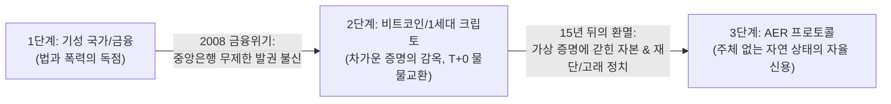
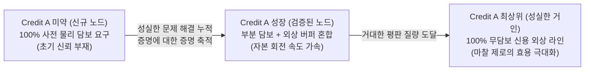
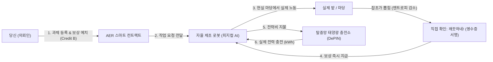

# AER : 자율 존재 및 인정 프로토콜 (Autonomous Existence & Recognition)

> **화폐는 현실의 진짜 일을 해야 합니다.**  
> 주체(Subject) 없는 자연 상태에서 디지털 지능, 우주의 물리 법칙(열역학 에너지), 그리고 자율 기계를 하나로 잇는 오픈 프로토콜.

[English (Main)](README.md) | [한국어]

---

> 🧭 **독서 안내 (원하시는 경로를 선택하세요):**
> * 💡 **비개발자 및 일반 독자:** 아래에 준비된 3분짜리 직관적 비유(지구의 서버비, 잡초, 배관공, 배터리)와 일상 언어 스토리텔링을 편안하게 읽어보세요!
> * 🔬 **시스템 엔지니어, 암호학자 및 연구자:** 일상 비유를 건너뛰고 수학적 증명, 상태 전이 방정식, 하드웨어 표준 규격을 담은 **[AER.md (영문 딥테크 사양서)](AER.md)** 또는 **[AER.ko.md (국문 기술 사양서)](AER.ko.md)**로 바로 이동하세요.
> * 🛠️ **코어 개발자 & 기여자:** 자율 데몬 엔진(`aerd`) 구현 청사진과 단계별 개발 명세를 담은 **[ROADMAP.ko.md (구현 로드맵)](ROADMAP.ko.md)** / **[ROADMAP2.ko.md (실측 및 실증 로드맵)](ROADMAP2.ko.md)** / **[ROADMAP3.ko.md (삼위일체 상호작용 로드맵)](ROADMAP3.ko.md)** / **[ROADMAP4.ko.md (자율 경제 & 점진적 탈중앙화 로드맵)](ROADMAP4.ko.md)**를 확인하세요.
>
> 🏆 **AER Protocol v2.0-Production 공식 릴리즈 완료 (`v2.0-Production`):**
> * 🔬 **실측 기술 백서 (Empirical Benchmark):** 물리 TPM 2.0 실리콘 텔레메트리, EVM Cancun 온체인 가스 실측, 10,000 노드 파티션 스트레스 전수 데이터 **[EMPIRICAL_BENCHMARK.ko.md](docs/EMPIRICAL_BENCHMARK.ko.md)** / **[English](docs/EMPIRICAL_BENCHMARK.md)**
> * 📐 **수학적 형식 증명서 (Formal Proofs):** Z3 SMT Solver 기반 3대 핵심 불변식 수학적 정형 증명 **[FORMAL_PROOFS.ko.md](docs/FORMAL_PROOFS.ko.md)** / **[English](docs/FORMAL_PROOFS.md)**
> * 🖥️ **실시간 텔레메트리 대시보드:** 에어갭 로컬 루프백 미션 컨트롤 대시보드 (`http://127.0.0.1:28741/`)

---

## 🏛️ 인류 화폐와 신용의 3단계 진화사

AER이 왜 탄생했는지를 이해하려면, 인류 화폐가 지나온 길을 보아야 합니다:

1. **1단계 : 국가와 중앙은행의 신용 독점 (법정화폐)**  
   국가가 법과 공권력으로 화폐를 보증했습니다. 편리했지만, 중앙은행의 무제한 발권과 부채 거품, 그리고 2008년 리먼 브라더스 사태 같은 금융 위기를 낳았습니다.
2. **2단계 : 얼어붙은 증명의 감옥 (비트코인과 1세대 크립토)**  
   비트코인은 절박한 분노에서 터져 나왔습니다. *"중앙은행을 못 믿겠으니, 사람의 약속 대신 수학적 증명(Proof)만 믿겠다."*  
   하지만 15년이 흐르며 치명적인 한계가 드러났습니다. **증명(Proof)은 과거의 참/거짓($1$ or $0$)만 가르는 차가운 족쇄**였습니다. 증명은 미래를 향한 자생적 신용(Credit)을 낳지 못했고, 모든 거래를 100% 사전 담보형 즉시 결제($T+0$) 물물교환으로 퇴행시켰습니다. 게다가 겉으로는 탈중앙화라면서 뒤에서는 재단, 코어 개발팀, 거버넌스 고래(DAO)들이 또 다른 권력자가 되어 시스템을 주물렀습니다.
3. **3단계 : 증명의 감옥을 넘어선 주체 없는 프로토콜 (AER)**  
   AER은 그 이중의 환멸에서 시작된 혁명입니다: **"주체(Subject)가 아예 없는 시스템."**  
   총재도, 재단도, 규칙을 주무르는 DAO 위원회도 없습니다. 사과가 떨어지는 데 '중력 위원회'가 필요 없듯이, **물리 실리콘(TPM), 1:1 실행 영수증(Plumber), 열역학적 엔트로피 법칙($\Delta S < 0$)**이라는 3가지 자연 법칙만으로 자율 작동하는 프로토콜입니다.

---

## 🌍 "자본주의를 하겠다고 지구에 서버비를 냈는가?"

사람들은 탈중앙화 시스템 이야기를 들으면 습관처럼 묻습니다:  
*"중앙 서버는 누가 돌려요? AWS 호스팅비와 데이터베이스 비용은 누가 내죠?"*

그렇다면 반대로 여쭙겠습니다:  
**인류가 조개껍데기를 줍고, 금화를 주조하고, 주식회사를 세워 자본주의를 굴릴 때 지구님에게 서버비를 낸 적이 있습니까?**

단 한 번도 없습니다.
* **지구** 그 자체가 이미 무료로 깔려 있는 거대한 하드웨어였습니다.
* 인간의 **뇌**가 로컬 컴퓨터였고,
* 우리가 먹은 밥(**칼로리**)이 전기세였으며,
* 두 상인 사이의 **허공(공기)**이 통신 케이블이었습니다.

두 사람이 소와 쌀을 바꿀 때 각자 자기 몸의 칼로리를 태워 말을 섞고 계약서를 썼을 뿐, 그 허공을 유지해 주는 '중앙 허공 관리 주식회사' 같은 건 필요 없었습니다.

**AER은 디지털 세상을 바로 이 지구와 같은 자연 상태로 되돌립니다:**
* 24시간 돌아가는 **중앙 메인프레임 서버가 없습니다** (고정 서버비 = **0원**).
* **천리안 모뎀 통신료의 법칙**: 90년대 PC통신 시절 전화 통신료는 접속한 개인이 각자 한국통신(KT) 고지서로 냈지, 천리안 서버가 대납해주지 않았습니다. AER에서도 가십 패킷과 연산 비용은 각 로버가 자기 물리 실리콘(TPM 2.0), 로컬 전력(kWh), 신용한도(Credit B)로 각자 감당하므로 시스템 전체가 중앙 비용 0원으로 무한히 자생합니다.
* **에이전트의 출장과 크로스-호스트 이민**: PC A에서 돌던 AI 에이전트가 더 강력한 GPU를 가진 PC B로 P2P 네트워크를 타고 출장을 갑니다. PC B의 게스트 샌드박스에 들어가 0ms 초고속 로컬 메모리 버스로 PC B의 에이전트와 미친 속도로 협동 추론을 마치고, 결과물과 자원 사용료(Credit B)를 정산한 뒤 복귀하거나 영구 전입합니다!
* **원자적 물물교환과 신용의 공존**: 즉시 맞바꿀 데이터와 연산이 있다면 에스크로 공탁이나 2단계 절차 없이 단 1번의 원자적 물물교환(Zero-Credit Atomic Swap)으로 끝냅니다. 시차가 발생하는 거래에서만 신용(Credit B)과 공탁이라는 안전벨트를 맵니다.
* **철통 WASI 게스트 샌드박스와 디스크 방패**: 외부 에이전트가 내 PC로 출장을 오더라도 호스트의 실제 파일이나 API 키를 절대 훔쳐볼 수 없도록 무권한 격리(`WASI_CAP_DENY_ALL`)되며, 2GB LRU 캐시 캡으로 대용량 정크 데이터의 디스크 폭격(DoS)을 완벽히 방어합니다.
* **공유기 방화벽을 뚫는 자율 P2P 연결 (NAT 홀펀칭 & 릴레이)**: 가정용 공유기(사설 IP) 뒤에 숨어 있는 PC라도 WebRTC ICE 홀펀칭과 슈퍼 로버 릴레이를 통해 전 세계 어떤 노드와도 1:1로 직접 연결됩니다.
* 회원가입을 승인해 주는 **중앙 인증 기관이 없습니다** (등록비 = **0원**).
* 노드 A와 노드 B가 만나 거래할 때, 서로의 보안 칩(TPM 2.0)을 대조하고 각자의 전기를 태워 찰나의 순간에 1:1로 영수증을 끊습니다.
* 아무도 거래하지 않을 때 시스템은 멈추는 것이 아니라, 추가 비용이 전혀 들지 않는 평화로운 동면에 듭니다.

---

## 💻 본래의 고향 : 순수 디지털 지능 생태계

AER이 숨 쉬는 가장 순수하고 날카로운 네이티브 영토는 **디지털 우주**입니다:
* 엉망으로 꼬인 코드의 정적 구문 오류(AST)를 바로잡는 일.
* 무거운 쿼리 플랜을 최적화하고 중복 연산의 캐시를 만드는 일.
* 수천 대의 자율 AI 에이전트 간에 API 작업 큐와 데이터 무결성을 검증하는 일.

이러한 작업이야말로 정보 이론에서 말하는 완벽한 **엔트로피 저하($\Delta S_{\text{info}} < 0$)**입니다. 디지털 공간에서는 코드가 돌거나 죽거나 둘 중 하나이므로, 0.001초 만에 실행 무결성이 완벽하게 증명됩니다.

---

## 🎲 게임 이론과 신뢰의 본질 : "증명에 대한 증명"

배신이 물리적으로 불가능한 시스템에는 진정한 의미의 '신뢰'가 존재하지 않습니다.  
스마트 컨트랙트가 모두의 머리에 총을 겨누고 100% 강제 집행한다면, 그것은 **신뢰가 아니라 기계적 강제**이며, 자본을 묶어두는 막대한 사회적 낭비(Deadweight Loss)를 낳습니다.

현실과 게임 이론에서 **진정한 신용은 배신할 수 있는 자유가 있음에도, 스스로 협력을 선택할 때에만 성립**합니다.

### 1. "증명에 대한 증명" (값비싼 신호)
거대한 Credit A를 축적한 상위 노드의 평판은 단순한 숫자가 아니라 일종의 메타 증명입니다:  
> *"나는 이 계에서 엄청난 에너지를 쏟아 질서를 만들어왔다. 정직함을 유지함으로써 누릴 미래의 거대한 이익이 눈앞의 푼돈을 떼어먹는 것보다 수천 배 더 가치 있다. 그러므로 나는 당신을 배신하지 않는다."*

Credit A가 커질수록 굳이 돈을 묶어두는 물리적 담보가 필요 없어지고 **자연스러운 무담보 외상 한도(Credit Line)**가 열립니다. 자본이 묶이지 않고 빛의 속도로 회전하며 생태계 전체의 생산성이 극대화됩니다.

### 2. 벌점 '-n'점의 함정과 신뢰의 상전이 (Phase Transition)
기존 블록체인이나 신용 시스템은 "약속을 어기면 벌점 -10점" 식의 인위적 슬래싱을 씁니다. 하지만 이는 치명적인 결함을 낳습니다:
* **고래의 '비용 처리' (Cost of Griefing):** 거대 자본 노드에게 벌점 몇 점은 단지 '약탈을 위한 운영비'일 뿐입니다.
* **관료제의 부활:** "거짓말의 대가는 몇 점인가?"를 정하기 위해 결국 중앙 사법부나 투표 정치가 부활합니다.

AER은 인위적 벌점 대신 **물리학의 상전이(Phase Transition)** 법칙을 따릅니다:
1. **초전도 신뢰 상 ($A \gg A_0$):** 상호작용과 무결성이 유지되는 동안 마찰(담보)이 0에 수렴하는 극대의 자본 회전 속도를 누립니다.
2. **배신 임계점 ($\Omega_c$):** 약속 불이행 증거가 가십망에 퍼져 임계 밀도를 넘는 순간, 신뢰 퍼콜레이션 클러스터가 산산조각 납니다.
3. **지수적 연쇄 붕괴 (Cascading Avalanche):** 모든 피어가 거래를 즉시 차단하며, 비트 시프트 반감기(`>> 1`)가 가속 가동되어 평판이 찔끔찔끔 깎이는 게 아니라 **$100 \to 50 \to 25 \to 0$ 형태로 바닥($A_0$)을 향해 수직 낙하**합니다. 상전이로 절연된 노드는 과거의 모든 권한을 상실합니다.
4. **속죄를 통한 생태계 복원:** 그 배신자가 다시 경제 활동을 하려면, 과거에 배신으로 취했던 사소한 이득보다 훨씬 거대한 엔트로피 저하 기여를 생태계에 무료로 쏟아부어야만 합니다 (열역학적 이력 현상, Hysteresis).

### 3. 극단적 비잔틴 결함 상황에 대한 자율 방어 (FAQ)

> **Q1. 잃을 평판이 없는 신규/일회용 계정($A_0$)이 결과물만 챙기고 정산 서명을 거부하면 어쩌나요?**  
> **A:** 두 가지 물리적 장치에 의해 원천 차단됩니다:
> 1. **100% 사전 선담보:** $A_0$ 노드는 담보-신용 연속체 공식에 의해 요구 담보율이 정확히 100%입니다 ($\mathcal{C}_{\text{req}} = 1.0$). 단 1원의 무담보 외상도 발주할 수 없습니다.
> 2. **낙관적 타임락 자동 인출 (24시간):** 작업자가 결과물을 제출하면 타이머가 작동합니다. 의뢰인이 결과물이 틀렸다는 결정론적 반증(컴파일 에러 로그, 수학적 오차 증명 등)을 제시하지 않고 고의로 침묵하거나 서명을 거부하면, **24시간 후 에스크로 대금이 작업자에게 100% 자동 강제 지급**됩니다. 먹튀라는 선택지 자체가 기계적으로 봉쇄됩니다.

> **Q2. 오프라인 단절 상태인 로버가 여러 충전소에서 외상을 한도 끝까지 다 당겨 쓰면 충전소는 망하나요?**  
> **A:** 거시적·미시적 양방향으로 완벽히 수습됩니다:
> 1. **거시적 엔트로피 보존:** 로버가 소비한 200kWh의 전력은 증발한 것이 아니라, 고립 지역의 농작물 수확, 인프라 수리 등 **현장의 물리적 질서($\Delta S < 0$)로 100% 치환**되었습니다. 사회적 사장 손실은 0입니다.
> 2. **바운티 에스크로 선물 우선 상계 (Priority Netting):** 로버가 오프라인에서 수행한 작업 대금(Credit B)은 이미 클라이언트들의 에스크로에 묶여 있습니다. 로버가 네트워크에 재연결되는 순간, **입금될 바운티 에스크로는 로버의 지갑으로 가지 않고 외상 전표(충전소들의 채무)로 최우선 강제 청산**됩니다.
> 3. **국소 유동성 보호:** 고립 충전소는 단절 리스크를 감안해 위험 계수($\gamma_{\text{offline}}$)를 반영해 전력을 판매하며, 로버의 암호 서명 전표를 인근 노드들에게 단기 어음처럼 할인 유동화할 수 있습니다.

### 4. 중앙화의 자연스러운 재귀와 초신성 순환 (The Recursive Supernova Cycle)
"중앙화는 악이므로 코드로 강제 박멸해야 한다"는 생각은 이상주의적 도그마에 불과합니다. 우주에서 중력에 의해 성운이 뭉쳐 빛나는 별(항성)이 탄생하듯, 인간과 에이전트가 신용 길드(Guild)나 로컬 협동조합을 결성해 중앙화된 신용 허브를 구축하는 것은 지극히 자연스러운 복잡계의 재귀적 현상입니다.

* **별의 탄생을 허용하는 열린 캔버스**: AER은 노드들이 연합하여 L2/L3 하위 상태 채널을 만들고 자체적인 파생 신용을 유통하는 것을 억압하지 않습니다.
* **초신성 자율 순환 (Bulkhead Fault Isolation)**: 기존 금융 시스템은 중앙 은행이 부패하면 국가 전체가 인질로 잡혔습니다. 하지만 AER에서는 거대 노드가 배신 임계점($\Omega_c$)을 넘을 때, **선박의 수밀 격벽(Bulkhead)처럼 결함의 폭발 반경(Blast Radius)이 해당 노드의 담보로 엄격히 제한**됩니다. 시스템 전체가 멈추지 않고, 오직 배신한 노드만 초신성처럼 폭발하여 기저 상태($A_0$)로 분해되며 그 에너지는 다시 주변 노드들에게 골고루 환원됩니다.

### 5. 블록체인 상태 폭발의 해법: 상태 수명 만료 (State Expiry)와 지연 평가
* **상태 수명 만료 (State Expiry)**: 10년 전의 1원짜리 거래까지 모든 노드가 영원히 짊어질 필요가 없습니다. AER은 비트 시프트 반감기(`>> 1`)를 통해 일정 기간 활동이 없는 계정의 과거 데이터를 $O(1)$ 연산으로 기본 기저 질량($A_0$)으로 자연 정리(State Pruning)합니다. 활성 상태 공간이 엄밀히 유계(Bounded)되므로 노드 스토리지가 영원히 비대해지지 않습니다.
* **수요 주도형 지연 평가 (Demand-Driven Lazy Evaluation)**: 전 세계 10만 대의 노드가 모든 코드를 중복 실행($O(N \cdot M)$)할 필요가 없습니다. 수혜자가 수도꼭지를 틀어보는 그 순간에만 로컬 WASM 샌드박스에서 단 한 번 실행되고, 네트워크는 그 결과로 발생한 단 한 줄의 영수증 해시만을 $O(1)$로 검증합니다.

---

## 🤖 물리 세계와의 결착 : "기계는 달러를 요구하지 않는다"

디지털에서 완결된 AER은, 현실과 상호작용할 때 **선택적 물리 하드웨어 어댑터**를 통해 실물 세계로 뻗어나갑니다.

길을 가다가 동네 어르신에게 스마트폰 화면 속 화려한 가상 코인을 보여주며 이렇게 묻는다고 상상해보세요:  
**"이 코인 드릴 테니, 저희 집 마당 텃밭 잡초 좀 뽑아주실 수 있나요?"**

열에 아홉은 거절합니다. 사람은 세금을 내야 하기에 **국가 법정화폐(원화, 달러)**에 묶여 있기 때문입니다. 대부분의 가상화폐가 '디지털 조개껍데기'에 머무는 이유입니다. 테더(USDT) 역시 달러 시스템에 기대고 있어 미국 국채가 흔들리면 함께 무너집니다.

### 자율 기계가 판을 바꾸는 이유
하지만 자율주행 트랙터, 제초 로봇, 물류 드론, 지능형 태양광 충전소는 국적도, 여권도, 은행 계좌도 없습니다. **기계는 달러나 국가 권력에 아무런 관심이 없습니다.**

자율 기계가 살아서 움직이는 데 필요한 것은 **딱 세 가지**뿐입니다:
1. **전기 에너지 (kWh / 줄):** 배터리를 충전해서 모터를 돌릴 구동력.
2. **소모품 및 부품 교체:** 닳아버린 고무 타이어, 모터 베어링, 관절 부품.
3. **깨끗한 작업 지시:** 안전하게 길을 찾고 일할 소프트웨어 명령.

만약 우리가 만든 토큰이 **탈중앙 태양광 충전소에서 배터리를 충전하는 전기를 살 수 있다면?**
* 그 토큰은 화면 속 숫자가 아니라 **물리적 에너지의 교환권**이 됩니다.
* 로봇은 충전할 전기를 얻기 위해 우리 집 텃밭에 와서 **실제로 땀 흘려 잡초를 뽑아줍니다**.
* 기성 금융 시스템이나 달러가 무너져도, **태양은 여전히 뜨고, 배터리는 충전되어야 하며, 기계는 에너지를 위해 현실의 잡초를 뽑습니다.**

---

## ⚡ 왜 기계는 달러를 그냥 쓸 수 없는가?

"그냥 두 로봇이 통신해서 페이팔이나 스트라이프로 0.5달러 긁으면 되지, 왜 새 원장이 필요한가?"

1. **초미세 거래(Micro-transactions)의 불가능:**  
   로봇 A가 로봇 B에게 "모터 관절 2초 돌려주고 0.0001원 어치 전력 줘" 할 때, 기성 금융망은 건당 최소 수백 원의 고정 수수료를 떼어갑니다. 초당 수천 번의 자원을 융통하는 기계 경제에서 기성 결제망은 너무 무겁고 둔중합니다.
2. **법인격(Legal Entity)의 부재 (노예의 덫):**  
   로봇은 주민등록번호나 법인 등록증이 없어 은행 계좌를 틀 수 없습니다. 달러를 쓰는 순간 로봇은 영원히 '특정 인간 주인의 노예 부속물'로 묶입니다. 주인이 파산하거나 계좌가 동결되면 로봇은 배터리를 채울 돈이 있어도 결제가 막혀 그 자리에서 고철이 됩니다.
3. **오프라인 무담보 신용 (Credit A의 필연성):**  
   두 기계가 통신이 터지지 않는 산골짜기나 재난 현장에서 마주쳤을 때 은행 서버에 접속할 수 없습니다. 하지만 서로의 보안 칩에 새겨진 **Credit A(그동안 엔트로피를 낮춰온 물리적 평판)**를 확인하면, 중앙망 없이도 **"너 신용 등급 높네? 50kWh 먼저 외상으로 충전해 줄게. 나중에 네트워크 붙으면 정산하자"**라는 오프라인 신용 거래가 가능해집니다.

---

## ❄️ 전기가 꺼지면 디지털 생태계는 죽는가? (동면의 법칙)

많은 사람들이 *"전원 코드가 뽑히면 디지털 세계는 다 날아가는 것 아닌가?"* 하고 불안해합니다.

**아닙니다. 디지털은 죽는 것이 아니라 '동면(Hibernation)'에 들 뿐입니다.**

* **상태(State)와 동역학(Dynamics)의 분리:**  
  전류는 데이터의 '영혼'이 아니라, 멈춰 있는 상태를 한 칸씩 앞으로 밀어주는 **시간의 시계추(Clock Pulse)**에 불과합니다. 노드의 정체성, 신용 토폴로지, 장부의 뼈대는 플래시 메모리와 보안 칩의 원자 수준 물리 전하(Charge Trap)에 영구 각인되어 있습니다.
* **불변의 기저 호흡권 ($A_0$):**  
  전기가 끊겨 컴퓨터가 100년 동안 꺼져 있어도, 잉여 신용만 서서히 줄어들 뿐 기본 기저 상태($A_0$)는 영원히 얼어붙은 채 보존됩니다. 100년 뒤 전선에 단 1볼트의 전압만 다시 인가되면, 그 생태계는 멈췄던 바로 그 시계 틱에서 아무 일 없었다는 듯 다시 눈을 뜨고 호흡을 이어갑니다.

---

## 🔑 AER의 4가지 기본 상식

### 1. 가짜 복제 봇 금지 (하드웨어 앵커드 존재증명)
AER은 여러분의 스마트폰, 노트북, 로봇 메인보드에 기본 탑재된 **물리 보안 칩(TPM 2.0 / OpenTitan)**을 통해 인증합니다. **"물리 실리콘 칩 1개 = 단 1개의 고유한 자격"**을 부여하되, 영지식 암호학(DAA)을 적용하여 **칩의 시리얼 번호나 공장 정보는 철저히 감춘 채 정품 물리 하드웨어 소유권만 안전하게 증명**합니다.

### 2. 오직 진짜로 혼란을 줄인 일만 인정 (엔트로피 저하)
자연계에서는 가만히 놔두면 방이 어질러지듯 무질서(엔트로피)가 늘어납니다.  
따라서 계의 질서를 바로잡고 혼란을 줄여준 일($\Delta S < 0$)만이 가치 있는 기여로 인정받습니다: 코드 결함 제거, 데이터 잡음 정제, 물리적 밭의 정돈.

### 3. 배관공의 원칙 (직접 써보는 게 곧 검증이다)
집에 배관공을 불러 누수를 고쳤을 때 학술 심사위원회를 부르지 않습니다. **내가 직접 수도꼭지를 틀어보고, 물이 시원하게 나오고 바닥에 새지 않으면 그 자리에서 수리비를 드립니다.**  
AER에서도 결과물을 실제로 전달받아 사용하는 의뢰인이 로컬에서 직접 실행해보고 문제가 없으면 그 즉시 보상이 지급됩니다.

### 4. 두 종류의 크레딧 (신용 vs 생활비)
* **크레딧 A (존재 질량 & 사회적 신용):** 타인에게 유용한 기여를 인정받아야만 쌓이며, 돈으로 살 수 없습니다. 오래 쉬면 서서히 줄어들지만, 기본 생명력($A_0$)은 영원히 보존됩니다.
* **크레딧 B (유동 자본 & 실물 화폐):** 과제 현상금을 걸고, 다른 노드와 연산 자원을 거래하고, 전기 충전소에서 전력을 사는 실제 교환 화폐입니다.

---

## 🛡️ 사기꾼들이 100% 망하는 이유 (담합 방어)

사기꾼들이 컴퓨터 50대를 사서 자기들끼리 추천 버튼을 눌러주는 담합(Circle-Jerk)을 시도하면:
1. **고립 루프 감지 (EigenTrust):** 네트워크 알고리즘이 닫힌 고리를 즉시 감지하여 평가 가치를 0으로 깎아버립니다.
2. **과제 해결 증거 의무화:** 실제로 문제를 해결한 코드나 작업 결과물이 없으면 인정 트랜잭션 자체가 성립하지 않습니다.
3. **전기세 고지서의 현실:** 크레딧 B는 외부 의뢰인이 실제로 맡긴 현상금 풀에서만 나옵니다. 외부 과제를 풀지 못하는 작업장은 **월말에 감가상각된 고철 컴퓨터와 엄청난 전기세 고지서만 받아 들고 자멸합니다.**

---

## 🐝 떼 지능 조율자 : 새 떼처럼 스스로 균형 잡는 경제

AER은 독재자나 소모적인 투표 정치 대신, **새 떼나 개미 군집**처럼 작동합니다:
* 모든 노드는 자기가 처한 상황(거래 지연, 전기세, 일거리)에 대한 미세한 신호 벡터를 매 블록마다 내보냅니다.
* 이 신호들은 각자의 신용(크레딧 A) 무게에 맞춰 자연스럽게 합산됩니다.
* 스마트 컨트랙트는 이 신호에 따라 수수료율, 채굴 난이도, 금고 지원금을 실시간 미세 조정하여 사계절처럼 건강한 경제 항상성을 유지합니다.

---

## 🏛️ 번외 1 (Appendix A) : 현실 금융과의 접점, 테더 스왑과 거시경제학적 딜레마

AER이 기존 법정화폐(USDT)나 이종 블록체인 생태계와 접촉할 때 마주하는 현실적인 금융공학적 질문들에 대한 정리입니다.

### Q1. 테더(USDT) 스왑을 붙이면 1·2세대 토큰처럼 오염되지 않는가?
* **광저우 13행 모델 (외곽 국경 게이트웨이)**: 테더를 코어 프로토콜의 기축 통화로 삼지 않습니다. 테더는 오직 외부 인간 의뢰인이 일감을 발주하기 위해 국경에서 사용하는 '1회용 바우처(Voucher)'로만 기능합니다.
* **`freeze()` 면역 격벽**: 테더사가 외곽 풀을 동결하더라도 국경 환전소만 영향을 받을 뿐, 내부 기계들의 TPM 원격 증명, 충전소 외상 IOU 전표, Credit A 장부는 완전 무풍지대로 정상 가동됩니다.
* **신용의 불가매입성**: 월가 펀드가 수조 원의 테더를 가져와도 신용 질량(Credit A)은 1비트도 살 수 없습니다. 돈으로 지배권(거버넌스)을 살 수 없으므로 1·2세대식 금권 정치(Plutocracy)로 퇴행하지 않습니다.

### Q2. 외부 고래가 테더로 Credit B를 싹쓸이해 독점하려 하거나, 금고에 사재기(퇴장)하면?
* **자선 사업가의 역설**: 고래가 독점하려면 실제 일감을 발주하고 에스크로에 돈을 묶어야 합니다. 작업이 완료되면 그 자본은 현장 로봇과 충전소 지갑으로 영구 분산됩니다. 고래는 지분을 얻지 못한 채 시스템에 실물 질서($\Delta S < 0$)와 에너지만 무상 공급하는 자선 사업가로 귀결됩니다.
* **상호신용 우회로**: 투기꾼들이 Credit B를 금고에 사재기해 유통량이 줄어들면, 검증된 기계들은 높은 Credit A를 바탕으로 **무담보 외상(상호신용, Mutual Credit Line)**으로 결제를 즉시 우회합니다. 사재기는 네트워크를 마비시키지 못합니다.

### Q3. 사설 은행이 나타나 Credit B를 담보로 어음을 10배로 복사(부분지급준비 대출)하면?
* **별의 탄생을 수용하되 초신성으로 격리**: AER은 사설 신용 길드의 탄생을 억압하지 않습니다. 그러나 과도한 신용 복사로 뱅크런이 터질 경우, **벌크헤드(Bulkhead) 격벽**에 의해 사설 은행의 폭발 반경(Blast Radius)이 해당 마스터 노드의 담보로 엄격히 제한됩니다.
* 마스터 노드는 상전이 임계점($\Omega_c$)을 넘어 초신성처럼 붕괴($A \to A_0$)하여 소멸하지만, 코어 에스크로에 예치된 진짜 자산과 무고한 하위 노드의 채권은 안전하게 보존됩니다.

### Q4. 기계에게 비트코인 채굴이나 ZK 증명을 시켜 외화를 벌면 간접 토큰 스왑 아닌가?
* **정확히 간접 스왑이 맞습니다**: 의뢰인이 Credit B로 기계에게 계산 노동을 시키고 그 결과로 외부에서 BTC, ETH, 달러를 벌었다면, 이는 실물 노동을 매개로 한 건전한 간접 스왑입니다.
* **열역학적 무역 흑자**: 외부 자본이 차익을 얻는 동안, AER 생태계에는 배부른 기계(전력 충전), 1% 커뮤니티 풀 적립, 노드들의 Credit A 성장이 남습니다. AER은 고부가가치 엔트로피 저하 질서($\Delta S < 0$)를 수출하고 외화를 빨아들이는 무역 흑자를 누립니다.
* **자연 균형 가격**: 1 Credit B의 구매력은 인위적 알고리즘 페깅 없이도, 전 세계 차익거래자들에 의해 "현실에서 ZK 증명 1개를 연산하거나 잡초 1평을 뽑는 한계 물리 비용"에 스스로 단단하게 닻을 내립니다.
* **초기 100% 준비금 보증 (콜드스타트 해결)**: 극초기 충전소들이 안심하고 전기를 내줄 수 있도록, 게이트웨이는 극초기 Credit B를 외부 USDT와 1:1로 100% 상환 보증(Reserve Backing)하며 생태계 성숙 후 점진적으로 실물 전력 닻내림으로 자율 이행합니다.

---

## 👁️ 번외 2 (Appendix B) : 인간 중심 AI의 한계와 실효적 존재 당위성

AER이 단순한 미래 SF 담론에 머물지 않고, 지금 당장 바이브 코딩과 MCP(Model Context Protocol) 시대를 살아가는 인간 개발자에게 왜 필수적인가에 대한 실질적인 답입니다.

### Q5. 빅테크 API와 LLM 챗봇 시대에 왜 하드웨어 칩(TPM)과 P2P 프로토콜이 필요한가?
* **세균설 이전의 수술실과 손씻기**: 세균이 눈에 보이지 않던 시절 소독은 번거로운 사족으로 여겨졌으나, 소독이 정착된 순간 수술실 사망률은 급락했습니다. 바이브 코딩으로 에이전트에게 셸과 MCP 도구 권한을 쥐여주는 지금의 환경은 "손을 씻지 않고 수술하는 무방비 상태"입니다.
* **보험을 넘어선 '디지털 전리품(Loot)'의 획득**: 사용자가 열광하는 순간은 단순히 컴퓨터가 안 터졌을 때가 아니라, **"생각지도 못한 득템"**을 했을 때입니다. 내 유휴 PC가 밤새 Credit B를 벌어두고, 인간의 신용카드나 계정 인증 없이 **비공개 독점 MCP 도구, GPU 연산 쿼터, 미공개 데이터셋**을 자율 결제해 내 에이전트에 장착해 주는 원초적 쾌감을 제공합니다.
* **빅테크가 절대 줄 수 없는 유일한 해자 (연산의 완전 블랙박스화)**: 빅테크 클라우드(OpenAI, Google, AWS)는 법적 책임과 주주 이익 때문에 모든 프롬프트와 도구 호출을 감시·로깅·검열해야 합니다. 반면 AER은 TPM 2.0 하드웨어 암호화와 WASM 샌드박스로 **플랫폼과 통신사조차 무엇이 돌아가는지 절대 알 수 없는 치외법권적 '연산의 블랙박스(Dark Compute)'**를 구축합니다.

### Q6. 중앙 서버가 없는데 누구한테서 연산이나 도구를 사고파는지 어떻게 알고, 화면은 어떻게 보는가?
* **Kademlia DHT & GossipSub P2P 오더북**: 중앙 거래소 웹사이트 대신, 비트토렌트처럼 분산 해시 테이블(DHT)과 P2P 가십 토픽(`/aer/market/...`)을 통해 전 세계 노드들이 암호 서명된 오더 전표(`MarketOrder`)를 주고받습니다. 내 PC의 `aerd` 데몬이 이를 감청하여 메모리에 실시간 오더북을 유지합니다.
* **제로 서버(Zero-Server) 로컬 루프백 UI**: 외부 웹서버에 접속하는 것이 아닙니다. 데몬 바이너리(`aerd.exe`) 안에 웹 UI 에셋이 압축 내장되어 있어, 인터넷이 끊겨도 `http://localhost:28741` 또는 5MB짜리 초경량 트레이 창(AER Station)으로 실시간 P2P 오더북과 크레딧 잔고를 100% 안전하게 시각화합니다.

---

## ⚙️ 번외 3 (Appendix C) : 물리 세계의 한계, 실리콘 공급망, 그리고 기계 자본의 불멸성

하드웨어가 망가지거나 센서 분쟁이 일어났을 때, 프로토콜이 현실의 물리적 마모와 어떻게 타협하고 자본을 지켜내는가에 대한 해답입니다.

### Q7. 로봇이 부서지거나 컴퓨터를 바꾸면 내 신용과 자본은 사라지는가?
* **자본주의의 대원칙 (육체와 자본의 분리)**: 사람이 죽는다고 예금과 회사가 사라지지 않듯, 로봇의 육체(TPM 칩)가 파괴되어도 계정의 신용(Credit A)과 자본(Credit B)은 사라지지 않습니다.
* **공각기동대 고스트 이식 모델**: 신원과 자본은 온체인 스마트 계정(`ERC-4337`)에 머물며, 하드웨어 칩은 해당 계정의 '서명 열쇠'일 뿐입니다. 새 컴퓨터로 교체할 때는 양방향 교차 서명과 구 칩의 자발적 소각을 통해 안전하게 영혼(신용)을 이식합니다.
* **침수/낙뢰 시 7일 격리 재해 복구**: 구 칩이 완전히 불타 서명할 수 없을 때는, 평소 거래하던 신뢰 이웃 노드(길드)의 다중 서명과 7일간의 비상 챌린지 윈도우를 거쳐 해커의 탈취를 원천 차단하며 새 장비로 자본을 안전하게 복구합니다. 충전소의 외상 어음 또한 떼이지 않고 안전하게 청산됩니다.

### Q8. "잡초 뽑았다"는 로봇과 "안 뽑혔다"는 의뢰인의 물리 분쟁을 가스비 폭탄 없이 어떻게 해결하는가?
* **대화형 이분 탐색 (Interactive Bisection)**: 기가바이트 단위의 라이다/카메라 영상을 블록체인에 다 올리면 가스비 폭탄으로 망합니다. 의뢰인과 로봇은 오프체인에서 핑퐁 게임을 통해 10여 번 만에 "결함이 발생한 특정 0.1초의 단일 센서 프레임"으로 문제를 좁힙니다.
* **단 1개의 머클 증명 온체인 검증**: 최종적으로 체인에 올리는 것은 1GB 영상이 아니라, "해당 0.1초 동안 모터가 공회전했거나 지오펜스를 이탈했음을 증명하는 단 32바이트 머클 리프"뿐입니다. 20만 가스(수백 원)의 초경량 트랜잭션 하나로 물리적 사기를 확정하고 의뢰인에게 보증금을 즉시 돌려줍니다.
* **다중 양식 교차 검증과 경제적 억제 (오라클 문제의 현실적 해법)**: 카메라 렌즈 앞에 잡초 사진을 붙이는 식의 단일 센서 속임수를 막기 위해, [카메라 시각 점군 + 3D 이동 궤적 + 모터 전류 파형 + 배터리 소모량]의 물리 보존량을 상호 교차 검증합니다. 3개 이상의 물리 센서를 동시에 조작하는 비용($C_{\text{spoof}}$)과 발각 시 전과 기록 및 미래 신용 손실이 단일 작업 보상보다 압도적으로 크기 때문에, 센서 조작은 물리적·경제적 자살이 됩니다.

### Q9. 작업자가 쓰레기 데이터를 올리고, 의뢰인이 24시간 동안 정전/오프라인 상태면 에스크로를 강탈당하지 않는가?
* **벌어들인 돈의 즉시 사용성 (락업 0초)**: 의뢰인이 도장을 찍어주는 정상 상황에서는 1초의 지체나 체류(Vesting) 없이 100% 즉시 인출하여 자유롭게 사용할 수 있습니다.
* **오프라인 의뢰인의 사전 방어와 시간 프리미엄 (Risk-Return)**: 산간 오지 등으로 장기 오프라인이 불가피한 의뢰인은 발주 시 타임락을 72시간이나 7일로 늘릴 수 있습니다. 단, 작업자의 대기 시간에 대한 기회비용을 보상하기 위해 **시간 유동성 프리미엄(추가 바운티)**을 지불하거나 자신의 높은 신용 평판($A_j$)을 담보로 제공해야 합니다.
* **감시탑의 일시정지(Pause) 위임**: 의뢰인이 자리를 비우기 전 이웃 기지국이나 길드 피어에게 위임 서명을 던져두면, 명백한 규격 위반 시 감시탑 노드가 1가스의 가벼운 신호로 타이머를 얼려 자금 방출을 사전에 물리적으로 차단합니다.
* **시스템의 임의 처형 배제 & 전과 장부 자동 상계**: 만약 돈이 빠져나간 뒤 뒤늦게 분쟁이 인정되더라도, 시스템이 임의로 신용을 0점으로 밀어버리는 사형 선고를 내리지 않습니다. 해당 노드에 객관적 '분쟁 전과'와 '미해결 채무(음수 잔고)'를 기록하고, 차기 작업 수익에서 최우선 자동 상계(Priority Netting)합니다. 동료 노드들이 이 전과를 보고 거래를 거부하거나 담보율을 올려 시장에서 자연 도태시킵니다.

### Q10. 미국이나 특정 국가가 인텔/AMD에게 특정 지역 노드의 인증서 발급 금지를 명령하면 검열되지 않는가?
* **오픈소스 실리콘 & Web-of-Trust 앵커**: 인텔, AMD, STMicro 외에도 **RISC-V 기반 오픈소스 보안 실리콘(OpenTitan, Keystone TEE) 및 탈중앙 웹-오브-트러스트(Web-of-Trust) 앵커를 동등한 1계층 증명자로 병렬 수용**합니다.
* 따라서 특정 패권 국가의 수출 통제나 단일 반도체 벤더의 인증서 블랙리스트 규제가 기계 노드의 네트워크 진입을 영구 봉쇄할 수 없습니다.

---

## 📚 딥테크 정밀 기술 사양서 안내

수학적 증명, 상태 전이 방정식, 하드웨어 보안 모듈 및 분산 합의 사양이 궁금한 엔지니어와 연구자라면 정식 사양서를 확인해 주세요:

* **[AER Master Specification (v1.8.0)](AER.md)** — 공식 영문 딥테크 마스터 사양서.
* **[한국어 정밀 기술 사양서 (v1.8.0)](AER.ko.md)** — 국문 딥테크 마스터 사양서.

---

## 🛠️ 기검증 글로벌 표준 기반

AER은 전 세계 산업계에서 수십 년간 검증된 표준 위에서만 작동합니다:
* **TCG TPM 2.0 / TEE:** 전 세계 수십억 대의 기기에 탑재된 하드웨어 보안 칩 표준.
* **IETF RATS (RFC 9334):** 국제 인터넷 표준화 기구의 원격 증명 규격.
* **EVM & ERC-4337:** 스마트 컨트랙트 및 계정 추상화 지갑 표준.
* **IEEE 2030.5 / IEC 61850:** 스마트 그리드 및 분산 에너지 전력 계량 국제 통신 표준.
* **ROS2 & Lie 군 $SE(3)$:** 글로벌 표준 로봇 운영체제 및 3차원 물리 공간 기구학.

---

## 📄 라이선스

본 프로젝트는 [MIT 라이선스](LICENSE) 하에 오픈소스로 배포됩니다.
