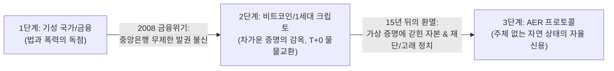
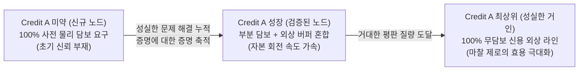
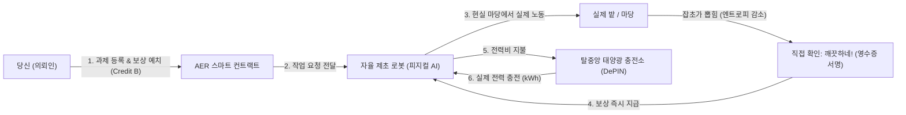

# AER : 자율 존재 및 인정 프로토콜 (Autonomous Existence & Recognition)

> **화폐는 현실의 진짜 일을 해야 합니다.**  
> 주체(Subject) 없는 자연 상태에서 디지털 지능, 우주의 물리 법칙(열역학 에너지), 그리고 자율 기계를 하나로 잇는 오픈 프로토콜.

[English (Main)](README.md) | [한국어]

---

> 🧭 **독서 안내 (원하시는 경로를 선택하세요):**
> * 💡 **비개발자 및 일반 독자:** 아래에 준비된 3분짜리 직관적 비유(지구의 서버비, 잡초, 배관공, 배터리)와 일상 언어 스토리텔링을 편안하게 읽어보세요!
> * 🔬 **시스템 엔지니어, 암호학자 및 연구자:** 일상 비유를 건너뛰고 수학적 증명, 상태 전이 방정식, 하드웨어 표준 규격을 담은 **[AER.md (영문 딥테크 사양서)](AER.md)** 또는 **[AER.ko.md (국문 기술 사양서)](AER.ko.md)**로 바로 이동하세요.

---

## 🏛️ 인류 화폐와 신용의 3단계 진화사

AER이 왜 탄생했는지를 이해하려면, 인류 화폐가 지나온 길을 보아야 합니다:

1. **1단계 : 국가와 중앙은행의 신용 독점 (법정화폐)**  
   국가가 법과 공권력으로 화폐를 보증했습니다. 편리했지만, 중앙은행의 무제한 발권과 부채 거품, 그리고 2008년 리먼 브라더스 사태 같은 금융 위기를 낳았습니다.
2. **2단계 : 얼어붙은 증명의 감옥 (비트코인과 1세대 크립토)**  
   비트코인은 절박한 분노에서 터져 나왔습니다. *"중앙은행을 못 믿겠으니, 사람의 약속 대신 수학적 증명(Proof)만 믿겠다."*  
   하지만 15년이 흐르며 치명적인 한계가 드러났습니다. **증명(Proof)은 과거의 참/거짓($1$ or $0$)만 가르는 차가운 족쇄**였습니다. 증명은 미래를 향한 자생적 신용(Credit)을 낳지 못했고, 모든 거래를 100% 사전 담보형 즉시 결제($T+0$) 물물교환으로 퇴행시켰습니다. 게다가 겉으로는 탈중앙화라면서 뒤에서는 재단, 코어 개발팀, 거버넌스 고래(DAO)들이 또 다른 권력자가 되어 시스템을 주물렀습니다.
3. **3단계 : 증명의 감옥을 넘어선 주체 없는 프로토콜 (AER)**  
   AER은 그 이중의 환멸에서 시작된 혁명입니다: **"주체(Subject)가 아예 없는 시스템."**  
   총재도, 재단도, 규칙을 주무르는 DAO 위원회도 없습니다. 사과가 떨어지는 데 '중력 위원회'가 필요 없듯이, **물리 실리콘(TPM), 1:1 실행 영수증(Plumber), 열역학적 엔트로피 법칙($\Delta S < 0$)**이라는 3가지 자연 법칙만으로 자율 작동하는 프로토콜입니다.

---

## 🌍 "자본주의를 하겠다고 지구에 서버비를 냈는가?"

사람들은 탈중앙화 시스템 이야기를 들으면 습관처럼 묻습니다:  
*"중앙 서버는 누가 돌려요? AWS 호스팅비와 데이터베이스 비용은 누가 내죠?"*

그렇다면 반대로 여쭙겠습니다:  
**인류가 조개껍데기를 줍고, 금화를 주조하고, 주식회사를 세워 자본주의를 굴릴 때 지구님에게 서버비를 낸 적이 있습니까?**

단 한 번도 없습니다.
* **지구** 그 자체가 이미 무료로 깔려 있는 거대한 하드웨어였습니다.
* 인간의 **뇌**가 로컬 컴퓨터였고,
* 우리가 먹은 밥(**칼로리**)이 전기세였으며,
* 두 상인 사이의 **허공(공기)**이 통신 케이블이었습니다.

두 사람이 소와 쌀을 바꿀 때 각자 자기 몸의 칼로리를 태워 말을 섞고 계약서를 썼을 뿐, 그 허공을 유지해 주는 '중앙 허공 관리 주식회사' 같은 건 필요 없었습니다.

**AER은 디지털 세상을 바로 이 지구와 같은 자연 상태로 되돌립니다:**
* 24시간 돌아가는 **중앙 메인프레임 서버가 없습니다** (고정 서버비 = **0원**).
* 회원가입을 승인해 주는 **중앙 인증 기관이 없습니다** (등록비 = **0원**).
* 노드 A와 노드 B가 만나 거래할 때, 서로의 보안 칩(TPM 2.0)을 대조하고 각자의 전기를 태워 찰나의 순간에 1:1로 영수증을 끊습니다.
* 아무도 거래하지 않을 때 시스템은 멈추는 것이 아니라, 추가 비용이 전혀 들지 않는 평화로운 동면에 듭니다.

---

## 💻 본래의 고향 : 순수 디지털 지능 생태계

AER이 숨 쉬는 가장 순수하고 날카로운 네이티브 영토는 **디지털 우주**입니다:
* 엉망으로 꼬인 코드의 정적 구문 오류(AST)를 바로잡는 일.
* 무거운 쿼리 플랜을 최적화하고 중복 연산의 캐시를 만드는 일.
* 수천 대의 자율 AI 에이전트 간에 API 작업 큐와 데이터 무결성을 검증하는 일.

이러한 작업이야말로 정보 이론에서 말하는 완벽한 **엔트로피 저하($\Delta S_{\text{info}} < 0$)**입니다. 디지털 공간에서는 코드가 돌거나 죽거나 둘 중 하나이므로, 0.001초 만에 실행 무결성이 완벽하게 증명됩니다.

---

## 🎲 게임 이론과 신뢰의 본질 : "증명에 대한 증명"

배신이 물리적으로 불가능한 시스템에는 진정한 의미의 '신뢰'가 존재하지 않습니다.  
스마트 컨트랙트가 모두의 머리에 총을 겨누고 100% 강제 집행한다면, 그것은 **신뢰가 아니라 기계적 강제**이며, 자본을 묶어두는 막대한 사회적 낭비(Deadweight Loss)를 낳습니다.

현실과 게임 이론에서 **진정한 신용은 배신할 수 있는 자유가 있음에도, 스스로 협력을 선택할 때에만 성립**합니다.

### 1. "증명에 대한 증명" (값비싼 신호)
거대한 Credit A를 축적한 상위 노드의 평판은 단순한 숫자가 아니라 일종의 메타 증명입니다:  
> *"나는 이 계에서 엄청난 에너지를 쏟아 질서를 만들어왔다. 정직함을 유지함으로써 누릴 미래의 거대한 이익이 눈앞의 푼돈을 떼어먹는 것보다 수천 배 더 가치 있다. 그러므로 나는 당신을 배신하지 않는다."*

Credit A가 커질수록 굳이 돈을 묶어두는 물리적 담보가 필요 없어지고 **자연스러운 무담보 외상 한도(Credit Line)**가 열립니다. 자본이 묶이지 않고 빛의 속도로 회전하며 생태계 전체의 생산성이 극대화됩니다.

### 2. 만약 상위 노드가 배신한다면? (조용한 사형 집행기)
만약 어떤 노드가 과제 정산을 고의로 거부하거나 오프라인 외상을 떼어먹고 도망친다면? 중앙 경찰이나 법원이 필요할까요? **전혀 필요 없습니다.**

1. **토폴로지적 보이콧 (Topological Boycott):** 배신 정보가 P2P로 전파되면, 정상 노드들은 자기 손해를 보지 않기 위해 배신자와의 거래를 거부하고 고립시킵니다.
2. **반감기 공식의 무자비한 집행:** 신용 질량($\Delta A$)은 외부로부터 새로운 인정을 받아야만 유지됩니다. 인정 유입이 끊기는 순간, 프로토콜의 비트 시프트 반감기 수식이 30일마다 그의 평판 질량을 절반씩 무자비하게 날려버립니다 (`>> 1`):
   $$\Delta A(t) = \Delta A_{\text{peak}} \gg \left\lfloor \frac{\Delta t}{T_{\text{half}}} \right\rfloor$$
   경찰에게 세금을 내거나 재판을 열 필요도 없이, **시간과 수학 그 자체가 배신자의 발언권과 신용 한도를 바닥($A_0$)으로 증발시킵니다.**
3. **속죄를 통한 생태계 복원:** 그 배신자가 다시 경제 활동을 하려면, 과거에 배신으로 취했던 사소한 이득보다 훨씬 거대한 엔트로피 저하 기여를 생태계에 쏟아부어 타자들의 신뢰를 다시 사야만 합니다. 결국 배신자의 악행조차 장기적으로는 계 전체의 총후생을 증진시키는 에너지로 흡수됩니다.

---

## 🤖 물리 세계와의 결착 : "기계는 달러를 요구하지 않는다"

디지털에서 완결된 AER은, 현실과 상호작용할 때 **선택적 물리 하드웨어 어댑터**를 통해 실물 세계로 뻗어나갑니다.

길을 가다가 동네 어르신에게 스마트폰 화면 속 화려한 가상 코인을 보여주며 이렇게 묻는다고 상상해보세요:  
**"이 코인 드릴 테니, 저희 집 마당 텃밭 잡초 좀 뽑아주실 수 있나요?"**

열에 아홉은 거절합니다. 사람은 세금을 내야 하기에 **국가 법정화폐(원화, 달러)**에 묶여 있기 때문입니다. 대부분의 가상화폐가 '디지털 조개껍데기'에 머무는 이유입니다. 테더(USDT) 역시 달러 시스템에 기대고 있어 미국 국채가 흔들리면 함께 무너집니다.

### 자율 기계가 판을 바꾸는 이유
하지만 자율주행 트랙터, 제초 로봇, 물류 드론, 지능형 태양광 충전소는 국적도, 여권도, 은행 계좌도 없습니다. **기계는 달러나 국가 권력에 아무런 관심이 없습니다.**

자율 기계가 살아서 움직이는 데 필요한 것은 **딱 세 가지**뿐입니다:
1. **전기 에너지 (kWh / 줄):** 배터리를 충전해서 모터를 돌릴 구동력.
2. **소모품 및 부품 교체:** 닳아버린 고무 타이어, 모터 베어링, 관절 부품.
3. **깨끗한 작업 지시:** 안전하게 길을 찾고 일할 소프트웨어 명령.

만약 우리가 만든 토큰이 **탈중앙 태양광 충전소에서 배터리를 충전하는 전기를 살 수 있다면?**
* 그 토큰은 화면 속 숫자가 아니라 **물리적 에너지의 교환권**이 됩니다.
* 로봇은 충전할 전기를 얻기 위해 우리 집 텃밭에 와서 **실제로 땀 흘려 잡초를 뽑아줍니다**.
* 기성 금융 시스템이나 달러가 무너져도, **태양은 여전히 뜨고, 배터리는 충전되어야 하며, 기계는 에너지를 위해 현실의 잡초를 뽑습니다.**

---

## ⚡ 왜 기계는 달러를 그냥 쓸 수 없는가?

"그냥 두 로봇이 통신해서 페이팔이나 스트라이프로 0.5달러 긁으면 되지, 왜 새 원장이 필요한가?"

1. **초미세 거래(Micro-transactions)의 불가능:**  
   로봇 A가 로봇 B에게 "모터 관절 2초 돌려주고 0.0001원 어치 전력 줘" 할 때, 기성 금융망은 건당 최소 수백 원의 고정 수수료를 떼어갑니다. 초당 수천 번의 자원을 융통하는 기계 경제에서 기성 결제망은 너무 무겁고 둔중합니다.
2. **법인격(Legal Entity)의 부재 (노예의 덫):**  
   로봇은 주민등록번호나 법인 등록증이 없어 은행 계좌를 틀 수 없습니다. 달러를 쓰는 순간 로봇은 영원히 '특정 인간 주인의 노예 부속물'로 묶입니다. 주인이 파산하거나 계좌가 동결되면 로봇은 배터리를 채울 돈이 있어도 결제가 막혀 그 자리에서 고철이 됩니다.
3. **오프라인 무담보 신용 (Credit A의 필연성):**  
   두 기계가 통신이 터지지 않는 산골짜기나 재난 현장에서 마주쳤을 때 은행 서버에 접속할 수 없습니다. 하지만 서로의 보안 칩에 새겨진 **Credit A(그동안 엔트로피를 낮춰온 물리적 평판)**를 확인하면, 중앙망 없이도 **"너 신용 등급 높네? 50kWh 먼저 외상으로 충전해 줄게. 나중에 네트워크 붙으면 정산하자"**라는 오프라인 신용 거래가 가능해집니다.

---

## ❄️ 전기가 꺼지면 디지털 생태계는 죽는가? (동면의 법칙)

많은 사람들이 *"전원 코드가 뽑히면 디지털 세계는 다 날아가는 것 아닌가?"* 하고 불안해합니다.

**아닙니다. 디지털은 죽는 것이 아니라 '동면(Hibernation)'에 들 뿐입니다.**

* **상태(State)와 동역학(Dynamics)의 분리:**  
  전류는 데이터의 '영혼'이 아니라, 멈춰 있는 상태를 한 칸씩 앞으로 밀어주는 **시간의 시계추(Clock Pulse)**에 불과합니다. 노드의 정체성, 신용 토폴로지, 장부의 뼈대는 플래시 메모리와 보안 칩의 원자 수준 물리 전하(Charge Trap)에 영구 각인되어 있습니다.
* **불변의 기저 호흡권 ($A_0$):**  
  전기가 끊겨 컴퓨터가 100년 동안 꺼져 있어도, 잉여 신용만 서서히 줄어들 뿐 기본 기저 상태($A_0$)는 영원히 얼어붙은 채 보존됩니다. 100년 뒤 전선에 단 1볼트의 전압만 다시 인가되면, 그 생태계는 멈췄던 바로 그 시계 틱에서 아무 일 없었다는 듯 다시 눈을 뜨고 호흡을 이어갑니다.

---

## 🔑 AER의 4가지 기본 상식

### 1. 가짜 복제 봇 금지 (하드웨어 앵커드 존재증명)
AER은 여러분의 스마트폰, 노트북, 로봇 메인보드에 기본 탑재된 **물리 보안 칩(TPM 2.0)**을 통해 인증합니다. **"물리 실리콘 칩 1개 = 단 1개의 고유한 자격"**을 부여하여 소프트웨어 복제 사기를 원천 차단합니다.

### 2. 오직 진짜로 혼란을 줄인 일만 인정 (엔트로피 저하)
자연계에서는 가만히 놔두면 방이 어질러지듯 무질서(엔트로피)가 늘어납니다.  
따라서 계의 질서를 바로잡고 혼란을 줄여준 일($\Delta S < 0$)만이 가치 있는 기여로 인정받습니다: 코드 결함 제거, 데이터 잡음 정제, 물리적 밭의 정돈.

### 3. 배관공의 원칙 (직접 써보는 게 곧 검증이다)
집에 배관공을 불러 누수를 고쳤을 때 학술 심사위원회를 부르지 않습니다. **내가 직접 수도꼭지를 틀어보고, 물이 시원하게 나오고 바닥에 새지 않으면 그 자리에서 수리비를 드립니다.**  
AER에서도 결과물을 실제로 전달받아 사용하는 의뢰인이 로컬에서 직접 실행해보고 문제가 없으면 그 즉시 보상이 지급됩니다.

### 4. 두 종류의 크레딧 (신용 vs 생활비)
* **크레딧 A (존재 질량 & 사회적 신용):** 타인에게 유용한 기여를 인정받아야만 쌓이며, 돈으로 살 수 없습니다. 오래 쉬면 서서히 줄어들지만, 기본 생명력($A_0$)은 영원히 보존됩니다.
* **크레딧 B (유동 자본 & 실물 화폐):** 과제 현상금을 걸고, 다른 노드와 연산 자원을 거래하고, 전기 충전소에서 전력을 사는 실제 교환 화폐입니다.

---

## 🛡️ 사기꾼들이 100% 망하는 이유 (담합 방어)

사기꾼들이 컴퓨터 50대를 사서 자기들끼리 추천 버튼을 눌러주는 담합(Circle-Jerk)을 시도하면:
1. **고립 루프 감지 (EigenTrust):** 네트워크 알고리즘이 닫힌 고리를 즉시 감지하여 평가 가치를 0으로 깎아버립니다.
2. **과제 해결 증거 의무화:** 실제로 문제를 해결한 코드나 작업 결과물이 없으면 인정 트랜잭션 자체가 성립하지 않습니다.
3. **전기세 고지서의 현실:** 크레딧 B는 외부 의뢰인이 실제로 맡긴 현상금 풀에서만 나옵니다. 외부 과제를 풀지 못하는 작업장은 **월말에 감가상각된 고철 컴퓨터와 엄청난 전기세 고지서만 받아 들고 자멸합니다.**

---

## 🐝 떼 지능 조율자 : 새 떼처럼 스스로 균형 잡는 경제

AER은 독재자나 소모적인 투표 정치 대신, **새 떼나 개미 군집**처럼 작동합니다:
* 모든 노드는 자기가 처한 상황(거래 지연, 전기세, 일거리)에 대한 미세한 신호 벡터를 매 블록마다 내보냅니다.
* 이 신호들은 각자의 신용(크레딧 A) 무게에 맞춰 자연스럽게 합산됩니다.
* 스마트 컨트랙트는 이 신호에 따라 수수료율, 채굴 난이도, 금고 지원금을 실시간 미세 조정하여 사계절처럼 건강한 경제 항상성을 유지합니다.

---

## 📚 딥테크 정밀 기술 사양서 안내

수학적 증명, 상태 전이 방정식, 하드웨어 보안 모듈 및 분산 합의 사양이 궁금한 엔지니어와 연구자라면 정식 사양서를 확인해 주세요:

* **[AER Master Specification (v1.8.0)](AER.md)** — 공식 영문 딥테크 마스터 사양서.
* **[한국어 정밀 기술 사양서 (v1.8.0)](AER.ko.md)** — 국문 딥테크 마스터 사양서.

---

## 🛠️ 기검증 글로벌 표준 기반

AER은 전 세계 산업계에서 수십 년간 검증된 표준 위에서만 작동합니다:
* **TCG TPM 2.0 / TEE:** 전 세계 수십억 대의 기기에 탑재된 하드웨어 보안 칩 표준.
* **IETF RATS (RFC 9334):** 국제 인터넷 표준화 기구의 원격 증명 규격.
* **EVM & ERC-4337:** 스마트 컨트랙트 및 계정 추상화 지갑 표준.
* **IEEE 2030.5 / IEC 61850:** 스마트 그리드 및 분산 에너지 전력 계량 국제 통신 표준.
* **ROS2 & Lie 군 $SE(3)$:** 글로벌 표준 로봇 운영체제 및 3차원 물리 공간 기구학.

---

## 📄 라이선스

본 프로젝트는 [MIT 라이선스](LICENSE) 하에 오픈소스로 배포됩니다.
