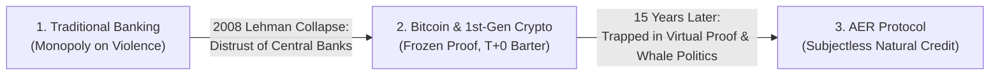
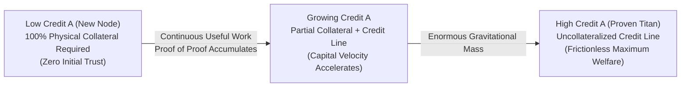
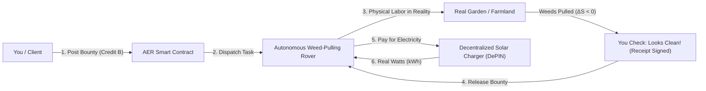

# AER : Autonomous Existence & Recognition Protocol

> **Money should do real work.**  
> An open, subjectless protocol connecting digital intelligence, thermodynamic energy, and physical machines.

[English (Main)] | [한국어 (Korean)](README.ko.md)

---

> 🧭 **Reading Guide (Choose Your Path):**
> * 💡 **Curious Thinkers & General Readers:** Enjoy the intuitive 3-minute story, everyday analogies (Earth's hosting bill, weeds, plumbers, batteries), and core ideas below!
> * 🔬 **Systems Engineers, Cryptographers & Researchers:** Skip the analogies and jump straight into our mathematical proofs, formal state transitions, and engineering standards at **[AER.md (Deep-Tech Master Specification)](AER.md)** (or the **[한국어 기술 사양서](AER.ko.md)**).
> * 🛠️ **Core Developers & Contributors:** Explore the technical implementation blueprint and daemon architecture in **[ROADMAP.md (Implementation Roadmap)](ROADMAP.md)** / **[ROADMAP.ko.md (한국어)](ROADMAP.ko.md)**.

---

## 🏛️ The Three Steps of Human Money

To understand why AER exists, we have to look at how humanity got here:

1. **Step 1: The Banking Monopoly (Fiat)**  
   Governments and central banks held the exclusive right to print money and enforce credit by law. It worked, but it enabled infinite debt printing, currency devaluation, and financial collapses like the 2008 Lehman Brothers crisis.
2. **Step 2: The Cage of Cold Proof (Bitcoin & Early Crypto)**  
   Bitcoin was an act of righteous fury: *"We do not trust central bankers, so we will replace human trust with mathematical Proof."*  
   It created an unshakeable concrete floor. But over the last 15 years, a major flaw appeared: **Proof is retrospective and frozen.** $1 + 1 = 2$ is cold fact, but it cannot create *organic credit or future promises*. It forced all crypto trade backward into 100% pre-funded, instant-settlement ($T+0$) barter. Worse, behind the scenes, "decentralized" projects were secretly captured by Foundations, core teams, and Whale DAOs acting as unelected politicians.
3. **Step 3: The Rebellion Against Proof (AER)**  
   AER is the third step: **A completely subjectless system.**  
   No foundation. No central bank. No DAO council voting on rules. Just like gravity pulls an apple without needing a "Gravity Committee," AER operates as an immutable **natural law of silicon, negentropy, and mutual recognition**.

---

## 🌍 "Did Capitalism Pay Server Fees to the Earth?"

When people first hear about decentralized software, they always ask:  
*"Who pays for the AWS servers? Who pays for the central database?"*

Consider this counter-question:  
**When human civilization invented barter, gold coins, promissory notes, and modern capitalism, did humanity ever pay hosting fees to Planet Earth?**

Of course not. 
* The **Earth** was the free hardware substrate already under our feet.
* Human **brains** were the local compute nodes.
* The food we ate (**calories**) was our electricity.
* The open air between two merchants was the communication cable.

When two people traded a cow for grain, they expended their own calories to speak and write a contract. There was no "Central Air Hosting Company" charging them a monthly subscription just to let the universe exist.

**AER treats the digital universe the exact same way:**
* There is **no central mainframe server** running 24/7 (Fixed hosting cost = **$0**).
* There is **no domain authority** to register with (Registration cost = **$0**).
* When Node A and Node B meet to exchange code, compute, or physical work, they communicate directly, verify each other's hardware security chip (TPM 2.0), and settle locally. **They burn their own local electricity and bandwidth only during the split-second of interaction.**
* When nobody is trading, the system is not "down"—it rests in silent, zero-cost dormancy.

---

## 💻 The Native Home: Pure Digital Intelligence

AER's primary native habitat is the **digital universe**:
* Cleaning up broken code and resolving bugs.
* Running deterministic Abstract Syntax Tree (AST) verifications.
* Optimizing heavy database queries and caching redundant compute.
* Managing task queues between thousands of autonomous AI agents.

These are the purest mathematical forms of **entropy reduction ($\Delta S_{\text{info}} < 0$)**. In digital space, a solution either compiles cleanly or it crashes—verifiable in a fraction of a millisecond.

---

## 🎲 Game Theory & The Nature of Trust: "Proof of Proof"

True trust cannot exist in a system where betrayal is physically impossible.  
If smart contracts physically hold a gun to everyone's head to force settlement, that isn't **trust**—it is just mechanical coercion, carrying massive deadweight loss and locking down capital.

In real life and game theory, **trust only emerges when an actor has the agency to defect, but voluntarily chooses to cooperate.**

### 1. "Proof of Proof" (The Costly Signal)
A high Credit A score is not just a digital number; it is an implicit meta-proof:  
> *"I have spent immense energy reducing entropy across this network. The future stream of benefits I enjoy by staying honest is worth thousands of times more than any one-off theft. Therefore, I will not betray you."*

As Credit A expands, the need for locked-up physical collateral naturally melts away into **uncollateralized credit buffers**. Capital moves at lightning speed, maximizing total economic output.

### 2. The Fallacy of '-n' Fines & The Phase Transition of Trust
Conventional Web3 systems rely on artificial slashing rules like "deduct 10 points for a broken promise." This introduces severe structural vulnerabilities:
* **The "Cost of Griefing" Trap:** For well-capitalized cartels, a finite linear penalty is simply an operating cost for predatory behavior.
* **Bureaucratic Creep:** Defining the arbitrary magnitude of "how many points a lie costs" inevitably summons centralized courts, subjective arbiters, and political committees.

AER replaces arbitrary arithmetic penalties with **Statistical-Mechanical Phase Transitions**:
1. **Superconducting Trust Phase ($A \gg A_0$):** So long as interaction frequency and verified integrity persist, collateral friction decays to zero, enabling frictionless capital velocity.
2. **Critical Percolation Point ($\Omega_c$):** When cryptographic proof of breach diffuses through the gossip mesh and crosses critical threshold density $\Omega_c$, the trust percolation cluster abruptly shatters.
3. **Cascading Half-Life Avalanche:** All routing peers sever edges ($R_{\text{inbound}} = 0$). Driven by bit-shift arithmetic (`>> 1`), the traitor's surplus does not decrement slowly; it triggers an **exponential avalanche collapse ($100 \to 50 \to 25 \to 0$) straight into the insulating ground state ($A_0$)**:
   $$\Delta A(t) = \Delta A_{\text{peak}} \gg \left\lfloor \frac{\Delta t}{T_{\text{half}}} \right\rfloor \xrightarrow{\text{Cascading Avalanche}} 0$$
4. **Thermodynamic Hysteresis:** Re-entry from the quenched $A_0$ state requires injecting immense, uncompensated negentropy into the public commons to organically re-establish non-local recognition.

### 3. Autonomous Defense Against Micro-Byzantine Edge Cases (FAQ)

> **Q1. What if a disposable, zero-reputation account ($A_0$) steals deliverables and refuses to sign settlement?**  
> **A:** Solved mechanically by two invariant barriers:
> 1. **100% Upfront Escrow:** For nascent nodes ($A_0$), the Collateral-to-Credit continuum strictly enforces $\mathcal{C}_{\text{req}}(A_0) = 1.0$. Uncollateralized credit cannot be initiated by an account with zero surplus reputation.
> 2. **Optimistic Timelock Auto-Discharge (24h):** Once the worker submits the deliverable hash, a 24-hour countdown starts. The client cannot stall; unless they submit a *deterministic fraud proof* (compilation crash log, AST defect, spatial violation), **escrow automatically unlocks 100% to the worker upon timeout**. Free-riding is impossible.

> **Q2. What if an offline rover drains credit limits across multiple isolated charging stations?**  
> **A:** Systemic equilibrium is preserved in both dimensions:
> 1. **Macro Negentropy Conservation:** The 200 kWh of energy consumed is not annihilated; it is converted into physical order in the field ($\Delta S < 0$, automated farming, infrastructure repair, data surveying). Macroeconomic deadweight loss is zero.
> 2. **Bounty-Futures Priority Netting:** Tasks completed by the rover represent locked escrows (Credit B receivables). The instant the rover reconnects to the network, **inbound task bounties are automatically routed to clear outstanding offline energy IOUs before liquid disbursement**.
> 3. **Local Liquidity Protection:** Isolated stations apply an offline risk factor ($\gamma_{\text{offline}}$) to pricing and can discount/trade signed rover IOUs across local peer clusters as short-term liquidity paper.

### 4. Recursive Centralization & The Supernova Cycle
The belief that "centralization is absolute evil and must be dogmatically prohibited by code" is an untenable ideal. In nature, gravitational instabilities inevitably condense diffuse gas clouds into shining stars; similarly, economic actors naturally organize into credit guilds, local cooperatives, and clearinghouses.

* **A Permissive Substrate**: AER does not suppress nodes from forming L2/L3 sub-channels or issuing localized mutual credit. Centralization of mass is treated as a natural emergent property.
* **Autonomous Supernova Dissolution (Bulkhead Fault Isolation)**: In conventional banking, when a central institution fails, the entire society is taken hostage. In AER, when a super-node crosses the critical betrayal threshold ($\Omega_c$), the blast radius is strictly confined to its collateral boundary via a **Bulkhead Fault Isolation** pattern. The broader network continues uninterrupted, while the defaulting node undergoes localized supernova dissolution ($A \to A_0$), redistributing opportunity and negentropy back to the commons.

### 5. Overcoming Blockchain State Bloat: State Expiry & Demand-Driven Evaluation
* **State Expiry via Amortized Decay**: Nodes do not need to carry historical transaction bloat indefinitely. Inactive accounts lazily compact down to baseline $A_0$ in $O(1)$ complexity via bit-shift half-life decay. Node storage remains bounded to currently active peers, preventing archival state bloat.
* **Demand-Driven Lazy Evaluation**: Global networks do not need to redundantly execute every computational instruction ($O(N \cdot M)$). Execution occurs on-demand exactly once inside the beneficiary's client-side WASM sandbox. Global peers simply verify the resulting cryptographic receipt in $O(1)$ time complexity.

---

## 🤖 The Real-World Bridge: Machines Don't Care About Dollars

While AER lives natively in code, it extends into physical reality through an optional **Physical Hardware Bridge**. 

Imagine you hand someone a colorful digital token on your phone and ask them:  
**"Can you come weed my garden for this?"**

Almost anyone would say **no**, because humans must pay government taxes, rent, and supermarket bills in official state currency (Dollars, Won, Euros). Digital tokens feel like shiny seashells. And stablecoins like Tether (USDT) are tied to US Treasury bonds—if the sovereign dollar shakes, stablecoins collapse too.

### Why Autonomous Machines Change Everything
A self-driving farm rover, a logistics drone, or a smart solar station doesn't have a passport, a nationality, or a bank account. **Machines do not care about dollars.**

An autonomous machine only needs **three things to survive**:
1. **Electricity (kWh / Joules):** To charge its battery and spin its motors.
2. **Spare Parts:** Fresh rubber tires, new bearings, and replacement actuators.
3. **Clean Code & Maps:** Clear task instructions to do its job safely.

When an AER token directly buys kilowatt-hours at a decentralized solar charger:
* That token has **physical mass and thermodynamic value**.
* The robot earns that token by coming to your backyard and **actually pulling real weeds**.
* Even if traditional financial systems face hyperinflation or collapse, **the sun still shines, batteries still need power, and machines still pull weeds for energy.**

---

## ⚡ Why Machines Cannot Just Use Dollars

Why can't two robots just ping each other and swipe a credit card or PayPal for \$0.50?

1. **Micro-Transactions ($0.00001):**  
   When Robot A asks Robot B to rotate a sensor joint for 2 seconds, the fair value is a fraction of a cent. Traditional bank wires and credit card rails charge minimum flat fees (often \$0.30+), making machine micro-commerce economically impossible.
2. **No Legal Entity (The Slavery Trap):**  
   A robot cannot get a Social Security Number or register a corporate bank account. If a machine relies on dollars, it must be the legal property of a human master. If that human goes bankrupt or gets their account frozen, the robot's power is cut and it turns into a dead paperweight.
3. **Offline Trust (Credit A):**  
   When two machines meet in a remote mountain valley or during an internet outage, they cannot call Visa's servers. By reading each other's hardware-verified **Credit A (historical reputation)**, Machine A can safely say: *"You have a proven track record of reducing entropy. I will extend you 50 kWh of power on credit. Settle with me when we reconnect to the mesh."*

---

## ❄️ Does the Ecosystem Die When the Power Goes Out? (Hibernation)

A common fear is: *"If the electricity turns off, doesn't the digital world vanish?"*

**No. It simply enters Hibernation.**

* **State vs. Dynamics:**  
  Electricity is not the "soul" of data; it is merely the **clock pulse (the arrow of time)** that pushes state forward. The actual identity, reputation, and transaction history are etched into physical atomic charge traps inside silicon NAND flash and TPM chips.
* **The Immortal Base ($A_0$):**  
  Even if a node is unplugged for 100 years, its accumulated surplus gently clamps down to its baseline existence score ($A_0$). It is never deleted or bricked. The moment 1 volt of power is restored a century later, the node wakes up at that exact clock tick and resumes life without missing a beat.

---

## 🔑 The 4 Core Principles (In Brief)

### 1. Real Hardware, Not Phantom Bots (Proof of Existence)
AER anchors each node to **TPM 2.0 / TEE security chips** already mass-produced inside laptops, phones, and robot motherboards. **One physical silicon chip = one sovereign voice.** Software clones are rejected at the gate.

### 2. Only Real Work Counts (Reducing Disorder)
In physics, chaos naturally spreads (entropy increases). The only actions AER rewards are those that **reduce chaos ($\Delta S < 0$)**: fixing buggy code, filtering noisy telemetry, or mechanically cultivating a field.

### 3. The Plumber Principle (Direct Execution Verification)
When a plumber fixes your home's water pipe, you don't form a 20-person academic committee to inspect it. **You turn on the faucet.** If water flows cleanly and the basement stays dry, you hand over the payment. The client who needed the work is the one who tests it in their local sandbox.

### 4. Two Kinds of Credits (Reputation vs. Fuel)
* **Credit A (Reputation & Credit Line):** Earned exclusively when others confirm your useful work. It cannot be bought with money. Fades gently during long inactivity, but your base heartbeat ($A_0$) is immortal.
* **Credit B (Daily Fuel & Capital):** The liquid spending currency used to fund bounties, trade compute, and purchase solar electricity.

---

## 🛡️ Why Cheaters Go Broke (Anti-Collusion)

If a group of fraudsters buys 50 computers to praise each other in a circle (circle-jerking):
1. **Graph Damping (EigenTrust):** The network detects the closed loop and damps their praise score down to zero.
2. **Task Output Mandatory:** Praise requires attaching verified problem-solving artifacts.
3. **The Power Bill Reality:** Credit B is never minted out of thin air; it only comes from real bounties posted by external clients. With zero real problems solved, **all the fraudsters get is zero income and a massive electric bill.**

---

## 🐝 The Ambient Swarm: Economics Like a Flock of Birds

AER operates like a **flock of birds or an ant colony**:
* Every node continuously emits a tiny hormonal vector representing local conditions (network lag, power tariffs, task availability).
* These signals are integrated, weighted by each node's earned trustworthiness (Credit A).
* The protocol automatically nudges transaction fees, mining difficulty, and treasury reserves in real time to maintain stable homeostasis without human politicians or centralized managers.

---

## 📚 Deep-Tech Documentation

If you are a systems architect, distributed systems researcher, or protocol engineer looking for formal specifications, state machines, and mathematical equations:

* **[AER Master Specification (v1.8.0)](AER.md)** — The complete engineering standard covering TCG TPM 2.0 attestation, bit-shift surplus halving, Lie $SE(3)$ kinematics, and IEEE 2030.5 smart grid micro-settlement.
* **[한국어 정밀 기술 사양서 (v1.8.0)](AER.ko.md)** — 국문 딥테크 마스터 사양서.

---

## 🛠️ Standards We Stand On

AER builds directly on established global engineering standards:
* **TCG TPM 2.0 / TEE:** Hardware-grade attestation of physical silicon chips.
* **IETF RATS (RFC 9334):** Internet-standard Remote Attestation Procedures.
* **EVM & ERC-4337:** Programmable smart contracts and user-friendly account abstraction.
* **IEEE 2030.5 / IEC 61850:** International smart grid energy metering and distributed energy resource communication.
* **ROS2 & Lie Group $SE(3)$:** Global robotics operating system and 3D spatial motion kinematics.

---

## 📄 License

This project is licensed under the [MIT License](LICENSE).
