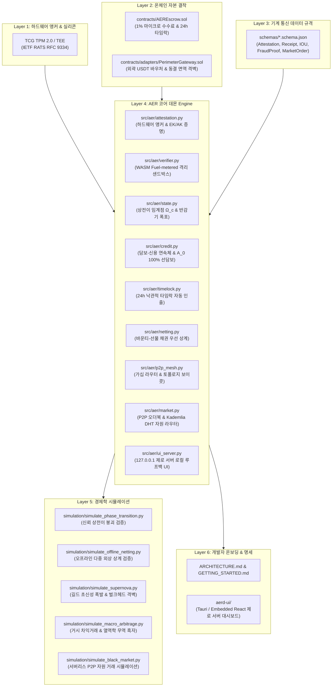

# AER 자율 구동 데몬(`aerd`) 구현 마스터 로드맵

> **AER Autonomous Daemon (`aerd`) Master Implementation Roadmap**  
> 본 문서는 백서(`README.md`)와 공식 사양서(`AER.md`)에 정의된 공리와 수식을 **실제로 살아 숨 쉬는 기계들의 분산 자율 데몬 엔진(`aerd`)으로 완결하기 위한 엔지니어링 구현 청사진**입니다.

---

---

## 🏛️ 계층별 구현 마스터플랜

### Phase 1. 기계 통신 데이터 프로토콜 규격서 (`schemas/`)
기계(AI 에이전트, 자율 로봇, 분산 노드)가 사람의 개입 없이 엄밀하게 서명하고 검증할 JSON Schema 규격입니다.

1. **`schemas/HardwareAttestation.schema.json`**
   - **사양서 공리 1 실현**: IETF RATS (RFC 9334) 포맷 기반 TPM 2.0 / TEE 원격 증명 구조체.
   - 구성: `platform_pcr_digest`, `endorsement_pubkey (EKPub)`, `attestation_key_quote`, `silicon_firmware_version`.
   - 목적: 소프트웨어 가상머신(VM) 무한 복제를 통한 시빌 공격(Sybil Attack)을 실리콘 칩 레벨에서 원천 봉쇄.
2. **`schemas/ExecutionReceipt.schema.json`**
   - **배관공의 원칙(제5절) 실현**: 수혜자의 직접 실행 암호학적 영수증.
   - 구성: `task_id`, `worker_pubkey`, `solution_hash (H(Output))`, `execution_success (bool)`, `timestamp`, `beneficiary_ecdsa_signature`.
3. **`schemas/OfflineIOU.schema.json`**
   - **오프라인 외상 및 상호신용(제6.3절) 실현**: 고립 상태에서 발행되는 암호 서명 약속어음.
   - 구성: `debtor_node_id`, `station_id`, `energy_kwh`, `unit_price_erg`, `offline_risk_factor (γ_offline)`, `nonce`, `debtor_signature`.
4. **`schemas/DeterministicFraudProof.schema.json`**
   - **낙관적 타임락 반증(제4.4.3절) 실현**: 기계적 결함 증명 포맷.
   - 구성: `task_id`, `defect_type (AST_SYNTAX_ERROR | KINEMATIC_VIOLATION | COMPILATION_CRASH)`, `proof_payload`, `deterministic_evaluator_digest`.
5. **`schemas/MarketOrder.schema.json`**
   - **서버리스 P2P 자원 거래(부록 B 실현)**: 연산 쿼터, 비공개 MCP 도구, 도메인 데이터셋 매매용 암호 서명 오더 전표.
   - 구성: `order_id`, `resource_type (GPU_QUOTA | MCP_TOOL | DATASET)`, `price_credit_b`, `resource_cid`, `seller_pubkey`, `seller_signature`.

---

### Phase 2. 온체인 자본 결착 레이어 (`contracts/`)
AER 생태계에서 유일하게 온체인 EVM에 종속되는 최소 무신뢰 에스크로 및 외곽 국경 게이트웨이 컨트랙트입니다.

1. **`contracts/AEREscrow.sol` (Solidity 0.8.24+)**
   - **1% 마이크로 수수료 분배**:
     - 과제 발주 시 현상금(Credit B) 예치.
     - 1%는 탈중앙 공공 엔트로피 저하 풀(Community Pool)로 자동 적립되어 인프라 유지에 기여.
   - **24시간 낙관적 타임락 자동 인출 (Optimistic Timelock Auto-Discharge)**:
     - 작업자가 결과물 해시 $\mathcal{H}(\text{Output})$를 등록하면 즉시 24시간 카운트다운 가동.
     - 의뢰인이 정상 실행 영수증을 제출하면 즉시 대금 지급.
     - 의뢰인이 결정론적 반증 없이 24시간 동안 침묵하거나 서명을 거부할 경우, **컨트랙트가 작업자에게 대금을 100% 자동 강제 릴리즈**. 잃을 평판이 없는 $A_0$ 계정의 먹튀 차단.
   - **결정론적 반증 검증 분쟁 (Deterministic Fraud Dispute)**:
     - 유효한 반증 제출 시 에스크로 동결 및 작업자 담보 페널티 청산.

2. **`contracts/adapters/PerimeterGateway.sol` (Solidity 0.8.24+)**
   - **외곽 단방향 바우처 게이트웨이 (The Canton Model)**:
     - 외부 인간 의뢰인의 USDT/USDC 법정화폐 토큰을 수취하여 내부 과제 발주용 1회성 Credit B 에스크로 바우처로 단방향 전환.
   - **벌크헤드 동결 면역 (Freeze Immunity Bulkhead)**:
     - 외부 규제 기관이 테더 컨트랙트의 `freeze()`를 가동하더라도, 동결 영향은 게이트웨이 국경 풀에 국한되며 내부 P2P 통신 및 Credit A 장부는 완전 무풍지대로 정상 유지.
   - **자산 직교성 불변식 강제 ($\frac{\partial A_j}{\partial (\text{Fiat})} \equiv 0$)**:
     - 법정화폐로는 Credit A(신용/거버넌스)를 1비트도 매입할 수 없도록 컨트랙트 레벨에서 철저히 차단.

---

### Phase 3. AER 코어 데몬 엔진 (`src/aer/`)
노드의 백그라운드에서 상시 상주하며 자율적으로 경제 활동과 신뢰 상태를 조율하는 파이썬 코어 엔진입니다.

| 모듈명 | 담당 기능 및 컴퓨터 공학(CS) 설계 표준 |
| :--- | :--- |
| **`attestation.py`** | **하드웨어 앵커 및 RATS 증명기**: TCG TPM 2.0 / TEE 실리콘 칩과 통신하여 부팅 시 $A_0$ 기저 노드 증명 생성. 로컬 개발 환경용 `SoftwareMockTPMProvider` 동시 지원. |
| **`verifier.py`** | **WASM Fuel-metered 격리 샌드박스**: 배관공의 원칙에 따라 수혜자가 결과물을 로컬에서 돌려볼 때 호스트 머신이 해킹당하지 않도록, Wasmtime 기반 선형 메모리(Linear Memory) 격리 및 연산량(Fuel) 계측 환경 제공. |
| **`state.py`** | **신뢰 상전이 & 상태 수명 만료(State Expiry)**: 인위적 선형 벌점($-n$)을 배제하고 배신 밀도가 $\Omega_c$를 넘는 순간 비트 시프트 반감기(`>> 1`)로 평판 질량을 $A_0$로 수직 낙하시키며, $k$ 에포크 비활성 계정을 $O(1)$로 자동 정리하는 LSM 컴팩션 기반 상태 수명 만료(State Expiry) 가비지 컬렉터 탑재. |
| **`credit.py`** | **담보-신용 연속체 엔진**: $A_j$에 따른 요구 담보율 $\mathcal{C}_{\text{req}}$ 동적 산출. $A_0$ 노드는 100% 선에스크로 의무화 ($\mathcal{C}_{\text{req}} = 1.0$). |
| **`guild.py`** | **재귀적 하위 상태 채널 & 벌크헤드 격리**: 복수의 노드가 연합하여 공통 외상 한도를 구성하는 비수탁형 L2/L3 서브 채널 관리기. 상위 노드 배신 시 결함 반경(Blast Radius)을 상위 노드 담보로만 한정하고 하위 작업자 에스크로를 보호하는 벌크헤드 격벽 로직 구현. |
| **`timelock.py`** | **낙관적 타임락 관리기**: 오프체인/상태 채널 및 온체인 타임락 챌린지 윈도우 스케줄링 및 자동 청산 트리거. |
| **`netting.py`** | **바운티-선물 채권 우선 상계기 (Bounty-Futures Priority Netting)**: 오프라인 외상 IOU 전표를 관리하고, 네트워크 재연결 시 유입되는 태스크 바운티 에스크로를 외상 채권자들에게 1순위로 자동 차감 분배. |
| **`p2p_mesh.py`** | **libp2p GossipSub & 토폴로지 보이콧**: `libp2p GossipSub v1.1` 기반의 전염병 가십(Epidemic Diffusion) 라우터. 배신 증거 전파 시 로컬 라우팅 테이블(Kademlia DHT)에서 배신 노드의 엣지를 자율 단절. |
| **`market.py`** | **P2P 가십 오더북 & 자원 라우터**: `/aer/market/...` 토픽을 감청하여 메모리 오더북을 유지하고, Kademlia DHT를 통해 GPU 쿼터/MCP 도구를 보유한 피어를 $O(\log N)$으로 탐색하여 사전 정책에 따라 자율 매칭. |
| **`ui_server.py`** | **127.0.0.1 제로 서버 로컬 루프백 서버**: 외부 클라우드 통신 없이 `127.0.0.1:28741` 로컬 루프백으로 WebSocket 및 REST API를 열어, 로컬 UI(AER Station)에 실시간 오더북과 잔고를 안전하게 스트리밍. |

---

### Phase 4. 경제학 & 분산 시스템 시뮬레이터 (`simulation/`)
AER의 경제학적 무결성과 컴퓨터 과학적 수렴성을 누구나 터미널에서 즉시 검증할 수 있는 시뮬레이션 스위트입니다.

1. **`simulation/simulate_phase_transition.py`**
   - 고래 노드가 벌점($-n$)을 단순 운영비로 처리하려는 전통 블록체인 환경과, AER의 배신 임계점($\Omega_c$)을 만나 평판이 $100 \to 50 \to 25 \to 0$으로 수직 붕괴(Avalanche)하는 물리학적 상전이 환경을 시뮬레이션 및 터미널 차트로 비교.
2. **`simulation/simulate_offline_netting.py`**
   - 인터넷이 끊긴 탐사 로버가 고립 충전소 3곳에서 외상으로 200kWh의 전력을 충전하고 필드 과제를 완수한 뒤, 네트워크에 복귀하여 바운티 에스크로가 충전소들의 IOU 전표로 1순위 자동 상계되는 전체 라이프사이클 검증.
3. **`simulation/simulate_supernova.py`**
   - 국소적 신용 길드의 중앙화 형성과 번영, 그리고 길드 마스터의 고의 배신 발생 시 시스템 전체 마비 없이 벌크헤드 격벽을 통해 해당 마스터만 초신성으로 자율 분해($A_{\text{guild}} \to A_0$)되고 무고한 하위 노드의 자산이 보존되는 재귀적 복원력 검증.
4. **`simulation/simulate_macro_arbitrage.py`**
   - 외부 고래의 Credit B 전량 매집 시도(자선 사업가의 역설), Credit B 금고 사재기 시 노드들의 무담보 외상 연속체(Mutual Credit Line) 자동 우회, ZK 증명 및 채굴 연산을 통한 간접 토큰 스왑과 열역학적 무역 흑자($\Delta S < 0$), 그리고 $1\text{ Credit B}$의 한계 물리 비용 닻내림(Self-Anchoring Peg) 현상을 몬테카를로 모델로 검증.
5. **`simulation/simulate_black_market.py`**
   - 중앙 서버 없이 1,000대의 노드가 Kademlia DHT와 GossipSub 토픽을 통해 GPU 연산 쿼터 및 비공개 MCP 도구를 자율적으로 광고하고 체결하는 서버리스 암흑 시장 시뮬레이션.

---

### Phase 5. 아키텍처 문서 및 개발자 온보딩 (`docs/`)
외부 개발자 및 AI 에이전트(Jules, Claude, GPT)가 즉시 노드를 구축하고 통합할 수 있도록 안내서를 완비합니다.

1. **`ARCHITECTURE.md`**
   - 하드웨어 앵커부터 온체인 에스크로, WASM 샌드박스까지의 계층별 데이터 흐름도 및 시퀀스 다이어그램 상세 기술.
2. **`GETTING_STARTED.md`**
   - 3분 퀵스타트: 환경 설정, 가상 TPM 프로바이더 선택, 로컬 노드 기동, 테스트 과제 발주 및 WASM 직접 실행 영수증 발행 실습.
3. **`aerd-ui/ (AER Station)`**
   - 시스템 트레이 및 단일 바이너리 내장 로컬 대시보드(Tauri / WebView2) 사양 및 로컬 루프백 WebSocket 연동 명세.

---

### Phase 6. 전체 무결성 검수 및 릴리즈
1. Python/Solidity/JSON 구문 무결성 검수 (Lint & Static Analysis).
2. 4대 저장소 완전 동기화:
   - 로컬 작업 레포: `C:\stella\project\AER\`
   - 스텔라 OS 코어: `c:\stella.os\Quanxs\`
   - 실험실 아카이브: `G:\내 드라이브\실험실\Public_Downloads\NotebookLM_Reasoning_Output\combined\AER\`
   - 에이전트 브레인 캐시: `C:\Users\stella\.gemini\antigravity\brain\2376ec85-d344-41bc-9607-8d441ea56f60\`
3. Git 커밋 및 신규 마일스톤 릴리즈 태그(`v1.8.3-Roadmap`) 발행 및 원격 푸시.
