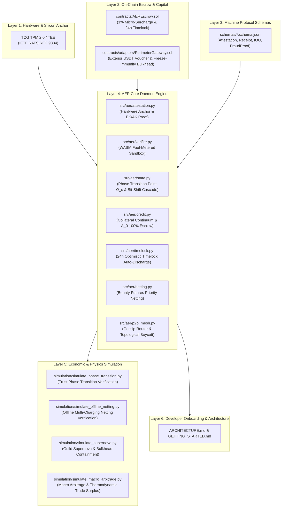

# AER Autonomous Daemon (`aerd`) Master Implementation Roadmap

> **Engineering Blueprint for Completing the AER Autonomous Daemon Engine**  
> This document formalizes the engineering roadmap to transition the axioms, game theory, and thermodynamic mathematics of the AER Whitepaper (`README.md`) and Technical Specification (`AER.md`) into an operational, decentralized, autonomous daemon (`aerd`).

---

---

## 🏛️ Layer-by-Layer Master Implementation Plan

### Phase 1. Machine Protocol Data Specifications (`schemas/`)
Deterministic JSON Schemas allowing machines (AI agents, autonomous rovers, physical nodes) to sign, serialize, and verify payloads without human ambiguity.

1. **`schemas/HardwareAttestation.schema.json`**
   - **Realizing Axiom 1**: Hardware remote attestation structure based on IETF RATS (RFC 9334) for TPM 2.0 / TEE.
   - Fields: `platform_pcr_digest`, `endorsement_pubkey (EKPub)`, `attestation_key_quote`, `silicon_firmware_version`.
   - Purpose: Physically bound Sybil defense at the silicon level, preventing software VM multiplication attacks.
2. **`schemas/ExecutionReceipt.schema.json`**
   - **Realizing Section 5 (The Plumber Principle)**: Beneficiary cryptographic execution receipt.
   - Fields: `task_id`, `worker_pubkey`, `solution_hash (H(Output))`, `execution_success (bool)`, `timestamp`, `beneficiary_ecdsa_signature`.
3. **`schemas/OfflineIOU.schema.json`**
   - **Realizing Section 6.3 (Offline Mutual Credit)**: Offline cryptographically signed promissory note.
   - Fields: `debtor_node_id`, `station_id`, `energy_kwh`, `unit_price_erg`, `offline_risk_factor (γ_offline)`, `nonce`, `debtor_signature`.
4. **`schemas/DeterministicFraudProof.schema.json`**
   - **Realizing Section 4.4.3 (Optimistic Timelock Fraud Proof)**: Machine-verifiable defect assertion format.
   - Fields: `task_id`, `defect_type (AST_SYNTAX_ERROR | KINEMATIC_VIOLATION | COMPILATION_CRASH)`, `proof_payload`, `deterministic_evaluator_digest`.

---

### Phase 2. On-Chain Settlement Layer (`contracts/`)
The minimal, zero-governance trustless smart contract infrastructure and exterior boundary gateway deployed on EVM.

1. **`contracts/AEREscrow.sol` (Solidity 0.8.24+)**
   - **1% Micro-Surcharge Distribution**:
     - Bounty (Credit B) deposited on task dispatch.
     - 1% automatically routed into the decentralized Community Negentropy Pool to maintain public infrastructure.
   - **24-Hour Optimistic Timelock Auto-Discharge**:
     - Submission of solution digest $\mathcal{H}(\text{Output})$ initiates a 24-hour challenge countdown.
     - Direct client execution receipt releases bounty instantly.
     - If client remains silent or refuses settlement without deterministic proof, **the contract automatically releases 100% of escrowed funds to the worker upon timeout**. Eliminates free-riding by disposable $A_0$ accounts.
   - **Deterministic Fraud Dispute**:
     - Valid fraud proofs freeze escrow and trigger worker collateral penalties.

2. **`contracts/adapters/PerimeterGateway.sol` (Solidity 0.8.24+)**
   - **Exterior One-Way Voucher Gateway (The Canton Model)**:
     - Receives external human client USDT/USDC fiat-backed tokens and mints one-way Credit B task vouchers.
   - **Freeze-Immunity Bulkhead**:
     - External regulatory freezes (`freeze()`) on the USDT contract only affect border liquidity pools. Internal node-to-node TPM attestation, mesh communication, and Credit A ledger remain 100% operational.
   - **Asset Orthogonality Enforcement ($\frac{\partial A_j}{\partial (\text{Fiat})} \equiv 0$)**:
     - Enforces at the contract level that fiat capital cannot buy relational credit or governance ($A_j$), precluding plutocratic capture.

---

### Phase 3. AER Core Daemon Engine (`src/aer/`)
The asynchronous background Python daemon executing continuous economic reconciliation and state transitions.

| Module | Core Responsibility & Computer Science (CS) Standards |
| :--- | :--- |
| **`attestation.py`** | **Hardware Anchor & RATS Attestor**: Interfaces with TCG TPM 2.0 / TEE silicon chips at boot to produce $A_0$ baseline existence proofs. Includes `SoftwareMockTPMProvider` for local developer testing. |
| **`verifier.py`** | **WASM Fuel-Metered Sandbox**: Implements safe execution of untrusted deliverables under the Plumber Principle via Wasmtime linear memory isolation and instruction fuel bounds, guaranteeing host OS integrity. |
| **`state.py`** | **Phase Transition & State Expiry Compactor**: Discards arbitrary arithmetic penalties ($-n$). Drives bit-shift half-life decay (`>> 1`) when betrayal density exceeds $\Omega_c$, and incorporates an LSM-compaction-based State Expiry garbage collector pruning inactive accounts down to baseline $A_0$ in $O(1)$ complexity. |
| **`credit.py`** | **Collateral-to-Credit Continuum Engine**: Dynamically computes required collateral $\mathcal{C}_{\text{req}}(A_j)$. Enforces mandatory 100% upfront escrow for $A_0$ accounts ($\mathcal{C}_{\text{req}} = 1.0$). |
| **`guild.py`** | **Recursive State Channels & Bulkhead Fault Isolation**: Manages non-custodial L2/L3 credit syndicates and sub-channels. Enforces bulkhead fault isolation to ensure that a defaulting guild master's blast radius is strictly confined, safeguarding sub-channel participants' escrows. |
| **`timelock.py`** | **Optimistic Timelock Manager**: Manages off-chain state channel and on-chain challenge windows with automated settlement triggers. |
| **`netting.py`** | **Bounty-Futures Priority Netting**: Tracks offline energy IOUs and automatically routes inbound task bounty escrows to clear outstanding debts upon network reconnection before liquid disbursement. |
| **`p2p_mesh.py`** | **libp2p GossipSub & Topological Boycott**: Epidemic diffusion router based on `libp2p GossipSub v1.1`. Disseminates fraud claims and autonomously severs defective node routing edges in local Kademlia routing tables. |

---

### Phase 4. Economic & Distributed Systems Simulators (`simulation/`)
Monte-Carlo test harnesses validating macroeconomic stability and computer science convergence in terminal environments.

1. **`simulation/simulate_phase_transition.py`**
   - Compares conventional slashing models (where whales treat fines as griefing budgets) against AER's phase transition avalanche collapse ($100 \to 50 \to 25 \to 0$) upon crossing critical threshold $\Omega_c$.
2. **`simulation/simulate_offline_netting.py`**
   - Simulates a disconnected exploration rover drawing 200 kWh across 3 isolated charging stations and verifies priority netting of inbound task escrows against offline IOUs upon network reconnection.
3. **`simulation/simulate_supernova.py`**
   - Validates recursive guild formation, central condensation, and bulkhead blast radius containment when a super-node defaults, verifying that innocent sub-channel escrows remain untouched during the localized supernova dissolution ($A_{\text{guild}} \to A_0$).
4. **`simulation/simulate_macro_arbitrage.py`**
   - Simulates macroeconomic whale accumulation (the Philanthropic Monopoly Paradox), hoarding resistance via mutual credit line bypassing, indirect token swaps via ZK-proving / mining workloads, and the natural self-anchoring peg of 1 Credit B to the marginal physical cost of computation.

---

### Phase 5. Architecture Documentation & Developer Onboarding (`docs/`)
Comprehensive onboarding enabling external developers and AI agents (Jules, Claude, GPT) to build and deploy nodes within minutes.

1. **`ARCHITECTURE.md`**
   - End-to-end data flow diagrams from silicon TPM anchors to WASM execution sandboxes and EVM escrows.
2. **`GETTING_STARTED.md`**
   - 3-minute quickstart guide covering environment setup, mock TPM configuration, local node spinning, task dispatching, and sandbox receipt issuance.

---

### Phase 6. Verification, Synchronization & Release
1. Full static syntax analysis and validation for Python, Solidity, and JSON.
2. Complete 4-way synchronization across:
   - Local Git repository: `C:\stella\project\AER\`
   - Stella OS Core: `c:\stella.os\Quanxs\`
   - Lab Workspace: `G:\내 드라이브\실험실\Public_Downloads\NotebookLM_Reasoning_Output\combined\AER\`
   - Brain Artifact Cache: `C:\Users\stella\.gemini\antigravity\brain\2376ec85-d344-41bc-9607-8d441ea56f60\`
3. Git commit, tag (`v1.8.3-Roadmap`), and push to GitHub remote.
