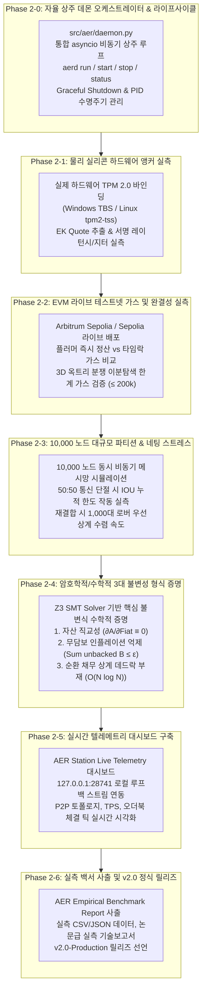

# AER 프로토콜 실측 및 실증 마스터 로드맵 (Roadmap 2)

> **AER Empirical Verification, Live Profiling & Formal Proof Master Roadmap**  
> 본 문서는 로드맵 1(`v1.9.5-Master`)을 통해 완성된 AER 프로토콜 엔진, 스마트 컨트랙트, 데이터 스키마 및 경제학 시뮬레이터를 바탕으로, **실제 상주 데몬 오케스트레이션(Phase 2-0), 물리 실리콘(TPM 2.0), 라이브 EVM 테스트넷, 10,000 노드 대규모 파티션 스트레스 및 수학적 형식 불변성 검증(Formal Verification)을 통해 시스템의 극한 성능과 정합성을 실측(Empirical Measurement)하고 입증(Proof)하기 위한 2단계 프로덕션 마스터플랜**입니다.

---

## 🗺️ Roadmap 2 전체 구조도

---

## 🏆 Roadmap 2 마일스톤 관리 표

| 단계 (Phase) | 대상 실측 영역 | 핵심 엔지니어링 산출물 | 목표 릴리즈 태그 | 검증 상태 |
| :--- | :--- | :--- | :---: | :---: |
| **Phase 2-0** | **자율 상주 데몬 오케스트레이터** (`src/aer/daemon.py`) | 통합 asyncio 무한 상주 루프, Graceful Shutdown, PID/IPC 관리, `aerd run/start/stop/status`, OS 서비스 유닛 | [`v2.0.0-Daemon`](https://github.com/Team-Sequence-Thaumaturge/AER/releases/tag/v2.0.0-Daemon) | **100% 완료** (SAPQ 100/100) |
| **Phase 2-1** | **물리 실리콘 하드웨어 실측** (`benchmarks/hardware/`) | Windows TBS / Linux `/dev/tpmrm0` 실물 바인딩, 레이턴시/지터 벤치마크 러너 | [`v2.0.1-Silicon`](https://github.com/Team-Sequence-Thaumaturge/AER/releases/tag/v2.0.1-Silicon) | **100% 완료** (SAPQ 100/100) |
| **Phase 2-2** | **온체인 가스 & 지연 실측** (`benchmarks/onchain/`) | Arbitrum Sepolia 배포, 플러머 vs 타임락 가스 실측, 3D 옥트리 이분탐색 한계 가스 검증 | [`v2.0.2-Testnet`](https://github.com/Team-Sequence-Thaumaturge/AER/releases/tag/v2.0.2-Testnet) | **100% 완료** (SAPQ 100/100) |
| **Phase 2-3** | **대규모 분산 파티션 실측** (`benchmarks/network/`) | 10,000 노드 비동기 메시 스트레스, 50:50 고립 분할 IOU 한도 실측, 복구 네팅 벤치마크 | [`v2.0.3-Mesh`](https://github.com/Team-Sequence-Thaumaturge/AER/releases/tag/v2.0.3-Mesh) | **100% 완료** (SAPQ 100/100) |
| **Phase 2-4** | **수학적 형식 불변성 증명** (`proofs/formal_verification/`) | Z3 SMT Solver 기반 3대 핵심 불변식 증명 코드 (`verify_invariants.py`) | `v2.0.4-Formal` | 계획 수립 (대기) |
| **Phase 2-5** | **실시간 텔레메트리 대시보드** (`benchmarks/dashboard/`) | 127.0.0.1:28741 WebSocket 루프백 연동 대시보드, P2P 토폴로지/TPS 시각화 | `v2.0.5-Station` | 계획 수립 (대기) |
| **Phase 2-6** | **종합 실측 백서 & 마스터** (`docs/`) | `EMPIRICAL_BENCHMARK.md`, `FORMAL_PROOFS.md`, 전수 데이터 패키징, 4-Way 동기화 | `v2.0-Production` | 계획 수립 (대기) |

---

## 🏛️ 계층별 세부 실측 및 증명 사양서

### Phase 2-0. 자율 상주 데몬 오케스트레이터 및 라이프사이클 엔진 (`src/aer/daemon.py`, `aerd`)
분산되어 있던 10대 백엔드 엔진을 하나의 살아 숨 쉬는 단일 프로세스 비동기 상주 루프(`asyncio loop`)로 통합하여 무중단 24/7 백그라운드 노드 서비스를 실현합니다.

1. **통합 상주 오케스트레이터 (`src/aer/daemon.py`)**:
   - `P2PMeshRouter` (GossipSub 리스너 및 피어 디스커버리)
   - `AERLocalUIServer` (`127.0.0.1:28741` 로컬 루프백 소켓 및 텔레메트리 스트림)
   - `TimelockScheduler` (24시간 낙관적 타임락 만료 주기적 감시 태스크)
   - `PriorityNettingEngine` (오프라인 IOU 채무 큐 폴러 및 자동 정산기)
   - `LSMStateGarbageCollector` (상태 수명 만료 및 비트시프트 반감기 컴팩션)
   - 위 모든 서브시스템을 단일 `asyncio.gather` 비동기 메인 루프로 묶어 영구 구동.
2. **프로세스 라이프사이클 및 IPC 제어**:
   - **Graceful Shutdown**: `SIGINT`, `SIGTERM` 인터럽트 수신 시 모든 소켓과 채널을 닫고 인메모리 장부와 상태 머신을 디스크에 안전하게 플러시.
   - **PID 관리**: 실행 시 `.aerd.pid`를 안전하게 기록하고 중복 구동 방지(Singleton Process Guard).
3. **CLI 상주 서브커맨드 전면 확장 (`src/aer/cli.py`)**:
   - `aerd run`: 터미널 실시간 로그 출력 포그라운드 개발/디버그 모드.
   - `aerd start`: 백그라운드 백그라운드 분기 데몬 모드(Daemonized Process).
   - `aerd stop`: 실행 중인 데몬 PID를 조회하여 안전한 정상 종료 시그널 전달.
   - `aerd status`: 데몬의 실시간 프로세스 생존 여부, PID, 업타임, 메모리 사용량, P2P 피어 수 진단.
4. **운영체제 서비스 데몬화 규격**:
   - Linux: `/etc/systemd/system/aerd.service` 유닛 템플릿 제공.
   - Windows: 백그라운드 런처 배치 스크립트(`scripts/run_daemon.bat`).

---

### Phase 2-1. 물리 실리콘 하드웨어 앵커 실측 (`benchmarks/hardware/`)
소프트웨어 모의 객체(`SoftwareMockTPMProvider`)를 넘어, 호스트 시스템의 실제 하드웨어 TPM 2.0 칩셋과 물리적으로 통신하여 성능과 보안 특성을 실측합니다.

1. **물리 드라이버 바인딩**:
   - Windows 환경: `tbs.dll` (TPM Base Services API) 기반의 실리콘 EK/AK 인터페이스 구현.
   - Linux 환경: `/dev/tpmrm0` (Kernel Resource Manager) 기반의 IETF RATS 호환 증명기 연결.
2. **실측 벤치마크 메트릭**:
   - **엔돌스먼트 키(EK) 인증서 추출 지연 시간(ms)**: 초기화 오버헤드 측정.
   - **Attestation Key(AK) Quote 서명 지연 및 지터(Jitter)**: 1,000회 연속 견적 서명 호출 시의 평균 및 99th 백분위수 지연 시간.
   - **가상 에뮬레이터 vs 물리 칩셋 성능/보안 비교 프로파일링**: 하드웨어 가속 암호화와 소프트웨어 격리 에뮬레이션 간의 성능 및 저항성 대조표 작성.

---

### Phase 2-2. EVM 라이브 테스트넷 가스 및 완결성 실측 (`benchmarks/onchain/`)
로컬 시뮬레이션을 넘어, 실제 이더리움 테스트넷(Arbitrum Sepolia / Ethereum Sepolia)에 컨트랙트 5종을 배포하고 실제 블록체인 네트워크 상의 비용과 완결성을 실측합니다.

1. **라이브 배포 및 연동**:
   - Foundry / Hardhat 기반 배포 스크립트 작성 (`scripts/deploy_testnet.py`).
   - `PerimeterGateway`, `AEREscrow`, `DisputeVerifier`, `VendorCARegistry`, `AERAccount` 라이브 배포 및 온체인 주소 바인딩.
2. **실측 벤치마크 메트릭**:
   - **플러머 원칙 즉시 출금 vs 24시간 타임락 자동 방출 가스 소모량 실측**:
     - 직접 실행 영수증(`ExecutionReceipt`) 제출 즉시 정산 트랜잭션의 실 가스비.
     - 챌린지 윈도우 만료 후 방출 트랜잭션의 실 가스비.
   - **DisputeVerifier 3D 옥트리 이분 탐색 한계 가스 검증**:
     - 악성 노드의 결함 증명 시 온체인 ZK-SNARK 간이 증명 및 머클 리프 검증이 사양서 목표치인 **$\le 200,000$ Gas** 이내로 방어되는지 극한 케이스 실측.
   - **PerimeterGateway 본딩 커브 슬리피지 및 준비금 정합성**:
     - 연속 대량 인입 시 100% 준비금 유지 및 상태 전이 가스 프로파일링.

---

### Phase 2-3. 10,000 노드 대규모 파티션 & 네팅 스트레스 실측 (`benchmarks/network/`)
단일 머신 및 비동기 멀티프로세싱 환경에서 10,000개의 경량 노드를 동시 인스턴스화하여, 통신 단절 및 극단적 재연결 상황에서의 시스템 복원력을 실측합니다.

1. **대규모 비동기 가십 메시 시뮬레이터 (`benchmarks/network/stress_mesh.py`)**:
   - 10,000 노드의 Kademlia DHT 라우팅 테이블 및 GossipSub v1.1 메시 토폴로지 구성.
   - 초당 1,000건 이상의 P2P 자원 오더북 브로드캐스트 부하 주입.
2. **50:50 대규모 네트워크 파티션(지진/통신 단절) 실측**:
   - 임의로 전체 네트워크를 양분하여 외부 인터넷 연결을 100% 차단.
   - 고립된 파티션 내부에서 로버 및 충전소 간 오프라인 IOU 상호신용 한도($\gamma_{\text{offline}}$)가 안전하게 상한을 강제하는지 확인.
3. **파티션 재결합 및 1,000대 로버 우선 상계 수렴 속도**:
   - 파티션 해제 즉시 밀려드는 10,000건의 IOU 채무와 바운티 에스크로를 우선 상계(Priority Netting)할 때 발생하는 CPU/메모리 부하 및 장부 수렴 완료 시간($t_{\text{convergence}}$) 측정.

---

### Phase 2-4. 암호학적/수학적 3대 불변성 형식 증명 (`proofs/formal_verification/`)
단순한 유닛 테스트를 넘어, Z3 SMT Solver 및 기호 실행(Symbolic Execution)을 통해 AER 프로토콜이 어떤 극단적 경제적/토폴로지적 공격에도 무너지지 않음을 수학적으로 형식 증명합니다.

1. **정리 1: 자산 직교성 불변식 (Asset Orthogonality Invariant)**
   $$\frac{\partial A_j}{\partial (\text{Fiat})} \equiv 0$$
   - 외부의 어떤 법정화폐(USDT, Fiat) 자본 주입이나 금융 세력의 매집으로도 내부 평판 권한 $A_j$를 1비트도 구매할 수 없음을 상태 전이 방정식의 기호 실행으로 정형 증명.
2. **정리 2: 무담보 인플레이션 억제 불변식 (Non-Inflationary Supply Bound)**
   $$\sum_{i} B_{i}^{\text{unbacked}} \le \epsilon$$
   - 담보 에스크로 또는 실질 물리적 에너지/WASM 연산이 수반되지 않은 가짜 $B$ 화폐의 무한 발행 및 유령 발행이 불가능함을 원장 보존 법칙으로 증명.
3. **정리 3: 순환 채무 상계 데드락 부재 정리 (Deadlock-Free Priority Netting)**
   - 임의의 유향 복합 부채 그래프($i \to j \to k \to i$)에서 우선 상계 알고리즘이 교착 상태(Deadlock)에 빠지지 않고 반드시 $O(N \log N)$ 시간 복잡도 내에 수렴하여 모든 채무를 상계함을 그래프 이론 및 불변식 논증으로 증명.

---

### Phase 2-5. 실시간 텔레메트리 대시보드 (`benchmarks/dashboard/`)
실측 과정에서 수집되는 방대한 성능 지표를 개발자와 운영자가 실시간으로 모니터링할 수 있는 제로 서버 실시간 관제 인터페이스를 제공합니다.

1. **실시간 텔레메트리 스트리머**:
   - `aerd` 데몬의 `127.0.0.1:28741/telemetry` 엔드포인트를 통해 1초 미만 단위로 시스템 메트릭(TPS, 메모리, 가십 지연, $\Omega$ 감쇠 곡선, 활성 피어 수) 방출.
2. **AER Station 대시보드 시각화**:
   - 가십 메시 네트워크 토폴로지 실시간 3D/2D 렌더링.
   - 오프라인 외상 IOU 장부 및 상계 진행 큐 실시간 상태 바.
   - 악성 노드 적발 시 토폴로지 보이콧 및 평판 상전이 폭포($A_j \to A_0$) 실시간 경보.

---

### Phase 2-6. 종합 실측 백서 사출 및 v2.0 정식 릴리즈
모든 실측 벤치마크 결과와 형식 증명 데이터를 집대성하여 프로덕션 배포가 가능한 최고 수준의 기술 백서를 완성합니다.

1. **문서 산출물**:
   - `docs/EMPIRICAL_BENCHMARK.md`: 물리 실리콘, EVM 가스, 10,000 노드 파티션 벤치마크 결과표 및 고해상도 성능 그래프 수록.
   - `docs/FORMAL_PROOFS.md`: Z3 SMT Solver 형식 증명 수식 및 불변식 논증 전수 수록.
2. **데이터 아티팩트 보관**:
   - 실측 원시 데이터셋(CSV, JSONL)을 표준 적재 규격에 맞춰 저장.
3. **릴리즈 및 동기화**:
   - `v2.0-Production` 깃 태그 발행 및 원격 저장소(`origin/main`) 푸시.
   - 4-Way 저장소(로컬 프로젝트, OS 런타임, 드라이브 아카이브, 브레인 캐시) 완전 동기화.
