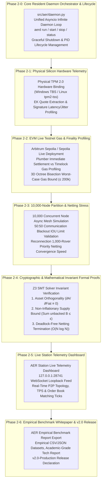

# AER Protocol Empirical Verification & Live Telemetry Master Roadmap (Roadmap 2)

> **AER Empirical Verification, Live Profiling & Formal Proof Master Roadmap**  
> Building upon the foundational core protocol engine, smart contracts, data schemas, and economic simulations delivered in Roadmap 1 (`v1.9.5-Master`), this document establishes the **Phase 2 Production Master Plan to orchestrate the resident daemon engine (Phase 2-0), empirically measure and benchmark physical silicon (TPM 2.0), live EVM testnets, 10,000-node partition stress scenarios, and Z3 mathematical invariant proofs.**

---

## 🗺️ Roadmap 2 Architecture Diagram

---

## 🏆 Roadmap 2 Milestone Tracking Table

| Phase | Empirical Focus Area | Core Engineering Deliverables | Target Release Tag | Verification Status |
| :--- | :--- | :--- | :---: | :---: |
| **Phase 2-0** | **Resident Daemon Orchestrator** (`src/aer/daemon.py`) | Unified asyncio daemon loop, Graceful Shutdown, PID/IPC management, `aerd run/start/stop/status`, OS service unit | [`v2.0.0-Daemon`](https://github.com/Team-Sequence-Thaumaturge/AER/releases/tag/v2.0.0-Daemon) | **100% Complete** (SAPQ 100/100) |
| **Phase 2-1** | **Physical Silicon Hardware Telemetry** (`benchmarks/hardware/`) | Windows TBS / Linux `/dev/tpmrm0` physical driver binding, latency/jitter benchmark runner | `v2.0.1-Silicon` | Planned (Pending) |
| **Phase 2-2** | **On-Chain Gas & Latency Profiling** (`benchmarks/onchain/`) | Arbitrum Sepolia deployment, Plumber vs Timelock gas profiling, 3D Octree bisection gas ceiling test | `v2.0.2-Testnet` | Planned (Pending) |
| **Phase 2-3** | **Large-Scale Partition & Netting Stress** (`benchmarks/network/`) | 10,000-node async mesh stress test, 50:50 isolation IOU accumulation limit, recovery netting benchmark | `v2.0.3-Mesh` | Planned (Pending) |
| **Phase 2-4** | **Mathematical Invariant Formal Proofs** (`proofs/formal_verification/`) | Z3 SMT Solver-based proofs of the 3 fundamental invariants (`verify_invariants.py`) | `v2.0.4-Formal` | Planned (Pending) |
| **Phase 2-5** | **Live Telemetry Dashboard** (`benchmarks/dashboard/`) | 127.0.0.1:28741 WebSocket loopback dashboard, real-time P2P topology / TPS visualizer | `v2.0.5-Station` | Planned (Pending) |
| **Phase 2-6** | **Empirical Technical Report & Master** (`docs/`) | `EMPIRICAL_BENCHMARK.md`, `FORMAL_PROOFS.md`, full dataset packaging, 4-way workspace sync | `v2.0-Production` | Planned (Pending) |

---

## 🏛️ Layer-by-Layer Technical Specifications

### Phase 2-0. Core Resident Daemon Orchestrator & Lifecycle (`src/aer/daemon.py`, `aerd`)
Unify the 10 standalone backend engines into a living, single-process, asynchronous background loop (`asyncio loop`) to provide continuous, 24/7 autonomous node operations.

1. **Unified Resident Daemon Orchestrator (`src/aer/daemon.py`)**:
   - `P2PMeshRouter` (GossipSub message listener & peer discovery)
   - `AERLocalUIServer` (`127.0.0.1:28741` local loopback socket & telemetry stream)
   - `TimelockScheduler` (Periodic 24h optimistic timelock expiration scanner)
   - `PriorityNettingEngine` (Offline IOU debt queue poller & auto-settlement engine)
   - `LSMStateGarbageCollector` (State expiry compaction & bit-shift half-life decay)
   - Bundle all subsystems into a single concurrent `asyncio.gather` main event loop.
2. **Process Lifecycle & IPC Control**:
   - **Graceful Shutdown**: On receiving `SIGINT` or `SIGTERM`, terminate all listening sockets, cleanly flush in-memory ledgers and state machines to disk.
   - **PID Management**: Maintain `.aerd.pid` and enforce singleton execution guards.
3. **Expanded CLI Daemon Subcommands (`src/aer/cli.py`)**:
   - `aerd run`: Foreground development & debug mode with real-time console logging.
   - `aerd start`: Background daemon mode spawning detached process.
   - `aerd stop`: Gracefully terminate running background daemon via PID lookup and signal delivery.
   - `aerd status`: Live process health-check, PID, uptime, memory footprint, and connected P2P peer count.
4. **OS Daemonization Specifications**:
   - Linux: `/etc/systemd/system/aerd.service` unit template.
   - Windows: Background runner script (`scripts/run_daemon.bat`).

---

### Phase 2-1. Physical Silicon Hardware Telemetry (`benchmarks/hardware/`)
Moving beyond the virtual mock provider (`SoftwareMockTPMProvider`), bind directly to physical host TPM 2.0 hardware to profile attestation speed and cryptographic entropy.

1. **Physical Driver Bindings**:
   - Windows: Direct binding to `tbs.dll` (TPM Base Services API) to query silicon Endorsement Keys (EK) and Attestation Keys (AK).
   - Linux: Native connection to `/dev/tpmrm0` (Kernel Resource Manager) for IETF RATS-compliant quote generation.
2. **Telemetry Metrics**:
   - **EK Certificate Extraction Latency (ms)**: Baseline initialization cost.
   - **AK Quote Signature Latency & Jitter**: Mean and 99th percentile response time across 1,000 consecutive quotes.
   - **Physical vs. Emulated Profiling**: Comparative benchmarks of hardware security vs. software fallback.

---

### Phase 2-2. EVM Live Testnet Gas & Finality Profiling (`benchmarks/onchain/`)
Deploy all 5 production smart contracts to live Ethereum testnets (Arbitrum Sepolia / Ethereum Sepolia) to profile gas dynamics, settlement fees, and RPC latency.

1. **Live Deployment & Orchestration**:
   - Automated deployment pipeline (`scripts/deploy_testnet.py`).
   - Live addresses bound for `PerimeterGateway`, `AEREscrow`, `DisputeVerifier`, `VendorCARegistry`, and `AERAccount`.
2. **Telemetry Metrics**:
   - **Plumber's Principle Immediate Withdrawal vs. 24h Timelock Gas Profiling**:
     - Gas cost of direct receipt (`ExecutionReceipt`) instantaneous settlement.
     - Gas cost of dispute challenge expiry release.
   - **DisputeVerifier Worst-Case Gas Ceiling**:
     - Verify on-chain ZK-SNARK succinct proof and Merkle leaf validation remain strictly **$\le 200,000$ Gas** under worst-case sensor dispute trajectories.
   - **PerimeterGateway Bonding Curve Slippage & Reserve Invariant**:
     - Maintain 100% reserve backing under bursts of synthetic load.

---

### Phase 2-3. 10,000-Node Partition & Netting Stress (`benchmarks/network/`)
Instantiate 10,000 lightweight async node processes to evaluate protocol resilience against massive network partitions and topological isolation.

1. **Massive Async Mesh Simulator (`benchmarks/network/stress_mesh.py`)**:
   - 10,000-node Kademlia DHT routing table and GossipSub v1.1 mesh topology.
   - High-throughput injection of $>1,000$ order book broadcasts per second.
2. **50:50 Communication Blackout Measurement**:
   - Sever 50% of the network and measure the offline IOU risk factor ($\gamma_{\text{offline}}$) enforcement.
3. **Partition Reconnection & Priority Netting Convergence**:
   - Reconnect partitions and benchmark the convergence time ($t_{\text{convergence}}$) and resource overhead as 10,000 IOUs and task bounties are settled.

---

### Phase 2-4. Cryptographic & Mathematical Invariant Formal Proofs (`proofs/formal_verification/`)
Utilize Z3 SMT Solver and symbolic execution to mathematically guarantee that AER remains secure against catastrophic economic and topological attacks.

1. **Theorem 1: Asset Orthogonality Invariant**
   $$\frac{\partial A_j}{\partial (\text{Fiat})} \equiv 0$$
   - Formally verify that external fiat capital injection cannot purchase internal authority credit $A_j$.
2. **Theorem 2: Non-Inflationary Supply Bound**
   $$\sum_{i} B_{i}^{\text{unbacked}} \le \epsilon$$
   - Prove that unbacked Credit B creation is impossible without escrowed collateral or verified physical entropy.
3. **Theorem 3: Deadlock-Free Priority Netting**
   - Formally prove that cyclic debt graph netting ($i \to j \to k \to i$) always terminates within $O(N \log N)$ complexity without circular deadlocks.

---

### Phase 2-5. Live Station Telemetry Dashboard (`benchmarks/dashboard/`)
Provide a lightweight zero-server GUI for real-time monitoring of daemon and network metrics.

1. **Real-Time Telemetry Stream**:
   - Stream metrics (TPS, memory, gossip latency, $\Omega$ decay curves, peer count) from `127.0.0.1:28741/telemetry`.
2. **AER Station Visualizer**:
   - Real-time 2D/3D visualization of the P2P gossip mesh topology.
   - Live queue status for offline IOU debt netting.
   - Real-time alert feed for topology boycotts and trust phase transition cascades ($A_j \to A_0$).

---

### Phase 2-6. Empirical Benchmark Whitepaper & v2.0 Release
Synthesize all benchmark datasets, gas charts, latency metrics, and mathematical proofs into an academic- and auditor-grade technical package.

1. **Documentation Deliverables**:
   - `docs/EMPIRICAL_BENCHMARK.md`: Comprehensive tables, gas profiles, and high-resolution latency graphs.
   - `docs/FORMAL_PROOFS.md`: Complete Z3 SMT Solver proof transcripts and formal derivations.
2. **Dataset Archival**:
   - Package all raw telemetry logs (CSV, JSONL) according to workspace standards.
3. **Release & Synchronization**:
   - Publish git tag `v2.0-Production` and push to remote `origin/main`.
   - Complete 4-way synchronization across all project workspaces.
