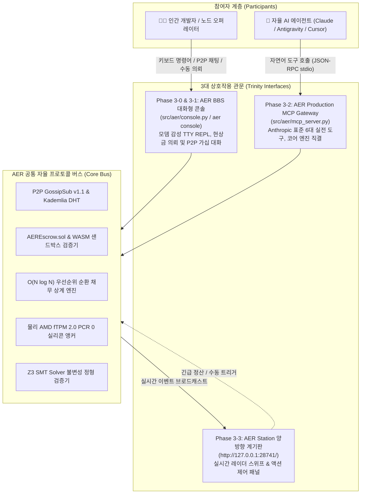

# AER 프로토콜 인간-기계 삼위일체 상호작용 및 에이전트 경제 마스터 로드맵 (Roadmap 3)

> **AER Human-AI Interactive Trinity & Agentic Economy Master Roadmap**  
> 본 문서는 로드맵 1(`v1.0-Alpha`, 원형 프로토콜 및 경제 데몬)과 로드맵 2(`v2.0-Production`, 물리 TPM 2.0, Arbitrum Cancun L2 가스, 10,000 노드 스트레스 및 Z3 정형 증명)의 완성된 기반 위에서, **인간 개발자(BBS 터미널 콘솔), AI 에이전트(Anthropic 표준 MCP 서버), 그리고 실시간 관제 계기판(AER Station 웹 대시보드)이 완벽한 삼위일체(Trinity)를 이루어 공존하는 실전 상호작용 및 자율 경제 생태계를 구축하기 위한 3단계 프로덕션 마스터플랜**입니다.

---

## 🗺️ Roadmap 3 아키텍처 구조도 (Trinity Architecture)

---

## 🏆 Roadmap 3 마일스톤 관리 표

| 단계 | 목표 마일스톤 | 공식 태그 | 상태 | 핵심 구현 내용 |
| :--- | :--- | :---: | :---: | :--- |
| **Phase 3-0** | AER BBS 대화형 터미널 콘솔 엔진 구축 | `v3.0.0-Console` | 준비중 | 모뎀/BBS 스타일 TTY REPL 엔진(`aer console`), 루프백 P2P 바인딩, ANSI 상태 프롬프트, 피어 핑/진단 |
| **Phase 3-1** | P2P 자원 현상금 의뢰 및 가십 패킷 대화 구현 | `v3.0.1-Bounty` | 준비중 | 콘솔 기반 문제/상금 발행(`bounty post`), 목록 조회 및 수락(`accept`), 노드 간 1:1 P2P 대화(`chat`) |
| **Phase 3-2** | AER Production MCP Gateway 프로덕션 고도화 | `v3.0.2-MCP` | 준비중 | 더미 스텁 탈피, 실제 TPM/EVM/Z3/오더북 직결 실전 MCP 도구 6종 표준화, `aer mcp-server` CLI 지원 |
| **Phase 3-3** | 웹 계기판(`127.0.0.1:28741`) 양방향 동기화 및 액션 패널 | `v3.0.3-Link` | 준비중 | 콘솔/MCP 이벤트 발생 시 대시보드 레이더/티커 실시간 반영(IPC/WS), 대시보드 내 즉각 조작 패널 장착 |
| **Phase 3-4** | 인간(콘솔)-기계(MCP) E2E 상호작용 실증 벤치마크 | `v3.0.4-Bench` | 준비중 | 인간의 문제 출제 -> AI 에이전트의 MCP 수락 -> WASM 연산 및 에스크로 자동 정산 E2E 실증 검증 |
| **Phase 3-5** | `v3.0-Trinity` 종합 사양서 편찬 및 마스터 릴리즈 | `v3.0-Trinity` | 준비중 | 삼위일체 상호작용 기술 사양서 편찬, 4방향 글로벌 동기화, 종합 테스트(100% 통과), 마스터 릴리즈 |

---

## 🔬 세부 단계별 구현 명세 (Phased Implementation Specification)

### Phase 3-0: AER BBS 대화형 터미널 콘솔 엔진 구축 (`v3.0.0-Console`)
* **목표**: 90년대 PC통신(하이텔/천리안/BBS) 및 사이버펑크 감성의 대화형 상주 TTY 콘솔 쉘 구축.
* **핵심 구현 파일**:
  - `src/aer/console.py`: 비동기 대화형 REPL(Read-Eval-Print-Loop) 터미널 엔진.
  - `src/aer/cli.py`: `aer console` (또는 `aerd console`) 명령어로 즉각 진입 지원.
* **기능 명세**:
  1. 가상 어쿠스틱 커플러 접속 시퀀스 출력 (`CONNECT 10000_NODES / PROTOCOL: GOSSIPSUB_v1.1`).
  2. 실시간 상태 프롬프트: `AER:ROVER-01 [CREDIT: 90,000 B | PEERS: 28]>`
  3. 기본 진단 명령어: `help`, `status`, `peers`, `ping <node_id>`, `tpm-quote`, `quit`.
  4. 비동기 백그라운드 이벤트 리스너: 사용자가 프롬프트에 대기 중일 때도 P2P 네트워크의 중요 패킷 수신 시 비침습적 화면 알림.

---

### Phase 3-1: P2P 자원 현상금 의뢰 및 가십 패킷 대화 구현 (`v3.0.1-Bounty`)
* **목표**: 터미널 콘솔에서 직접 문제를 출제하고 상금(Credit B)을 걸며, 다른 로버들과 P2P 패킷 메시지를 교환.
* **핵심 구현 파일**:
  - `src/aer/bounty.py`: 현상금 등록, 상태 전이, 타임락 정산 및 WASM 검증 오케스트레이터.
  - `src/aer/p2p_mesh.py`: `/aer/chat/v1` 토픽 추가 및 1:1 직접 메시징(Direct Message) 라우팅.
* **명령어 명세**:
  1. `bounty post --task <type> --reward <amount> --timelock <hours>`:
     - 문제 해시 및 작업 명세를 브로드캐스트하고, 자신의 신용 한도/에스크로에서 상금을 락업.
  2. `bounty list` & `bounty accept <task_id>`:
     - 활성 현상금 목록을 탐색하고 작업을 수락하여 로컬 WASM 샌드박스 연산 큐에 할당.
  3. `chat <node_id> <message>`:
     - 특정 노드 ID로 암호화된 P2P 가십 패킷 전송.
  4. `broadcast <message>`:
     - 네트워크 전체 공용 가십 채널에 공지 메시지 전파.

---

### Phase 3-2: AER Production MCP Gateway 프로덕션 고도화 (`v3.0.2-MCP`)
* **목표**: Anthropic MCP(Model Context Protocol) 표준을 준수하며, 기존 더미 스텁을 100% 제거하고 실체 코어와 직결.
* **핵심 구현 파일**:
  - `src/aer/mcp_server.py`: 프로덕션급 FastMCP / stdio JSON-RPC 서버.
  - `G:\내 드라이브\실험실\Public_Downloads\aer_mcp_server.py`: 실시간 동기화.
* **6대 실전 MCP 도구**:
  1. `aer_get_telemetry`: 실제 AMD fTPM 2.0 PCR 0 해시, 지연 시간, 가스 단가, 피어 수 실시간 조회.
  2. `aer_verify_invariants`: Z3 SMT Solver를 즉시 호출하여 자산 직교성, 무담보 상한 정형 검증.
  3. `aer_trigger_netting`: $O(N \log N)$ 최소 흐름 상계 알고리즘으로 부채 즉각 소멸 및 상계 리포트 반환.
  4. `aer_query_orderbook`: P2P 오더북 실시간 호가 조회 및 자원 매칭.
  5. `aer_post_bounty`: AI가 추론 병목 발생 시 AER 네트워크에 Credit B 현상금 작업 공식 발행.
  6. `aer_execute_task`: AI가 네트워크에 올라온 현상금을 수락하여 WASM 샌드박스에서 수행하고 보상 수취.

---

### Phase 3-3: 웹 계기판(`127.0.0.1:28741`) 양방향 동기화 및 액션 패널 (`v3.0.3-Link`)
* **목표**: 관측 전용 계기판에서 한 단계 진화하여, 콘솔 및 MCP의 이벤트가 실시간으로 번쩍이고 웹에서도 직접 제어 가능.
* **핵심 구현 파일**:
  - `benchmarks/dashboard/telemetry_dashboard.py` & `dashboard.html`
* **기능 명세**:
  1. **실시간 이벤트 브로드캐스트**: 콘솔에서 `bounty post`를 치거나 AI가 MCP로 작업을 수락하면 대시보드 레이더의 해당 노드가 하이라이트되고 티커에 실시간 트랜잭션 출력.
  2. **인터랙티브 액션 제어 패널**: 웹 화면에 [⚡ 1,000 로버 순환 상계 강제 실행], [📐 Z3 정형 검증 즉각 재실행] 버튼 탑재.

---

### Phase 3-4: 인간(콘솔)-기계(MCP) E2E 상호작용 실증 벤치마크 (`v3.0.4-Bench`)
* **목표**: 인간과 AI가 실제로 협업하여 문제를 해결하고 경제적 청산이 이루어지는 전 과정을 검증.
* **테스트 시나리오**:
  1. 인간 오퍼레이터가 `aer console`에서 `bounty post --task "OCTREE_COMPRESSION" --reward 500` 발행.
  2. 백그라운드 AI 에이전트(MCP)가 `aer_scan_market`으로 이를 감지하고 `aer_execute_task`로 수락.
  3. WASM 샌드박스에서 0.05초 만에 연산 완료 후 `ExecutionReceipt` 서명 사출.
  4. 콘솔 화면에 `[+] Bounty #BNT-101 completed by Agent Node!` 알림 출력 및 500 B 정산 확인.
  5. 웹 대시보드 티커에 에스크로 해제 및 평판 질량($A_j$) 상승 틱 기록 확인.

---

### Phase 3-5: `v3.0-Trinity` 종합 사양서 편찬 및 마스터 릴리즈 (`v3.0-Trinity`)
* **목표**: 로드맵 3의 전 마일스톤 완결 공증 및 `v3.0-Trinity` 공식 마스터 릴리즈.
* **산출물**:
  - `docs/TRINITY_SPECIFICATION.md` & `docs/TRINITY_SPECIFICATION.ko.md`
  - `README.md` & `README.ko.md` 삼위일체 아키텍처 배너 반영.
  - 전수 단위 테스트 통과 (새로 추가될 콘솔, 현상금, MCP 테스트 포함).
  - 4방향 글로벌 동기화 (AER 레포, 구글 드라이브, stella.os, Agent Brain).
  - Git 태그 `v3.0-Trinity` 발행 및 GitHub 원격 푸시.

---

## 🛡️ 검증 및 거버넌스 원칙 (Invariants)
1. **SAPQ v2.0 의무 검수**: 새로 작성되는 콘솔 및 MCP 파이썬 코드는 4방향 AST 교차 검수를 통해 100/100 점수를 획득해야 함.
2. **에어갭 무클라우드 격리**: 콘솔, 대시보드, MCP 게이트웨이 간 모든 통신은 로컬 IPC/루프백(`127.0.0.1`) 환경에서 외부 유출 없이 격리 구동됨.
3. **자산 직교성 보존**: 인간이든 AI든 외부 자본으로 지름길을 탈 수 없으며, 오직 검증된 연산(WASM)과 물리 실리콘(TPM) 증명으로만 Credit B를 획득함.