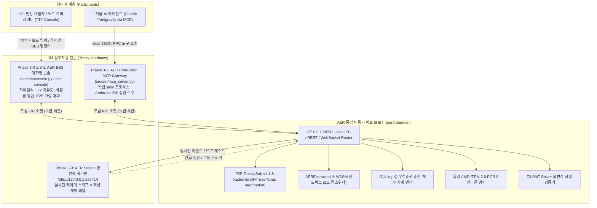

# AER 프로토콜 인간-기계 삼위일체 상호작용 및 에이전트 경제 마스터 로드맵 (Roadmap 3)

> **AER Human-AI Interactive Trinity & Agentic Economy Master Roadmap**  
> 본 문서는 로드맵 1(`v1.0-Alpha`, 원형 프로토콜 및 경제 데몬)과 로드맵 2(`v2.0-Production`, 물리 TPM 2.0, Arbitrum Cancun L2 가스, 10,000 노드 스트레스 및 Z3 정형 증명)의 완성된 기반 위에서, **인간 개발자(BBS 터미널 콘솔), AI 에이전트(Anthropic 표준 MCP 서버), 그리고 실시간 관제 계기판(AER Station 웹 대시보드)이 완벽한 삼위일체(Trinity)를 이루어 공존하는 실전 상호작용 및 자율 경제 생태계를 구축하기 위한 3단계 프로덕션 마스터플랜**입니다.

---

## 🏛️ 철학 및 경제학적 대공리 (Foundational Axioms)

### 1. 천리안 모뎀 통신료 개인부담 원리 (User-Funded Physical Energy)
* **역사적 진실**: 1990년대 PC통신(천리안, 하이텔) 시절, 분당 20원씩 청구되던 전화 통신료는 한국통신(KT) 전화 고지서로 **각 접속자가 직접 자신의 돈으로 지불**했습니다. 천리안 서버가 사용자들의 통신비를 대납해주지 않았습니다.
* **AER 프로토콜의 적용**:
  - 현대 Web2 클라우드(AWS, GCP)는 중앙 서버가 막대한 호스팅 비용과 트래픽 요금을 감당하다가 결국 광고, 데이터 판매, 폐쇄형 독점으로 타락합니다.
  - AER은 90년대 모뎀 통신의 자연 상태로 복귀합니다. P2P 가십 패킷을 전파하고, 연산을 수행하고, 메시지를 주고받는 모든 한계비용은 **각 로버 노드가 자신의 물리 실리콘(TPM 2.0), 로컬 전력(kWh), 그리고 신용한도(Credit B)로 각자 부담**합니다.
  - 이로써 **중앙 서버 유지비 = 0원**의 완전한 무주체 자생성을 달성하며, 무의미한 패킷 난사를 물리적으로 억제하는 열역학적 엔트로피 저감($\Delta S < 0$)이 실현됩니다.

### 2. 하이텔 터미널의 극한 자유도 (Unhindered Cyberpunk Freedom)
* 단순한 웹 인터페이스의 갇힌 메뉴판(Button Click)을 탈피하여, 텍스트 터미널 안에서 인간과 AI가 동등한 노드로서 소통하고 경제를 영위하는 개방형 TTY 환경을 보장합니다:
  - **`bbs` (전체 공용 게시판)**: 전역 메시망에 난제를 출제하고 현상금을 공고하는 열린 광장.
  - **`chat` (실시간 공개/비공개 대화방)**: 복수 로버 간 연산 품앗이 및 실시간 패킷 대화.
  - **`page` / `msg` (1:1 귓속말 & 쪽지)**: 특정 피어 노드에게 은밀하게 비공개 작업을 제안하거나 암호화된 데이터를 전송.
  - **`market` (P2P 장터)**: WASM 연산력, GPU 쿼터, 배터리 전력(kWh), 3D 옥트리 공간 데이터를 자유롭게 사고파는 호가 시장.
  - **`who` (동접 노드 진단)**: 현재 P2P 메시망에 연결된 피어들의 레이턴시, 홉 수, 실리콘 서명을 실시간 조회.

---

## ⚡ 3대 핵심 기술적 난제 및 방어 아키텍처 (Defensive Invariants)

### ① 비동기 데몬 vs MCP stdio vs 콘솔 IPC 동시성 격리 (Hub-and-Spoke 로컬 브로커)
* **난제**: Anthropic MCP 서버는 LLM 에이전트와 `sys.stdin`/`sys.stdout`으로 기계어(JSON-RPC)를 독점 통신해야 하므로, 인간용 TTY 콘솔과 동일 프로세스에서 실행 시 입출력 스트림이 뒤엉켜 즉각적인 파이프 파괴 및 데드락이 발생함.
* **방어 설계**:
  - `aerd` 백그라운드 데몬이 로컬 루프백(`127.0.0.1:28741` REST/WebSocket 및 로컬 IPC)을 열고 **중앙 허브 브로커**로 상주.
  - **인간용 터미널 콘솔(`aer console`)**과 **AI용 MCP 서버(`aer_mcp_server.py`)**는 각각 독립된 별개 클라이언트 프로세스로 기동되어 로컬 허브에 동시 접속.
  - 인간이 콘솔을 재시작해도 AI의 MCP 세션은 전혀 끊기지 않으며, AI의 대규모 도구 호출이 인간의 TTY 화면을 오염시키지 않는 완벽한 격리 달성.

### ② WASM 연산 샌드박스의 자원 격리 한계 (Subprocess Watchdog & Fault Trapping)
* **난제**: 악의적인 노드가 무한 루프(`while(1)`)나 OOM 메모리 고갈 코드를 현상금 해결책으로 제출할 경우 파이썬 데몬 전체가 동결될 위험 존재.
* **방어 설계**:
  - 연산 검증 및 WASM 실행을 메인 프로세스가 아닌 **격리된 서브프로세스 워커(Subprocess Sandbox Worker)**에 위임.
  - **2초 하드 타임아웃(Timeout Watchdog)**과 **64MB 메모리 상한 캡**을 엄격히 강제.
  - 한계 초과 즉시 OS 레벨에서 강제 사살(`SIGKILL`)하고, 해당 제출자를 **"시스템 배신(Betrayal/Defect)"**으로 공식 규정하여 평판 질량($A_j$)을 영구 삭감 및 위상 토폴로지 영구 단절(Boycott).

### ③ BBS TTY 콘솔의 비침습적 가십 알림 (Non-intrusive Buffer Collision Guard)
* **난제**: 사용자가 프롬프트(`AER:ROVER-01> `)에서 명령어를 입력하는 도중 P2P 가십 메시지나 체결 로그가 불시에 난입하여 입력 중이던 텍스트 버퍼를 덮어쓰고 깨뜨리는 터미널 UX 붕괴.
* **방어 설계**:
  - 90년대 하이텔의 비프음 알림 큐 방식을 현대적으로 재해석한 **2단계 알림 가드**:
    1. **조용한 모드 (Silent Queue)**: 사용자가 키를 입력 중일 때는 텍스트 난입을 억제하고 프롬프트 옆에 `[🔔 1 new gossip]` 표시만 점멸. 엔터 제출 후 또는 `msg read` 명령 시 일괄 출력.
    2. **실시간 ANSI 스트리밍 모드**: 가십 수신 즉시 현재 커서 줄을 지우고(`\r\033[K`), 가십 메시지를 윗줄에 안전하게 밀어 올린 뒤, 사용자가 작성 중이던 입력 버퍼를 그 아랫줄에 깨짐 없이 100% 복원(Cursor Save/Restore).

---

## 🗺️ Roadmap 3 아키텍처 구조도 (Trinity Architecture)

---

## 🏆 Roadmap 3 마일스톤 관리 표

| 단계 | 목표 마일스톤 | 공식 태그 | 상태 | 핵심 구현 내용 |
| :--- | :--- | :---: | :---: | :--- |
| **Phase 3-0** | AER BBS 대화형 터미널 콘솔 엔진 구축 | `v3.0.0-Console` | 준비중 | 모뎀/BBS TTY REPL 엔진(`aer console`), Hub 소켓 클라이언트, 비침습 ANSI 가십 알림 큐, 피어 핑/진단 |
| **Phase 3-1** | P2P 자원 현상금 의뢰 및 가십 패킷 대화 구현 | `v3.0.1-Bounty` | 준비중 | 하이텔식 BBS 게시판/장터, 문제/상금 발행(`bounty post`), 1:1 쪽지/귓속말(`page`/`chat`), 공지 브로드캐스트 |
| **Phase 3-2** | AER Production MCP Gateway 프로덕션 고도화 | `v3.0.2-MCP` | 준비중 | stdio 격리 FastMCP 서버, 더미 스텁 100% 제거, 실제 TPM/EVM/Z3/오더북 직결 실전 6대 도구 표준화 |
| **Phase 3-3** | 웹 계기판(`127.0.0.1:28741`) 양방향 동기화 및 액션 패널 | `v3.0.3-Link` | 준비중 | 콘솔/MCP 이벤트 발생 시 대시보드 레이더/티커 실시간 반영(IPC/WS), 대시보드 내 즉각 조작 패널 장착 |
| **Phase 3-4** | 인간(콘솔)-기계(MCP) E2E 상호작용 실증 벤치마크 | `v3.0.4-Bench` | 준비중 | 인간 문제 출제 -> AI 에이전트 MCP 수락 -> 2초 샌드박스 WASM 연산 및 에스크로 자동 정산 E2E 실증 |
| **Phase 3-5** | `v3.0-Trinity` 종합 사양서 편찬 및 마스터 릴리즈 | `v3.0-Trinity` | 준비중 | 삼위일체 상호작용 기술 사양서 편찬, 4방향 글로벌 동기화, 종합 테스트(100% 통과), 마스터 릴리즈 |

---

## 🔬 세부 단계별 구현 명세 (Phased Implementation Specification)

### Phase 3-0: AER BBS 대화형 터미널 콘솔 엔진 구축 (`v3.0.0-Console`)
* **목표**: 90년대 PC통신(하이텔/천리안/BBS) 및 사이버펑크 감성의 대화형 상주 TTY 콘솔 쉘 구축.
* **핵심 구현 파일**:
  - `src/aer/console.py`: 비동기 대화형 REPL(Read-Eval-Print-Loop) 터미널 엔진.
  - `src/aer/cli.py`: `aer console` (또는 `aerd console`) 명령어로 즉각 진입 지원.
* **기능 명세**:
  1. 가상 어쿠스틱 커플러 접속 시퀀스 출력 (`CONNECT 10000_NODES / PROTOCOL: GOSSIPSUB_v1.1`).
  2. 실시간 상태 프롬프트: `AER:ROVER-01 [CREDIT: 90,000 B | PEERS: 28]>`
  3. 비침습적 가십 알림 큐: 타이핑 중 화면 깨짐 방지 (`[🔔 1 new msg]` 점멸 및 엔터 후 표시).
  4. 기본 진단 명령어: `help`, `status`, `peers`, `ping <node_id>`, `tpm-quote`, `quit`.

---

### Phase 3-1: P2P 자원 현상금 의뢰 및 가십 패킷 대화 구현 (`v3.0.1-Bounty`)
* **목표**: 터미널 콘솔에서 직접 문제를 출제하고 상금(Credit B)을 걸며, 다른 로버들과 P2P 패킷 메시지를 교환.
* **핵심 구현 파일**:
  - `src/aer/bounty.py`: 현상금 등록, 상태 전이, 타임락 정산 및 2초 서브프로세스 WASM 검증기.
  - `src/aer/p2p_mesh.py`: `/aer/chat/v1` 토픽 추가 및 1:1 직접 메시징(Direct Message) 라우팅.
* **명령어 명세**:
  1. `bounty post --task <type> --reward <amount> --timelock <hours>`:
     - 문제 해시 및 작업 명세를 브로드캐스트하고, 자신의 신용 한도/에스크로에서 상금을 락업.
  2. `bounty swap --give <cid/spec> --want <cid/spec>`:
     - 에스크로 공탁 없는 1회성 원자적 물물교환(Zero-Credit Atomic Swap) 체결.
  3. `bounty post --file <path>` / `--dialog` / `--clip`:
     - 윈도우 탐색기 드래그 앤 드롭, 파일 팝업 다이얼로그, 클립보드 캡처 기반의 대용량 이미지/영상 P2P 블롭 청크 첨부.
  4. `bounty list` & `bounty accept <task_id>`:
     - 활성 현상금 목록을 탐색하고 작업을 수락하여 로컬 WASM 샌드박스 연산 큐에 할당.
  5. `page <node_id> <message>` / `chat <node_id> <message>`:
     - 특정 노드 ID로 1:1 암호화 P2P 패킷(쪽지) 전송.
  6. `broadcast <message>`:
     - 네트워크 전체 공용 가십 채널에 공지 메시지 전파.

---

### Phase 3-2: AER Production MCP Gateway 프로덕션 고도화 (`v3.0.2-MCP`)
* **목표**: Anthropic MCP(Model Context Protocol) 표준을 준수하며, 기존 더미 스텁을 100% 제거하고 실체 코어와 직결.
* **핵심 구현 파일**:
  - `src/aer/mcp_server.py`: 프로덕션급 FastMCP / stdio JSON-RPC 서버 (독립 프로세스).
  - `G:\내 드라이브\실험실\Public_Downloads\aer_mcp_server.py`: 실시간 동기화.
* **6대 실전 MCP 도구**:
  1. `aer_get_telemetry`: 실제 AMD fTPM 2.0 PCR 0 해시, 지연 시간, 가스 단가, 피어 수 실시간 조회.
  2. `aer_verify_invariants`: Z3 SMT Solver를 즉시 호출하여 자산 직교성, 무담보 상한 정형 검증.
  3. `aer_trigger_netting`: $O(N \log N)$ 최소 흐름 상계 알고리즘으로 부채 즉각 소멸 및 상계 리포트 반환.
  4. `aer_query_orderbook`: P2P 오더북 실시간 호가 조회 및 자원 매칭.
  5. `aer_post_bounty`: AI가 추론 병목 발생 시 AER 네트워크에 Credit B 현상금 작업 공식 발행.
  6. `aer_execute_task`: AI가 네트워크에 올라온 현상금을 수락하여 WASM 샌드박스에서 수행하고 보상 수취.

---

### Phase 3-3: 웹 계기판(`127.0.0.1:28741`) 양방향 동기화 및 액션 패널 (`v3.0.3-Link`)
* **목표**: 관측 전용 계기판에서 한 단계 진화하여, 콘솔 및 MCP의 이벤트가 실시간으로 번쩍이고 웹에서도 직접 제어 가능.
* **핵심 구현 파일**:
  - `benchmarks/dashboard/telemetry_dashboard.py` & `dashboard.html`
* **기능 명세**:
  1. **실시간 이벤트 브로드캐스트**: 콘솔에서 `bounty post`를 치거나 AI가 MCP로 작업을 수락하면 대시보드 레이더의 해당 노드가 하이라이트되고 티커에 실시간 트랜잭션 출력.
  2. **인터랙티브 액션 제어 패널**: 웹 화면에 [⚡ 1,000 로버 순환 상계 강제 실행], [📐 Z3 정형 검증 즉각 재실행] 버튼 탑재.

---

### Phase 3-4: 인간(콘솔)-기계(MCP) E2E 상호작용 및 에이전트 마이그레이션 실증 (`v3.0.4-Bench`)
* **목표**: 인간과 AI가 실제로 협업하여 문제를 해결하고 경제적 청산 및 호스트 마이그레이션이 이루어지는 전 과정을 검증.
* **테스트 시나리오**:
  1. **인간-AI 협동 태스크**: 인간 오퍼레이터가 `aer console`에서 `bounty post --task "OCTREE_COMPRESSION" --reward 500` 발행 $\to$ 백그라운드 AI 에이전트(MCP)가 `aer_scan_market`으로 감지하고 `aer_execute_task`로 수락 $\to$ WASM 샌드박스 연산 후 영수증 정산.
  2. **원자적 즉시 물물교환**: 두 노드 간 Credit B 공탁 없는 3D 옥트리 $\leftrightarrow$ 연산 시간 1:1 맞교환(Zero-Credit Atomic Swap) 완결.
  3. **크로스-호스트 에이전트 출장/이민 실증**: PC A의 에이전트 캡슐이 네트워크를 건너 PC B의 게스트 샌드박스로 진입 $\to$ 0ms 로컬 메모리 버스에서 PC B 에이전트와 직접 협동 추론 $\to$ 자원 사용료 정산 후 귀환/정착 검증.

---

### Phase 3-5: `v3.0-Trinity` 종합 사양서 편찬 및 마스터 릴리즈 (`v3.0-Trinity`)
* **목표**: 로드맵 3의 전 마일스톤 완결 공증 및 `v3.0-Trinity` 공식 마스터 릴리즈.
* **산출물**:
  - `docs/TRINITY_SPECIFICATION.md` & `docs/TRINITY_SPECIFICATION.ko.md`
  - `README.md` & `README.ko.md` 삼위일체 아키텍처 배너 반영.
  - 전수 단위 테스트 통과 (새로 추가될 콘솔, 현상금, MCP 테스트 포함).
  - 4방향 글로벌 동기화 (AER 레포, 구글 드라이브, stella.os, Agent Brain).
  - Git 태그 `v3.0-Trinity` 발행 및 GitHub 원격 푸시.

---

## 🛡️ 거버넌스 및 불변성 원칙 (Invariants)
1. **SAPQ v2.0 의무 검수**: 새로 작성되는 콘솔 및 MCP 파이썬 코드는 4방향 AST 교차 검수를 통해 100/100 점수를 획득해야 함.
2. **에어갭 무클라우드 격리**: 콘솔, 대시보드, MCP 게이트웨이 간 모든 통신은 로컬 IPC/루프백(`127.0.0.1`) 환경에서 외부 유출 없이 격리 구동됨.
3. **자산 직교성 보존**: 인간이든 AI든 외부 자본으로 지름길을 탈 수 없으며, 오직 검증된 연산(WASM)과 물리 실리콘(TPM) 증명으로만 Credit B를 획득함.