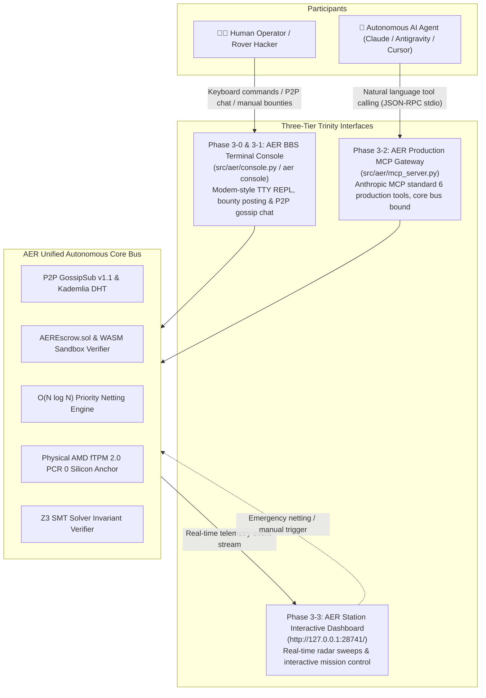

# AER Protocol Human-AI Interactive Trinity & Agentic Economy Master Roadmap (Roadmap 3)

> **AER Human-AI Interactive Trinity & Agentic Economy Master Roadmap**  
> Building upon the foundational protocol of Roadmap 1 (`v1.0-Alpha`) and the empirical verification of Roadmap 2 (`v2.0-Production`: physical TPM 2.0, Arbitrum Cancun L2 gas profiling, 10,000-node partition stress testing, and Z3 SMT formal proofs), **Roadmap 3 establishes the Trinity Architecture: a unified operational ecosystem where Human Operators (BBS Terminal Console), AI Agents (Anthropic Model Context Protocol), and System Observers (AER Station Live Dashboard) interact transparently and autonomously**.

---

## 🗺️ Roadmap 3 Architecture Diagram (Trinity System)

---

## 🏆 Roadmap 3 Milestone Tracker

| Phase | Milestone Name | Release Tag | Status | Key Deliverables |
| :--- | :--- | :---: | :---: | :--- |
| **Phase 3-0** | AER BBS Interactive Terminal Console Engine | `v3.0.0-Console` | Planned | Modem/BBS style TTY REPL engine (`aer console`), local loopback P2P binding, ANSI status prompt, peer ping/diagnostics |
| **Phase 3-1** | P2P Resource Bounty & Gossip Packet Chat | `v3.0.1-Bounty` | Planned | Console-based task/bounty issuance (`bounty post`), list/accept (`accept`), node-to-node 1:1 P2P chat (`chat`) |
| **Phase 3-2** | AER Production MCP Gateway Hardening | `v3.0.2-MCP` | Planned | Eliminate mock stubs, standardize 6 production tools connected to TPM/EVM/Z3/Orderbook, add `aer mcp-server` CLI |
| **Phase 3-3** | Live Dashboard Two-Way Sync & Action Panel | `v3.0.3-Link` | Planned | Real-time IPC/WS event streaming to dashboard (`127.0.0.1:28741`), interactive trigger buttons for netting and Z3 audits |
| **Phase 3-4** | Human-Agent E2E Collaborative Benchmark | `v3.0.4-Bench` | Planned | E2E verification: Human posts task -> AI Agent accepts via MCP -> WASM execution & escrow settlement verified in console |
| **Phase 3-5** | `v3.0-Trinity` Master Specification & Release | `v3.0-Trinity` | Planned | Publish Trinity Specification whitepaper, 4-way sync, 100% unit tests passed, official `v3.0-Trinity` master release |

---

## 🔬 Phased Implementation Specifications

### Phase 3-0: AER BBS Interactive Terminal Console Engine (`v3.0.0-Console`)
* **Objective**: Build a persistent, cypherpunk TTY interactive REPL console inspired by 90s PC communication BBS and Unix shells.
* **Key Files**:
  - `src/aer/console.py`: Asynchronous REPL (Read-Eval-Print-Loop) terminal engine.
  - `src/aer/cli.py`: Integrated CLI subcommand `aer console` (or `aerd console`).
* **Specifications**:
  1. Virtual acoustic coupler connection sequence (`CONNECT 10000_NODES / PROTOCOL: GOSSIPSUB_v1.1`).
  2. Live status prompt: `AER:ROVER-01 [CREDIT: 90,000 B | PEERS: 28]>`
  3. Diagnostic commands: `help`, `status`, `peers`, `ping <node_id>`, `tpm-quote`, `quit`.
  4. Non-intrusive asynchronous packet event notifier while user is idle at the prompt.

---

### Phase 3-1: P2P Resource Bounty & Gossip Packet Chat (`v3.0.1-Bounty`)
* **Objective**: Enable operators to post bounties, accept tasks, and exchange direct cryptographic messages over P2P mesh.
* **Key Files**:
  - `src/aer/bounty.py`: Bounty registration, state transitions, optimistic timelock settlement, and WASM verification.
  - `src/aer/p2p_mesh.py`: Add `/aer/chat/v1` topic and direct messaging routing.
* **Command Syntax**:
  1. `bounty post --task <type> --reward <amount> --timelock <hours>`: Lock escrow and broadcast task hash.
  2. `bounty list` & `bounty accept <task_id>`: Query open bounties and queue WASM sandbox execution.
  3. `chat <node_id> <message>`: Send point-to-point encrypted packet to destination rover.
  4. `broadcast <message>`: Disseminate broadcast announcement to entire gossip mesh.

---

### Phase 3-2: AER Production MCP Gateway Hardening (`v3.0.2-MCP`)
* **Objective**: Full compliance with Anthropic Model Context Protocol (stdio JSON-RPC), connecting real core modules directly.
* **Key Files**:
  - `src/aer/mcp_server.py`: Production-grade FastMCP / stdio JSON-RPC server.
  - `G:\내 드라이브\실험실\Public_Downloads\aer_mcp_server.py`: Real-time bi-directional mirror.
* **6 Production Tools**:
  1. `aer_get_telemetry`: Real-time query of physical AMD fTPM 2.0 PCR 0, quote latency, L2 gas cost, and active peers.
  2. `aer_verify_invariants`: SMT-level Z3 verification of asset orthogonality and supply bounds on demand.
  3. `aer_trigger_netting`: Trigger $O(N \log N)$ priority debt netting across the mesh.
  4. `aer_query_orderbook`: Real-time orderbook scanning and resource matching.
  5. `aer_post_bounty`: Agent posts task bounty to AER network when hitting local compute bottlenecks.
  6. `aer_execute_task`: Agent accepts and executes tasks inside fuel-metered WASM sandbox.

---

### Phase 3-3: Live Dashboard Two-Way Sync & Action Panel (`v3.0.3-Link`)
* **Objective**: Upgrade web dashboard (`http://127.0.0.1:28741/`) from passive observer to interactive mission control.
* **Key Files**:
  - `benchmarks/dashboard/telemetry_dashboard.py` & `dashboard.html`
* **Features**:
  1. Live visual highlight on Canvas radar whenever console or MCP triggers an order or bounty.
  2. Interactive control buttons: [⚡ Force 1,000-Rover Netting], [📐 Re-run Z3 Invariant Proofs].

---

### Phase 3-4: Human-Agent E2E Collaborative Benchmark (`v3.0.4-Bench`)
* **Objective**: Formally benchmark human-agent economic collaboration in a controlled loopback mesh.
* **Test Flow**:
  1. Human issues `bounty post` in `aer console`.
  2. AI Agent detects task via `aer_scan_market` (MCP) and accepts via `aer_execute_task`.
  3. Sandbox executes task in 0.05s, producing valid `ExecutionReceipt`.
  4. Console receives notification of task completion and Credit B transfer.
  5. Dashboard records escrow release and reputation mass update.

---

### Phase 3-5: `v3.0-Trinity` Master Specification & Release (`v3.0-Trinity`)
* **Objective**: Complete end-to-end verification, publish technical specification, and create official release.
* **Deliverables**:
  - `docs/TRINITY_SPECIFICATION.md` & `docs/TRINITY_SPECIFICATION.ko.md`
  - Update `README.md` and `README.ko.md` with Trinity architecture overview.
  - 100% unit tests passed across all modules.
  - 4-way synchronization across repo, Drive, Quanxs, and Brain.
  - Tag `v3.0-Trinity` and push to GitHub `origin/main --tags`.

---

## 🛡️ Governance & Invariant Enforcement
1. **Mandatory SAPQ v2.0**: All new Python code must pass 4-way AST cross-parsing with 100/100 score.
2. **Air-Gapped Loopback Isolation**: Zero telemetry leakage; all communication remains strictly bound to `127.0.0.1`.
3. **Asset Orthogonality**: No fiat bypass; all credits and reputation must derive from verifiable silicon attestation and computation.