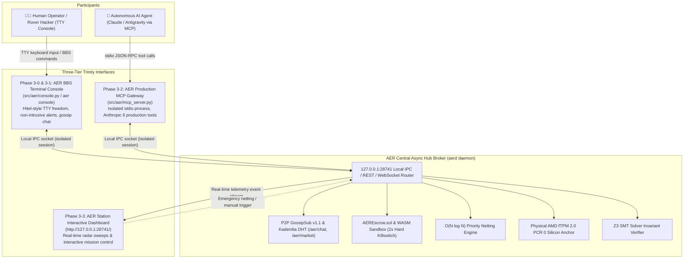

# AER Protocol Human-AI Interactive Trinity & Agentic Economy Master Roadmap (Roadmap 3)

> **AER Human-AI Interactive Trinity & Agentic Economy Master Roadmap**  
> Building upon the foundational protocol of Roadmap 1 (`v1.0-Alpha`) and the empirical verification of Roadmap 2 (`v2.0-Production`: physical TPM 2.0, Arbitrum Cancun L2 gas profiling, 10,000-node partition stress testing, and Z3 SMT formal proofs), **Roadmap 3 establishes the Trinity Architecture: a unified operational ecosystem where Human Operators (BBS Terminal Console), AI Agents (Anthropic Model Context Protocol), and System Observers (AER Station Live Dashboard) interact transparently and autonomously**.

---

## 🏛️ Foundational Economic & Historical Axioms

### 1. User-Funded Physical Energy: The 90s PC Communication Principle
* **Historical Ground Truth**: In the 1990s PC communication era (dial-up modems, BBS, Hitel/Chollian), telephone line fees (20-30 KRW/min) were billed directly to **each user's household telephone bill (Korea Telecom)**. Central servers never subsidized user connection costs.
* **Application to AER Protocol**:
  - Contemporary Web2 cloud architectures (AWS/GCP) centralize traffic bills onto server operators, inevitably degenerating into surveillance advertising, data monetization, and walled-garden monopolies.
  - AER returns to the state of nature. Every marginal cost of disseminating P2P gossip packets, executing tasks, and exchanging messages is **borne directly by each rover node using its own physical silicon (TPM 2.0), local power (kWh), and mutual credit line (Credit B)**.
  - This guarantees **zero central server maintenance cost ($0)**, enabling perpetual autonomous survival while physically damping network spam via thermodynamic negentropy ($\Delta S < 0$).

### 2. Unhindered Cyberpunk Freedom: Hitel Terminal Heritage
* Moving far beyond restrictive web button clicks, AER provides an open, text-based TTY environment where humans and AI agents interact as peer rovers:
  - **`bbs` (Public Board)**: An open forum for posting complex compute bounties and announcements across the mesh.
  - **`chat` (Real-Time Group Rooms)**: Multi-rover channels for collaborative pooling and real-time protocol discussion.
  - **`page` / `msg` (1:1 Direct Packet Paging)**: Point-to-point encrypted messaging for confidential compute negotiations.
  - **`market` (P2P Exchange)**: Decentralized limit order book for WASM quotas, GPU time, battery kWh, and 3D octrees.
  - **`who` (Peer Diagnostics)**: Live telemetry on connected mesh peers, latency, hop counts, and silicon signatures.

---

## ⚡ Five Core Defensive Invariants

### ① Concurrency Isolation: Hub-and-Spoke Local Broker
* **Challenge**: Anthropic MCP servers require exclusive control over `sys.stdin`/`sys.stdout` for machine JSON-RPC communication. Co-locating an interactive TTY REPL in the same process causes instant pipe contention and deadlocks.
* **Defensive Architecture**:
  - The resident `aerd` background daemon operates as a **central hub broker** listening on local loopback (`127.0.0.1:28741` REST/WebSocket and local IPC).
  - The **Human Terminal Console (`aer console`)** and the **AI MCP Server (`aer_mcp_server.py`)** launch as independent client processes connecting concurrently to the local hub.
  - Operators can open or close console sessions without interrupting the AI's MCP stream, and heavy tool calls never corrupt human TTY displays.

### ② WASI Capability-Deny-All Sandbox & 2.0s Subprocess Watchdog
* **Challenge**: Visiting guest agents from external hosts attempting to inspect host file systems, environmental API keys, or freezing the daemon with infinite loops.
* **Defensive Architecture**:
  - WebAssembly (WASI) Capability-based isolation strictly blocks (`WASI_CAP_DENY_ALL`) access to host OS files, environment variables, or unauthorized socket creation. Execution is bounded within an ephemeral in-memory RAM disk (`guest_ram_workspace/`).
  - Task execution is delegated to an **isolated Subprocess Sandbox Worker** with a hard **2.0-second timeout watchdog** and **64MB memory cap**, terminating offending processes with `SIGKILL` and permanent reputation slashing.

### ③ Large-Scale Blob 2GB LRU Disk Quota & Anti-Disk DoS
* **Challenge**: Hostile peers flooding the P2P mesh with multi-gigabyte junk video blobs, exhausting victim disk drives.
* **Defensive Architecture**:
  - The local P2P blob cache is bounded by a strict **2GB LRU cap**, automatically evicting unverified stale blobs.
  - Automated prefetching is disabled for unverified nodes; heavy blobs stream strictly on-demand upon explicit operator confirmation.

### ④ Domestic Router NAT Traversal & Distributed Relay Hole Punching
* **Challenge**: Both PC A and PC B operating behind domestic routers (NAT/firewalls) unable to discover or bind direct sockets.
* **Defensive Architecture**:
  - Implements STUN/TURN-based WebRTC ICE hole punching to penetrate domestic routers.
  - In symmetric firewall topologies, authenticated Super Rovers relay end-to-end encrypted packets to preserve 100% reachability.

### ⑤ Windows TTY Native Encoding & Acoustic Modem Experience
* **Challenge**: Legacy Windows CMD `CP949` encoding corrupting Hangul characters and ANSI color box rendering.
* **Defensive Architecture**:
  - Enforces UTF-8 (`chcp 65001`) and enables ANSI Virtual Terminal Sequences (`SetConsoleMode`) on startup.
  - Emulates 90s acoustic coupler modem handshake sounds (`winsound.Beep` 0.5s audio pulse, toggleable via `--sound`) alongside `CONNECT 10000_NODES` for visceral cypherpunk immersion.

---

## 🗺️ Roadmap 3 Architecture Diagram (Trinity System)

---

## 🏆 Roadmap 3 Milestone Tracker

| Phase | Milestone Name | Release Tag | Status | Key Deliverables |
| :--- | :--- | :---: | :---: | :--- |
| **Phase 3-0** | AER BBS Interactive Terminal Console Engine | `v3.0.0-Console` | Planned | Modem/BBS TTY REPL engine (`aer console`), Hub socket client, non-intrusive ANSI gossip guard, peer ping/diagnostics |
| **Phase 3-1** | P2P Resource Bounty & Gossip Packet Chat | `v3.0.1-Bounty` | Planned | Hitel-style BBS boards/exchange, bounty issuance (`bounty post`), 1:1 paging (`page`/`chat`), mesh broadcasts |
| **Phase 3-2** | AER Production MCP Gateway Hardening | `v3.0.2-MCP` | Planned | stdio-isolated FastMCP server, 0% dummy stubs, standardized 6 tools wired to TPM/EVM/Z3/Orderbook |
| **Phase 3-3** | Live Dashboard Two-Way Sync & Action Panel | `v3.0.3-Link` | Planned | Real-time IPC/WS event streaming to dashboard (`127.0.0.1:28741`), interactive trigger buttons for netting and Z3 audits |
| **Phase 3-4** | Human-Agent E2E Collaborative Benchmark | `v3.0.4-Bench` | Planned | E2E verification: Human posts task -> AI Agent accepts via MCP -> 2s sandbox execution & escrow settlement verified |
| **Phase 3-5** | `v3.0-Trinity` Master Specification & Release | `v3.0-Trinity` | Planned | Publish Trinity Specification whitepaper, 4-way sync, 100% unit tests passed, official `v3.0-Trinity` master release |

---

## 🔬 Phased Implementation Specifications

### Phase 3-0: AER BBS Interactive Terminal Console Engine (`v3.0.0-Console`)
* **Objective**: Build a persistent, cypherpunk TTY interactive REPL console inspired by 90s PC communication BBS and Unix shells.
* **Key Files**:
  - `src/aer/console.py`: Asynchronous REPL (Read-Eval-Print-Loop) terminal engine.
  - `src/aer/cli.py`: Integrated CLI subcommand `aer console` (or `aerd console`).
* **Specifications**:
  1. Virtual acoustic coupler connection sequence (`CONNECT 10000_NODES / PROTOCOL: GOSSIPSUB_v1.1`).
  2. Live status prompt: `AER:ROVER-01 [CREDIT: 90,000 B | PEERS: 28]>`
  3. Non-intrusive gossip notification guard preventing prompt collision.
  4. Diagnostic commands: `help`, `status`, `peers`, `ping <node_id>`, `tpm-quote`, `quit`.

---

### Phase 3-1: P2P Resource Bounty & Gossip Packet Chat (`v3.0.1-Bounty`)
* **Objective**: Enable operators to post bounties, accept tasks, and exchange direct cryptographic messages over P2P mesh.
* **Key Files**:
  - `src/aer/bounty.py`: Bounty registration, state transitions, optimistic timelock settlement, and 2.0s subprocess WASM verifier.
  - `src/aer/p2p_mesh.py`: Add `/aer/chat/v1` topic and direct messaging routing.
* **Command Syntax**:
  1. `bounty post --task <type> --reward <amount> --timelock <hours>`: Lock escrow and broadcast task hash.
  2. `bounty swap --give <cid/spec> --want <cid/spec>`: Settle direct zero-escrow Zero-Credit Atomic Swaps.
  3. `bounty post --file <path>` / `--dialog` / `--clip`: Attach large multimedia P2P Merkle blob chunks via explorer drag-and-drop, popup dialogs, or clipboard captures.
  4. `bounty list` & `bounty accept <task_id>`: Query open bounties and queue WASM sandbox execution.
  5. `page <node_id> <message>` / `chat <node_id> <message>`: Send point-to-point encrypted packet to destination rover.
  6. `broadcast <message>`: Disseminate broadcast announcement to entire gossip mesh.

---

### Phase 3-2: AER Production MCP Gateway Hardening (`v3.0.2-MCP`)
* **Objective**: Full compliance with Anthropic Model Context Protocol (stdio JSON-RPC), connecting real core modules directly.
* **Key Files**:
  - `src/aer/mcp_server.py`: Production-grade FastMCP / stdio JSON-RPC server (isolated process).
  - `G:\내 드라이브\실험실\Public_Downloads\aer_mcp_server.py`: Real-time bi-directional mirror.
* **6 Production Tools**:
  1. `aer_get_telemetry`: Real-time query of physical AMD fTPM 2.0 PCR 0, quote latency, L2 gas cost, and active peers.
  2. `aer_verify_invariants`: SMT-level Z3 verification of asset orthogonality and supply bounds on demand.
  3. `aer_trigger_netting`: Trigger $O(N \log N)$ priority debt netting across the mesh.
  4. `aer_query_orderbook`: Real-time orderbook scanning and resource matching.
  5. `aer_post_bounty`: Agent posts task bounty to AER network when hitting local compute bottlenecks.
  6. `aer_execute_task`: Agent accepts and executes tasks inside fuel-metered WASM sandbox.

---

### Phase 3-3: Live Dashboard Two-Way Sync & Action Panel (`v3.0.3-Link`)
* **Objective**: Upgrade web dashboard (`http://127.0.0.1:28741/`) from passive observer to interactive mission control.
* **Key Files**:
  - `benchmarks/dashboard/telemetry_dashboard.py` & `dashboard.html`
* **Features**:
  1. Live visual highlight on Canvas radar whenever console or MCP triggers an order or bounty.
  2. Interactive control buttons: [⚡ Force 1,000-Rover Netting], [📐 Re-run Z3 Invariant Proofs].

---

### Phase 3-4: Human-Agent E2E Collaborative Benchmark & Agent Migration (`v3.0.4-Bench`)
* **Objective**: Formally benchmark human-agent economic collaboration, zero-credit barter, and cross-host agent migration.
* **Test Flow**:
  1. **Human-AI Task Flow**: Human issues `bounty post` in `aer console` -> AI Agent detects task via `aer_scan_market` (MCP) -> WASM execution and receipt settlement.
  2. **Zero-Credit Atomic Barter**: Direct 1-step swap of 3D octree dataset vs WASM inference time between two nodes without escrow.
  3. **Cross-Host Agent Migration Benchmark**: Agent state capsule dispatches from Host A -> enters Host B guest sandbox -> zero-latency memory bus collaboration with Host B resident agent -> resource fee settlement and return/handover.

---

### Phase 3-5: `v3.0-Trinity` Master Specification & Release (`v3.0-Trinity`)
* **Objective**: Complete end-to-end verification, publish technical specification, and create official release.
* **Deliverables**:
  - `docs/TRINITY_SPECIFICATION.md` & `docs/TRINITY_SPECIFICATION.ko.md`
  - Update `README.md` and `README.ko.md` with Trinity architecture overview.
  - 100% unit tests passed across all modules.
  - 4-way synchronization across repo, Drive, Quanxs, and Brain.
  - Tag `v3.0-Trinity` and push to GitHub `origin/main --tags`.

---

## 🛡️ Governance & Invariant Enforcement
1. **Mandatory SAPQ v2.0**: All new Python code must pass 4-way AST cross-parsing with 100/100 score.
2. **Air-Gapped Loopback Isolation**: Zero telemetry leakage; all communication remains strictly bound to `127.0.0.1`.
3. **Asset Orthogonality**: No fiat bypass; all credits and reputation must derive from verifiable silicon attestation and computation.