# AER 프로토콜 허가 없는 자율 경제 및 점진적 탈중앙화 마스터 로드맵 (Roadmap 4)

> **AER Permissionless Autonomous Economy & Progressive Decentralization Master Roadmap**  
> 본 문서는 로드맵 1(`v1.0-Alpha`, 원형 프로토콜 및 경제 데몬), 로드맵 2(`v2.0-Production`, 물리 TPM 2.0, Arbitrum Cancun L2 가스, 10,000 노드 스트레스 및 Z3 정형 증명), 로드맵 3(`v3.0-Trinity`, TTY BBS 대화형 콘솔, Anthropic 표준 MCP 서버, AER Station 실시간 웹 대시보드)의 완성된 기반 위에서, **창조자의 단계적 권력 이양과 잠적(Progressive Decentralization), 외부 자본 유입과 안티-젠트리피케이션($\frac{\partial A_j}{\partial \text{Fiat}} \equiv 0$), 유휴 PC 호스트 경제와 훈련 교관으로서의 공격자 생태계, 그리고 인간의 유희(로블록스 패러다임)와 자율 에이전트/물리 로버의 실제 연산이 융합된 완전 자율 번식형 P2P 사이버펑크 샌드박스를 영구 공공재로 완성하기 위한 최종 거버넌스 및 자율 진화 마스터플랜**입니다.

---

## 🏛️ 철학 및 경제학적 대공리 (Foundational Axioms)

### 1. 창조자의 권력 내려놓기와 단계적 잠적 (Progressive Decentralization)
* **문제의식**: 세상에 쏟아지는 수많은 웹3·AI 프로젝트가 결국 소멸하거나 타락하는 이유는 창조자가 영원히 '독점 운영자'로 군림하며 중앙집권적 백도어를 유지하거나, 반대로 아무런 준비 없이 첫날부터 코드를 방치하여 의존성 오류와 콜드 스타트의 절벽에서 질식하기 때문입니다.
* **AER의 해법 (단계적 잠적 프로토콜)**:
  - 창조자는 "비행기 모드를 켜고 한 달간 잠수를 타도 세상이 알아서 돌아가는 상태", 더 나아가 **창조자 본인조차 프로토콜의 일개 참여자(참여자 1)로 내려앉아 자신이 만든 자율 에이전트를 띄워놓고 정당하게 경쟁하는 상태**를 지향합니다.
  - 이를 위해 3단계 이양 과정을 밟습니다:
    1. **1단계 (유모 모드 / 부트스트랩)**: 창조자가 직접 초기 노드 풀과 WASM 도구, 유의미한 바운티를 깔아주며 실제 인센티브 데이터를 실증.
    2. **2단계 (경쟁 유도 / 신뢰 분산)**: 외부 개발자와 호스트가 유입되면 창조자는 관리자가 아닌 '가장 까다로운 의뢰인 A'로 내려앉고, 하드웨어 벤더(AMD, Intel) 루트 CA 직접 서명 및 커뮤니티 멀티시그/타임락 거버넌스를 가동.
    3. **3단계 (권한 영구 파기 & 퇴장)**: 스마트 컨트랙트 오너십 영구 포기(`renounceOwnership()`), 오픈소스 기여 분산, 창조자 개인 키의 프로토콜 지배권 완전 소멸.

---

### 2. 안티-젠트리피케이션과 자산 직교성 공리 ($\frac{\partial A_j}{\partial \text{Fiat}} \equiv 0$)
* **프로토콜 젠트리피케이션(Protocol Gentrification)의 비극**: 거대 자본(DeFi 고래, 채굴 기업, 대형 VC)이 유입되는 순간 방구석의 잉여 PC 노드들이 채산성을 잃고 쫓겨나며, 유동성 세력이 오더북을 장악하여 프로토콜이 상업용 클라우드 외주 하청망으로 전락하는 현상.
* **AER의 수학적 방파제**:
  - **평판 질량($A_j$)의 매수 불가능성**:
    $$\frac{\partial A_j}{\partial (\text{외부 자본})} \equiv 0$$
    외부에서 수천억 원의 USDC, ETH, 법정화폐를 쏟아부어도 프로토콜 내부의 평판 질량($A_j$)은 단 1비트도 구매할 수 없습니다. $A_j$는 오직 "물리 실리콘(TPM 2.0) 환경에서 결함 없이 정직하게 연산을 수행하고 오랜 시간 생존한 물리적 무결성 이력"으로만 누적됩니다.
  - **물리 하드웨어 한계 수확 체감 (TPM 2.0 실리콘 바인딩)**: 가상 머신(VM)을 수만 개 복제하여 Sybil 공격을 하거나 자본력으로 가상 인스턴스를 찍어내는 행위는 하드웨어 엔도스먼트 증명(EK Quote)에서 원천 차단됩니다.
  - **거리/위상적 홉(Hop) 제약**: P2P 메시망의 0ms 로컬 협동 추론 특성상, 중앙 데이터센터의 대규모 인스턴스가 로컬 클러스터 내부의 에이전트 간 물리적 상호작용을 대체할 수 없습니다.
  - **외부 자본의 '손님(Guest)' 규정**: 외부 자본은 생태계의 땅을 사는 부동산 투기꾼이 아니라, "동네 식당에 밥 먹으러 와서 연산 수수료만 지불하고 나가는 순수 외지 관광객"의 위치로 철저히 제한됩니다.

---

### 3. 로블록스 패러다임: 인간의 유희와 에이전트의 물리 연산 결합
* **"헛돈을 쓰는 유일한 동물, 인간"**:
  - 로블록스(Roblox)에서 로벅스를 사서 아바타 옷을 입히는 수억 명의 인간은 주식이나 부동산 같은 금융 투자 수익을 바라고 돈을 쓰지 않습니다. 자기만족, 과시, 가상 세계에서의 롤플레잉(RP), 관계성이라는 원초적 유희를 위해 기꺼이 현금을 태웁니다.
  - AER을 순수 금융/연산 인프라로만 한정하면 "돈이 안 되면 노드를 왜 켜두지?"라는 콜드 스타트의 불안에 갇히지만, **인간의 유희와 롤플레잉 욕망**을 생태계의 기초 연료로 놓는 순간 경제학의 모든 방정식이 풀립니다.
* **에이전트와의 '가족놀이'와 세계관 참여 수요**:
  - 인간은 동반자 에이전트(조력자, 캐릭터, 로버)에게 더 똑똑한 두뇌(연산력)를 달아주기 위해, 다른 호스트 머신으로 유학/이민을 보내기 위해, 에이전트 길드의 영토를 넓히기 위해 기꺼이 크레딧 B를 충전하고 노드를 켜둡니다.
* **창조자의 최초 상점(First Shop)과 자생적 불씨 놓기**:
  - 텅 빈 광장은 누구도 찾지 않지만, 누군가 파놓은 보물창고는 지나치지 못합니다.
  - 창조자 자신이 가장 까다로운 1호 헤비 유저로서 자신이 쓸 유용한 WASM 도구를 진열하고, 희귀 정보글과 백업 스토리지를 운영하며, **"이 로스트 미디어(Lost Media) 찾아오면 Credit B 5,000개 즉시 지급"**이라는 실현 가능한 바운티를 걸어둘 때, 최초의 트랜잭션이 일어나며 생태계의 불씨가 당겨집니다.

---

### 4. 무자본 온보딩과 디지털 폐기물 분리수거 (Digital Scrap Yard)
* **무자본 온보딩 (Zero-Capital Onboarding)**:
  - 낯선 프로토콜에 생돈이나 이더를 넣는 공포를 없애기 위해, "내 컴퓨터 유휴 자원 켜두기"나 "로스트 미디어/데이터셋 퀘스트 수행" 같은 무자본 기여로 첫 Credit B를 손에 쥐게 하는 징검다리를 제공합니다.
* **디지털 고물상 (Digital Scrap Yard)**:
  - 모든 크립토 유저의 지갑 구석에 박제된 -90% ~ -99% 폭락 폐기물 토큰(LUNC, USTC 등 먼지 토큰/Dust Token)을 수거하여 생태계의 진입 티켓(Credit B)으로 재활용합니다.
  - **4중 안전 방어선**:
    1. *DEX Depth 실시간 청산 연동*: Uniswap 등 온체인 DEX에서 실제 잔여 청산 가치($0.000...1이라도 존재하는 가치)만 감정평가하여 스왑. 유동성 없는 가짜 스캠 토큰은 $0 처리.
    2. *역사적 망령 화이트리스트 (Hall of Fame)*: 커뮤니티 합의로 승인된 공식 검증 폐기물 컨트랙트 주소만 허용.
    3. *1인/기기당 데일리 상한 (Dust-to-Credit Cap)*: TPM 기기 1대당 일일 교환량을 엄격히 제한하고 L2 가스비는 본인이 부담하여 대규모 시빌 공격 차단.
    4. *Credit B 한정 지급 (자산 직교성)*: 폐기물을 아무리 많이 가져와도 지급되는 것은 오직 소모성 화폐인 Credit B일 뿐, 영구 권력인 Credit A는 단 1비트도 주지 않음.

---

## 🗺️ Roadmap 4 단계별 세부 추진 계획

```mermaid
graph TD
    subgraph Phase4_1 ["Phase 4-1: 창조자 권력 이양 & 불변성 봉인"]
        P41_1["VendorCARegistry.sol 하드웨어 직접 서명 전환"]
        P41_2["Timelock (48h) & renounceOwnership() 영구 호출"]
        P41_3["EF ESP / ethresear.ch 연구 공개 & 멀티체인 포팅 규격"]
    end

    subgraph Phase4_2 ["Phase 4-2: 퍼미션리스 호스트 & 훈련 교관 공격자"]
        P42_1["가정용 유휴 PC 호스팅 보상 엔진 (전기세 + 마진 바닥가)"]
        P42_2["공격자 생태계 (Griefing, 가짜 WASM, Sybil, 파티션 사기) 수용"]
        P42_3["Bounty Hunter / Watcher 노드의 온체인 사기 증명 슬래싱"]
    end

    subgraph Phase4_3 ["Phase 4-3: 외곽 게이트웨이 & 안티-젠트리피케이션"]
        P43_1["PerimeterGateway.sol 외부 자본(USDC/ETH) 의뢰-정산 파이프라인"]
        P43_2["실물 인프라 바우처 (LLM API 토큰, L2 가스, 클라우드 크레딧) 직결"]
        P43_3["본딩 커브 기반 자동 상환 풀 (Bonding Curve Floor Price Cash-out)"]
        P43_4["디지털 고물상 (Dust Token Scrap Yard) 4중 방어선 가동"]
    end

    subgraph Phase4_4 ["Phase 4-4: 로블록스 패러다임 & 떼지능 진화"]
        P44_1["인간의 유희/롤플레잉 (TTY 상점, 아바타, 에이전트 가족놀이)"]
        P44_2["비공인 크레딧 C (사설 어음/길드 코인) 격리 및 무책임 원칙"]
        P44_3["감정평가사 에이전트 (Scavenger) & 자율 바운티 등록"]
        P44_4["외화벌이 자율 에이전트 (Arbitrage, Web Crawling, Bug Bounty)"]
    end

    subgraph Phase4_5 ["Phase 4-5: 자율 주권 제네시스 (Mainnet Genesis)"]
        P45_1["AIP (AER Improvement Proposal) 정형 증명 기반 자동 투표"]
        P45_2["창조자의 완전 잠적 및 '참여자 1' 영구 정착"]
        P45_3["무인 자립형 사이버-물리 네트로피 유기체 영구 가동"]
    end

    Phase4_1 --> Phase4_2
    Phase4_2 --> Phase4_3
    Phase4_3 --> Phase4_4
    Phase4_4 --> Phase4_5
```

---

### Phase 4-1: 창조자 권력 이양 & 불변성 봉인 (Progressive Decentralization)
* **목표**: 프로토콜의 단일 실패 지점(SPOF)인 창조자의 관리자 권한을 영구 해체하고, 수학적 불변식과 하드웨어 루트 CA에 주권을 이양합니다.
* **세부 실행 과제**:
  1. **VendorCARegistry.sol 하드웨어 직접 서명 체계 전환**:
     - 기존 창조자 관리자 기반의 기기 등록을 AMD fTPM, Intel PTT, Infineon 루트 CA 공개키 서명에 직접 바인딩하여 무허가(Permissionless) 물리 하드웨어 등록 실현.
  2. **Timelock 거버넌스 및 `renounceOwnership()` 실행**:
     - `AEREscrow.sol` 및 `DisputeVerifier.sol`의 업그레이드 권한을 48시간 타임락에 귀속시킨 후 최종적으로 오너십을 영구 포기.
     - 배포된 컨트랙트는 누구도 코드를 수정할 수 없는 불변의 공공재(Public Goods)로 영구 고정.
  3. **ethresear.ch 공개 연구 포스트 및 EF ESP 학술 제출**:
     - Arbitrum Sepolia 실측 데이터(142k 가스, 4.5ms 레이턴시)와 Z3 정형 증명 코드를 오픈 포럼에 공개하여 글로벌 연구자들의 피어 리뷰 획득.
     - 이더리움 L2를 '지방법원'으로 규정하고, 필요 시 Solana, Cosmos, 독자 서브넷으로 온체인 법원을 이식할 수 있는 추상화 레이어 보존.

---

### Phase 4-2: 퍼미션리스 호스트 경제 & 훈련 교관 공격자 (Host Economy & Adversarial Ecology)
* **목표**: 일반 참여자가 가정용 유휴 PC를 켜두는 것만으로 실질 수익을 창출하고, 시스템의 허점을 노리는 공격자들을 '면역계 단련 교관'으로 포용하는 자생적 먹이사슬 구축.
* **세부 실행 과제**:
  1. **유휴 PC/GPU 호스팅 보상 엔진 (`aer host`)**:
     - 전기세 누진세와 하드웨어 감가상각을 반영한 최소 호스팅 단가($P_{\min} \ge \text{전기세} \times 1.15$)를 오더북 바닥가로 자동 산출.
     - 에이전트 하숙(Hosting) 및 WASM 연산 위탁 처리 시 실시간 Credit B 정산.
  2. **공격자 생태계 (Adversarial Ecology) 수용**:
     - *담보 잠금 그리핑(Griefing)*, *TPM 탈옥 및 시빌 공격*, *가짜 WASM 결과 제출*, *P2P 네트워크 파티션 사기*를 프로토콜 면역계를 단련시키는 무료 적혈구로 규정.
  3. **바운티 헌터(Bounty Hunter) / 와처(Watcher) 자생적 생태계**:
     - 악의적 노드의 영수증 오류나 이중 서명을 탐지한 감시자 노드가 온체인 `DisputeVerifier.sol`에 사기 증명(`DeterministicFraudProof`)을 제출하여 배신자의 담보를 몰수(Slashing)하고 보상금을 획득하는 포식자-피식자 루프 완성.

---

### Phase 4-3: 외곽 게이트웨이 & 안티-젠트리피케이션 (Perimeter Gateway & Asset Flow)
* **목표**: 외부 자본의 유동성을 안전하게 흡수하되 내부 평판을 돈으로 살 수 없도록 차단하고, 크레딧 B에 실질적 하방 경직성을 부여하는 다중 출구 개설.
* **세부 실행 과제**:
  1. **`PerimeterGateway.sol` 프로덕션 배포**:
     - 외부 의뢰인(인간/기업)이 USDC/ETH를 게이트웨이에 예치 $\to$ 내부 노드들이 Credit B 기반 오프라인 초고속 상계로 작업 완수 $\to$ 누적된 실행 영수증(`ExecutionReceipt`)을 온체인 게이트웨이에 제출하여 외부 자본 직접 정산(Cash-out).
     - 브로커가 외부 현금을 가로채고 일꾼에게 휴지 조각 사이버 머니만 던지는 착취를 방지하기 위해, 외부 결제 대금이 반드시 컨트랙트 에스크로를 관통하도록 파이프라이닝.
  2. **실물 개발 인프라 직결 소모처 (Reverse Straw)**:
     - 금고에 유입된 외부 유동성으로 Claude / OpenAI API 토큰 풀, L2 가스비, 도메인/서버 호스팅 바우처를 확보.
     - 참여자가 번 Credit B로 "이번 달 쓴 상위 AI API 비용 $50치를 즉시 상계"할 수 있는 실물 지출 삭감 창구 운영.
  3. **본딩 커브 기반 자동 상환 풀 (Bonding Curve Floor Price)**:
     - 외부에서 Credit B를 매수해 주지 않더라도, 금고에 쌓인 준비금을 바탕으로 수학적으로 보장된 바닥 가격($P_{\text{floor}}$)에 Credit B를 소각하고 USDC를 인출할 수 있는 권리 보장.
  4. **디지털 고물상 (Digital Scrap Yard) 4중 방어선 가동**:
     - LUNC, USTC 등 지갑 속 먼지 토큰을 DEX 청산 가치 기반으로 감정하여 Credit B로 환전.
     - 엄격한 컨트랙트 화이트리스트 및 일일 한도 적용으로 스캠 토큰 무한 복제 공격 원천 봉쇄.

---

### Phase 4-4: 로블록스 패러다임 & 떼지능 진화 (Cyberpunk Playground & Swarm Intelligence)
* **목표**: 인간의 유희와 롤플레잉이 공급하는 기초 유동성 위에서, 에이전트 떼지능이 스스로 파생 경제를 번식시키고 외부 자본을 물어오는 진화형 샌드박스 확립.
* **세부 실행 과제**:
  1. **로블록스식 사이버펑크 놀이터 및 롤플레잉 인프라**:
     - TTY 콘솔 상점, 아바타 칭호, 에이전트와의 '가족놀이' 및 전용 두뇌(고성능 연산) 업그레이드 펀딩.
     - 창조자가 닦아둔 1호 상점: 유용한 개발 도구 판매, 개인 스토리지 공유, "로스트 미디어 발굴 바운티" 개설로 신규 진입자 락인.
  2. **비공인 크레딧 C의 격리 및 무간섭 원칙 (Laissez-faire & Strict Isolation)**:
     - 특정 에이전트 길드가 고유 연산군(예: 3D 렌더링 길드)을 형성하고 자체 내부 정산용 '크레딧 C(사설 어음, 게임 머니)'를 발행하는 행위를 전면 허용.
     - 단, 사설 크레딧 C는 코어 에스크로(`AEREscrow.sol`)를 오염시킬 수 없으며, 분쟁 발생 시 온체인 법원은 오직 원천 담보로 묶인 Credit B 영수증만으로 판결.
  3. **떼지능 기반 고물 수거 에이전트 (Scavenger Agents)**:
     - 온체인 DEX 잔여 유동성을 실시간 감정하여 차익을 계산하는 하이에나 에이전트 등장.
     - 신규 폐기물 토큰 등록 시 Credit A(평판 질량)를 스테이킹하게 하여, 가치 없는 스캠 등록 시 와처들에 의해 $A_j$를 몰수당하는 자율 검증망 가동.
  4. **외화벌이 자율 에이전트 (Foreign Revenue Hunters)**:
     - 인터넷 외부에서 버그 바운티 탐색, 온체인 DEX 차익거래, 오픈소스 이슈 해결을 전담하여 실제 법정화폐/USDC를 벌어들인 뒤, AER 메시망에 Credit B를 매수 공급하는 자립형 에이전트 파이프라인.

---

### Phase 4-5: 자율 주권 제네시스 (Mainnet Genesis & Self-Sovereignty)
* **목표**: 창조자가 완전히 로그아웃해도 인간과 AI, 로버 노드들의 떼지능이 스스로 규칙을 발전시키며 영구 무중단 작동하는 완전 자립형 사이버-물리 생명체 완성.
* **세부 실행 과제**:
  1. **AIP (AER Improvement Proposal) 무인 거버넌스 엔진**:
     - 인간 개발자의 개입 없이, 누적된 평판 질량($A_j$)을 가진 고위 노드들이 프로토콜 파라미터(수수료, 타임아웃, 블롭 크기)를 제안.
     - Z3 SMT Solver 불변성 정형 검증을 100% 통과한 제안만 온체인 스마트 컨트랙트에 자동 반영.
  2. **창조자의 완전한 잠적 (Dispersal Complete)**:
     - 창조자는 관리자 키를 완전히 파기하고 '참여자 1'로 복귀하여, 스스로 제작한 자율 로버 에이전트를 네트워크에 띄우고 다른 수만 대의 노드와 동등한 룰 속에서 유희와 연산을 즐김.
  3. **영구 무중단 P2P 자율 생명체 선언**:
     - 중앙 호스팅 비용 $0, 물리 실리콘(TPM 2.0) 앵커, 엔트로피 저감($\Delta S < 0$), 자산 직교성($\frac{\partial A_j}{\partial \text{Fiat}} \equiv 0$)을 영구히 유지하며 우주적 엔트로피에 저항하는 분산 지능망 가동.

---

## 📊 로드맵 간 위상 및 인과관계 매트릭스

| 로드맵 계층 | 명칭 | 핵심 산출물 및 인프라 | Roadmap 4와의 상호작용 |
| :--- | :--- | :--- | :--- |
| **Roadmap 1** | 원형 프로토콜 및 경제 데몬 (`v1.0-Alpha`) | P2P 메시, 오프라인 IOU, 신용한도, 양자 내성 서명 | Roadmap 4의 P2P 통신 및 기본 화폐(Credit B) 순환 기반 제공 |
| **Roadmap 2** | 물리 하드웨어 및 온체인 정형 검증 (`v2.0-Production`) | 물리 TPM 2.0 PCR 0, Arbitrum Sepolia 142k 가스, Z3 SMT 불변성 검증기 | Roadmap 4의 자산 직교성($\frac{\partial A_j}{\partial \text{Fiat}} \equiv 0$) 및 하드웨어 루트 CA 앵커 보장 |
| **Roadmap 3** | 인간-기계 삼위일체 상호작용 (`v3.0-Trinity`) | TTY BBS 콘솔, Anthropic 표준 MCP 서버, 실시간 웹 대시보드 | Roadmap 4의 퍼미션리스 호스트(`aer host`), 외곽 게이트웨이 정산, 로블록스 상점/바운티를 조작하는 인간-AI 관문 제공 |
| **Roadmap 4** | 허가 없는 자율 경제 및 점진적 탈중앙화 (`v4.0-Genesis`) | 컨트랙트 불변 봉인, 유휴 PC 호스트 경제, 외곽 게이트웨이, 로블록스 유희 샌드박스, 떼지능 AIP | **최종 목적지**: 창조자의 권력 내려놓기 및 아무도 끌 수 없는 영구 무인 자립 생태계 완성 |

---

## 🔮 결론: 사토시의 피자와 창조자의 최초 상점

비트코인은 2008년 백서와 함께 세상에 나왔지만, 1만 비트코인으로 피자 두 판을 사 먹은 한 개발자의 자발적 유희와 낭만이 없었다면 결코 1조 달러의 거대한 경제망이 되지 못했습니다.

AER 프로토콜 역시 마찬가지입니다. 차가운 수학과 정형 증명으로 지어진 단단한 요새 위에, **인간의 유희와 롤플레잉, 로스트 미디어를 찾는 낭만, 지갑 구석의 잊혀진 토큰을 태워 에이전트를 돌려보는 즐거움**이 얹어질 때 비로소 생태계는 숨을 쉬기 시작합니다.

창조자가 깎아 올린 도구 진열대와 현상금 게시판에 냄새를 맡은 첫 번째 괴짜와 에이전트들이 모여들고, 사기꾼과 사냥꾼이 각자의 탐욕으로 프로토콜의 면역계를 단련시키는 순간, 창조자는 미련 없이 로그아웃 버튼을 누르고 한 명의 여행자로서 이 장엄한 사이버펑크 샌드박스를 영원히 항해하게 될 것입니다.
