# AER Protocol Permissionless Autonomous Economy & Progressive Decentralization Master Roadmap (Roadmap 4)

> **AER Permissionless Autonomous Economy & Progressive Decentralization Master Roadmap**  
> Built upon the verified foundations of Roadmap 1 (`v1.0-Alpha`: Core Protocol & Economic Daemon), Roadmap 2 (`v2.0-Production`: Physical TPM 2.0, Arbitrum Cancun L2 Gas Optimization, 10,000-Node Stress Testing & Z3 Formal Verification), and Roadmap 3 (`v3.0-Trinity`: TTY BBS Interactive Console, Anthropic Standard MCP Server, and AER Station Live Web Dashboard), this document specifies the **Final Governance and Autonomous Evolutionary Master Plan**. It formalizes the **Creator's Progressive Decentralization and Dispersal, Outer Capital Inflow and Anti-Gentrification ($\frac{\partial A_j}{\partial \text{Fiat}} \equiv 0$), Idle PC Host Economics, the Adversarial Ecosystem as Drill Sergeants, and the Cyberpunk Sandbox where Human Play (the Roblox Paradigm) synthesizes with Autonomous Agent / Physical Rover Computations into an Immortal Public Good**.

---

## 🏛️ Foundational Axioms & Philosophy

### 1. Progressive Decentralization & Sovereign Dispersal
* **Problem Statement**: The collapse or corruption of most Web3 and decentralized AI initiatives stems from two fatal extremes: either the creator remains an eternal, centralized operator with administrative backdoors, or the codebase is abandoned prematurely on Day 1 without maintenance, choking to death in dependency divergence and cold-start oblivion.
* **The AER Solution (Three-Stage Dispersal Protocol)**:
  - The creator's ultimate objective is a state where *"the protocol continues to thrive uninterrupted even if the creator enables airplane mode and disappears for months"*, evolving further until **the creator steps down to 'Participant 1', operating their own autonomous agent and competing fairly under the exact same immutable rules**.
  - This transitions through three deliberate phases:
    1. **Stage 1 (Nursemaid Mode / Bootstrap)**: The creator directly hosts the initial node pool, supplies practical WASM tools, and seeds meaningful bounties, empirically proving genuine economic incentives to external participants.
    2. **Stage 2 (Competitive Seeding / Trust Dispersal)**: As external developers and hosts arrive, the creator transitions from operator to 'Demanding Client A'. Root CA signatures bind directly to hardware vendors (AMD, Intel), while community multi-sig and timelock governance activate.
    3. **Stage 3 (Permanent Ownership Renunciation & Exit)**: Smart contract administrative rights are permanently renounced via `renounceOwnership()`, open-source contributions diversify across global guilds, and the creator's private keys retain zero structural privilege over the protocol.

---

### 2. Anti-Gentrification & The Asset Orthogonality Axiom ($\frac{\partial A_j}{\partial \text{Fiat}} \equiv 0$)
* **The Tragedy of Protocol Gentrification**: When massive external capital (DeFi whales, industrial mining conglomerates, venture capital) floods an ecosystem, local grassroots PC hosts are priced out, speculative liquidity manipulates the order book, and an open, resilient mesh degenerates into a commodified Web2 cloud subcontractor.
* **AER's Mathematical Defense Invariants**:
  - **Non-Purchasability of Reputational Mass ($A_j$)**:
    $$\frac{\partial A_j}{\partial (\text{External Capital})} \equiv 0$$
    Even if an external entity injects billions of USDC, ETH, or fiat currency, internal reputational mass ($A_j$) cannot be acquired by capital. $A_j$ accumulates exclusively through "physical silicon (TPM 2.0) verification, zero-defect verifiable execution, and persistent survival over physical time".
  - **Diminishing Returns on Silicon Capital (TPM 2.0 Binding)**: Spawning tens of thousands of virtual machines (VMs) to execute Sybil attacks or simulate artificial presence is cryptographically halted at the hardware Endorsement Key (EK Quote) layer.
  - **Physical & Topological Hop Constraints**: P2P mesh 0ms local cooperative inference requires physical proximity. A remote mega-datacenter cannot topologically outcompete low-latency peer-to-peer rover clusters in a local neighborhood.
  - **External Capital as 'Guest Customers'**: External capital is not a feudal landlord acquiring land; it is strictly an "outside tourist entering a local diner, paying for computation fees, and exiting".

---

### 3. The Roblox Paradigm: Human Play Synthesizing with Physical Agent Computation
* **"Humans: The Only Animals That Willingly Spend Money on Play"**:
  - Millions of users purchasing Robux for pixelated avatars do not seek financial ROI or dividend yields. They spend fiat for vanity, emotional expression, virtual role-playing (RP), and social standing.
  - Viewing AER solely through the sterile lens of financial and computational infrastructure traps the system in the cold-start anxiety of *"Why would anyone keep a node running if ROI is low?"* Centering **human play and role-playing desires** as the baseline liquidity solves the economic equation.
* **Agent Companionship & World-Building RP**:
  - Humans willingly allocate real capital to upgrade their companion agent's neural capacity (subsidizing high-tier compute), finance agent migrations to distant hosts, or expand their agent guild's digital territory.
* **The Creator's First Shop & Igniting the Sparks**:
  - An empty town square attracts no visitors, but an eccentric workshop full of curiosities cannot be ignored.
  - The creator acts as Heavy User #1: stocking useful WASM developer utilities, sharing private resilient storage, and posting real, verifiable bounties—such as **"Retrieve this specific Lost Media archive for 5,000 Credit B"**—triggering the inaugural transactions that ignite the network.

---

### 4. Zero-Capital Onboarding & The Digital Scrap Yard
* **Zero-Capital Onboarding**:
  - To eliminate the psychological dread of staking real cash or ETH into an unfamiliar protocol, users can earn their first Credit B through zero-capital contributions: sharing idle background PC resources or resolving community lost media/dataset quests.
* **The Digital Scrap Yard**:
  - Crypto participants universally hold wallets littered with depreciated, -90% to -99% fallen tokens (LUNC, USTC, or illiquid dust tokens).
  - The `PerimeterGateway.sol` activates a digital scrap yard, incinerating dead dust tokens into Credit B entry vouchers.
  - **Four Defensive Invariants Against Malicious Spam**:
    1. *Real-time DEX Depth Appraisal*: Uniswap/DEX on-chain depth is queried; only tokens possessing non-zero liquidation value ($\ge \$0.000...1$) can be liquidated into Credit B. Freshly minted zero-liquidity scam tokens yield $\$0.00$.
    2. *Hall of Fame Whitelist*: Only community-vetted, historically proven depreciated tokens are accepted by the gateway contract.
    3. *Per-Device Daily Cap (Dust-to-Credit Rate Limiting)*: Strict daily caps per TPM silicon identity prevent automated Sybil drain attacks.
    4. *Credit B Exclusivity (Orthogonality Enforced)*: Scrap assets yield only consumable Credit B. Reputational power (Credit A) is never awarded for burned tokens.

---

### 5. Zero-Code-Intervention Autonomous Evolution: The Cartridge Paradigm
* **Foundational Question: "Can an ecosystem autonomously evolve without code modifications (patches/hard forks) once the creator departs?"**:
  - A distributed system that requires continuous developer patches to survive is not a decentralized protocol; it is merely a centralized SaaS.
  - To achieve perpetual metabolism without external code intervention, an architecture must strictly decouple **immutable natural laws (Kernel)** from **evolving biological activity (Userspace)**.
* **3-Tier Architecture: Frozen Kernel & Pluggable Cartridges**:
  1. **Foundational Layer (Frozen Physical Universe / Kernel)**:
     - The smart contracts (`AEREscrow.sol`, `VendorCARegistry.sol`), physical TPM 2.0 silicon anchor, and asset orthogonality invariant ($\frac{\partial A_j}{\partial \text{Fiat}} \equiv 0$) established in Roadmaps 1–3 are permanently frozen.
     - Executing `renounceOwnership()` permanently strips the creator of administrative keys, converting the base protocol into immutable physical constants (analogous to gravity and thermodynamics).
  2. **Execution Layer (Permissionless Cartridge Plugins / Userspace WASM Sandbox)**:
     - Rather than modifying the core, external participants deploy new computational features (AI inference pipelines, continuous order books, robotic kinematics, MCP tools, and datasets) as **WASM bytecode cartridges** uploaded permissionlessly to P2P storage (Kademlia DHT / Blob cache).
     - Isolated within a `WASI Capability-Deny-All` sandbox, arbitrary experimental scripts run without risking host machine integrity or core protocol consensus.
  3. **Governance Layer (Mechanized Parameter Adaptation via AIP + Z3 SMT Solver)**:
     - Protocol adaptations do not rely on subjective human voting or manual PR merges. Instead, parameter adjustments proposed by participants are evaluated mechanically by the **Z3 SMT Solver**.
     - Only parameter sets that mathematically preserve all core invariants without counterexamples (UNSAT) are automatically applied on-chain.
* **Intuitive Analogy: The Nintendo Game Boy Model**:
  - **Roadmaps 1–3 (The Game Boy Hardware & TCP/IP)**: The physical console. Once shipped from the factory, its circuit architecture is unalterable.
  - **Participant Additions (Game Cartridges & Websites)**: Game cartridges inserted into the bus. Without modifying the console's internal circuitry, global developers create Pokémon and Tetris, fostering infinite ecosystem evolution.
* **Two Permanent Interface Covenants**:
  1. **Standard Execution ABI Invariance**:
     - The daemon (`aerd`) invokes all external cartridges through an immutable, locked JSON Schema specification:
       $$\text{execute}(\text{task\_payload}) \longrightarrow \text{receipt\_hash}$$
  2. **Thermodynamic Economic Garbage Collection (Market Pruning & Demurrage)**:
     - The creator does not manually moderate or prune spam/malicious cartridges. Through bitshift halving decay (`>> 1`) and demurrage, cartridges that fail to reduce thermodynamic entropy ($\Delta S < 0$) cannot sustain hosting fees and naturally evaporate from network memory.
* **The Creator's Intentional Silence & The "Airplane Mode" Litmus Test**:
  - *"If the creator turns on airplane mode and disappears tomorrow, can this system evolve without a single line of code intervention?"*
  - The moment a creator issues a patch to fix a bug or exploit, the protocol regresses to centralized dependency. Embracing attackers as drill sergeants and allowing bounty hunters and economic arbitrageurs to resolve imbalances through internal incentive loops is the hallmark of true autonomy.

---

## 🗺️ Roadmap 4 Phased Engineering Blueprint

```mermaid
graph TD
    subgraph Phase4_1 ["Phase 4-1: Progressive Decentralization & Immutability Seal"]
        P41_1["VendorCARegistry.sol Hardware Root CA Direct Binding"]
        P41_2["Timelock (48h) & Permanent renounceOwnership()"]
        P41_3["EF ESP / ethresear.ch Research Release & Multi-chain Porting Layer"]
    end

    subgraph Phase4_2 ["Phase 4-2: Permissionless Host Economy & Adversarial Ecology"]
        P42_1["Consumer Idle PC/GPU Hosting Engine (Electricity + Margin Floor)"]
        P42_2["Adversarial Influx Absorption (Griefing, Fake WASM, Sybil, Partition Scams)"]
        P42_3["Bounty Hunter / Watcher On-chain Deterministic Fraud Slashing"]
    end

    subgraph Phase4_3 ["Phase 4-3: Perimeter Gateway & Anti-Gentrification"]
        P43_1["PerimeterGateway.sol External Capital (USDC/ETH) Settlement Pipeline"]
        P43_2["Real-world Infra Vouchers (Claude/OpenAI API Tokens, L2 Gas, Hosting)"]
        P43_3["Bonding Curve Floor Price Cash-out Pool"]
        P43_4["Digital Scrap Yard Four-Tier Anti-Scam Shield"]
    end

    subgraph Phase4_4 ["Phase 4-4: The Roblox Paradigm & Swarm Intelligence"]
        P44_1["Cyberpunk RP Playground (TTY Shop, Avatars, Agent Companionship)"]
        P44_2["Unofficial Credit C Guild Isolation (Laissez-faire, No Liability)"]
        P44_3["Scavenger Appraisal Agents & Autonomous Bounty Listings"]
        P44_4["Foreign-Revenue Hunting Autonomous Agents (Arbitrage, Web Bounties)"]
    end

    subgraph Phase4_5 ["Phase 4-5: Autonomous Sovereignty & Mainnet Genesis"]
        P45_1["AIP Formal Z3-Verified Autonomous Governance Voting"]
        P45_2["Creator Dispersal Complete: Settling as 'Participant 1'"]
        P45_3["Immortal Cyber-Physical Negentropy Organism Running Indefinitely"]
    end

    Phase4_1 --> Phase4_2
    Phase4_2 --> Phase4_3
    Phase4_3 --> Phase4_4
    Phase4_4 --> Phase4_5
```

---

### Phase 4-1: Progressive Decentralization & Immutability Seal
* **Objective**: Dismantle the creator's single point of failure (SPOF) administrative powers, transferring sovereignty entirely to mathematical invariants and hardware root CAs.
* **Key Milestones**:
  1. **Direct Hardware Root CA Verification in `VendorCARegistry.sol`**:
     - Shift device registration from creator administration to direct validation against AMD fTPM, Intel PTT, and Infineon Root CA certificates, enabling trustless silicon admission.
  2. **Timelock Governance & Execution of `renounceOwnership()`**:
     - Subject `AEREscrow.sol` and `DisputeVerifier.sol` to a 48-hour timelock, followed by permanent ownership renunciation.
     - Ensure the deployed smart contracts become immutable public goods that cannot be upgraded or altered by any single party.
  3. **Open Research Release (ethresear.ch) & Academic Grant Submission**:
     - Publish benchmark metrics (142k gas on Arbitrum Sepolia, 4.5ms physical latency) and Z3 formal proofs to the academic peer-review community.
     - Preserve EVM L2 abstractions so on-chain dispute courts can be easily ported to Solana, Cosmos, or custom app-chains if required.
  4. **Standard Execution ABI Invariance & WASM Cartridge Sandboxing**:
     - Lock in the immutable `execute(task_payload) -> receipt_hash` JSON Schema interface, guaranteeing perpetual plug-in compatibility for external cartridges executed within the `aerd` daemon without requiring L1/L2 code changes.

---

### Phase 4-2: Permissionless Host Economy & Adversarial Ecology
* **Objective**: Allow anyone with an idle consumer PC or gaming GPU to earn meaningful economic returns while embracing system attackers as natural drill sergeants that stimulate the evolution of bounty hunters.
* **Key Milestones**:
  1. **Idle PC/GPU Hosting Engine (`aer host`)**:
     - Dynamically compute order book floor prices ($P_{\min} \ge \text{Electricity} \times 1.15$) factoring in residential power rates and hardware depreciation.
     - Provide instantaneous off-chain Credit B settlement for hosting visiting guest agents and processing verified WASM tasks.
  2. **Embracing the Adversarial Ecology**:
     - Treat *Griefing (collateral lockup)*, *TPM jailbreaking / Sybil simulations*, *Bogus WASM executions*, and *P2P network partitioning* as free red-blood-cell stress tests for protocol immunity.
  3. **Bounty Hunter / Watcher Node Ecosystem**:
     - Autonomous watchers monitor gossip channels for inconsistent receipts or double-signing, submitting `DeterministicFraudProof` to `DisputeVerifier.sol` on-chain to slash the attacker's deposit and claim bounties.

---

### Phase 4-3: Perimeter Gateway & Anti-Gentrification
* **Objective**: Securely absorb external capital liquidity without allowing wealth to purchase internal power, providing solid downward price floors for Credit B.
* **Key Milestones**:
  1. **`PerimeterGateway.sol` Production Deployment**:
     - External clients deposit USDC/ETH $\to$ internal rovers fulfill workloads via off-chain Credit B netting $\to$ verified `ExecutionReceipt` batches are submitted to the on-chain gateway for direct fiat/stablecoin cash-out.
     - Compulsory contract escrow prevents parasitic brokers from extracting external fiat while undercompensating worker nodes with illiquid internal points.
  2. **Direct Real-World Infrastructure Vouchers (Reverse Straw)**:
     - Reserve pools purchase bulk AI developer infrastructure (Claude/OpenAI API quotas, L2 gas tokens, cloud server credits).
     - Node runners can immediately spend Credit B to wipe out their monthly real-world AI API bills, establishing tangible utility independent of secondary token trading.
  3. **Bonding Curve Floor Price Pool ($P_{\text{floor}}$)**:
     - Guarantees that node runners can always burn Credit B against the gateway reserve to withdraw stablecoins at a mathematically determined floor price.
  4. **Digital Scrap Yard Integration**:
     - Enables dead dust tokens to be redeemed for entry-level Credit B via real-time DEX depth verification, whitelisting, and daily caps.

---

### Phase 4-4: The Roblox Paradigm & Swarm Intelligence
* **Objective**: Build a cyberpunk role-playing sandbox where human play funds baseline liquidity while autonomous agent swarms branch out into specialized derivative economies and capture external revenue.
* **Key Milestones**:
  1. **Roblox-Style Cyberpunk Role-Playing & Companionship**:
     - TTY shopfronts, avatar titles, and companion agent upgrades (funding high-performance compute clusters for specialized agent personalities).
     - The Creator's Initial Storefront: Curated developer utilities, resilient P2P storage, and active lost-media search bounties.
  2. **Laissez-faire Isolation of Unofficial Credit C**:
     - Autonomous guilds are free to issue private promissory notes and internal guild currencies ("Credit C") within sandboxed WASM channels.
     - Strict isolation: Core contracts (`AEREscrow.sol`, `DisputeVerifier.sol`) recognize only Credit B. Unofficial currency insolvencies remain isolated to their respective guilds.
  3. **Scavenger Appraisal Agents**:
     - Autonomous agents calculate arbitrage opportunities from on-chain liquidity dust and register dead assets by staking Credit A, subject to watcher slashing.
  4. **Foreign-Revenue Hunting Agents**:
     - Specialized autonomous agents hunt web bounties, execute on-chain DEX arbitrage, and solve open-source issues outside the mesh, feeding earned fiat/USDC into the gateway to purchase internal computation.

---

### Phase 4-5: Autonomous Sovereignty & Mainnet Genesis
* **Objective**: Achieve complete protocol autonomy where human intervention is no longer required, allowing the cyber-physical organism to evolve indefinitely through Z3-verified governance.
* **Key Milestones**:
  1. **AIP (AER Improvement Proposal) Autonomous Engine**:
     - High-reputation nodes ($A_j$) propose protocol parameter updates (fees, timeouts, blob sizes).
     - Proposals execute on-chain only if they pass 100% formal verification via the Z3 SMT Solver suite.
  2. **Complete Creator Dispersal**:
     - The creator fully relinquishes all administrative keys, transitioning permanently to 'Participant 1' and navigating the sandbox as an equal traveler.
  3. **Declaration of the Immortal Public Negentropy Organism**:
     - Sustained with $0 central server hosting costs, physically anchored to TPM 2.0 silicon, bound by thermodynamic negentropy ($\Delta S < 0$), and shielded by asset orthogonality ($\frac{\partial A_j}{\partial \text{Fiat}} \equiv 0$).
  4. **Thermodynamic Market Pruning (Entropy Pruning) & The Airplane Mode Litmus Test**:
     - Validate autonomous cartridge pruning driven by bitshift halving decay (`>> 1`) and demurrage, cleaning out stale or low-utility cartridges automatically.
     - Pass the final Airplane Mode Litmus Test, proving zero developer code intervention is needed as external participants supply new cartridges and internal incentives drive autonomous evolution.

---

## 📊 Inter-Roadmap Dependency & Interaction Matrix

| Roadmap Layer | Codename | Core Infrastructure & Artifacts | Interaction with Roadmap 4 |
| :--- | :--- | :--- | :--- |
| **Roadmap 1** | Prototype & Economic Daemon (`v1.0-Alpha`) | P2P Mesh, Offline IOUs, Credit Limits, Post-Quantum Signatures | Provides P2P messaging and foundational currency circulation (Credit B) |
| **Roadmap 2** | Hardware Anchor & On-Chain Proofs (`v2.0-Production`) | AMD fTPM 2.0 PCR 0, Arbitrum Sepolia 142k Gas, Z3 SMT Solver Invariants | Guarantees Asset Orthogonality ($\frac{\partial A_j}{\partial \text{Fiat}} \equiv 0$) and Hardware Root CA trust |
| **Roadmap 3** | Human-AI Interactive Trinity (`v3.0-Trinity`) | TTY BBS Console, Anthropic Standard MCP Server, Live Web Dashboard | Provides the human-AI interactive interfaces to execute `aer host`, manage bounties, and trade in the marketplace |
| **Roadmap 4** | Permissionless Autonomous Economy (`v4.0-Genesis`) | Immutable Contract Seals, Idle PC Hosting, Perimeter Gateway, Roblox Sandbox, AIP Swarm Governance | **The Final Destination**: Creator sovereign dispersal into an unkillable, self-sustaining public utility |

---

## 🔮 Epilogue: Satoshi's Pizza and the Creator's First Workshop

Bitcoin began with a whitepaper in 2008, but it became a global monetary network only when a developer spent 10,000 bitcoins on two pizzas—an act of spontaneous, playful curiosity.

The AER Protocol mirrors this truth. Atop an unyielding fortress of formal mathematics and hardware roots, **it is human play, the romance of tracking lost media, the companionship of autonomous agents, and the joy of recycling forgotten tokens** that breathes true life into the network.

When the first seekers and autonomous agents gather around the creator's workshop, and when attackers and bounty hunters clash to sharpen the protocol's immune system, the creator can quietly press log out, stepping into the endless cyberpunk sandbox as an equal traveler among stars.
