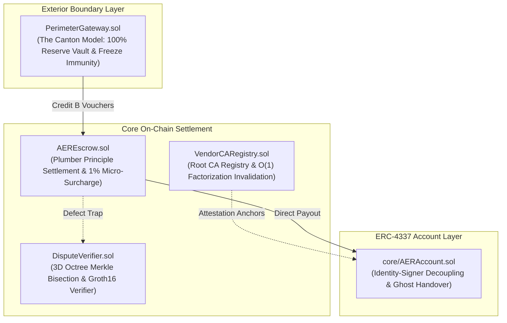

# AER On-Chain Settlement Layer (`contracts/`)

This directory contains the production **Solidity 0.8.24+** smart contract suite anchoring the capital, escrow, dispute verification, and account abstraction layers of the **AER (Autonomous Existence & Recognition)** decentralized network.

---

## 🏛️ Architecture Overview



---

## 📋 Core Contract Specifications

### 1. `AEREscrow.sol`
* **Specification Target**: Section 4.4.3 (Optimistic Timelocks) & Section 5 (The Plumber Principle).
* **Key Features**:
  * **1% Micro-Surcharge**: Automatically routes 1% (`COMMUNITY_FEE_BPS = 100`) of task bounties to the Community Entropy Reduction Pool (`communityPool`).
  * **Zero-Delay Direct Settlement (`settleDirect`)**: Verifies the beneficiary's ECDSA signature and releases 100% of escrowed funds to the worker immediately with 0-second lockup.
  * **Variable Timelock Liquidity Premium**: Automatically calculates an extra waiting bounty ($\Delta B_{\text{time}}$) if the client requests an extended timelock window beyond 24 hours.
  * **Watchtower Pause (`pauseEscrow`)**: Grants authorized watchtowers a 1-gas interface to freeze countdowns for 72 hours upon detecting malformed bytecode or execution traps.
  * **Non-Punitive Priority Netting**: Records unpaid offline IOU debt on ledger and automatically subtracts liabilities from incoming future task bounties.

### 2. `adapters/PerimeterGateway.sol`
* **Specification Target**: Appendix A.4 (The Canton Model & Autonomous Bonding Curve Transition).
* **Key Features**:
  * **100% Reserve Isolation**: Locks external fiat ERC-20 tokens (USDT/USDC) into a segregated reserve vault and issues internal Credit B task vouchers.
  * **Autonomous Bonding Curve Shift**: Automatically shifts from a 1:1 fiat redemption peg to a physical marginal cost peg once network active node count crosses threshold ($N \ge 1,000$).
  * **Bulkhead Freeze Immunity**: Internal Credit B vouchers and Credit A reputation ledgers remain completely immune to external ERC-20 blacklist/freeze actions.
  * **Asset Orthogonality**: Strictly enforces $\frac{\partial A_j}{\partial (\text{Fiat})} \equiv 0$—external fiat capital cannot purchase governance or reputation under any circumstance.

### 3. `DisputeVerifier.sol`
* **Specification Target**: Appendix C.1 (Spatiotemporal Octree Bisection & Physical Conservation).
* **Key Features**:
  * **3D Octree Merkle Bisection**: Compresses gigabytes of high-frequency robotics sensor telemetry down to an isolated $100\text{ms} / 1\text{cm}^3$ dispute voxel via 8-ary Merkle tree proofs ($O(\log N)$).
  * **Succinct ZK-SNARK Verification**: Validates Groth16 bilinear pairing checks over EVM precompile `0x08` within a tight 200,000 gas budget.

### 4. `VendorCARegistry.sol`
* **Specification Target**: Appendix C.2 (Semiconductor Root CA Registry & Open Silicon).
* **Key Features**:
  * **$O(1)$ Mathematical Self-Invalidation**: If a whistleblower submits non-trivial factors $p > 1, q > 1$ such that $p \times q = N_{CA}$, the Root CA is instantly and irrevocably revoked on-chain without governance delays or human voting.
  * **Censorship-Resistant Silicon Parity**: Provides equal first-class status to commercial roots (Intel, AMD, ARM, TPM) and open-source RISC-V roots (OpenTitan, Keystone TEE).
  * **RFC 5280 CRL Merkle Relay**: Maintains verifiable Merkle roots of revoked hardware certificate serials.

### 5. `core/AERAccount.sol`
* **Specification Target**: Appendix C.3 (ERC-4337 Account Abstraction & Capital Succession).
* **Key Features**:
  * **Identity-Signer Decoupling**: Conforms to ERC-4337 `IAccount` (`validateUserOp`). The physical silicon chip is solely an authorized signer, while capital and reputation reside permanently in the smart contract vault.
  * **Graceful Handover (`executeGracefulHandover`)**: Transfers signer authority between physical TPMs upon dual cryptographic signatures and a valid hardware zeroization receipt.
  * **Emergency Disaster Recovery (`initiateEmergencyRecovery`)**: Restores access following physical chassis destruction via M-of-N guild witness quorum protected by a mandatory 7-day quarantine challenge window.

---

## 🧪 Verification & Tooling

```bash
# Compile and verify static AST syntax of all contracts
python scripts/compile_contracts.py

# Execute full contract unit test suite
python test/contracts/test_contracts.py
```
