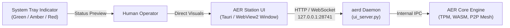

# AER Station: Zero-Server Localhost UI & Desktop Companion Specification
## Local IPC, System Tray Dashboard & Digital Loot Notification Protocol

```
Document Version: v1.9.4
Standard Track: User Interface & Local Station Engineering
Component: aerd-ui (AER Station)
Host Binding: 127.0.0.1:28741 (Loopback Only, Air-Gapped)
Recommended Shell: Tauri / Microsoft WebView2 / Native System Tray
```

---

## 1. Architectural Philosophy: Zero-Cloud Invariant ($C_{\text{fixed}} \equiv 0$)

Traditional crypto frontends rely on cloud-hosted web apps (AWS S3, Vercel, Cloudflare) and public RPC gateways (Infura, Alchemy), introducing central censorship choke points, DNS hijacking vulnerabilities, and persistent subscription overhead.

**AER Station strictly repudiates cloud-hosted frontends:**
- **Zero External Server Overhead:** The UI runs 100% locally on the user’s physical machine.
- **Air-Gapped IPC:** All communications bind strictly to `127.0.0.1:28741` via loopback HTTP and WebSockets.
- **No Third-Party Telemetry:** Zero Google Analytics, zero Sentry tracking, zero telemetry exfiltration.



---

## 2. Local Loopback API Endpoints (`127.0.0.1:28741`)

The daemon’s embedded HTTP server (`src/aer/ui_server.py`) exposes deterministic JSON endpoints:

### 2.1 Node Telemetry & Status (`GET /api/status` or `GET /`)
Returns comprehensive operational telemetry:
```json
{
  "daemon": "aerd",
  "version": "1.9.2",
  "node_id": "0xnode_local_identity_hash",
  "evaluator_digest": "0x3b89ef...41a",
  "credit_a_reputation": 100,
  "credit_b_balance": 1500,
  "p2p_active_peers": 42,
  "state_channels_active": 3,
  "is_boycotted": false
}
```

### 2.2 Daemon Health Check (`GET /api/health`)
Returns immediate liveness confirmation:
```json
{
  "health": "OK"
}
```

### 2.3 P2P Resource Market Order Feed (`GET /api/market`)
Streams active resting orders across all GossipSub topics (`/aer/market/gpu-quota`, `/aer/market/mcp-tools`, `/aer/market/datasets`).

### 2.4 Digital Loot Stream (`GET /api/loot`)
Real-time feed notifying the user when the local agent autonomously monetizes idle night-time compute to acquire specialized tools or datasets without human intervention.

---

## 3. Desktop Shell & System Tray Integration

AER Station is packaged as a compact single-binary desktop companion:
1. **Status Icon Color States:**
   - **Green (Superconducting Phase):** Node is active, attestation valid, peering with healthy swarm.
   - **Amber (Watchtower Warning):** Active timelock pending or uncollateralized credit threshold near limit.
   - **Red (Quarantine / Boycott):** Node quarantined or bulkhead emergency isolation triggered.
2. **Context Menu Actions:**
   - **Open Station Dashboard:** Opens the local WebView2 window.
   - **Hibernate Node:** Gracefully finishes active WASM tasks and suspends peering.
   - **Rotate Hardware Key:** Initiates graceful hardware handover (`schemas/HardwareMigration.schema.json`).
   - **Exit:** Shuts down background loopback listener.
