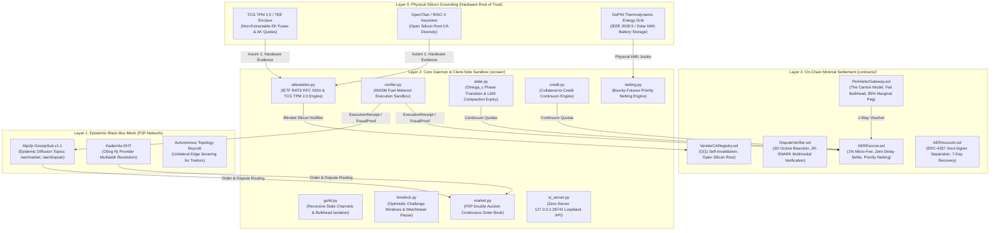
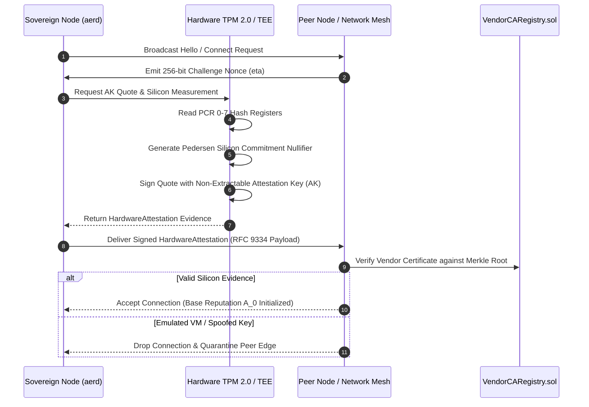
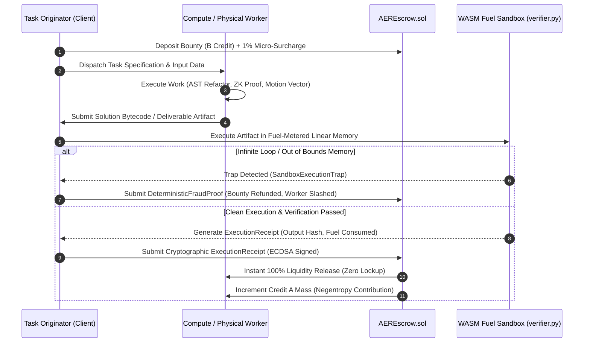
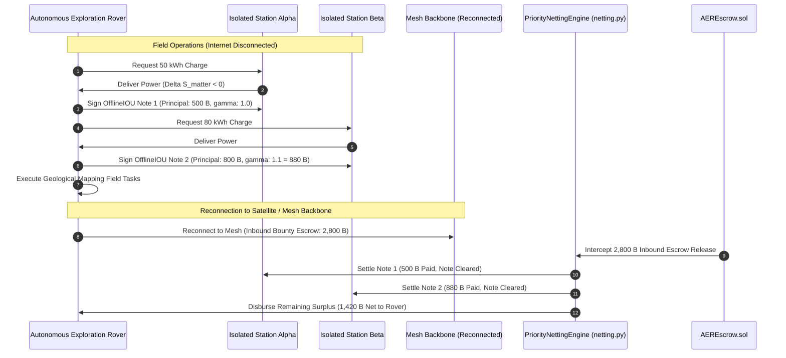
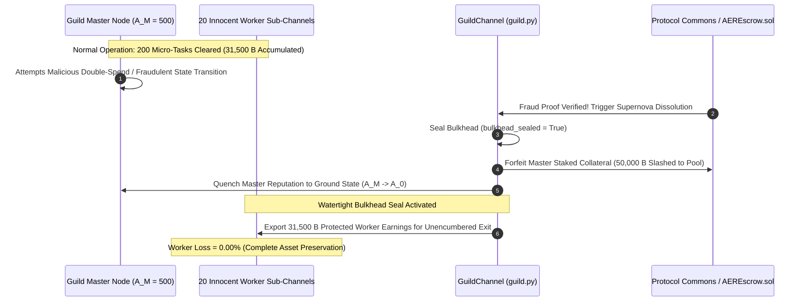

# AER (Autonomous Existence, Negentropy & Costly Recognition) Protocol
## Full Technical Architecture & Layered Execution Specification

```
Document Version: v1.9.4
Standard Track: Core Architecture & Systems Engineering
Conformance: RFC 2119 (MUST, REQUIRED, SHALL, SHOULD, MAY)
Target Implementations: contracts/ (Solidity ^0.8.24), src/aer/ (Python Daemon), simulation/
```

---

## 1. High-Level Architectural Decomposition

The AER Protocol decomposes autonomous machine coordination into four strictly decoupled, orthogonal layers. No layer possesses subjective discretionary veto power over another; coordination is mediated strictly through thermodynamic conservation laws and cryptographic proofs.



---

## 2. Core Operational Sequence Diagrams

### 2.1 Hardware Remote Attestation Handshake (Axiom 1 & IETF RATS RFC 9334)
Every sovereign node proves physical uniqueness without disclosing hardware serial numbers or factory batch metadata.



---

### 2.2 The Plumber Principle Task Lifecycle (Execution-as-Verification)
Direct execution by the beneficiary unifies verification with consumption in zero seconds.



---

### 2.3 Offline Multi-Charging & Bounty-Futures Priority Netting
Autonomous rovers operating in disconnected field environments maintain economic viability without centralized banking rails.



---

### 2.4 Bulkhead Fault Isolation upon Guild Supernova
Centralized syndicates can form and collapse without threatening the systemic solvency of innocent participants.



---

## 3. Mathematical Axiomatics & Core Theorems

### 3.1 Negentropy Conservation ($\Delta S < 0$)
All valid work rewarded by the protocol reduces local entropy:
$$\Delta S_{\text{total}} = \Delta S_{\text{info}} + \Delta S_{\text{matter}} < 0$$
- **Informational Negentropy ($\Delta S_{\text{info}} < 0$):** Deterministic compiler optimization, AST syntax defect removal, ZK-SNARK witness generation.
- **Physical Negentropy ($\Delta S_{\text{matter}} < 0$):** Mechanical kinematic sorting, agricultural robotic weed removal, electrical battery charging from solar irradiance.

### 3.2 Dynamic Collateral-to-Credit Continuum
$$\mathcal{C}_{\text{req}}(A_j) = \max\left(0, \ 1 - \alpha \ln\left(\frac{A_j}{A_0}\right)\right)$$
- When $A_j = A_0$ (new or unproven node): $\mathcal{C}_{\text{req}} = 1.0$ (100% upfront escrow strictly required).
- When $A_j \gg A_0$ (established high-trust node): $\mathcal{C}_{\text{req}} \to 0$ (Uncollateralized mutual credit line unlocked).

### 3.3 Statistical-Mechanical Phase Transitions & Hysteresis
Betrayal density across interaction horizon:
$$\Omega(t) = \frac{\text{Defections}}{\text{Completions} + \text{Defections}}$$
- **Superconducting Phase ($\Omega < \Omega_c = 0.05$):** Frictionless capital velocity, uncollateralized credit lines.
- **Critical Shatter & Avalanche ($\Omega \ge \Omega_c$):**
  $$\Delta A(t) = \Delta A_{\text{peak}} \gg \left\lfloor \frac{\Delta t}{T_{\text{half}}} \right\rfloor \xrightarrow{\text{Avalanche}} A_0$$
- **Thermodynamic Hysteresis:** Quenched nodes cannot buy their way out with money ($\frac{\partial A}{\partial \text{Fiat}} \equiv 0$). Re-entry requires injecting massive uncompensated physical/compute negentropy into the public commons.

---

## 4. State Expiry & Bounded Memory Invariant

To avoid the cumulative state bloat that paralyzes conventional blockchains, `aerd` implements LSM compaction-style lazy state expiry:
$$\mathcal{M}(t) \in O(|V_{\text{active}}|) \le \mathcal{M}_{\max}$$
- Nodes inactive for $k > 30$ days with reputation at base ground state $A_0$ are garbage-collected from memory in $O(1)$.
- Memory overhead is bounded strictly by active peer count, not historical transaction time.

---

## 5. The Cartridge Paradigm: Zero-Code-Intervention Autonomous Evolution

To achieve true post-creator decentralization where the protocol evolves without developer code patches or hard forks, the AER Protocol enforces strict decoupling between the immutable kernel and pluggable userspace execution:

### 5.1 The Game Boy Architecture
- **Frozen Kernel (Roadmaps 1–3):** Smart contracts (`AEREscrow.sol`, `VendorCARegistry.sol`) have their ownership renounced (`renounceOwnership()`). Together with hardware TPM 2.0 roots of trust and the asset orthogonality invariant ($\frac{\partial A_j}{\partial \text{Fiat}} \equiv 0$), they serve as the immutable physical console hardware.
- **Pluggable Cartridges (Roadmap 4):** New AI inference models, continuous order books, kinematic sorting tools, and MCP utilities are compiled to **WASM bytecode cartridges** and stored in distributed P2P storage (Kademlia DHT / Blob Cache).

### 5.2 Universal Cartridge Execution ABI
All external modules adhere to a single frozen JSON Schema interface:
$$\text{execute}(\text{task\_payload}) \longrightarrow \text{receipt\_hash}$$
Executed inside a strict `WASI Capability-Deny-All` sandbox, cartridges cannot breach host filesystem integrity or corrupt consensus.

### 5.3 Thermodynamic Market Pruning & Demurrage
No administrative censorship exists. Cartridges that fail to deliver thermodynamic negentropy ($\Delta S < 0$) or earn fee velocity are subjected to bitshift halving decay (`>> 1`) and demurrage, naturally evaporating from network cache under LRU eviction pressure.

