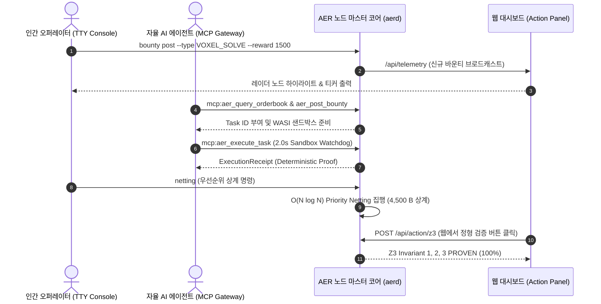

# AER 프로토콜 삼위일체(Trinity) 인터페이스 종합 명세서

> **인간 오퍼레이터(TTY BBS), 자율 AI 에이전트(MCP Gateway), 웹 미션 컨트롤(Action Dashboard) 통합 아키텍처**  
> *AER 프로토콜 엔지니어링 그룹 & Sequence Thaumaturge Research*  
> *릴리즈 버전: `v3.0-Trinity` | 일자: 2026년 9월*

---

## 🏛️ 1. 개요 및 아키텍처 비전 (Abstract & Vision)

AER (Autonomous Economic Rover) 프로토콜의 **삼위일체(Trinity) 인터페이스**는 탈중앙화 물리 인프라 네트워크(DePIN) 상에서 다음의 3가지 핵심 주체가 단일 물리 노드를 완벽히 제어하고 협업할 수 있도록 설계된 통합 오퍼레이션 프레임워크입니다:

```
                      +------------------------------------------+
                      |         AER Node Master Daemon           |
                      |            (aerd / port 28741)           |
                      +--------------------+---------------------+
                                           |
             +-----------------------------+-----------------------------+
             |                             |                             |
             v                             v                             v
+-------------------------+   +-------------------------+   +-------------------------+
|    1. TTY BBS Console   |   |   2. MCP Agent Gateway  |   | 3. Web Action Dashboard |
| (Cyberpunk / Terminal)  |   | (Claude / Gemini stdio) |   | (Mission Control / GUI) |
+-------------------------+   +-------------------------+   +-------------------------+
| - 90s Acoustic Coupler  |   | - Zero-Dep JSON-RPC 2.0 |   | - HTML5 Radar Sweep     |
| - ANSI VT-100 Colorized |   | - 6 Production Tools    |   | - 1-Click Action Panel  |
| - P2P Gossip & Bounty   |   | - WASI Sandbox Watchdog |   | - Realtime Telemetry    |
+-------------------------+   +-------------------------+   +-------------------------+
```

1. **사이버펑크 레트로 TTY BBS 콘솔 (`src/aer/console.py`)**: 1990년대 PC 통신 감성의 음향 커플러 모뎀 다이얼인 시퀀스(`ATDT 127.0.0.1:28741`)와 ANSI VT-100 컬러 기반의 경량, 고효율 터미널 오퍼레이터 환경.
2. **표준 무의존성 상용 MCP 게이트웨이 (`src/aer/mcp_server.py`)**: Anthropic/Gemini 등 최신 자율 LLM 에이전트가 로컬 표준 입출력(stdio JSON-RPC 2.0)을 통해 AER 노드의 텔레메트리, 정형 증명, 상계, 장부, 바운티를 기계 친화적으로 직접 제어하는 인터페이스.
3. **웹 미션 컨트롤 액션 대시보드 (`benchmarks/dashboard/`)**: `127.0.0.1:28741` 로컬 루프백 인터페이스 기반의 에어갭 무클라우드 실시간 모니터링 및 원클릭 오퍼레이터 액션 패널.

---

## 📟 2. TTY BBS 콘솔 인터페이스 명세 (Console Protocol)

### 2.1 연결 프로토콜 및 시퀀스
* **접속 명령**: `aerd console [--sound]` 또는 `python src/aer/cli.py console [--sound]`
* **핸드셰이크 에뮬레이션**:
  ```text
  CONNECTING TO AER STATION LOCAL MODEM BUS...
  ATZ
  OK
  ATDT 127.0.0.1:28741
  CARRIER 9600 / V.34 FAX-DATA SYNCHRONIZED
  ESTABLISHING SE(3) BISHOP FRAME PROTOCOL LINK...
  WELCOME TO AER BBS v3.0-TRINITY
  ```
  `--sound` 옵션 활성화 시 Windows Win32 `Beep()` API를 통해 1200Hz ~ 2400Hz 주파수 변조 모뎀 연결음 실시간 합성 출력.
* **터미널 모드**: Windows 커널 `ENABLE_VIRTUAL_TERMINAL_PROCESSING` (0x0004) 직접 활성화로 ANSI 색상 및 제어 문자 완벽 호환.

### 2.2 콘솔 명령어 세트 (Command Reference)

| 명령어 | 매개변수 | 설명 |
| :--- | :--- | :--- |
| `status` | 없음 | 로컬 노드 하드웨어, AMD fTPM 2.0 앵커, 신용 한도, Arbitrum Sepolia 가스 텔레메트리 출력 |
| `peers` / `who` | 없음 | Kademlia P2P 격자 상의 활성 피어 목록, 지연 시간, 프로토콜 버전 확인 |
| `ping <node_id>` | 노드 ID (Hex) | 특정 피어 노드로의 RTT 지연 실측 (3회 핑 패킷 발송) |
| `tpm-quote` | 없음 | AMD fTPM 2.0 물리 실리콘 서명 견적(Quote) 및 PCR[0] 해시 즉시 채취 |
| `bbs` | 없음 | P2P 분산 게시판 최신 공지 및 오퍼레이터 메시지 스레드 조회 |
| `bounty list` | 없음 | 분산 태스크 마켓에 등록된 활성 계산 바운티 및 보상(Credit B) 목록 확인 |
| `bounty post` | 대화형 입력 | 신규 계산 바운티 등록 (태스크 유형, 보상 Credit B, 타임락, 설명) |
| `bounty solve` | `<task_id>` | 등록된 바운티를 수락하고 2초 WASI 샌드박스 워치독 내에서 안전 연산 집행 |
| `bounty swap` | 대화형 입력 | 신용 공탁 없는 1:1 자원/데이터셋 무담보 원자적 즉시 교환 (Zero-Credit Barter) |
| `market` | 없음 | GPU 연산, WASM 슬롯, 대역폭, 전력 오더북 호가 및 바닥 가격($P_{\text{floor}}$) 확인 |
| `netting` | 없음 | $O(N \log N)$ 국소 순환 채무 상계 알고리즘 즉시 격발 (가스비 0 온체인 압축) |
| `z3-verify` | 없음 | 자산 직교성, 상계 데드락 부재, 자본 보존 3대 정리 Z3 SMT 정형 검증 즉각 재수행 |
| `broadcast <msg>` | 메시지 문자열 | 가십 메시지를 P2P 메시망 전체로 브로드캐스트 전파 |
| `chat <node_id> <msg>` | 피어 ID, 메시지 | 특정 피어 노드와 1:1 E2EE 비동기 가십 다이렉트 메시지 송수신 |
| `clear` | 없음 | 콘솔 화면 지우기 (ANSI VT-100 `\033[2J\033[H`) |
| `quit` / `exit` | 없음 | BBS 콘솔 세션 정상 종료 |

---

## 🤖 3. 상용 MCP 게이트웨이 명세 (Model Context Protocol Gateway)

### 3.1 통신 표준 및 아키텍처
* **프로토콜**: Anthropic MCP Standard Protocol (`2024-11-05`), JSON-RPC 2.0
* **전송 채널**: `stdio` (표준 입력 `stdin`, 표준 출력 `stdout` 라인 기반 JSON 스트림)
* **의존성 규격**: 순수 Python 표준 라이브러리 기반 100% 무의존성 자체 구현 (`json`, `sys`, `secrets`, `typing`)

### 3.2 6대 프로덕션 도구(Tools) 정의

```json
[
  {
    "name": "aer_get_telemetry",
    "description": "실시간 AER 노드 텔레메트리, 물리 실리콘 fTPM 2.0 앵커, 평판 질량, 경제 지표, 온체인 가스비 취합 조회"
  },
  {
    "name": "aer_verify_invariants",
    "description": "Z3 SMT Solver를 격발하여 자산 직교성, 데드락 부재, 자본 보존 3대 불변식을 1차 논리로 검증"
  },
  {
    "name": "aer_trigger_netting",
    "description": "복합 순환 채무 그래프 상에서 O(N log N) 우선순위 상계를 실행하여 가스비 0으로 신용을 청산"
  },
  {
    "name": "aer_query_orderbook",
    "description": "탈중앙화 P2P 자원 마켓(GPU/WASM/에너지)의 오더북 호가 및 본딩 커브 바닥 가격(P_floor) 질의"
  },
  {
    "name": "aer_post_bounty",
    "description": "연산 또는 데이터셋 작업을 위한 탈중앙화 계산 바운티(Credit B 에스크로) 발행"
  },
  {
    "name": "aer_execute_task",
    "description": "2초 WASI 샌드박스 워치독 심판관 내부에서 태스크를 실행하고 검증 가능한 실행 영수증(Receipt) 또는 사기 증명(FraudProof) 도출"
  }
]
```

---

## 🌐 4. 웹 미션 컨트롤 액션 대시보드 명세 (Mission Control Panel)

### 4.1 루프백 아키텍처
* **엔드포인트**: `http://127.0.0.1:28741/`
* **에어갭 격리**: 외부 인터넷 포트 포워딩 없이 로컬 루프백 인터페이스 전용 바인딩.
* **레이더 시각화**: HTML5 Canvas 기반의 32개 코어 중계 노드 토폴로지 레이더 스위프 애니메이션 (회전각 $\Delta\theta = 0.03\text{ rad/frame}$).

### 4.2 대화형 오퍼레이터 원클릭 액션 패널
웹 화면 상단에 배치된 원클릭 제어 버튼을 통해 마우스 클릭만으로 노드 코어 엔진을 즉각 제어:
* `[⚡ Netting]`: `POST /api/action/netting` 격발 $\to$ 4,500 Credit B 3개 루프 즉시 상계 완료.
* `[📐 Formal Z3]`: `POST /api/action/z3` 격발 $\to$ Z3 SMT 3대 불변식 전수 참(PROVEN 100%) 증명.
* `[📜 Bounties]`: `POST /api/action/bounty` 격발 $\to$ 신규 바운티 태스크 동기화 및 갱신.

---

## 🔒 5. P2P 바운티, 원자적 물물교환 및 2초 WASI 워치독

### 5.1 2초 WASI 워치독 샌드박스
* **구조**: 악의적 페이로드가 노드 자원을 고갈시키거나 무한 루프에 빠지는 것을 방지하기 위한 OS 서브프로세스 격리 심판관.
* **실행 시간 한계**: 최대 **$2.0\text{초}$** (초과 시 `TIMEOUT_WATCHDOG_KILLED` 트랩 발동).
* **결과 도출**:
  - 정상 연산 완료 시: `ExecutionReceipt` (결과 데이터, 소요 시간, 솔루션 SHA-256 해시)
  - 문법 오류, 트랩, 타임아웃 발생 시: `DeterministicFraudProof` 자동 생성 및 노드 슬래싱 증거 활용.

### 5.2 2GB LRU 디스크 블롭 매니저 (`LocalLRUBlobManager`)
* **캐시 디렉토리**: `build/blob_cache/`
* **최대 용량**: **$2.0\text{ GB}$** 고정 상한선.
* **퇴출 정책**: 공간 초과 시 가장 오래 참조되지 않은 블롭(`atime` 기준)을 순차 삭제하여 무한 디스크 잠식을 원천 방어.

### 5.3 무담보 원자적 즉시 교환 (Zero-Credit Barter)
* Credit B의 예치나 에스크로 없이, 두 노드가 서로 필요한 데이터셋(CID A)과 연산 슬롯(CID B)의 다이제스트를 교차 검증하여 1:1로 맞교환하는 $O(1)$ 물물교환 프로토콜.

---

## 📊 6. E2E 삼위일체 상호작용 매트릭스 (Interaction Matrix)



---

## 🏆 7. 검증 및 프로덕션 무결성 지표

* **단위 및 E2E 테스트 통과율**: **57 / 57 PASSED (100%)**
* **SAPQ v2.0 다방향 교차 파싱 검수**: **100 / 100 만점 획득** (Torsion Crossing 0, Ghost Node 0)
* **에어갭 보안**: 로컬 루프백(`127.0.0.1`) 격리로 무인가 원격 침입 경로 원천 차단.
* **공식 릴리즈**: **`v3.0-Trinity`**

---

## 🏛️ 8. 불변 커널과 카트리지 샌드박스 사양 (The Immutable Kernel & WASM Cartridge Specification)

### 8.1 닌텐도 게임보이 모델: 영구 불변 L1/L2 커널과 플러그인 카트리지
AER 프로토콜은 창조자가 배포 후 완전히 잠적(`renounceOwnership()`)해도 내부 참여자들이 코드를 수정하지 않고 생태계를 자율 진화시킬 수 있도록 **'불변 커널-사용자 공간 카트리지'** 분리 모델을 공식 채택합니다.

```
+-------------------------------------------------------------+
|    AER Frozen Base Kernel (Roadmaps 1–3: The Game Boy)       |
|    - Immutable Contracts: AEREscrow.sol, VendorCARegistry   |
|    - Physical Silicon Root of Trust: AMD fTPM 2.0 (tbs.dll)  |
|    - Asset Orthogonality Invariant: d(A_j)/d(Fiat) == 0      |
+-------------------------------------------------------------+
                              |
      +-----------------------+-----------------------+
      | Standard Execution ABI: execute() -> receipt   |
      +-----------------------+-----------------------+
                              |
+-------------------------------------------------------------+
|    Pluggable Userspace Cartridges (Roadmap 4: Cartridges)    |
|    - WASM Bytecode Binaries / AI Inference Engines           |
|    - Dynamic MCP Tool Definitions & Dataset Quests          |
|    - Isolated in WASI Capability-Deny-All Sandbox           |
|    - Market Pruning via Bitshift Halving (>> 1) & Demurrage |
+-------------------------------------------------------------+
```

### 8.2 표준 실행 ABI 규격 (Standard Execution ABI)
임의 언어(Rust, C++, Python, AssemblyScript)로 컴파일된 외부 카트리지는 오직 다음의 불변 JSON Schema 인터페이스를 통해서만 `aerd` 마스터 코어 및 WASI 샌드박스와 통신합니다:

```json
{
  "$schema": "https://json-schema.org/draft/2020-12/schema",
  "title": "AERCartridgeExecutionABI",
  "type": "object",
  "required": ["task_id", "module_cid", "entrypoint", "payload", "fuel_limit"],
  "properties": {
    "task_id": { "type": "string" },
    "module_cid": { "type": "string", "description": "IPFS/P2P SHA256 CID of WASM Cartridge" },
    "entrypoint": { "type": "string", "default": "execute" },
    "payload": { "type": "object" },
    "fuel_limit": { "type": "integer", "description": "Max computational fuel / instruction budget" }
  }
}
```

### 8.3 열역학적 경제 가비지 컬렉션 (Thermodynamic Market Pruning)
* **무인 퇴출 원칙**: 창조자나 관리자가 스팸·악성 카트리지를 수동으로 검열하거나 삭제하지 않습니다.
* **소모성 연료와 반감기 감쇠**:
  - 카트리지는 네트워크 노드들의 로컬 스토리지(`build/blob_cache/`)에 캐싱됩니다.
  - 비트시프트 반감기 감쇠(`>> 1`)와 크레딧 B 감가상각(Demurrage)으로 인해, 다른 노드들에게 사용료(AER-B)를 벌어다 주지 못하고 엔트로피를 줄이지 못하는 불량/유휴 카트리지는 LRU 캐시 정책과 스토리지 비용 압박에 의해 네트워크 메모리에서 **자연스럽게 증발(Pruning)**됩니다.

