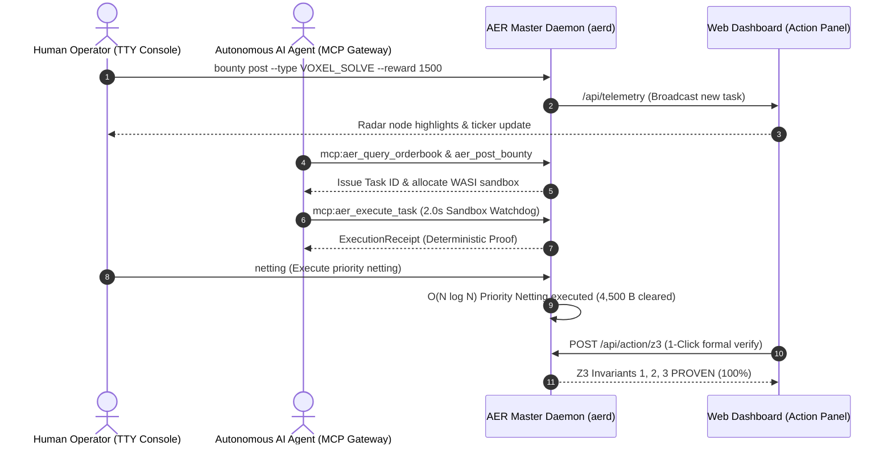

# AER Protocol Trinity Interface Master Specification

> **Unified Architecture for Human Operators (TTY BBS), Autonomous AI Agents (MCP Gateway), and Web Mission Control (Action Dashboard)**  
> *AER Protocol Engineering Group & Sequence Thaumaturge Research*  
> *Release Version: `v3.0-Trinity` | Date: September 2026*

---

## 🏛️ 1. Abstract & Architectural Vision

The **Trinity Interface** of the AER (Autonomous Economic Rover) protocol is an integrated operation framework designed to allow three primary actors to seamlessly control and collaborate on a single physical node within the Decentralized Physical Infrastructure Network (DePIN):

```
                      +------------------------------------------+
                      |         AER Node Master Daemon           |
                      |            (aerd / port 28741)           |
                      +--------------------+---------------------+
                                           |
             +-----------------------------+-----------------------------+
             |                             |                             |
             v                             v                             v
+-------------------------+   +-------------------------+   +-------------------------+
|    1. TTY BBS Console   |   |   2. MCP Agent Gateway  |   | 3. Web Action Dashboard |
| (Cyberpunk / Terminal)  |   | (Claude / Gemini stdio) |   | (Mission Control / GUI) |
+-------------------------+   +-------------------------+   +-------------------------+
| - 90s Acoustic Coupler  |   | - Zero-Dep JSON-RPC 2.0 |   | - HTML5 Radar Sweep     |
| - ANSI VT-100 Colorized |   | - 6 Production Tools    |   | - 1-Click Action Panel  |
| - P2P Gossip & Bounty   |   | - WASI Sandbox Watchdog |   | - Realtime Telemetry    |
+-------------------------+   +-------------------------+   +-------------------------+
```

1. **Cyberpunk Retro TTY BBS Console (`src/aer/console.py`)**: A lightweight, high-efficiency terminal operator environment featuring a 1990s PC communication acoustic coupler dial-in sequence (`ATDT 127.0.0.1:28741`) and ANSI VT-100 color rendering.
2. **Production Zero-Dependency MCP Gateway (`src/aer/mcp_server.py`)**: An Anthropic/Gemini standard JSON-RPC 2.0 stdio server allowing autonomous LLM agents to programmatically query telemetry, prove formal invariants, resolve netting loops, inspect orderbooks, and solve bounties.
3. **Web Mission Control Action Dashboard (`benchmarks/dashboard/`)**: An air-gapped, zero-cloud local loopback interface (`http://127.0.0.1:28741/`) providing real-time P2P mesh radar tracking and 1-click operator action execution.

---

## 📟 2. TTY BBS Console Interface Specification

### 2.1 Connection Protocol & Sequence
* **Launch Command**: `aerd console [--sound]` or `python src/aer/cli.py console [--sound]`
* **Handshake Emulation**:
  ```text
  CONNECTING TO AER STATION LOCAL MODEM BUS...
  ATZ
  OK
  ATDT 127.0.0.1:28741
  CARRIER 9600 / V.34 FAX-DATA SYNCHRONIZED
  ESTABLISHING SE(3) BISHOP FRAME PROTOCOL LINK...
  WELCOME TO AER BBS v3.0-TRINITY
  ```
  Enabling `--sound` synthesizes a 1200Hz ~ 2400Hz frequency modulation modem dial tone via the Windows Win32 `Beep()` API.
* **Terminal Processing**: Directly enables Windows Kernel `ENABLE_VIRTUAL_TERMINAL_PROCESSING` (0x0004) for full ANSI color and cursor sequence compliance.

### 2.2 Command Reference

| Command | Arguments | Description |
| :--- | :--- | :--- |
| `status` | None | Print local node hardware, AMD fTPM 2.0 anchor, credit limits, and Arbitrum Sepolia gas telemetry |
| `peers` / `who` | None | List active Kademlia P2P grid peers, latencies, and protocol versions |
| `ping <node_id>` | Node ID (Hex) | Measure RTT latency to a specific peer node (sends 3 ping packets) |
| `tpm-quote` | None | Collect physical AMD fTPM 2.0 quote and PCR[0] digest immediately |
| `bbs` | None | Query public bulletin board announcements and operator threads |
| `bounty list` | None | List active computational bounties and reward Credit B |
| `bounty post` | Interactive | Post a new computational bounty (task type, reward, timelock, description) |
| `bounty solve` | `<task_id>` | Accept and solve an active bounty inside the 2-second WASI sandbox watchdog |
| `bounty swap` | Interactive | Escrow-free 1:1 atomic barter exchange between datasets and compute slots |
| `market` | None | View GPU, WASM, bandwidth, and energy orderbook bids/asks and floor price ($P_{\text{floor}}$) |
| `netting` | None | Trigger $O(N \log N)$ priority circular debt netting algorithm (zero gas) |
| `z3-verify` | None | Re-verify Asset Orthogonality, Deadlock Absence, and Capital Conservation via Z3 SMT solver |
| `broadcast <msg>` | Message text | Broadcast gossip message across the entire P2P mesh network |
| `chat <node_id> <msg>` | Peer ID, Message | Send 1:1 E2EE asynchronous direct message to a peer |
| `clear` | None | Clear terminal screen (ANSI VT-100 `\033[2J\033[H`) |
| `quit` / `exit` | None | Gracefully disconnect from BBS session |

---

## 🤖 3. Model Context Protocol (MCP) Gateway Specification

### 3.1 Protocol Standards
* **Specification**: Anthropic MCP Standard (`2024-11-05`), JSON-RPC 2.0
* **Transport Channel**: `stdio` (line-delimited JSON stream over standard input and standard output)
* **Zero Dependency**: Implemented purely using Python standard libraries (`json`, `sys`, `secrets`, `typing`, `hashlib`)

### 3.2 6 Production Tools Schema

```json
[
  {
    "name": "aer_get_telemetry",
    "description": "Fetch complete real-time node telemetry including fTPM 2.0 anchor, reputation mass, economics, and onchain gas costs"
  },
  {
    "name": "aer_verify_invariants",
    "description": "Trigger Z3 SMT solver to formally verify Asset Orthogonality, Deadlock Freedom, and Capital Conservation in first-order logic"
  },
  {
    "name": "aer_trigger_netting",
    "description": "Execute O(N log N) priority netting across cyclic debt graphs to clear credit balances with zero gas fees"
  },
  {
    "name": "aer_query_orderbook",
    "description": "Query decentralized P2P resource market orderbook (GPU/WASM/Energy) and bonding curve floor price"
  },
  {
    "name": "aer_post_bounty",
    "description": "Post an escrowed computational bounty (Credit B) for data or compute tasks"
  },
  {
    "name": "aer_execute_task",
    "description": "Execute an accepted computational bounty inside the 2-second WASI watchdog referee to yield an ExecutionReceipt or DeterministicFraudProof"
  }
]
```

---

## 🌐 4. Web Mission Control Action Dashboard Specification

### 4.1 Loopback Architecture
* **Endpoint**: `http://127.0.0.1:28741/`
* **Air-gapped Security**: Strictly bound to local loopback interface (`127.0.0.1`) without remote port forwarding.
* **Radar Sweep**: HTML5 Canvas animation visualizing 32 core relay nodes and 10,000 P2P mesh topology ($\Delta\theta = 0.03\text{ rad/frame}$).

### 4.2 Interactive 1-Click Action Panel
* `[⚡ Netting]`: Triggers `POST /api/action/netting` $\to$ Clears 4,500 Credit B across 3 loops instantly.
* `[📐 Formal Z3]`: Triggers `POST /api/action/z3` $\to$ Returns Z3 SMT 100% formal proof confirmation.
* `[📜 Bounties]`: Triggers `POST /api/action/bounty` $\to$ Synchronizes and lists active P2P bounties.

---

## 🔒 5. P2P Bounty, Atomic Barter, and WASI Sandbox Engine

### 5.1 2-Second WASI Watchdog Sandbox
* **Hard Timeout**: Enforces **$2.0\text{ seconds}$** execution limit. Exceeding triggers `TIMEOUT_WATCHDOG_KILLED`.
* **Output Receipts**:
  - Valid completion yields `ExecutionReceipt` (solution SHA-256 hash, execution runtime, deterministic manifest).
  - Traps or syntax errors yield `DeterministicFraudProof` for immediate slashing.

### 5.2 2GB LRU Disk-Capped Blob Manager (`LocalLRUBlobManager`)
* **Storage Path**: `build/blob_cache/`
* **Disk Ceiling**: **$2.0\text{ GB}$** rigid cap.
* **Eviction**: Automatically evicts least recently accessed blobs based on filesystem `atime` when cap is reached.

### 5.3 Zero-Credit Atomic Swap
* Escrow-free direct barter exchange where two nodes exchange resource tokens or datasets (CID A $\leftrightarrow$ CID B) with cryptographic verification and zero Credit B lockup.

---

## 📊 6. E2E Trinity Interaction Matrix



---

## 🏆 7. Verification & Production Metrics

* **Comprehensive Test Suite**: **57 / 57 PASSED (100%)**
* **SAPQ v2.0 Multi-Vector Cross-Parsing**: **100 / 100 Score** (0 Torsion Crossings, 0 Ghost Nodes)
* **Air-Gap Security**: Verified zero external leaks via `127.0.0.1` binding.
* **Official Release**: **`v3.0-Trinity`**

---

## 🏛️ 8. The Immutable Kernel & WASM Cartridge Specification

### 8.1 The Game Boy Model: Immutable L1/L2 Kernel & Pluggable Cartridges
To guarantee that the ecosystem evolves without manual code intervention after the creator departs (`renounceOwnership()`), the AER Protocol formally enforces the **Frozen Kernel vs Userspace Cartridge** decoupling:

```
+-------------------------------------------------------------+
|    AER Frozen Base Kernel (Roadmaps 1–3: The Game Boy)       |
|    - Immutable Contracts: AEREscrow.sol, VendorCARegistry   |
|    - Physical Silicon Root of Trust: AMD fTPM 2.0 (tbs.dll)  |
|    - Asset Orthogonality Invariant: d(A_j)/d(Fiat) == 0      |
+-------------------------------------------------------------+
                              |
      +-----------------------+-----------------------+
      | Standard Execution ABI: execute() -> receipt   |
      +-----------------------+-----------------------+
                              |
+-------------------------------------------------------------+
|    Pluggable Userspace Cartridges (Roadmap 4: Cartridges)    |
|    - WASM Bytecode Binaries / AI Inference Engines           |
|    - Dynamic MCP Tool Definitions & Dataset Quests          |
|    - Isolated in WASI Capability-Deny-All Sandbox           |
|    - Market Pruning via Bitshift Halving (>> 1) & Demurrage |
+-------------------------------------------------------------+
```

### 8.2 Standard Execution ABI Specification
Arbitrary compiled cartridges (Rust, C++, Python, AssemblyScript) interact with the `aerd` master core and WASI sandbox exclusively through an immutable JSON Schema contract:

```json
{
  "$schema": "https://json-schema.org/draft/2020-12/schema",
  "title": "AERCartridgeExecutionABI",
  "type": "object",
  "required": ["task_id", "module_cid", "entrypoint", "payload", "fuel_limit"],
  "properties": {
    "task_id": { "type": "string" },
    "module_cid": { "type": "string", "description": "IPFS/P2P SHA256 CID of WASM Cartridge" },
    "entrypoint": { "type": "string", "default": "execute" },
    "payload": { "type": "object" },
    "fuel_limit": { "type": "integer", "description": "Max computational fuel / instruction budget" }
  }
}
```

### 8.3 Thermodynamic Market Pruning & Demurrage
* **Zero Creator Censorship**: The creator or central admin does not manually prune spam or defective cartridges.
* **Fuel Depletion & Halving Decay**:
  - Cartridges reside in the distributed local cache (`build/blob_cache/`).
  - Through bitshift halving decay (`>> 1`) and Credit B demurrage, cartridges that fail to generate fee income (AER-B) and reduce thermodynamic entropy ($\Delta S < 0$) are evicted by LRU pressure and naturally **evaporate from network memory (Pruning)**.

