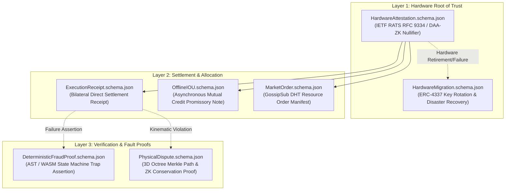

# AER Machine Protocol Data Specifications (`schemas/`)

This directory contains the canonical **JSON Schema (Draft-07)** formal specifications defining machine-to-machine data structures, cryptographic proofs, and settlement manifests across the **AER (Autonomous Existence & Recognition)** decentralized network.

---

## 🏛️ Specification Hierarchy



---

## 📋 Schema Specifications

### 1. `HardwareAttestation.schema.json`
* **Specification Target**: AER Axiom 1 (Bijective Silicon Identity Mapping) & IETF RATS (RFC 9334).
* **Cryptographic Properties**:
  * Employs Pedersen zero-knowledge commitments $\mathcal{F}: \text{Commit}(\text{Chip}_{\text{Secret}}, r) \longleftrightarrow \text{Node}_{\text{ID}}$ to bind node identity to physical silicon state while concealing manufacturer serial fingerprints.
  * Verifies Direct Anonymous Attestation (DAA) or ZK-SNARK membership proofs (`zk_vendor_membership_proof`) against on-chain root CA Merkle trees.
  * Mitigates Sybil replication by strictly verifying hardware measurement digests (`platform_pcr_digest`).

### 2. `ExecutionReceipt.schema.json`
* **Specification Target**: AER Section 5 (Subjective Quality Non-Verifiability Principle).
* **Cryptographic Properties**:
  * Formalizes non-verifiable subjective task fulfillment by requiring unilateral ECDSA signature authorization (`beneficiary_ecdsa_signature`) from the designated service beneficiary.
  * Bypasses third-party heuristic evaluation and enables immediate, zero-delay capital release from on-chain escrow upon signature presentation.

### 3. `OfflineIOU.schema.json`
* **Specification Target**: AER Section 6.3 (Partition-Tolerant Asynchronous Mutual Credit Clearing).
* **Cryptographic Properties**:
  * Enables bilateral credit extension during network partitions and air-gapped field operations without synchronous global state consensus.
  * Enforces monotonic nonce sequence tracking and calculates delay-adjusted liabilities via an offline risk multiplier ($\gamma_{\text{offline}} \ge 1.0$).
  * Settles via deterministic priority netting against subsequent inbound task escrows upon network reconnection.

### 4. `DeterministicFraudProof.schema.json`
* **Specification Target**: AER Section 4.4.3 (Deterministic Fault Assertion & Optimistic Timelock Halting).
* **Cryptographic Properties**:
  * Provides a standardized evidence structure for reproducible state-machine failures (e.g. `AST_SYNTAX_ERROR`, `KINEMATIC_VIOLATION`, `COMPILATION_CRASH`).
  * Enables automated watchtower nodes to immediately suspend optimistic escrow release countdowns by presenting deterministic evaluator digests and reproduction traces.

### 5. `MarketOrder.schema.json`
* **Specification Target**: AER Appendix B (Decentralized Peer-to-Peer Resource Allocation).
* **Cryptographic Properties**:
  * Standardizes limit order structures for bilateral trading of GPU compute allocations, Model Context Protocol (MCP) tool routing, and verified dataset distributions.
  * Broadcast over decentralized libp2p GossipSub channels (`/aer/market/...`) with embedded ECDSA maker signatures and explicit validity expiration timestamps.

### 6. `HardwareMigration.schema.json`
* **Specification Target**: AER Appendix C.3 (ERC-4337 Non-Custodial Account Key Rotation & Recovery).
* **Cryptographic Properties**:
  * Decouples persistent contract balance and state from transient hardware silicon.
  * Supports bilateral cryptographic handshakes with TPM zeroization receipts for scheduled hardware upgrades (`GRACEFUL_HANDOVER`).
  * Provides M-of-N threshold guild quorum attestations and mandatory 7-day quarantine timelocks for disaster recovery following physical chassis destruction (`EMERGENCY_DISASTER_RECOVERY`).

### 7. `PhysicalDispute.schema.json`
* **Specification Target**: AER Appendix C.1 (Spatiotemporal Bisection & Multimodal Conservation Verification).
* **Cryptographic Properties**:
  * Isolates physical robotics telemetry violations to discrete spatial voxels ($100\text{ms} / 1\text{cm}^3$) using interactive 3D octree Merkle bisection paths.
  * Verifies joint conservation constraints across visual point clouds, SE(3) kinematic trajectories, actuator current draws, and Coulomb discharge ($\Delta E$) via succinct ZK-SNARK proofs ($\le 200,000$ gas).

---

## 🧪 Verification & Tooling

All schemas conform to the **JSON Schema Draft-07** specification and are verified via an automated test harness:

```bash
# Execute schema syntax validation and positive/negative fixture tests
python scripts/validate_schemas.py
```
