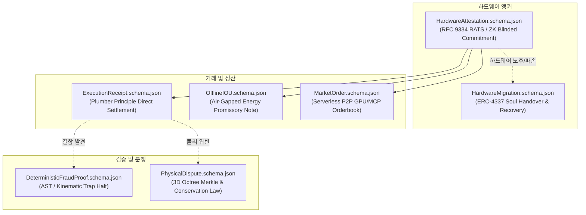

# AER Machine Data Protocol Schemas (`schemas/`)

본 디렉토리는 **AER (Autonomous Existence & Recognition)** 자율 기계 경제망에서 기계(AI 에이전트, 자율 로봇, 분산 노드) 간의 무인(Zero-Human) 상호작용을 규정하는 **7대 결정론적 JSON Schema (Draft-07)** 표준 사양을 담고 있습니다.

---

## 🏛️ 7대 핵심 스키마 개요



---

## 📋 스키마별 상세 명세

### 1. `HardwareAttestation.schema.json`
* **사양서 근거**: 제1공리(단사적 실리콘 앵커) 및 IETF RATS (RFC 9334).
* **핵심 역할**:
  * 물리 칩셋의 고유 시리얼을 노출하지 않고 영지식 페더슨 커밋먼트($\mathcal{F}: \text{Commit}(\text{Chip}_{\text{Secret}}, r) \longleftrightarrow \text{Node}_{\text{ID}}$)로 신원을 바인딩.
  * ZK 벤더 소속 증명(`zk_vendor_membership_proof`)을 통해 반도체 Root CA 서명 체인을 온체인에서 저렴하게 검증.
  * 가상머신(VM) 및 시빌 복제 노드의 침입을 물리 계층에서 원천 차단.

### 2. `ExecutionReceipt.schema.json`
* **사양서 근거**: 제5절(배관공의 원칙: 주관적 평가 불가능성).
* **핵심 역할**:
  * 과제 결과물에 대한 주관적 미학/맛 평가는 프로토콜이 개입하지 않으며, **오직 수혜자의 암호학적 직접 서명(`beneficiary_ecdsa_signature`)**만으로 정산 성립.
  * 정상 서명 접수 즉시 락업 기간 0초로 **100% 즉시 출금 및 유동성 해제** 보장.

### 3. `OfflineIOU.schema.json`
* **사양서 근거**: 제6.3절(오프라인 상호신용 및 전력 어음).
* **핵심 역할**:
  * 통신이 두절된 화성 탐사 로버나 재난 현장의 기계가 고립 충전소에서 에너지(kWh)를 외상 수급하고 발행하는 암호 약속어음.
  * 오프라인 위험 할증 계수($\gamma_{\text{offline}} \ge 1.0$)를 반영하여 네트워크 재연결 시 바운티 에스크로 유입금에서 1순위 최우선 자동 상계(Priority Netting).

### 4. `DeterministicFraudProof.schema.json`
* **사양서 근거**: 제4.4.3절(낙관적 타임락 및 기계적 결함 증명).
* **핵심 역할**:
  * 의뢰인이 부재하거나 타임락 카운트다운 도중 제출된 결과물에 명백한 결함이 있을 경우, 감시탑(Watchtower)이나 발주자가 제출하는 반증 전표.
  * 구문 분석 에러(`AST_SYNTAX_ERROR`), 물리 관절 제약 위반(`KINEMATIC_VIOLATION`), WASM 트랩(`COMPILATION_CRASH`) 등 결정론적 반증으로 즉시 카운트다운을 중단.

### 5. `MarketOrder.schema.json`
* **사양서 근거**: 부록 B(서버리스 P2P 장외 자원 거래).
* **핵심 역할**:
  * 중앙 서버나 오더북 서버 없이, libp2p GossipSub 망(`/aer/market/...`)을 통해 GPU 연산 쿼터, 비공개 MCP 도구, 도메인 데이터셋을 직거래하는 P2P 주문 전표.
  * 주문 생성자의 전자서명과 만료 시각(`expiration_timestamp`)을 내장하여 위조 및 재생 공격 차단.

### 6. `HardwareMigration.schema.json`
* **사양서 근거**: 부록 C.3(기계 자본 승계 및 고스트 이식).
* **핵심 역할**:
  * 로봇 차체나 칩셋 노후 교체 시 구/신 칩 간의 양방향 핸드셰이크 서명 및 구 칩의 TPM Zeroization 증거로 자본(ERC-4337 금고)을 안전하게 승계.
  * 침수/낙뢰로 인한 하드웨어 급작 사망 시, M-of-N 길드 동료 증언과 7일간의 비상 격리 타임락을 통해 신규 육신으로 영혼을 부활(Disaster Recovery).

### 7. `PhysicalDispute.schema.json`
* **사양서 근거**: 부록 C.1(물리 공간 대화형 이분 탐색 및 다중 양식 검증).
* **핵심 역할**:
  * 로봇이 물리 공간에서 과제를 수행하다 발생한 분쟁에 대해 전체 기가바이트 센서 로그를 온체인에 올리지 않고, 3D 옥트리 머클 분할을 통해 단 1개의 결함 복셀(100ms / 1cm³)로 압축.
  * [시각 포인트클라우드 + SE(3) 궤적 + 모터 토크 전류 + 배터리 방전량]의 다중 물리 보존 법칙 위반을 ZK-SNARK 간이 증거(20만 가스 이하)로 온체인 증명.

---

## 🛠️ 검증 및 사용법

본 스키마는 JSON Schema Draft-07을 준수하며, 파이썬 테스트 러너를 통해 자동 검증할 수 있습니다:

```bash
# 전체 스키마 유효성 및 예제 픽스처 검증
python scripts/validate_schemas.py
```
